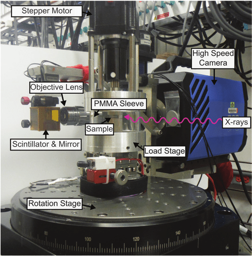

=========
2-BM Docs
=========

Manual and troubleshoting information to operate the APS beamline 2-BM.

Content
-------

.. toctree::
   :maxdepth: 1

   source/about
   source/cora
   source/apsu
   source/manual
   source/ops
   source/procedures
   source/data_management
   source/maxiv
   source/pre_apsu/pre_apsu
   source/publications

Contribute
----------

* `Documentation <https://github.com/xray-imaging/2bm-docs/tree/master/docs>`_
* `Issue Tracker <https://github.com/xray-imaging/2bm-docs/issues>`_

Mailing list
------------

To subscribe to the 2-BM mailing list send an e-mail to 2-bm-owner@lists.anl.gov. 

Mailing list administrators can configure the mailing list `here <https://lists-web.anl.gov/mailman3/lists/2-bm.lists.anl.gov/>`_.

Useful Links
------------

`User login <https://ups.servicenowservices.com/ups>`_

`Admin loging <https://ups.servicenowservices.com/login_locate_sso.do>`_ then enter your anl email address

`Credit for Sector Orientation <https://beam.aps.anl.gov/pls/apsweb/sst_credit.start_page>`_

`ESAF <https://beam.aps.anl.gov/pls/apsweb/esaf0001.start_page>`_

`Safety and Training <https://www.aps.anl.gov/Safety-and-Training>`_