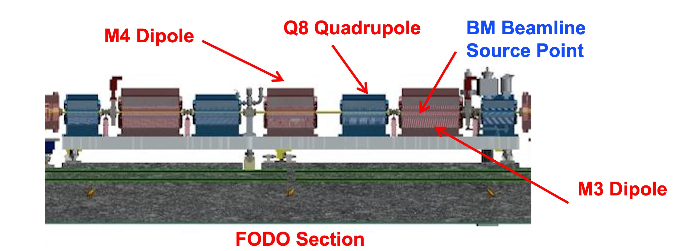
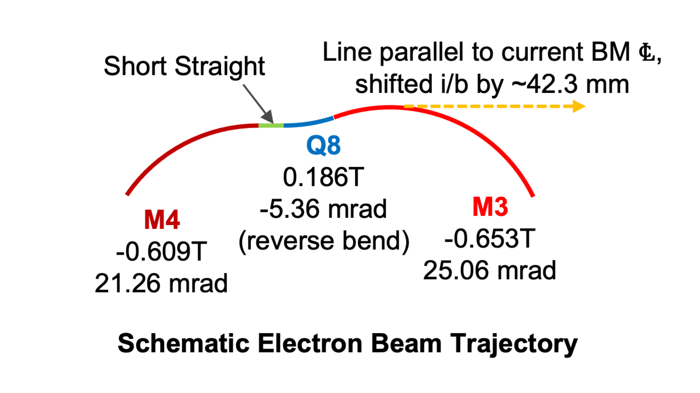
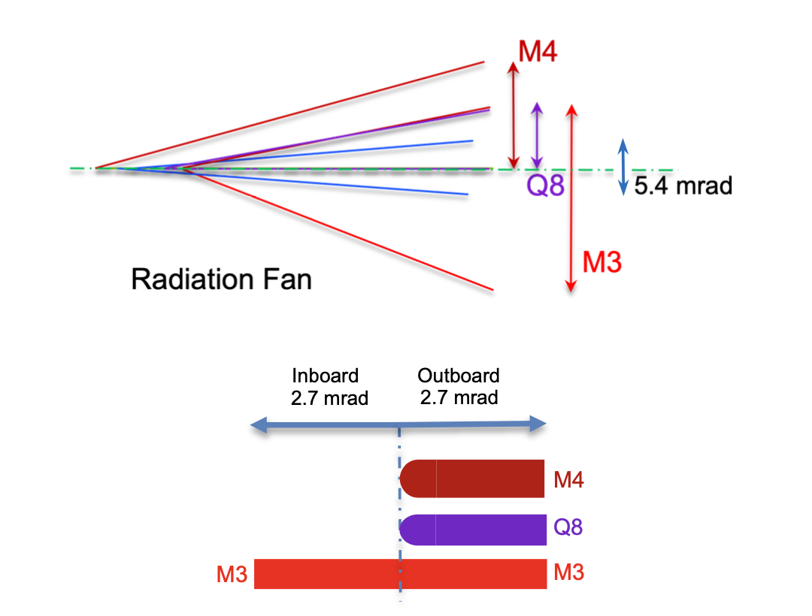

=====
APS-U
=====

The APS Upgrade involves replacing the whole storage ring currently operating at 7 GeV with a new storage ring using a multi-bend achromat lattice operating at 6 GeV. The new stored current is 200 mA compared to the previous 100 mA. The change of the storage ring is to generate extremely small emittance beams. 

The previous double bend APS lattice ahs being replaced by a new 7 bend achromat lattice. This new lattice is aligned in the existing storage ring enclosure. The location of the ID beamline has been fixed based on the layout. However, this change in lattice results in a displacement to the BM source.

.. image:: img/apsu_bm_01.png
   :width: 720px
   :align: center
   :alt: project

In the old APS, the BM beamlines received a total of 6 mrad horizontal fan of radiation from the B dipole magnet. In the new APS-U, the centerline of the BM source fan is shifted inboard and also upstream. The new BM source fan comes from multiple dipole magnets namely B:M4 and B:M3. In addition, due to the reverse bend lattice, radiation from the B:Q8 magnet also overlaps with the BM beamline source fans. Below is an illustration of the APS-U focusing-drift-defocusing-drift (FODO) section where the BM beamline source originates with a schematic of how the electron trajectory through the various magnets in the FODO.

Based on the above electron trajectory, the radiation fan as seen by the beamline is: 

The SR extraction port limits the available radiation to a 5.4 mrad fan. 

More details `2BM APSU <https://anl.box.com/s/h4ni34iixzs2nipbyupdjajt2ldyresw>`_