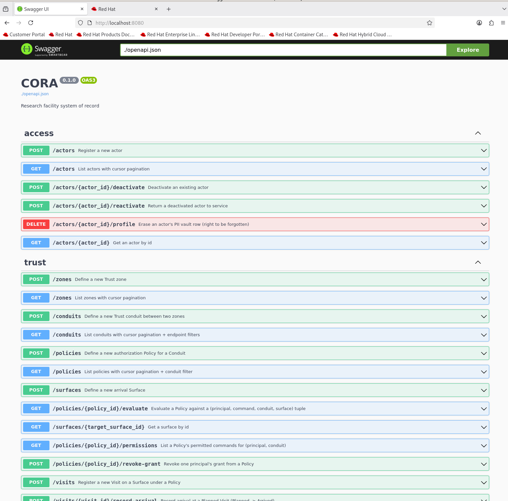

===========================================
Serve Swagger UI locally (no CDN, no patch)
===========================================

Purpose
=======

Get the interactive Swagger UI at
``http://localhost:8000/docs`` working on the beamline private
network. Left to itself, the page loads blank; this section
explains why and installs a fully-offline Swagger UI beside CORA
that renders the same schema without any network fetch beyond
loopback.

The private-network problem
===========================

FastAPI's ``/docs`` endpoint returns a tiny HTML shell that pulls
Swagger UI's JavaScript and CSS from a public CDN at runtime — by
default from ``https://cdn.jsdelivr.net/npm/swagger-ui-dist@…/``.
On a laptop with internet this is invisible: the browser fetches
the assets, initialises Swagger UI, and the page renders in under
a second.

The beamline hosts do not behave like that laptop:

- **arcturus** is on the private beamline network. Outbound HTTPS
  to public CDNs is blocked at the network boundary. When the
  browser tries to fetch ``swagger-ui-bundle.js`` from jsdelivr, the
  TCP handshake times out. The HTML shell is served fine from
  CORA's own loopback port, so the tab loads and the URL bar shows
  ``localhost:8000/docs``, but the ``
`` never
  gets its JavaScript. What the operator sees is a long "unable to
  connect" spinner followed by a **completely white page** — the
  empty shell after the CDN fetch has given up. There is no error
  banner, because the failing fetch happens inside the browser's
  fetch machinery and not inside CORA at all.

- **tocai** is on the public network and can reach jsdelivr, so
  ``/docs`` would render there — but the CORA server usually runs
  on arcturus, and the browser we care about runs on arcturus too.
  SSH-forwarding the port to tocai just to get the docs page is
  not a durable workflow.

The fix has to satisfy three constraints at once:

1. **Zero CORA source changes.** Patching
   ``apps/api/src/cora/api/main.py`` to override the ``/docs``
   route with local assets works, but the diff conflicts on every
   upstream ``git pull``, and the beamline should not carry a
   private fork of a fast-moving repository.
2. **Zero live public-network access on arcturus.** The solution
   has to ship as files on disk, not as runtime CDN fetches.
3. **Reusable across CORA instances.** Whatever we set up should
   also work for a future staging box or a fresh clone, without
   editing anything CORA-specific.

The solution: local static server beside CORA
=============================================

Install the Swagger UI JavaScript + CSS bundle into the ``cora``
conda env from tocai (where PyPI is reachable), snapshot CORA's
``openapi.json`` into a serving directory on arcturus, and start
Python's built-in HTTP server on a second local port. Swagger UI
loads from ``localhost:8080``, fetches the schema from the same
origin as a relative URL (so no CORS is involved), and never
touches the public network.

Because ``$HOME`` is NFS-shared between tocai and arcturus, the
pip install on tocai is visible on arcturus without any second
install step.

Steps
=====

1. **On tocai** (needs public network), install the Swagger UI
   bundle into the ``cora`` conda env:

   .. code-block:: bash

      conda activate cora
      pip install swagger-ui-bundle

   The package vendors Swagger UI 4.15.5 as static files under
   ``site-packages/swagger_ui_bundle/vendor/swagger-ui-4.15.5/``.

2. **On arcturus**, create a serving directory next to your notes.
   The example below uses ``~/claude/cora/swagger-ui/``; any path
   works:

   .. code-block:: bash

      mkdir -p ~/claude/cora/swagger-ui
      cd ~/claude/cora/swagger-ui

3. **Symlink the vendored Swagger UI assets** into the serving
   directory. Symlinks (not copies) keep the assets in sync with
   whatever ``pip`` decides to update:

   .. code-block:: bash

      ASSETS=$(python -c "import swagger_ui_bundle; print(swagger_ui_bundle.swagger_ui_path)")
      for f in favicon-16x16.png favicon-32x32.png index.css index.html \
               oauth2-redirect.html swagger-ui-bundle.js \
               swagger-ui-bundle.js.map swagger-ui-standalone-preset.js \
               swagger-ui-standalone-preset.js.map swagger-ui.css \
               swagger-ui.css.map; do
        ln -sf "$ASSETS/$f" "$f"
      done

4. **Snapshot CORA's OpenAPI schema** from the running server.
   This step will be scripted in ``refresh.sh`` below; the raw
   command is:

   .. code-block:: bash

      curl -sSf http://localhost:8000/openapi.json > openapi.json

5. **Downgrade the spec version label** from ``3.1.0`` to ``3.0.3``.
   FastAPI emits OpenAPI 3.1.0, but Swagger UI 4.15.5 only
   understands 3.0.x. Left as-is, the browser shows the error
   "Unable to render this definition. The provided definition does
   not specify a valid version field." A one-line rewrite fixes it:

   .. code-block:: bash

      python - <<'PY'
      import json, pathlib
      p = pathlib.Path("openapi.json")
      d = json.loads(p.read_text())
      d["openapi"] = "3.0.3"
      d.pop("webhooks", None)
      p.write_text(json.dumps(d))
      PY

   This relabel is safe as long as CORA's schema uses no 3.1-only
   constructs. Watch for ``type: ["string", "null"]`` arrays,
   top-level ``webhooks`` entries, and ``unevaluatedProperties`` in
   future schema changes; if any of those appear, Swagger UI 4
   will complain and you will need to upgrade to a
   ``swagger-ui-bundle`` release that vendors Swagger UI 5.x (which
   natively supports 3.1).

6. **Write a custom** ``swagger-initializer.js`` **that points
   Swagger UI at the local snapshot** (the vendored default points
   at the public petstore demo):

   .. code-block:: javascript

      window.onload = function() {
        window.ui = SwaggerUIBundle({
          url: "./openapi.json",
          dom_id: '#swagger-ui',
          deepLinking: true,
          presets: [
            SwaggerUIBundle.presets.apis,
            SwaggerUIStandalonePreset
          ],
          plugins: [
            SwaggerUIBundle.plugins.DownloadUrl
          ],
          layout: "StandaloneLayout"
        });
      };

   Save it as ``swagger-initializer.js`` in the serving directory
   (this filename overrides the symlinked default from the vendored
   bundle because ``ln -sf`` does not overwrite a real file — if
   you did symlink it, delete the symlink first).

7. **Write two helper scripts** to make refresh and serve
   one-command operations.

   ``refresh.sh``:

   .. code-block:: bash

      #!/usr/bin/env bash
      set -euo pipefail
      cd "$(dirname "$0")"
      SRC="${1:-http://localhost:8000/openapi.json}"
      curl -sSf "${SRC}" > openapi.json
      python - <<'PY'
      import json, pathlib
      p = pathlib.Path("openapi.json")
      d = json.loads(p.read_text())
      d["openapi"] = "3.0.3"
      d.pop("webhooks", None)
      p.write_text(json.dumps(d))
      PY
      echo "Refreshed $(pwd)/openapi.json from ${SRC}"

   ``serve.sh``:

   .. code-block:: bash

      #!/usr/bin/env bash
      set -euo pipefail
      cd "$(dirname "$0")"
      PORT="${1:-8080}"
      echo "Swagger UI: http://localhost:${PORT}/"
      python -m http.server "${PORT}" --bind 127.0.0.1

   Make both executable:

   .. code-block:: bash

      chmod +x refresh.sh serve.sh

8. **Start it.** With CORA already running on port 8000 (see
   :doc:`item_003`), open a second terminal on arcturus and start
   the Swagger UI server:

   .. code-block:: bash

      ~/claude/cora/swagger-ui/serve.sh

   Then browse to ``http://localhost:8080/`` on arcturus. You
   should see the CORA API rendered exactly like the screenshot at
   the top of this page: title bar showing "CORA 0.1.0 OAS3", a
   green OAS3 pill (confirmation the version relabel took), and
   every endpoint grouped by bounded context tag.

Verify
======

The rendered page shows:

- The CORA logo and version pill (``0.1.0``) in the title bar.
- A green ``OAS3`` badge next to the version. If you see
  the "Unable to render this definition" error instead, step 5
  did not run and the schema is still labelled ``3.1.0``.
- Endpoints grouped by BC tag (``access``, ``trust``, and so on).
  Clicking a row expands the request / response schema; clicking
  **Try it out** posts live against the CORA server on port 8000.

At the shell level, every asset returns HTTP 200 when fetched
directly:

.. code-block:: bash

   for path in / /swagger-ui-bundle.js /swagger-ui.css \
               /swagger-initializer.js /openapi.json; do
     curl -sS -o /dev/null -w "%{http_code} ${path}\n" \
       http://127.0.0.1:8080${path}
   done

Refreshing after CORA schema changes
====================================

The served ``openapi.json`` is a **snapshot**, not a live proxy.
When you add endpoints or change schemas in CORA, re-snapshot with
the helper:

.. code-block:: bash

   ~/claude/cora/swagger-ui/refresh.sh
   # or point at a different CORA host:
   ~/claude/cora/swagger-ui/refresh.sh http://otherhost:8000/openapi.json

Then hard-refresh the browser tab (Ctrl+Shift+R) to bust the
browser cache.

Why not patch CORA's own ``/docs`` route?
=========================================

FastAPI documents a supported pattern for hosting Swagger UI assets
locally: override ``docs_url=None`` in ``FastAPI(…)``, mount a
``StaticFiles`` route at ``/static-swagger-ui``, and add a custom
``@app.get("/docs")`` that returns ``get_swagger_ui_html(...)`` with
``swagger_js_url`` and ``swagger_css_url`` pointed at the local
mount. This works, and it keeps the docs URL at
``localhost:8000/docs``.

We do not use that pattern here because it edits
``apps/api/src/cora/api/main.py``, and every edit to CORA's core
would conflict with the upstream repository on every ``git pull``.
Serving Swagger UI beside CORA keeps the fix outside the tree, lets
one Swagger UI browse any CORA instance just by re-pointing
``refresh.sh``, and requires no maintenance when CORA upgrades.
