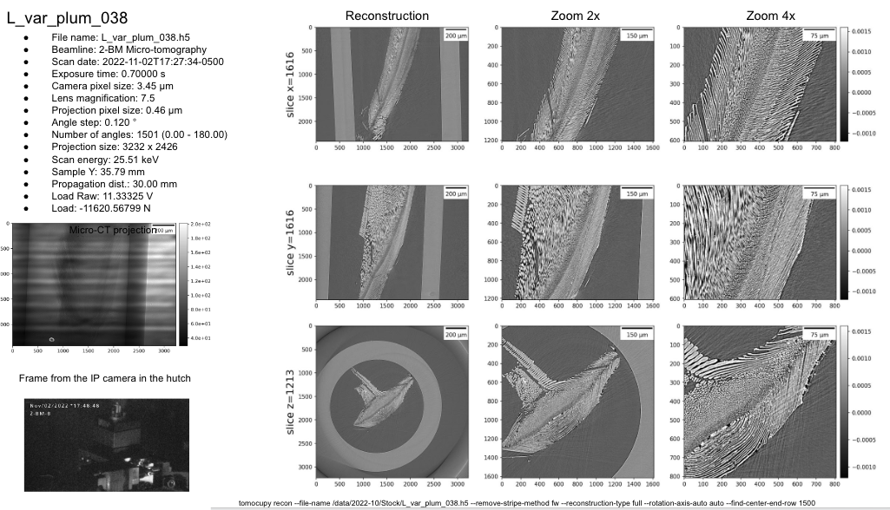

Data Analysis
=============

The raw data are automatically copied from the detector to the analysis computer (one of the tomo cluster computers) under the folder /data2/YYYY-MM/YYYY-MM-PI_lastName.

Manual
~~~~~~

To manually reconstruct a data set, use the `tomocupy cli tool <https://github.com/tomography/tomocupy-cli>`_.
::

    [2bmb@tomo4,~]$ bash
    [2bmb@tomo4,~]$ conda activate tomocupy

then for help::

    [2bmb@tomo4,~]$ tomocupy recon -h

To do a test reconstruction type::

    [2bmb@tomo4,~]$ tomocupy recon --file-name /local/data/YYYY-MM/PI_lastName/file.h5

Slides
~~~~~~

To publish reconstruction snapshots and experiment metadata to a Google Slides presentation, see the `tomolog documentation <https://tomologcli.readthedocs.io/en/latest/>`_.

At your home institution
------------------------

See the `tomocupy documentation <https://tomocupy.readthedocs.io/en/latest/>`_ for installation and usage instructions.

