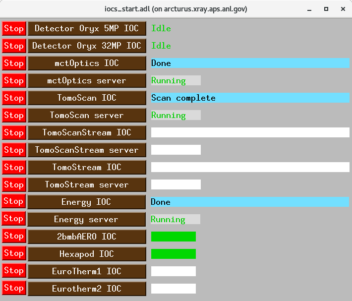

================
Beamline control
================

All beamline components and detectors are controlled using `EPICS <https://epics-controls.org/>`_ and `areaDetector <https://areadetector.github.io/master/index.html>`_.
Each device can be configure and controlled through a graphic user interface (GUI) or through a python script using `PyEpics <https://cars9.uchicago.edu/software/python/pyepics3/>`_.

To start the main 2-BM beamline control user interface::

    [2bmb@arcturus,42,~]$ start_epics

or to access directly the admin screens for tomography in scan or stream mode::

    [2bmb@arcturus,42,~]$ start_tomo_scan
    [2bmb@arcturus,42,~]$ start_tomo_stream

.. image:: ../img/2bma_beamline.png 
   :width: 720px
   :align: center
   :alt: 2bma_beamline

.. image:: ../img/2bmb_beamline.png 
   :width: 720px
   :align: center
   :alt: 2bmb_beamline

.. image:: ../img/tomo_02.png 
   :width: 720px
   :align: center
   :alt: tomo_01

.. warning:: If some of the above screen contains white fields, it means that the corresponding EPICS IOC is not running. To check/start/stop any IOC associated with tomograhy use the ioc_start user interface:

