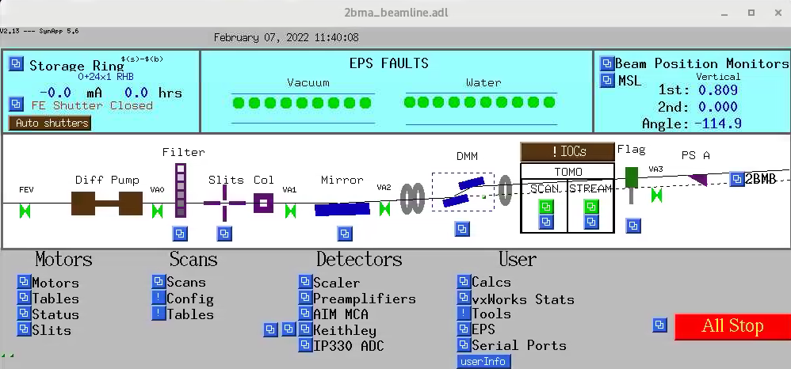
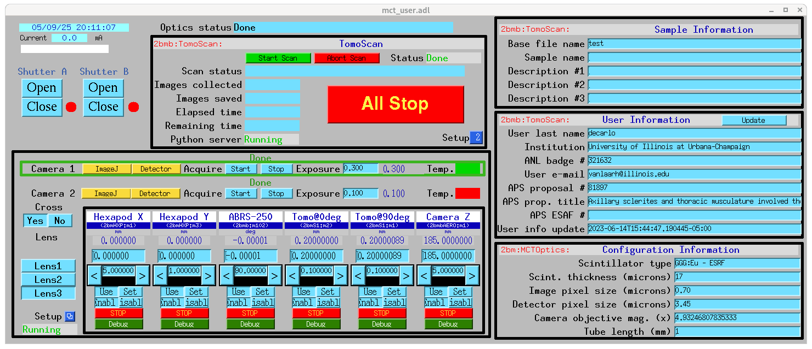

================
Beamline Control
================

All beamline components and detectors are controlled using `EPICS <https://epics-controls.org/>`_ and `areaDetector <https://areadetector.github.io/master/index.html>`_.
Each device can be configure and controlled through a graphic user interface (GUI) or through a python script using `PyEpics <https://cars9.uchicago.edu/software/python/pyepics3/>`_.

beamline
========

To start the main 2-BM beamline control user interface::

    [2bmb@arcturus,42,~]$ start_epics

Tomography
==========

To start the main tomography control screens for 2-BM-B for scanning or streaming data collection select in the main beamline control screens the corresponding screen for user, admin, tomoscan, tomoscan 2-BM:

.. image:: ../img/tomo_00.png 
   :width: 128px
   :align: center
   :alt: tomo_00

You can also start the above directly with:

::

    [2bmb@arcturus,42,~]$ start_tomo

User interface
--------------

Admin interface
---------------

.. image:: ../img/tomo_02.png 
   :width: 512px
   :align: center
   :alt: tomo_02

Main tomography control screen
------------------------------

.. figure:: ../img/tomo_03.png 
   :width: 512px
   :align: center
   :alt: tomo_031
   

To start tomoScanStream
-----------------------

.. image:: ../img/tomo_04.png 
   :width: 128px
   :align: center
   :alt: tomo_04

Main tomoScanStream control screen
----------------------------------

.. figure:: ../img/tomo_05.png 
   :width: 340px
   :align: center
   :alt: tomo_05

Main tomoStream control screen
------------------------------

.. figure:: ../img/tomo_06.png 
   :width: 340px
   :align: center
   :alt: tomo_06   

.. warning:: If some of the above screen contains white fields, it means that the corresponding EPICS IOC is not running. To check/start/stop any IOC associated with tomograhy use the ioc_start user interface:

   .. image:: ../img/tomo_07.png 
      :width: 340px
      :align: center
      :alt: tomo_07   