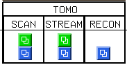
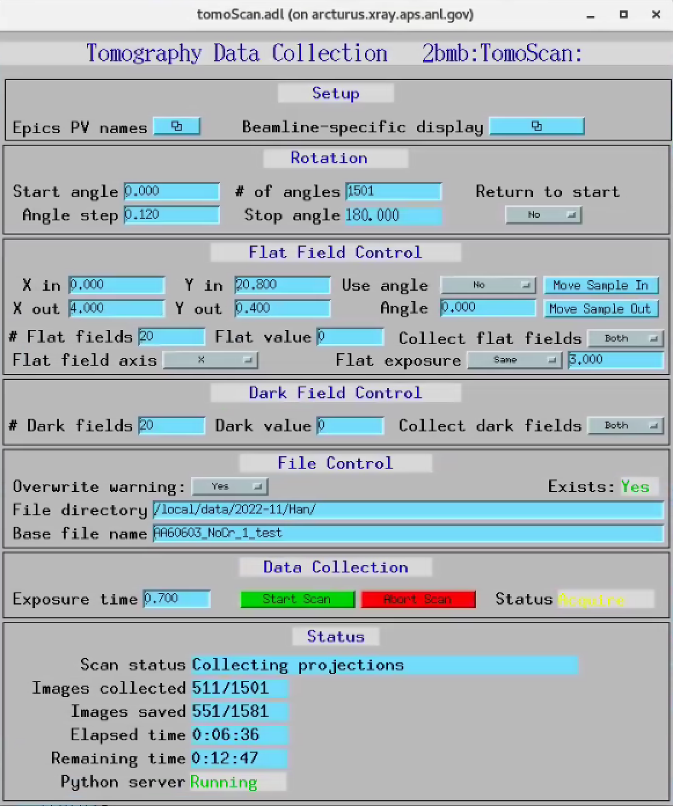

==================
Tomography control
==================

The main control screens for tomography at 2-BM-B provide access to
scanning, streaming data collection, and real-time reconstruction.

From the main 2-BM-B beamline control interface, select the
corresponding button or menu entry for **Scan**, **Stream**, or
**Recon** to open the appropriate tomography control screen:

TomoScan
========

The **TomoScan** interface is used for standard step-scan or fly-scan
tomography acquisitions. It provides control of scan geometry, exposure
parameters, motion axes, and basic acquisition settings.

TomoScanStream
==============

The **TomoScanStream** interface is used for continuous (streaming)
tomography data collection. It is typically used for high-throughput or
time-resolved experiments where data are acquired continuously while the
sample rotates.

.. figure:: ../img/tomo_05.png
   :width: 340px
   :align: center
   :alt: tomo_05

TomoStream
==========

The **TomoStream** interface is used for real-time or near real-time
reconstruction and visualization of tomography data. It allows users to
monitor reconstruction quality and adjust experimental parameters based
on immediate feedback.

.. figure:: ../img/tomo_06.png
   :width: 340px
   :align: center
   :alt: tomo_06