===================
Beamline components
===================

Reference inventory of the physical hardware that makes up 2-BM, walked
from the source to the detector. Each component is listed once, with the
fields needed to drive it (Family / role / intrinsic specs) and the
fields needed to reason about how it moves relative to everything else
(what it is mounted on, what rides on top of it).

This page is the source of truth for the beamline as an assembly. Per-
component operating instructions live in :doc:`item_010` (beamline
control) and the :doc:`../ops` section. Structured, cora-consumable
recipes that *use* this hardware live in :doc:`../procedures`.

.. note::

   "Mounted on" captures the kinematic chain, distinct from compositional
   ownership. A stage mounted on the rotary co-rotates with it; the same
   stage mounted under the rotary translates the rotation axis in lab
   coordinates. Alignment, error propagation, and limit-handling all
   depend on which is which.

Overview
========

.. figure:: ../img/beamline_layout_A342-RT1000.png
   :width: 720px
   :align: center
   :alt: 02-BM XSD beamline layout (APS drawing A342-RT1000, Rev 02)

   02-BM XSD beamline layout (APS drawing **A342-RT1000**, Rev 02,
   05/27/26). Top: building footprint with the 2-BM-A and 2-BM-B
   hutches. Bottom: beamline elevation with components labelled in
   walking order through 2-BM-A; the 2-BM-B hutch (~49–57 m from the
   source) contains a second set of L3 slits at z ≈ 50500 mm.
   Source PDF: `A342-RT1000-02.pdf
   <https://anl.app.box.com/file/2249043253618?s=r8e78v7jj30ggqhmbge0bin2mb4iof7w>`_.

Physical walk, source to detector (z values from the APS reference
table, in millimetres from the centre of the storage-ring straight
section; the beamline runs from z = 24020 at the FE exit mask to
z = 56764 at the photon stop)::

   Storage ring source
     -> A-shutter (front-end)          (in 2-BM-A; z TBD)
     -> L3 Slits + Filters             (z = 25225 mm)
     -> Y3-30 Mirror                   (z = 27626 mm)
     -> Double Multilayer Mono (DMM)   (z = 29335 / 29934 mm)
     -> Flag (diagnostic phosphor)     (z = 32500 mm)
     -> B-shutter (P6-50 Safety)       (z = 33343 mm)
     -> B-station Slits (L3-style)     (z = 50500 mm; in 2-BM-B)
     -> Sample stack                   (in 2-BM-B; optical table + tower)
     -> Detector system                (MCTOptics + Optique Peter Z + detector table)

Passive components (FE exit mask, K4-21 collimator, Be windows,
white-beam stop, baffles, beam transports, photon stop) sit between
these elements at the z positions listed in the inventory table
below.

Each block below expands into individual components with their intrinsic
properties and kinematic relations.

Personnel and access interlocks
===============================

The Personnel Safety System (PSS) and the APS-wide Access Control
and Interlock System (ACIS) gate beam admission to 2-BM. Neither
exposes a commandable Asset — both publish read-only status PVs
that downstream procedures and shutter-open commands check before
acting. They are not beam-conditioning devices and do not appear in
the z-ordered "Physical walk" above; they live here, alongside the
overview, because every beam-path component below is conditional on
both reading ``ON``.

PSS hutch search status
-----------------------

The Personnel Safety System publishes a per-hutch "secure" enum
that reads ``ON`` when the hutch is searched and locked (and the
PSS is willing to admit beam) and ``OFF`` when the search is broken
(door open, search active, manual override, etc.).

:Family: PSS interlock readback (read-only; not a Family in the
   cora 2-BM inventory — these are operational status PVs, not
   commandable Assets).
:Hosted on: ``s2pvgate.xray.aps.anl.gov:5064`` (PSS gateway; same
   host as the shutter ``BeamBlockingM`` PVs).

==========================  ===================  ==============
PV                          Description (DESC)   Meaning
==========================  ===================  ==============
``S02BM-PSS:StaA:SecureM``  ``Sta-A Secure``     2-BM-A hutch
``S02BM-PSS:StaB:SecureM``  ``Sta-B Secure``     2-BM-B hutch
==========================  ===================  ==============

Both PVs share the same enum:

- STATE 0 = ``OFF`` → hutch **not** secure (search active or
  broken; PSS will not admit beam).
- STATE 1 = ``ON``  → hutch secure (searched and locked; PSS
  permits beam).

These are the predicates the :doc:`../procedures/item_003`
(``enable_beamline``) stub procedure uses for its
``beamline_enabled`` postcondition. Both must read ``ON`` before
the FES open command (``S02BM-PSS:FES:OpenEPICSC``) will be
honoured.

ACIS upstream permit
--------------------

The APS Access Control and Interlock System exposes a single
"upstream permit" PV that aggregates storage-ring health,
injection state, APS-wide permits, the per-beamline PSS state,
and the BLEPS fault chain into one boolean. If it reads ``ON``,
all of the upstream conditions required to admit beam to 2-BM
are met -- the FES open command will be honoured.

:Family: ACIS upstream permit (read-only; analogous to the PSS
   ``SecureM`` PVs above but at a higher level of aggregation).
:Hosted on: ``s2pvgate.xray.aps.anl.gov:5064``.

==========================  =============================  ===================
PV                          Description (``DESC``)         Meaning
==========================  =============================  ===================
``SR-ACIS:2BM:FesPermitM``  ``2BM PSS FES Permit``         FES open permitted
==========================  =============================  ===================

Enum:

- STATE 0 = ``OFF`` → ACIS does **not** permit the FES to open
  (some upstream condition failed -- could be storage ring down,
  BLEPS fault latched, PSS not searched, etc.).
- STATE 1 = ``ON``  → ACIS permits the FES to open. The
  individual upstream conditions are all green.

This is the single PV the :doc:`../procedures/item_003`
(``enable_beamline``) stub procedure uses to test the composite
"upstream OK" condition. It replaces the earlier
"BLEPS-clear AND machine-state-OK" pair of TBDs because ACIS
already composes both.

Beam delivery
=============

The formal inventory of front-end and transport components, with
positions, apertures, materials, and tolerances, is maintained as the
**02-BM Beamline Component Reference Table** (APS_1404611):

https://anl.box.com/s/afme9vpllerzzvsuzqiyxn7aukh7292j

That document is the source of truth for positions and shielding;
the summary below reproduces it in walking order (source to hutch) and
expands the components that are operationally addressed at run time
(slits, mirror, monochromator, safety shutter) into per-component
blocks for `cora <https://github.com/xmap/cora>`__.

.. note::

   The reference table was last formally updated for the 2013 Sector 02
   Three-Year Safety Review and reflects the pre-APS-U layout. Post-
   APS-U changes (mirror retrofit, source brightness, any added
   components) need a separate reconciliation pass before this page is
   considered final.

Coordinate convention (from the APS_1404611 reference table linked above):

- ``X`` = horizontal, positive outboard [mm]
- ``Y`` = vertical, positive up [mm]
- ``Z`` = along beam from the centre of the straight section [mm]
- ``X`` / ``Y`` positions are relative to the nominal white-beam centreline
- Masks and collimators are referenced to the aperture centre
- ♥ standard bending-magnet centreline (1.35 mrad inboard)
- ♠ alternate centreline (5.1 mrad up at Y3-30 mirror)
- ♦ alternate centreline (5.23 mrad up at Y3-30 mirror)

The Z reference point varies per component class (a superscript on
the Z value in the original APS table; reproduced as the ``ref``
column in the inventory below):

- **1** — upstream face of thermal component (FE exit mask, Be
  windows, white-beam stop, W collimator, safety shutter, SS baffle)
- **2** — centre of optic (slits, mirror, DMM crystals)
- **3** — upstream face of shielding material (K4-21 collimator,
  beam transports, photon stop)

Beam-conditioning inventory (source to hutch)
---------------------------------------------

The table below lists only the components that condition the beam
(shape and energy). Passive hardware — FE exit mask, K4-21 collimator,
Be windows, white-beam stop, W collimator, SS baffle, shielded beam
transports, photon stop — is not reproduced here; the linked APS
reference table at the top of this section is the authoritative
full inventory. Item numbers below match the APS table for cross-
reference.

.. list-table::
   :header-rows: 1
   :widths: 4 32 14 5 45

   * - #
     - Component
     - z [mm]
     - ref
     - Notes
   * - 2
     - L3 Slits with Filters
     - 25225
     - 2
     - Operational; see block below. Splits into L3 Slits (shape) and L3 Filters (energy absorption); shared assembly.
   * - 4
     - Y3-30 Mirror
     - 27626
     - 2
     - Silicon · defines the ♠ / ♦ alternate centrelines · operational, see block below
   * - 5
     - Double Multilayer Monochromator
     - 29335 / 29934
     - 2
     - Silicon · two crystals (Y offsets 9.0 / 41.0 mm) · operational, see block below
   * - —
     - B-station Slits
     - 50500
     - 2
     - Second four-blade L3-style slits in 2-BM-B (no filter changer paired). Not in APS_1404611; z read from layout drawing A342-RT1000-02. Operational, see block below.

Common position tolerances across all rows: dx = dy = 250 µm, dz = 5 mm.

All four items are operational (have command surfaces) and are
expanded in :ref:`operational components <operational-components>`.
The P6-50 safety shutter (item 8c in the APS reference table) is also
operational but gates the beam rather than conditioning it; it appears
as its own block at the end of the operational-components section.

.. _operational-components:

Operational components
----------------------

The L3 slits and filters share an ops page; the mirror and DMM each
have their own. Pre-APS-U pages are noted as such — those entries are
candidates for reconciliation against the post-APS-U layout.

2-BM has two shutters: an A-shutter at the front end (first
gating element on the beamline, in 2-BM-A) and the P6-50 safety
shutter (``B_shutter``) further downstream. Both are listed below.

A-shutter (front-end)
~~~~~~~~~~~~~~~~~~~~~

:Role: First beam-gating element on the beamline; located in 2-BM-A
   upstream of the slits
:Family: Shutter
   (would be a second instance of the cora ``Shutter`` Family.
   The cora 2-BM assets inventory at
   ``docs/deployments/2-bm/assets.md`` currently lists only one
   ``Shutter`` Asset, ``StationShutter``, which is the B-station
   P6-50 safety shutter below; the A-shutter is not yet registered
   and needs a distinct Asset name (cora has not chosen one — a
   role-name like ``FrontEndShutter`` would follow the same
   convention as ``StationShutter``, naming the shutter by what it
   gates rather than by vendor or PV).)
:Mounted on: Front-end stand (floor-referenced)
:Carries: (beam gating only)
:z position: TBD (upstream of the L3 Slits; not separately listed in
   the APS reference table)
:EPICS prefix: ``S02BM-PSS:FES``
:Open command: ``S02BM-PSS:FES:OpenEPICSC``
:Close command: ``S02BM-PSS:FES:CloseEPICSC``
:Status readback: ``S02BM-PSS:FES:BeamBlockingM`` (``DBF_ENUM``,
   read-only; hosted on the PSS gateway ``s2pvgate``).

   - STATE 0 = ``OFF`` → beam is **not** being blocked →
     **shutter OPEN**.
   - STATE 1 = ``ON``  → beam **is** being blocked →
     **shutter CLOSED**.

   Note the inverted semantics: the PV reports the *blocking
   state*, not the *shutter position*. After issuing
   ``OpenEPICSC`` / ``CloseEPICSC`` confirm the state by reading
   ``BeamBlockingM`` (``caget`` returns the string ``OFF`` /
   ``ON`` when called with ``-S``; the integer 0 / 1 by default).
:Notes:
   Independent of the P6-50 personnel-safety shutter (``B_shutter``,
   below) further downstream. Both must be open for beam to reach
   2-BM-B. **Operational practice: the A-shutter is opened at the
   start of an experimental session and kept open continuously**
   to preserve the thermal stability of the beamline optics
   (mirror, monochromator). Per-scan beam gating is done on the
   downstream P6-50 (``B_shutter``) instead; see the P6-50 block
   below for the TomoScan integration.

.. note::

   **2-BM-A motor controller.** Every ``2bma:mNN`` motor cited in
   the 2-BM-A blocks below (L3 Slits, Y3-30 Mirror, DMM, B-station
   Slits, etc.) is a slot on the OMS-VME58 card in the ``ioc2bma``
   crate — cora Asset ``FrontEndDrive``. None of those
   driven stages are themselves modelled as cora Assets yet (the
   front-end / beam-conditioning band stays in cora's Pending
   list); the controller Asset ships in isolation as the
   addressability handle for "controller-level" Procedures.

L3 Slits
~~~~~~~~

:Role: Beam-shape conditioning, upstream of the mirror
:Family: Slit
   (listed as "Pending in code" in the cora Equipment BC families
   catalog at ``docs/catalog/families.md``; not yet a registered
   Family. Standard APS L3-20 four-blade slits — two horizontal
   (X−, X+) and two vertical (Y−, Y+) blade motors, plus per-
   direction derived ``Size`` / ``Center`` calc axes.)
:cora Asset: ``ConditioningSlit`` (proposed name; not yet registered.
   Used as the ``target_asset_ids`` value by ``calibrate_slit_blade_throw``
   (:doc:`../procedures/item_012`) and by ``centre_and_close_slits``
   (:doc:`../procedures/item_011`).)
:Mounted on: Front-end stand (floor-referenced)
:Driven by: ``FrontEndDrive`` (cora ``MotionController`` Asset
   already registered in ``cora/docs/deployments/2-bm/assets.md``;
   pending controller_id back-reference from this Asset once it
   registers)
:Carries: (beam conditioning only)
:z position: 25225 mm (ref 2: centre of optic; shared with Filters)
:Position tolerance: 250 µm (x, y), 5 mm (z)
:Reference drawing: L3200000-03.pdf
:As-built drawings: https://anl.box.com/s/sgmoux6db8tsx71pvifzkf2ajopfidqx
:MEDM screen: ``2slit.adl`` (running on ``arcturus``)
:EPICS prefix: ``2bma:`` (horizontal motors ``m14`` for A Slit X−
   [inboard], ``m13`` for A Slit X+ [outboard]; vertical motors
   ``m15`` for A Slit Y+ [up], ``m16`` for A Slit Y− [down])
:Virtual motor PVs: the four composite Size/Centre ``ao``-record
   PVs below drive both blades of a pair together. Hosted on
   ``ioc2bmb1.xray.aps.anl.gov:5064`` (the same IOC that hosts the
   B-station slit calc records, despite the ``2bma:`` prefix on
   both). These are the PVs the ``2slit.adl`` MEDM screen wires
   to the ``Size`` and ``Center`` text-entry boxes; the values you
   set on the screen propagate through downstream calc records to
   the individual blade motors.

   .. list-table::
      :header-rows: 1
      :widths: 50 50

      * - PV
        - Limits (mm)
      * - ``2bma:Slit1Hsize``
        - +93.95 / -24.05
      * - ``2bma:Slit1Hcenter``
        - +34.73 / -24.27
      * - ``2bma:Slit1Vsize``
        - +71.29 / -66.71
      * - ``2bma:Slit1Vcenter``
        - +23.47 / -45.53

The slits at 2-BM are standard APS L3-20. Technical as-built drawings
are available `here <https://anl.box.com/s/sgmoux6db8tsx71pvifzkf2ajopfidqx>`_.

.. note::

   "Inboard" follows the APS X convention: positive X is outboard
   (away from the ring centre), negative X is inboard (toward the
   ring centre). The screen below is oriented ``LOOKING UPSTREAM``,
   so on-screen left corresponds to inboard.

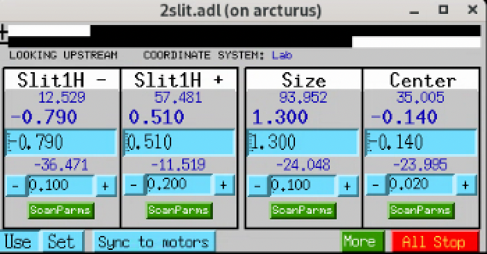

   ``2slit.adl`` — horizontal-slits control screen ("LOOKING
   UPSTREAM", ``Lab`` coordinate system). The two leftmost columns
   drive the individual blade motors: ``2bma:m14`` for the X− blade
   (inboard) and ``2bma:m13`` for the X+ blade (outboard). The
   ``Size`` and ``Center`` columns are calc-driven composites that
   move both blades together to set the aperture width and centre.

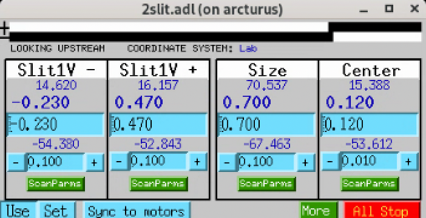

   ``2slit.adl`` — vertical-slits control screen (same orientation
   and layout as the horizontal screen). The two leftmost columns
   drive the individual blade motors: ``2bma:m15`` for the Y+ blade
   (up) and ``2bma:m16`` for the Y− blade (down). The ``Size`` and
   ``Center`` columns are calc-driven composites that move both
   blades together to set the aperture height and centre.

.. note::

   **cora Asset registration intent.** When the ``Slit`` Family
   graduates from Pending, register this assembly as Asset
   ``ConditioningSlit`` with the following structure (mirrors the
   ``Hexapod`` / ``Rotary`` patterns
   already in ``cora/docs/deployments/2-bm/assets.md``):

   - Family: ``Slit``
   - Mounted on: front-end stand (floor reference)
   - controller_id back-reference: ``FrontEndDrive``
   - Settings (blade motors): ``2bma:m13`` (H+ outboard), ``2bma:m14``
     (H− inboard), ``2bma:m15`` (V+ up), ``2bma:m16`` (V− down)
   - Settings (virtual / calc-driven aperture):
     ``2bma:Slit1Hsize``, ``2bma:Slit1Hcenter``,
     ``2bma:Slit1Vsize``, ``2bma:Slit1Vcenter``
   - z position: 25225 mm (from APS reference table)
   - Per-blade calibration field
     ``calibration_slope_pix_per_mm`` (one per blade motor),
     seed values + conditions from the
     :doc:`../procedures/item_012` field-test table for the
     "A station — after MRES fix" run (2026-06-14).
   - Target of Procedure ``calibrate_slit_blade_throw``
     (:doc:`../procedures/item_012`) and Procedure
     ``centre_and_close_slits`` (:doc:`../procedures/item_011`).

L3 Filters
~~~~~~~~~~

:Role: Energy filtering (selective absorption upstream of the mirror)
:Family: Filter
   (cora ``Filter`` Family; the device is preregistered in the
   2-BM Pending list at ``docs/deployments/2-bm/assets.md`` as
   Asset ``Filter`` with Family ``Filter``. ``Filter`` is the
   thing-noun the device IS (anatomy); the paddle-changing
   mechanism is operational behaviour, captured as affordances
   on the Family rather than baked into the Family name —
   cora's noun-LAST rule rejects the agent-noun reading of
   ``FilterChanger``. Two independent paddle sets — upstream and
   downstream — with up to four filter materials per side, plus
   a None / LowLimit reference per side.)
:Mounted on: Front-end stand (shared assembly with L3 Slits)
:Carries: (beam conditioning only)
:z position: 25225 mm (ref 2: centre of optic; shared with Slits)
:Position tolerance: 250 µm (x, y), 5 mm (z)
:Reference drawing: L3200000-03.pdf
:IOC: ``2filter`` (running on ``arcturus``)
:MEDM screens: ``2filter.adl`` (user), ``2filter_setup.adl`` (admin)
:EPICS prefix: ``2bma:`` (filter macro ``fltr1:``; motors ``m17`` upstream,
   ``m18`` downstream; lock calc ``userCalc10``)

**Current configuration.** The L3 filter changer has two independent
paddle sets, mounted upstream and downstream of the slits assembly.
Each side carries up to four filter materials, plus a ``None`` (empty)
position and a ``LowLimit`` hardware reference.

``2filter.adl`` is the operator screen used to drive the filters
during a run; ``2filter_setup.adl`` is the admin screen used to
program the paddle labels and the motor-drive positions each label
maps to. Both screens are part of the ``2filter`` IOC.

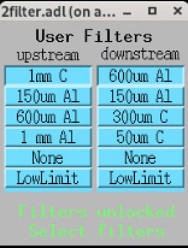

   ``2filter.adl`` — operator-facing filter selector. Each button
   moves the corresponding motor to the position bound for that
   material (see admin screen below). ``None`` pulls the paddle
   clear; ``LowLimit`` returns to the hardware reference.

Materials currently bound (read from the screen above):

- **Upstream paddles:** 1 mm C, 150 µm Al, 600 µm Al, 1 mm Al
- **Downstream paddles:** 600 µm Al, 150 µm Al, 300 µm C, 50 µm C

.. warning::

   **Downstream paddle (`2bma:m18`) motor is failed.** Operator-
   reported 2026-06-19. The motor is currently parked at position
   107.19 mm, ~1 mm beyond the ``None`` bind at 106.000 mm — i.e.,
   paddles are clear of the beam, but the motor cannot be commanded.
   Bindings (see table below) remain valid in the IOC and will
   return to use when the motor is repaired or replaced. **Repair
   is not expected in the near term**; the planning assumption for
   the foreseeable future is that filter selection at 2-BM is via
   the upstream paddle (m17) only.

   The **upstream paddle (`2bma:m17`)** is **fully operational** —
   paddles ``1 mm C``, ``150 µm Al``, ``600 µm Al``, ``1 mm Al``,
   and ``None`` are all selectable. Earlier revisions of this page
   said upstream "hardware not in service"; that was incorrect and
   has been removed. Filter selection at 2-BM today is therefore
   available via the upstream paddle only, until m18 is repaired.

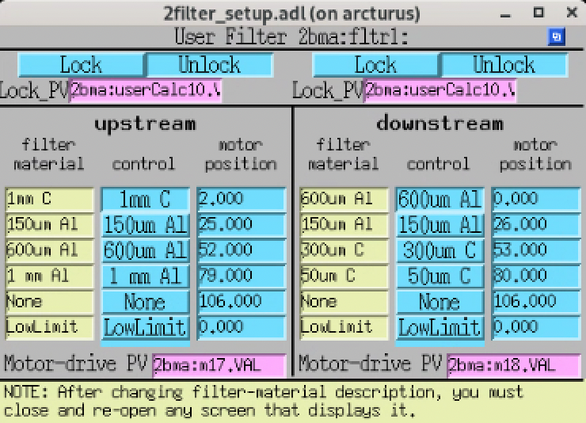

   ``2filter_setup.adl`` — administrative screen for the L3 filter
   changer. Used to (a) edit the material description on each paddle
   and (b) set the motor-drive position each material maps to, per
   side. The four-paddles-per-side limit and the upstream /
   downstream split are set here. When a material description is
   changed, any open ``2filter.adl`` instance must be closed and
   re-opened to pick up the new label.

**Motor-drive PVs:** upstream ``2bma:m17.VAL``,
downstream ``2bma:m18.VAL``.

**Position bindings (read from ``2filter_setup.adl``):**

.. list-table::
   :header-rows: 1
   :widths: 30 20 30 20

   * - Upstream material
     - ``m17`` position
     - Downstream material
     - ``m18`` position
   * - 1 mm C
     - 2.000
     - 600 µm Al
     - 0.000
   * - 150 µm Al
     - 25.000
     - 150 µm Al
     - 26.000
   * - 600 µm Al
     - 52.000
     - 300 µm C
     - 53.000
   * - 1 mm Al
     - 79.000
     - 50 µm C
     - 80.000
   * - None
     - 106.000
     - None
     - 106.000
   * - LowLimit
     - 0.000
     - LowLimit
     - 0.000

Position units are **millimetres**, per ``caget 2bma:m18.EGU``
(operator-verified 2026-06-19; PV returns ``mm``). The regular
~25-26 mm spacing across the 0–106 mm range is the physical paddle
pitch.

Y3-30 Mirror
~~~~~~~~~~~~

:Role: Vertical-deflecting mirror; defines the alternate beam centrelines
:Family: Mirror
   (Pending in cora: Asset ``Mirror`` appears in the Pending
   table at ``docs/deployments/2-bm/assets.md`` (role-name
   convention set by cora's #111, after earlier candidate
   names ``Mirror_2BM`` and ``Y3-30_mirror``); Family
   ``Mirror`` is listed as "Pending in code" at
   ``docs/catalog/families.md``. Composes a mirror body with
   an in-vacuum stripe selector and an external optical-table
   sub-assembly carrying Y / X / Z stages.)
:Mounted on: Optical table (six physical motors ``2bma:m1``–``2bma:m6``; the per-end Y motors are driven via ``2postMirror.db`` and the table X motors via the energy-change IOC; see the Mirror optical table block below)
:Carries: (beam conditioning only)
:z position: 27626 mm (ref 2: centre of optic; mirror-1 axis)
:Position tolerance: 250 µm (x, y), 5 mm (z)
:Material: Silicon
:Mirror length: 0.993 m (used by the angle calc record)
:Reference drawing: 4105091203-300000
:Reference (ops): https://docs2bm.readthedocs.io/en/latest/source/ops/item_045.html#mirror
:MEDM screens: ``2postMirror.adl`` (Y / pitch control). ``table_full.adl`` was historically used for the ``2bma:table1`` composite axes; that record was dropped 2026-06-15 (see Mirror optical table block below) and the screen is no longer functional at runtime.
:EPICS prefix: ``2bma:`` (motors listed per sub-system below)

The APS reference-table entry reflects pre-APS-U geometry; the
post-APS-U mirror retrofit (see ``02-BM-MirrorRetrofit_v0.pdf`` in
the beamline records) supersedes that entry and is the basis for the
current ops page linked above. Sets the ♠ (5.1 mrad up) and ♦
(5.23 mrad up) alternate centrelines used by downstream components.

**Mirror Y (pitch) control.** The mirror body sits on two vertical
stages — one near the upstream end, one near the downstream end —
driven independently to set the mirror Y position and the deflection
angle.

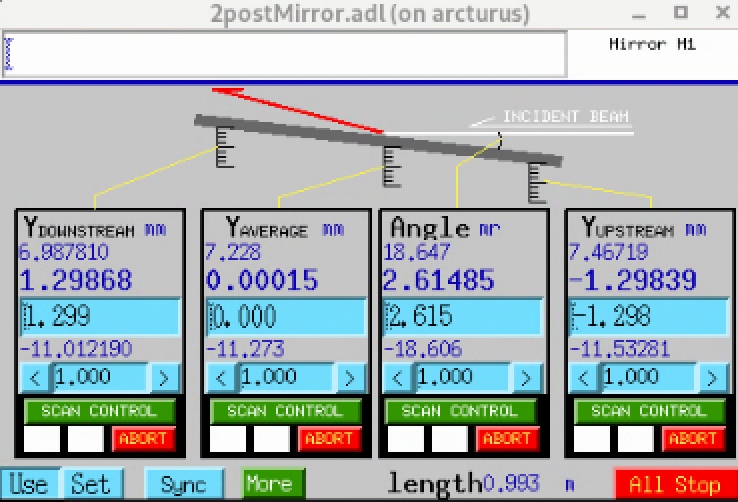

   ``2postMirror.adl`` — mirror Y / angle control screen. The two
   outer columns drive the physical Y motors; the two inner columns
   are derived (calc records).

- **M1 DSY** (downstream Y) — ``2bma:m2``
- **M1 USY** (upstream Y) — ``2bma:m5``
- **Y average** — derived (mean of the two Y motors)
- **Angle [mr]** — derived (deflection angle in milliradians,
  computed from the Y difference and the 0.9932 m mirror length)

These two per-end Y motors and the derived calc records are loaded
into the IOC by:

::

   dbLoadRecords("$(OPTICS)/opticsApp/Db/2postMirror.db",
                 "P=2bma:,Q=M1,mDn=m2,mUp=m5,LENGTH=0.9932")

i.e. ``mDn`` (downstream) = ``2bma:m2``, ``mUp`` (upstream) =
``2bma:m5``, mirror length 0.9932 m for the angle calc. There are
**exactly two physical Y motors** on the mirror itself; these are
the operational surface for fine pitch / angle setting via
``2postMirror.adl``. See the Mirror optical table block below for
why the table-level virtual record (``2bma:table1``) used to
double-count them and has now been removed.

**In-vacuum stripe selector.** The mirror has four horizontal coating
stripes on its optical surface, selected by translating the mirror
laterally with an in-vacuum X stage:

- **a** — 5 nm Pt (single-layer)
- **b** — W(1.2 nm) / Si(5.37 nm) × 50 multilayer (d-spacing 8.8 % below spec)
- **c** — W(1.2 nm) / Si(3.56 nm) × 50 multilayer (d-spacing 10.1 % below spec)
- **d** — W(1.2 nm) / Si(2.73 nm) × 50 multilayer (d-spacing 9.4 % below spec)

Selector motor: ``2bma:m3``. See the ops page above for the per-
stripe expected-flux curve (``mirror_multilayer_coating.png``).

.. warning::

   ``2bma:m3`` does not have enough travel on its own to reach the
   highest-energy stripe. Reaching that stripe requires a coordinated
   move of ``m3`` together with the optical-table X stages below.
   This coordination is encapsulated by the energy-change IOC; see
   :ref:`composite-iocs`.

**Mirror optical table.** The mirror sub-assembly sits on a
multi-motor optical table whose six physical motors live on the
``ioc2bma`` crate as ``2bma:m1`` through ``2bma:m6``. The table is
**not exposed as a composite virtual record at 2-BM today** (the
``2bma:table1`` record was historically loaded via ``table.db`` but
has been removed — see note below). The six physical motors are
driven via two separate, purpose-fit abstractions:

- ``2postMirror.db`` for the mirror's pitch and vertical translation
  (the per-end Y motors ``2bma:m2`` and ``2bma:m5``); operational
  surface is ``2postMirror.adl``.
- The energy-change IOC for the X support motors ``2bma:m1`` and
  ``2bma:m4`` (the ``m1mox`` / ``m1m2x`` per-energy values driven in
  coordinated moves with the in-vacuum stripe selector to reach the
  highest-energy mirror stripes; see :ref:`composite-iocs`).

Per-motor role:

=========  =============================================================
Motor PV   Role
=========  =============================================================
``2bma:m1``  Table X support, corner 0 (driven by energy-change IOC as ``m1mox``)
``2bma:m2``  Mirror downstream Y (``M1 DSY``; per-end Y for pitch / vertical; ``2postMirror.adl`` operational surface; also ``mDn`` in ``2postMirror.db``)
``2bma:m3``  In-vacuum X stripe selector (NOT a table support; see In-vacuum stripe selector block above)
``2bma:m4``  Table X support, corner 2 (driven by energy-change IOC as ``m1m2x``)
``2bma:m5``  Mirror upstream Y (``M1 USY``; per-end Y for pitch / vertical; ``2postMirror.adl`` operational surface; also ``mUp`` in ``2postMirror.db``)
``2bma:m6``  Table Z support; present but not used operationally
=========  =============================================================

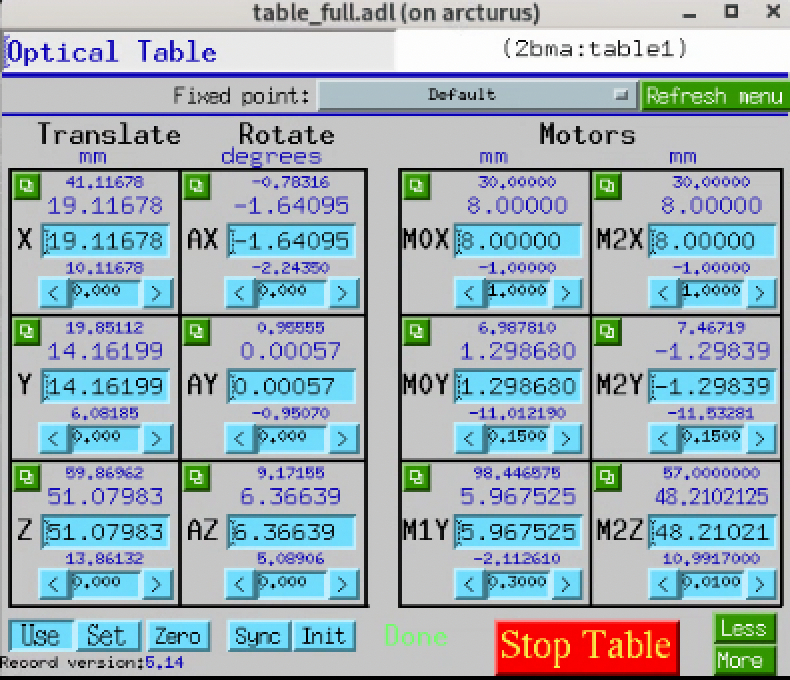

   ``table_full.adl`` for ``2bma:table1``, **historical screenshot**.
   This screen showed the table virtual record's composite axes
   while ``table.db`` was loaded. As of 2026-06-15 the
   ``2bma:table1`` record is no longer loaded (see note below); this
   screen will show disconnected PVs at runtime and is kept here for
   documentation of the prior configuration only.

.. note::

   **History — ``2bma:table1`` virtual record removed 2026-06-15.**

   ``iocBoot/ioc2bma/st.cmd`` previously loaded the synApps
   ``table.db`` template for this mirror table with the
   substitution
   ``"P=2bma:,Q=Table1,T=table1,M0X=m1, M0Y=m2, M1Y=m3, M2X=m4,
   M2Y=m5, M2Z=m6, GEOM=SRI"``. That substitution had ``M1Y =
   2bma:m3`` — but ``2bma:m3`` is the in-vacuum X stage that
   translates the mirror inside the vacuum chamber (the stripe
   selector), not a table Y corner support. The mirror table
   physically has only **two** Y supports (the per-end DSY / USY
   motors at ``2bma:m2`` / ``2bma:m5``, corroborated by the
   ``2postMirror.db`` substitution above), so the ``M1Y`` slot in
   the SRI 3-Y / 2-X / 1-Z template was structural padding
   mistakenly filled with the stripe-selector motor record.

   Consequence at the time: any move on ``2bma:table1.Y``, ``.AX``,
   or ``.AY`` distributed through ``M1Y`` and would have perturbed
   the in-vacuum stripe selector. The composite Y / pitch / yaw
   axes on the table were therefore not safe to drive.

   Three resolution paths were considered (tracked at
   `xray-imaging/2bm-docs#171
   <https://github.com/xray-imaging/2bm-docs/issues/171>`__):

   - **Path A** — substitute a soft motor record for ``M1Y`` so the
     composite axes stay nominally functional but no longer touch
     ``2bma:m3``.
   - **Path B** — switch to ``ASRPmirrorTable.db`` (the synApps
     mirror-table-specific template) which uses ``PITCH`` + ``VERT``
     instead of 6 motors and matches the physical 2-Y geometry.
   - **Path C** — drop the ``2bma:table1`` virtual record entirely;
     drive the 6 physical motors directly via ``2postMirror.db``
     (per-end Y / pitch / vertical) and the energy-change IOC (table
     X). No composite axes, no soft motor.

   **Path C was chosen** (operator-confirmed 2026-06-15): the
   ``dbLoadRecords`` line for ``table.db`` was commented out in
   ``iocBoot/ioc2bma/st.cmd``, so the ``2bma:table1`` record and
   its ``.X / .Y / .Z / .AX / .AY / .AZ`` composite axes no longer
   exist in CA. All operational motion at the mirror goes through
   ``2postMirror.db`` (pitch / vertical) and the energy-change IOC
   (table X for stripe-selector extension); ``2bma:m6`` (the Z
   support) remains an addressable raw motor record but is not used
   operationally.

Double Multilayer Monochromator (DMM)
~~~~~~~~~~~~~~~~~~~~~~~~~~~~~~~~~~~~~

:Role: Energy selection (monochromatic mode)
:Family: Monochromator
   (listed as "Pending in code" in the cora Equipment BC families
   catalog at ``docs/catalog/families.md``; not yet a registered
   Family. Two crystals — upstream (US) and downstream (DS) — each
   with X / Y / Bragg-arm drives, plus global tank Y / Z. Upstream
   crystal carries a split Y (OB / IB) for combined Y translation
   and Z-tilt.)
:Mounted on: Front-end stand (floor-referenced)
:Carries: (beam conditioning only)
:z position: crystal 1 at 29335 mm, crystal 2 at 29934 mm (ref 2: centre of optic)
:Y offset: 9.0 mm (crystal 1), 41.0 mm (crystal 2)
:Position tolerance: 250 µm (x, y), 5 mm (z)
:Material: Silicon
:Inter-crystal spacing: 1323 mm along beam, 765 mm in/out-board (read from screen)
:Reference (ops): https://docs2bm.readthedocs.io/en/latest/source/ops/item_021.html#dmm
:MEDM screen: ``DMMV.adl`` (running on ``arcturus``)
:EPICS prefix: ``2bma:`` (motors listed below)

Insertable: white-beam operation bypasses the DMM. Energy-change
coordination across the DMM motors and the mirror stripe selector
is encapsulated by the energy-change IOC; see :ref:`composite-iocs`.

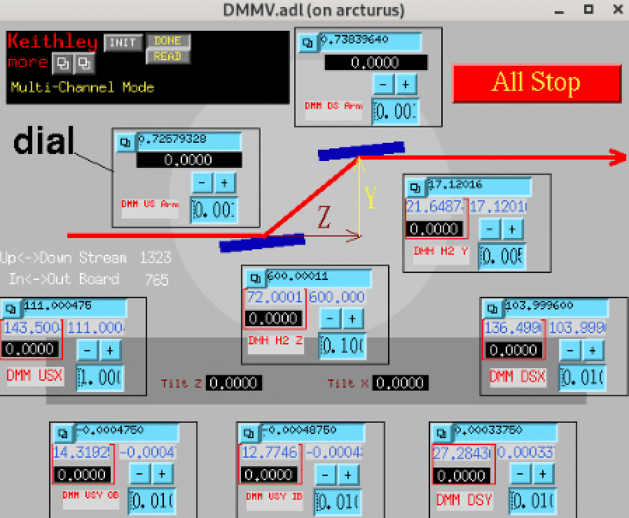

   ``DMMV.adl`` — DMM control screen.

**Motors:**

.. list-table::
   :header-rows: 1
   :widths: 22 53 25

   * - Description
     - Role
     - EPICS PV
   * - DMM M2 Z
     - Second crystal translation along the beam relative to the first
     - ``2bma:m8``
   * - DMM USX
     - Global tank upstream X
     - ``2bma:m25``
   * - DMM USY OB
     - Global tank upstream Y outboard side
     - ``2bma:m26``
   * - DMM USY IB
     - Global tank upstream Y inboard side
     - ``2bma:m27``
   * - DMM DSX
     - Global tank downstream X
     - ``2bma:m28``
   * - DMM DSY
     - Second crystal Y relative to the first
     - ``2bma:m29``
   * - DMM US Arm
     - Upstream Bragg-arm rotation
     - ``2bma:m30``
   * - DMM DS Arm
     - Downstream Bragg-arm rotation
     - ``2bma:m31``
   * - DMM M2 Y
     - Second crystal Y (companion to ``M2 Z``)
     - ``2bma:m32``

The tank's upstream end carries two independent Y motors (``USY OB``
and ``USY IB``); their average sets the upstream tank Y position and
their difference produces a Z-tilt around the beam axis. The second
crystal is positioned relative to the first via the ``DSY`` (Y),
``M2 Z`` (along beam), and ``M2 Y`` motors.

Flag (diagnostic phosphor)
~~~~~~~~~~~~~~~~~~~~~~~~~~

:Role: Diagnostic phosphor screen on a vertical stage. A visible-
   light camera looks at it so operators can see the X-ray beam
   position and gauge intensity. In pink-beam (white-beam) mode
   the flag is parked at its lower limit (``Y = 0 mm`` user,
   ``5 mm`` dial) -- out of the beam. In mono mode the flag is
   raised to block the M1-scattered halo while letting the
   monochromatic beam pass; the exact Y is energy-dependent.
:Family: Diagnostic (no cora Family declared yet; this is the
   first instance of a "viewable beam diagnostic" on the 2-BM
   inventory).
:Mounted on: Own stand in 2-BM-A (floor-referenced).
:Carries: phosphor-painted flag + visible camera (not modelled
   here; the camera is its own Asset).
:z position: 32500 mm (between the DMM and the P6-50 safety
   shutter). Not separately listed in the APS reference table.
:EPICS: ``2bma:m44`` -- single vertical (Y) motor.
:User/dial offset: user = dial - 5 mm. Limits (user, from
   ``meters_all.adl``): -4.5 to +35.0 mm (dial 0.5 to 40.0 mm).

The energy-dependent flag positions used by mono-beam scans are
defined in the ``energy`` package's lookup table
(`energy2bm.json
<https://github.com/xray-imaging/energy/blob/main/src/energy/data/energy2bm.json>`__,
key ``energy_move_flag``):

==============  ===================  ==========================
DMM energy keV  Flag Y (mm, user)    Comment
==============  ===================  ==========================
13.374          23.0                 highest (low energy)
13.574          22.0
18.000          17.0
20.000          15.0
25.000          12.0
25.584          12.0
30.000          0.0                  flag down (out of beam)
40.000          0.0
50.000          0.0
60.000          0.0                  highest energy
==============  ===================  ==========================

Pink-beam mode: flag at ``Y = 0 mm`` (user) -- same as the
"flag down" position used by mono at 30 keV and above.

.. note::

   **Procedures that command this component.**
   :doc:`../procedures/item_006` (``set_flag_in``) is the stub
   that satisfies the ``flag_in_beam`` precondition of
   :doc:`../procedures/item_002` (``detector_z_rail_alignment``).
   The energy-dependent target Y is read from the
   ``energy_move_flag`` field of `energy2bm.json
   <https://github.com/xray-imaging/energy/blob/main/src/energy/data/energy2bm.json>`__;
   operating in
   pink mode means writing ``0 mm`` user to ``2bma:m44``.

P6-50 Safety Shutter (B-shutter)
~~~~~~~~~~~~~~~~~~~~~~~~~~~~~~~~

:Role: Personnel-safety shutter for 2-BM hutches
:Family: Shutter
   (already registered as the cora ``StationShutter`` Asset
   (cora ``Shutter`` Family) in
   ``docs/deployments/2-bm/assets.md``; this entry is the source
   of its position and shielding data. ``StationShutter`` is the
   role-name cora chose for the B-station personnel-safety
   shutter; the upstream A-shutter would be a separate
   ``Shutter`` Asset — see the A-shutter block above.)
:Mounted on: Front-end stand (floor-referenced)
:Carries: (beam gating only)
:z position: 33343 mm (ref 1: upstream face of thermal component)
:Position tolerance: 250 µm (x, y), 5 mm (z)
:Material: W [21 mm]
:Aperture: 60.0 × 44.5 mm
:RSS tag: part of 02-BM-A-P-01 assembly
:EPICS prefix: ``S02BM-PSS:SBS``
:Open command: ``S02BM-PSS:SBS:OpenEPICSC``
:Close command: ``S02BM-PSS:SBS:CloseEPICSC``
:Status readback: ``S02BM-PSS:SBS:BeamBlockingM`` (``DBF_ENUM``,
   read-only; description ``SBS BLEPS Status``; hosted on the PSS
   gateway ``s2pvgate``). The status is reported via BLEPS rather
   than the PSS directly.

   - STATE 0 = ``OFF`` → beam is **not** being blocked →
     **shutter OPEN**.
   - STATE 1 = ``ON``  → beam **is** being blocked →
     **shutter CLOSED**.

   Same inverted semantics as the A-shutter ``BeamBlockingM`` PV
   above: the readback reports the *blocking state*, not the
   *shutter position*. After issuing ``OpenEPICSC`` /
   ``CloseEPICSC`` confirm by reading ``BeamBlockingM``.
:Notes:
   One element of the four-component P6-50 stack (white-beam stop,
   tungsten collimator, safety shutter, SS baffle) installed
   together at z ≈ 330 m. The other three are passive. Both this
   and the upstream A-shutter must be open for beam to reach 2-BM-B.

.. note::

   **The "fast shutter" in TomoScan / 2-BM operator parlance IS
   this P6-50 SBS shutter.** There is no separate pneumatic /
   fast-actuator shutter at 2-BM-B today; the P6-50 is the
   beam-gate that closes for dark and white (flat) field
   acquisition during every scan. The upstream A-shutter (FES)
   is kept open continuously to preserve the thermal stability
   of the beamline optics, so the per-scan gating responsibility
   falls on the P6-50.

   **TomoScan wiring (intended).** Both TomoScan shutter macro
   pairs target the same P6-50 SBS shutter:

   ============================  ====================================
   TomoScan macro / method        Target PV
   ============================  ====================================
   ``OpenShutter`` /
   ``open_frontend_shutter()``    ``S02BM-PSS:SBS:OpenEPICSC`` (=1)
   ``CloseShutter`` /
   ``close_frontend_shutter()``   ``S02BM-PSS:SBS:CloseEPICSC`` (=1)
   ``OpenFastShutter`` /
   ``open_shutter()``             ``S02BM-PSS:SBS:OpenEPICSC`` (=1)
   ``CloseFastShutter`` /
   ``close_shutter()``            ``S02BM-PSS:SBS:CloseEPICSC`` (=1)
   ``ShutterStatus``              ``S02BM-PSS:SBS:BeamBlockingM.VAL``
   ============================  ====================================

   Both macro pairs map to the same physical shutter because there
   is only one EPICS-controllable beam gate at 2-BM-B today. The
   FES (``S02BM-PSS:FES:``) is read-only from TomoScan's
   perspective via ``S02BM-PSS:FES:FEEPSPermitM`` (the
   ``BEAM_READY`` macro), and stays open throughout the session.

   Despite the ``frontend`` in the ``open_frontend_shutter`` method
   name, the actual PV target is the B-station P6-50, NOT the
   upstream FES. Misleading; tangential to fix.

   **Substitutions-file caveat (pending fix).** The current
   ``iocBoot/iocTomoScan_2BMB/tomoScan.substitutions`` correctly
   binds the ``OpenShutter`` / ``CloseShutter`` pair to the SBS
   PVs above, but the ``OpenFastShutter`` / ``CloseFastShutter``
   pair is bound to stale placeholder soft PVs
   (``2bma:B_shutter:open.VAL`` / ``close.VAL``) that have no
   physical actuator behind them. The ``TomoScan2BM.open_shutter()``
   / ``close_shutter()`` methods accordingly log
   ``"Wait 2s -- Temporarily while there is no fast shutter at
   2bmb"`` and just ``time.sleep(2)``. The substitutions file
   will be updated to point ``OpenFastShutter`` / ``CloseFastShutter``
   at the SBS PVs as well; the 2-second sleep can then be removed
   from the TomoScan methods (the P6-50's own actuation time
   becomes the only physical delay).

   Operational consequence: during a TomoScan run the P6-50
   cycles open / close many times per scan (closed for darks and
   for flat-fields, open for projections); this is by design, not
   a shutter failure. Cycle counts can be high.

B-station Slits
~~~~~~~~~~~~~~~

:Role: Beam-shape conditioning at the 2-BM-B entrance, ~21 m
   downstream of the front-end L3 slits
:Family: Slit
   (same standard APS L3-20 four-blade hardware as the front-end
   L3 Slits; reuses the ``Slit`` Family declared there. No filter
   changer is paired with this assembly.)
:cora Asset: ``SampleSlit`` (proposed name; not yet registered.
   Used as the ``target_asset_ids`` value by ``calibrate_slit_blade_throw``
   (:doc:`../procedures/item_012`) and by ``centre_and_close_slits``
   (:doc:`../procedures/item_011`).)
:Mounted on: Own stand in 2-BM-B (floor-referenced)
:Driven by: ``FrontEndDrive`` (same OMS VME58 board as the
   A-station L3 Slits, despite the B-station mounting location —
   the IOC crate is in 2-BM-A and addresses both stations'
   slits over VME)
:Carries: (beam conditioning only)
:z position: 50500 mm (read from layout drawing A342-RT1000-02; not
   listed in the APS_1404611 reference table)
:Position tolerance: 250 µm (x, y), 5 mm (z) (assumed identical to
   the A-side L3 Slits)
:MEDM screen: ``2slit.adl`` (same screen layout as the A-side slits,
   instantiated with the B-blade motor PVs)
:EPICS prefix: ``2bma:`` (horizontal motors ``2bma:m11`` and
   ``2bma:m12`` for the X pair; vertical motors ``2bma:m9`` for
   Y+ [up] and ``2bma:m10`` for Y− [down])
:Virtual motor PVs: the four composite Size/Centre ``ao``-record
   PVs below drive both blades of a pair together. Hosted on
   ``ioc2bmb1.xray.aps.anl.gov:5064`` (the same IOC that hosts the
   A-station slit calc records, despite the ``2bma:`` prefix on
   both). These are the PVs the ``2slit.adl`` MEDM screen wires
   to the ``Size`` and ``Center`` text-entry boxes; the ``Size`` /
   ``Center`` values you set on the screen propagate through
   downstream calc records to the individual blade motors.

   .. list-table::
      :header-rows: 1
      :widths: 50 50

      * - PV
        - Limits (mm)
      * - ``2bma:Slit2Hsize``
        - +45.50 / -112.50
      * - ``2bma:Slit2Hcenter``
        - +37.08 / -41.92
      * - ``2bma:Slit2Vsize``
        - +115.62 / -34.13
      * - ``2bma:Slit2Vcenter``
        - +52.28 / -22.60

   *(Earlier doc attempts referred to* ``2bma:Slit2H:size`` *with a
   colon — that is NOT the name. The canonical names are no-colon
   concatenations as listed.)*
:Notes:
   These are the slits driven by ``b_slit_top`` (= ``2bma:m9``) and
   ``b_slit_bot`` (= ``2bma:m10``) in the energy-change IOC; the
   vertical pair tracks the per-energy beam position in Mono mode.
   See :ref:`composite-iocs`.

.. note::

   **Horizontal-blade label flip.** The horizontal blade labels on
   the operator side ("B slit Inb" / "B slit outboard") are
   **flipped** with respect to the physical inboard / outboard
   direction: the detector image is mirrored left / right, so the
   on-screen "inboard" actually drives the outboard physical blade
   and vice versa. The mapping of ``2bma:m11`` and ``2bma:m12`` to
   the X+ / X− blades follows the physical convention (positive X
   outboard), not the on-screen labels.

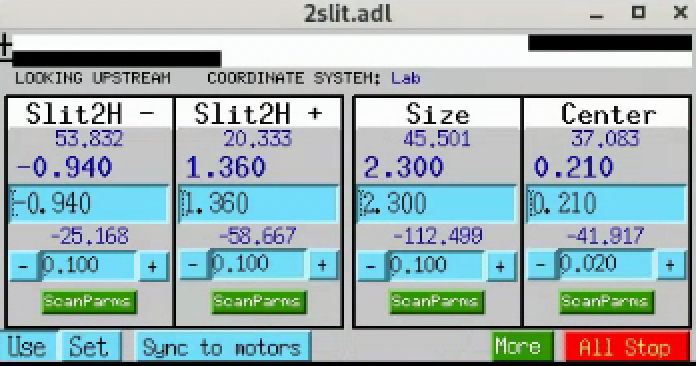

   ``2slit.adl`` (2-BM-B instance) — horizontal-slits control screen
   ("LOOKING UPSTREAM", ``Lab`` coordinate system). The two leftmost
   columns (``Slit2H −`` / ``Slit2H +``) drive the individual blade
   motors ``2bma:m11`` and ``2bma:m12``. See the label-flip note
   above. The ``Size`` and ``Center`` columns are calc-driven
   composites that move both blades together to set the aperture
   width and centre.

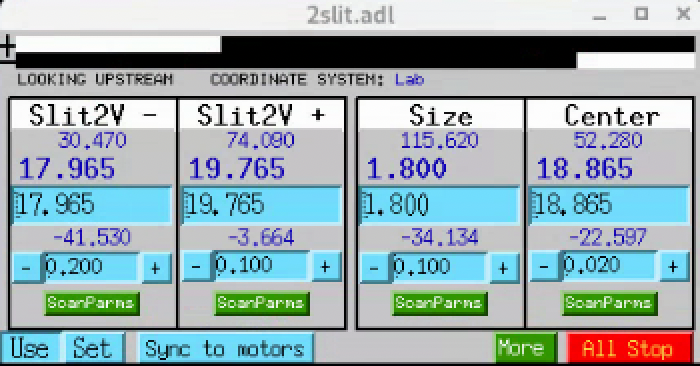

   ``2slit.adl`` (2-BM-B instance) — vertical-slits control screen
   (same layout as the horizontal screen). The two leftmost columns
   drive the individual blade motors: ``2bma:m9`` for the Y+ blade
   (up, screen-labelled ``Slit2V +``) and ``2bma:m10`` for the Y−
   blade (down, screen-labelled ``Slit2V −``). The ``Size`` and
   ``Center`` columns are calc-driven composites.

.. note::

   **cora Asset registration intent.** When the ``Slit`` Family
   graduates from Pending, register this assembly as Asset
   ``SampleSlit`` with the same structure as the proposed
   ``ConditioningSlit`` Asset (see L3 Slits block above) but
   with the B-station PV set:

   - Family: ``Slit``
   - Mounted on: own stand in 2-BM-B (floor reference)
   - controller_id back-reference: ``FrontEndDrive``
     (the IOC crate is in 2-BM-A and addresses both stations'
     slits over VME; both A and B Slit Assets back-reference
     the same controller)
   - Settings (blade motors): ``2bma:m11`` and ``2bma:m12`` (H
     pair, per the label-flip note above), ``2bma:m9`` (V+ up),
     ``2bma:m10`` (V− down)
   - Settings (virtual / calc-driven aperture):
     ``2bma:Slit2Hsize``, ``2bma:Slit2Hcenter``,
     ``2bma:Slit2Vsize``, ``2bma:Slit2Vcenter``
   - z position: 50500 mm (read from layout drawing
     A342-RT1000-02; not in the APS_1404611 reference table)
   - Per-blade calibration field
     ``calibration_slope_pix_per_mm`` (one per blade motor),
     seed values + conditions from the
     :doc:`../procedures/item_012` field-test table for the
     "B station (no fix needed)" run (2026-06-14).
   - Target of Procedure ``calibrate_slit_blade_throw``
     (:doc:`../procedures/item_012`) and Procedure
     ``centre_and_close_slits`` (:doc:`../procedures/item_011`).

Coded aperture (Jena NV200D piezo)
~~~~~~~~~~~~~~~~~~~~~~~~~~~~~~~~~~

:Role: Beam-shaping coded aperture mounted in the beam between the
   B-station Slits and the sample. The aperture is stepped through
   a list of (X, Y) piezo positions during a tomography fly-scan to
   produce randomised / dithered sampling for compressive-sensing
   imaging reconstructions.
:Family: (Pending — neither Camera nor Stage in the traditional
   sense; the mask itself is a beam-path optical element with its
   own positioning piezo; cora's eventual Family choice for the
   mask is a separate decision from the piezo controller below.)
:cora Asset (piezo controller): ``CodedApertureFineDrive`` (proposed
   name; ``SampleFineDrive`` was the earlier provisional placeholder
   and is wrong — the device does not move the sample). Family:
   ``MotionController``. Operator-confirmed 2026-06-19. The earlier
   provisional ``OpticsFineDrive`` placeholder for the unused
   NV100D (see :doc:`../ops/item_027`) should be retired since the
   NV100D is not in operational use at 2-BM.
:Hutch: 2-BM-B
:z position: ~51,300 mm (between the B-station Slits at 50,500 mm
   and the sample stack; just downstream of the last Be window
   before 2-BM-B)
:Hardware (controller): Piezosystem Jena **NV200D/NET** controller
   driving two piezo axes (X and Y). Vendor datasheet:
   `NV200D-Datasheet.pdf
   <https://www.piezosystem.com/wp-content/uploads/2023/07/NV200D-Datasheet.pdf>`__.
   NOT the NV100D (which lacks the external trigger mode required
   for tomoscan fly-scan integration and is therefore not used at
   2-BM in any operational procedure today; see :doc:`../ops/item_027`
   for the NV100D historical / decommissioned reference).
:Hardware (actuator / XY flexure stage): Piezosystem Jena
   **nanoSXY 120 CAP**, part number **T-223-06D** (the "D" suffix
   denotes the digital interface variant). Drawing: `nanoSXY-120-CAP
   <https://www.piezosystem.com/wp-content/uploads/2022/04/nanoSXY-120-CAP-Part-Drawing.pdf>`__
   (rev.01, Feb 2019). Key dimensions:

   ===========================  ==============
   Property                     Value
   ===========================  ==============
   Travel per axis (nominal)    120 µm
   Travel per axis (closed-loop, per :doc:`../ops/item_028`)  100 µm
   Clear aperture               Ø 12.5 mm (centred)
   Outer footprint              82 × 79 × 30 mm
   Mounting                     4× M3 tapped + 4× Ø3 G7 reamed dowel holes (symmetric, on both sides); 32 mm / 54 mm / 60 mm hole-pattern centres
   Standard cable length        1600 mm (voltage + sensor cables)
   Feedback                     Capacitive (the ``CAP`` in the model)
   ===========================  ==============

   The clear aperture is what the coded-aperture mask itself is
   mounted into; the X / Y piezo motion moves the mask within the
   beam.
:IOC: ``JenaNV200D`` (running on ``arcturus``)
:Operational reference: :doc:`../ops/item_028` covers IOC startup,
   network configuration, caQtDM screens, FPGA trigger integration,
   and the triggered-step mode (``nv200_trigger_step_lib.py`` with
   ``--linspace`` or ``--random``; standard list length 1024).

.. note::

   **Why this lives here (between B-station Slits and Sample
   stack).** The coded aperture is a beam-path element upstream of
   the sample, not part of the sample tower. Putting its description
   in the z-ordered walk between B-station Slits (50,500 mm) and the
   Sample stack section below matches the physical layout. The
   piezo controller (``CodedApertureFineDrive``) is the
   ``MotionController`` Asset that drives the aperture mask, but the
   mask itself is a separate beam-path element — cora's eventual
   Asset model needs both.

Sample stack
============

The sample tower is a kinematic chain of six elements, from the
experimental-hutch floor up to the sample itself. Order matters: stages
below the rotary translate or tilt the rotation axis in lab
coordinates; stages above the rotary ride with the sample and appear in
projection space.

Kinematic chain (bottom to top)::

   Sample optical table              (Y only; floor-referenced)
     +-- Hexapod                  (6-DOF coarse positioner)
          +-- LaminographyPitch        (laminography pitch, 0-20 deg)
               +-- fixed -10 deg wedge (cancels +10 deg stage hold)
                    +-- Rotary  (theta axis)
                         +-- SampleTop_X     (co-rotates with theta)
                         +-- SampleTop_Z     (co-rotates with theta)

.. note::

   The cora 2-BM asset inventory at
   ``docs/deployments/2-bm/assets.md`` lists four sample-top
   Devices: ``SampleTop_X``, ``SampleTop_Z``,
   ``Sample_top_Roll``, ``Sample_top_Pitch``.
   ``SampleTop_X`` and ``SampleTop_Z`` are the Kohzu CYAT-070
   stages above the rotary and are documented below.
   ``Sample_top_Roll`` and ``Sample_top_Pitch`` correspond to the
   hexapod's Roll (``2bmHXP:m5``) and Pitch (``2bmHXP:m4``) axes —
   they are part of the **Hexapod** block below, not separate
   per-component stages above the rotary. cora classifies these
   two as ``PseudoAxis`` Assets ("virtual DoFs over the 2bmHXP
   hexapod-kinematics solver"), confirming the same mapping.

.. note::

   **For cora PV mapping.** Every ``2bmb:mNN`` PV cited in the
   Sample stack and Detector system sections has been verified
   against the ioc2bmb IOC: OMS-VME58 motors ``m1``–``m91`` are
   declared in ``motor.substitutions``, and the Aerotech Ensemble
   axes ``m100``/``m101``/``m102`` in ``AsynMotor.substitutions``
   (asyn ports ``AeroE1``/``AeroE2``/``AeroE3``). The motor records
   themselves carry generic ``DESC`` strings (``"motor $(N)"``), so
   the per-Device role (e.g. ``SampleTop_X = 2bmb:m18``) is not
   recoverable from the IOC alone — it is configured in mctoptics
   substitutions, tomoScanStream, ``table.db`` calls, and this
   page. When registering cora Devices against ioc2bmb PVs, treat
   this page as the source of truth.

Sample optical table
--------------------

:Role: Floor-referenced support for the entire sample tower
:Family: Table
   (cora ``Table`` Family, declared in the cora catalog at
   ``catalog/catalog.yaml`` and pending registration as Asset
   ``SampleTable`` in ``docs/deployments/2-bm/assets.md``. The
   substrate word "Optical" is deliberately omitted from the Family
   name per cora's naming rule that a Family names the device's own
   nature, not its contents — the ``OpticalHousing`` → ``Housing``
   precedent. Axis-set differences across the three 2-BM tables
   (sample = 4 direct translation motors; detector = 6 virtual axes;
   mirror = present but unused) are a per-Asset settings axis
   (``axis_layout``), not a Family split.)
:Mounted on: Hutch floor
:Carries: Hexapod (and everything above)
:Degrees of freedom: 4 motors (Y, downstream X, upstream X, Z). In
   routine operation only Y is moved; the X and Z motors exist but
   are not used for day-to-day sample positioning.
:EPICS:

   ============  ==============  ====================================
   Axis          PV              MEDM label
   ============  ==============  ====================================
   Y (vertical)  ``2bmb:m24``    ``Sample table Y``
   Z             ``2bmb:m20``    ``Sample table Z``
   USX           ``2bmb:m21``    ``Sample table USX`` (upstream X)
   DSX           ``2bmb:m22``    ``Sample table DSX`` (downstream X)
   ============  ==============  ====================================

   No combined ``table.db`` virtual record is loaded for this table —
   the four motors are addressed directly.
:Notes:
   Used to set a coarse vertical origin so the hexapod operates near
   the centre of its Y travel. Standard APS optical-table hardware on
   a Vibraplane isolation base (visible in the sample-stack photo
   below).

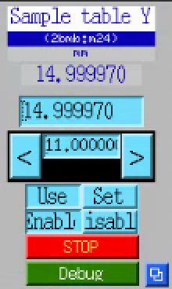

   Single-motor stage-control screen for the Y axis (``2bmb:m24``).
   This is the screen used for routine vertical positioning of the
   sample tower — no aggregating table MEDM is needed since only one
   axis moves in normal operation.

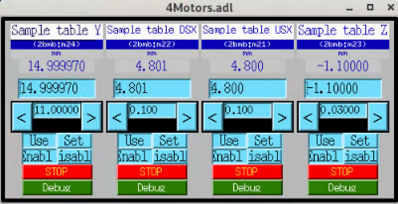

   ``4Motors.adl`` MEDM for all four axes of the sample optical
   table (Y, DSX, USX, Z), shown for reference when the rarely-used
   X or Z axes need to be touched.

Hexapod
-------

:Role: Coarse 6-DOF sample positioner
:Family: Hexapod
:Model: Aerotech HexGen HEX300-230HL hexapod (300 mm platform,
   230 mm home height). Full ordering code: HEX300-230HL with
   suffixes ``-E1`` (incremental encoders), ``-PL4`` (ULTRA
   high-accuracy performance grade) and ``-TAS`` (tested and
   integrated as a system).
:Serial number: ``486060-01``
:Mounted on: Sample optical table
:Carries: LaminographyPitch
:Driven by: ``HexapodDrive`` (cora ``MotionController`` Asset,
   bound to Aerotech **Automation1-iXR3** drive, full ordering
   code ``Automation1-iXR3-VL1-VB4-VB4-SB0CT222222-P1P1P1P1P1P1-CO-LC1MT1PSO6-SI0-TAS``,
   S/N ``486125-01``, in a separate rack; operator-confirmed
   2026-06-15. Earlier this page noted "specific product line not
   yet confirmed"; this is the resolution.)
:Degrees of freedom: X, Y, Z, A (θ\ :sub:`x`), B (θ\ :sub:`y`), C (θ\ :sub:`z`)
:Travel:
   X 55 mm, Y 60 mm, Z 25 mm, A 15°, B 15°, C 30° (single-axis moves
   from home; travels are mutually exclusive — consult Aerotech's
   HexGen workspace simulator for combined-move envelopes)
:Resolution: 20 nm (XYZ), 0.2 µrad / 0.04 arc-sec (ABC)
:Accuracy:
   ±1 µm (X), ±0.75 µm (Y, Z), ±10 µrad / ±2.1 arc-sec (A, B, C);
   PL4 ULTRA grade, measured over full travel.
:Maximum speed: 50 mm/s (X), 25 mm/s (Y, Z), 15 °/s (A, B), 30 °/s (C)
:Load capacity:
   45 kg vertical, 21 kg horizontal, 14 kg de-energized holding;
   stage mass 12 kg
:Drive: Precision ball screw, brushless slotless servo, 80 VDC bus
:EPICS: Prefix ``2bmHXP:``. Per-axis motor records (only the
   user-accessible axes are exposed):

   ===========  ==============  =====================================
   Axis         PV              Notes
   ===========  ==============  =====================================
   X            ``2bmHXP:m1``   linear, lab-X
   Y            ``2bmHXP:m2``   linear, lab-Y (vertical)
   Pitch        ``2bmHXP:m4``   rotation about lab-X
   Roll         ``2bmHXP:m5``   rotation about lab-Z (beam axis)
   ===========  ==============  =====================================

   ``2bmHXP:m3`` (Z) and ``2bmHXP:m6`` (Yaw / θ\ :sub:`z`) are not
   exposed to the user. ``m3`` is reserved for the MCTOptics IOC,
   which drives it as ``LENS_SAMPLE_Y`` for sample-side Y alignment
   relative to the microscope.

   Top-level launcher screen is the ``2bmHXP`` UI (see
   ``hexapod_01.png``); native Aerotech Ensemble interface rather
   than plain motor records.
:Notes:
   Coarse positioning of the entire sample tower. Y is shared with the
   optical table: convention is to set table Y so the sample sits in
   the beam with the hexapod at mid-travel, maximising remaining
   hexapod DOF for fine alignment. See the `Hex300-230HL data sheet
   <https://anl.box.com/s/jn2h32rqxuwmtbygilk509x41ixgsdwf>`__
   (``Hex300-Data-Sheet-D20250203.pdf``) for accuracy maps and load
   curves.

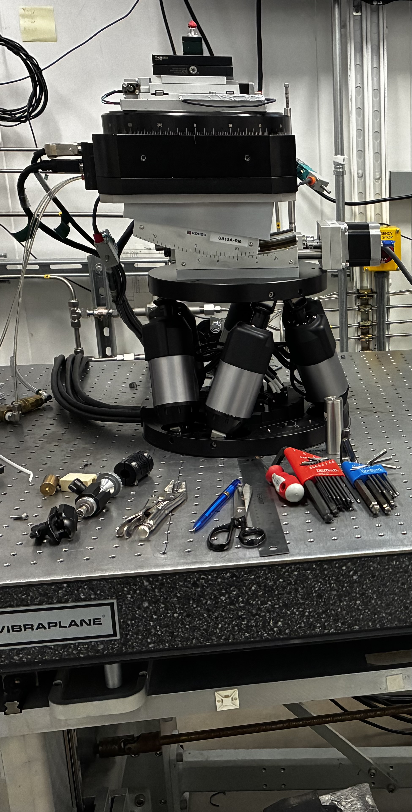

   2-BM-B sample stack on the Vibraplane-isolated optical table.
   Visible from bottom to top: the Aerotech HEX300-230HL hexapod (six
   struts), the Kohzu SA16A-RM laminography tilt stage (centre), and
   the Aerotech ABRS-250MP-M-AS air-bearing rotary at top.

LaminographyPitch
-----------------

:Role: Laminography pitch axis
:Family: TiltStage
   (cora ``TiltStage`` Family, declared specifically for the
   Kohzu SA16A-RM laminography goniometer per
   ``docs/deployments/2-bm/assets.md``: a rotational, limited-range
   stage — so neither ``LinearStage`` nor ``RotaryStage`` (whose
   ``Following`` / ``Marking`` PSO affordances a tilt does not carry).
   Affordances: ``Rotatable``, ``Homeable``, ``Limitable``. Not yet
   instantiated as an Asset; the closest pending entry is "Broader
   sample-stage motors" in that page's Pending table.)
:Model: Kohzu SA16A-RM goniometer / tilt stage
:Mounted on: Hexapod
:Carries: Rotary (via a fixed -10° wedge)
:Travel: 0° to 20° (full mechanical range; see operating convention below)
:EPICS: ``2bmb:m49``
:Notes:
   Inserted between the hexapod and the rotary specifically for
   laminography. A fixed **-10° wedge** sits between this stage and
   the rotary; the stage is held at **+10°** so the two cancel and
   the rotation axis is vertical (standard tomography). Sweeping the
   stage between 0° and 20° therefore gives a **±10° (20° total)**
   range of net rotary-axis tilt for laminography. The default
   laminography setpoint is **+15°** on the stage, i.e. +5° net
   rotary-axis tilt.

Rotary
------

:Role: Sample rotation axis (theta)
:Family: RotaryStage
:Model:
   Stage — Aerotech **ABRS-250MP-M-AS** air-bearing direct-drive
   rotary (Aerotech ABRS series, 250 mm aperture, mid-precision
   class). Drive — Aerotech **ENSEMBLE ML 10-40-IO-MXH**
   (Multi-Loop subseries, 10 A, 40 V bus, I/O option, MXH option;
   operator-confirmed against the hardware label 2026-06-16).
   The cora Device identifier ``Rotary`` is a role-name per cora's
   #111 convention (vendor / model lives in the bound Model, not
   the Asset name). Earlier candidate names: ``Aerotech_ABRS_rotary``,
   ``aerotech_abs250mp_m_as`` — the second one was based on a
   then-incorrect ``ABS`` reading of the hardware label; operator
   confirmation 2026-06-15 settles the model on ABRS.
:Serial number: ``146853-A-1-1-X``
:Reference drawing: ``630C2125 REV (-)``
:Mounted on: LaminographyPitch (via a fixed -10° wedge — see above)
:Carries: SampleTop_X, SampleTop_Z
:Driven by: ``RotaryDrive`` (cora ``MotionController`` Asset
   wrapping the **Aerotech ENSEMBLE ML 10-40-IO-MXH**, S/N
   ``730792/1``, Aeronet-networked. Earlier this page named the
   drive as Ensemble HLE10-40-A-MXH; operator confirmation
   2026-06-16 corrects both the subseries (ML, not HLe) and the
   option suffix (``-IO-`` was missing). The drive card is housed
   in an Aerotech **TM3-A-20B VDC-20B VDC / NO SPLIT / PS24-1 /
   C1ML-06 / C2ML-09 / US-115VAC** chassis, S/N ``160591-A-1-1``
   (Order # ``730578``, built to dwg ``630D2079 REV-H``); the
   chassis + PS24-1 supply provide DC bus and Aeronet
   distribution to the ML card. Bound cora Model:
   ``aerotech_ensemble`` (currently — see [cora#156] for the
   pending rename to a Model handle matching the actual P/N.))
:Travel: 360° continuous (per datasheet); the 2-BM operational
   software limits are configured at ``2bmb:m102.LLM = -360 deg``,
   ``.HLM = +360 deg``.
:Max speed (datasheet): 500 rpm (= 3000 deg/s). 2-BM operational
   profile uses much lower speeds (the 720 deg/s value previously
   listed here was an operational soft limit, not the stage maximum;
   re-derive from the application speed profile rather than the
   stage rating).
:Encoder: 11,840 lines/rev fundamental (per datasheet). With
   Aerotech's standard interpolation the addressable resolution is
   sub-microradian, corresponding to roughly 0.0001 deg per step at
   the application layer.
:Accuracy: ±2 arc sec (per datasheet)
:Repeatability (bidirectional): <1 arc sec (per datasheet)
:Homing offset: 0 deg
:Dimensions: 250 mm wide × 100 mm high; 228.1 mm tabletop diameter;
   35 mm clear aperture (per datasheet — note: the "250" in
   ``ABRS-250MP`` is the stage width, NOT the aperture, which earlier
   revisions of this page conflated)
:Bus voltage: 340 VDC (per datasheet)
:Max load: 66 kg axial, 36 kg radial, 28 N·m tilt (per datasheet)
:Air supply: 80 psig (5.5 bar) ± 10 psig; air consumption <56.6
   SLPM (<2 SCFM); clean dry air at 0 °F dew point, 0.25 µm filter,
   nitrogen at 99.9 % purity recommended (per datasheet)
:Inertia (unloaded): 39,100 kg·mm² (per datasheet)
:Total mass: 15.6 kg (per datasheet)
:Material / finish: Aluminum, hardcoat (62 Rockwell hardness) (per datasheet)
:Datasheet: https://de.aerotech.com/wp-content/uploads/2021/01/abrs.pdf
   (Aerotech ABRS series rotary stages, covers ABRS150MP /
   ABRS200MP / ABRS250MP / ABRS300MP; the 2-BM stage is the
   ABRS250MP variant)
:EPICS: ``2bmb:m102``
   (PV mapping from
   `tomoScanStream.substitutions
   <https://github.com/tomography/tomoscan/blob/master/iocBoot/iocTomoScanStream_2BMB/tomoScanStream.substitutions>`__,
   where ``ROTATION = 2bmb:m102``)
:Notes:
   The two Sample_top_* stages above this axis (SampleTop_X and
   SampleTop_Z) co-rotate with theta. In projection geometry their
   effect is in the rotating frame, not the lab frame.

SampleTop_X
-----------

:Role: Fine sample translation perpendicular to the beam
   (co-rotates with theta). Operationally the "0/180 stage" —
   motion lies along the beam when theta = 0° or 180°.
:Family: LinearStage
:Model: Kohzu CYAT-070 crossed-roller alignment stage,
   80 × 80 mm table, ball-screw lead 1.0 mm. See
   :doc:`../ops/item_050` for the operational page.
:Mounted on: Rotary
:Carries: (sample)
:Travel: ±15 mm
:Resolution: 1 / 0.5 / 0.05 µm (full / half / 1/20 microstep)
:Max speed: 5 mm/s
:Repeatability: ≤±0.5 µm
:Lost motion: ≤2 µm
:Backlash: ≤1 µm
:Straightness: ≤3 µm / 30 mm (horizontal and vertical)
:Load capacity: 98 N (10 kgf)
:Weight: 1.7 kg
:EPICS: ``2bmb:m18``
   (matches ``LENS_SAMPLE_X`` in
   ``iocBoot/iocMCTOptics/mctOptics.substitutions`` — this is the
   sample-side X motor MCTOptics drives for lens/sample alignment.)
:Driven by: ``SampleStageDrive`` (cora ``MotionController``
   Asset wrapping the OMS-VME58 card in ``ioc2bmb`` that hosts
   the entire ``2bmb:m1``–``m91`` motor band)

SampleTop_Z
-----------

:Role: Fine sample translation along the beam (co-rotates with
   theta). Operationally the "90/270 stage" — motion lies along
   the beam when theta = 90° or 270°.
:Family: LinearStage
:Model: Kohzu CYAT-070 crossed-roller alignment stage
   (same hardware as SampleTop_X; see :doc:`../ops/item_050`).
:Mounted on: Rotary
:Carries: (sample)
:Travel: ±15 mm
:Resolution: 1 / 0.5 / 0.05 µm (full / half / 1/20 microstep)
:Max speed: 5 mm/s
:Repeatability: ≤±0.5 µm
:Lost motion: ≤2 µm
:Backlash: ≤1 µm
:Straightness: ≤3 µm / 30 mm (horizontal and vertical)
:Load capacity: 98 N (10 kgf)
:Weight: 1.7 kg
:EPICS: ``2bmb:m17``
   (matches ``LENS_SAMPLE_Z`` in
   ``iocBoot/iocMCTOptics/mctOptics.substitutions`` — this is the
   sample-side Z motor MCTOptics drives for lens/sample alignment.)
:Driven by: ``SampleStageDrive`` (cora ``MotionController``
   Asset; same as ``SampleTop_X``)

Detector system
===============

The 2-BM-B detector is an **Optique Peter MICRX080 white-beam triple-
objective microscope**, mounted on a 1 m linear Z stage that itself
sits on a dedicated APS-standard optical table. The Z stage moves the
entire microscope along the beam from near-contact with the sample
(short propagation) out to ~1 m for phase-contrast imaging; the table
is used to keep the detector centred on the beam as Z varies.

Kinematic chain (top of beam down to floor)::

   FLIR Oryx 5MP  /  FLIR Oryx 31MP               (two cameras, selected via folding mirror)
     +-- Camera selector stage                    (Schunk LPTM 30, two-position mirror)
          +-- Dual-port system + tube lens
               +-- Triple-objective head          (3 microscope heads, Mitutoyo MPLAPO)
                    +-- Objective selector       (Nanotec ST4118M1404-B + ERO 1420 coder)
                         +-- Scintillator support (LuAG, tiltable)
                              +-- Optique Peter MICRX080 microscope body
                                   +-- Optique Peter 1 m linear Z stage  (along beam)
                                        +-- Detector optical table       (X / Y / Z / roll / pitch / yaw)
                                             +-- Hutch floor

cora's ownership view differs from the kinematic-mounting view above:
the lens turret and the Optique Peter Z stage are registered as
Device-level siblings under the ``2-BM`` Unit, then wired into the
``MCTOptics`` Component via ``Plan.wiring`` rather than nested under
it. The objectives, cameras, and scintillator are children of
``MCTOptics`` in cora. See ``docs/deployments/2-bm/assets.md`` for the
canonical composition.

Optique Peter MICRX080 microscope
---------------------------------

:Role: White-beam triple-objective indirect-detection microscope
   (~55 m from source)
:Family: Microscope
:Model: Optique Peter **MICRX080**, ANL configuration
   (manual MAN-11863-0521-0465-A, 21/05/2021)
:Configuration:
   Three microscope heads, each accepting one Mitutoyo MPLAPO long-
   working-distance objective; an in-beam objective selector translates
   the chosen head onto the optical axis. The dual-port system splits
   the optical path between two cameras via a switchable folding-
   mirror "camera selector". A common filter and per-head individual
   filter live above the objectives; a tiltable scintillator support
   sits below them.
:Cameras:
   Two cameras on the dual-port system (current ANL configuration):

   - **FLIR Oryx 5MP** (camera 0, ``2bmSP1:`` areaDetector prefix).
     Model ``Oryx ORX-10G-51S5M``. Sony IMX250 CMOS sensor,
     global shutter; 2448 × 2048, 3.45 µm pixel pitch; 162 fps
     at full resolution over 10GigE; 12-bit ADC. C-mount.
   - **FLIR Oryx 31MP** (camera 1, ``2bmSP2:`` areaDetector prefix).
     Model ``Oryx ORX-10G-310S9M``. Sony IMX367 CMOS sensor,
     global shutter; 6464 × 4852, 3.45 µm pixel pitch. C-mount.

   Vendor technical reference: FLIR ``ORX-10GS-51S5-Technical-
   Reference.pdf`` (revised 2020-04-22). Covers both ``ORX-10G-51S5``
   and ``ORX-10GS-51S5`` variants, which the manual cover page
   states are "functionally the same and differ only in dimensions
   and mass" — i.e. the IOC-reported model string (``ORX-10G-51S5M``,
   without ``GS``) and any catalog SKU using ``ORX-10GS-51S5M-C``
   describe the same camera class.

   The cameras shipped in the manual's optical table (PCO Dimax HS
   and Adimec Quartz Q-12A180) have been replaced; the manual's §16
   table is still informative for object-field / oversampling
   estimates if you substitute the Oryx pixel size and sensor format.
   cora now records the **PCO Dimax HS** under the Decommissioned
   block of ``docs/deployments/2-bm/assets.md`` with rationale
   "superseded by the FLIR Oryx detector chain" (per cora's #89).
   cora's ``Camera`` Family schema is now made explicit at 2-BM
   with ``max_framerate_hz``, ``sensor_kind``, and ``readout_mode``
   fields so the high-framerate Dimax and the general-purpose Oryx
   share one Family (the variant-as-settings rule, not variant-
   as-subtype).
:Objectives:
   Current ANL configuration, three slots:

   - Lens 0 — **1.1×**
   - Lens 1 — **2×**
   - Lens 2 — **10×**

   All Mitutoyo MPLAPO long-working-distance class. The manual lists
   the broader objective family the microscope supports (2× / 5× /
   5×HR / 7.5× / 10× / 20×) with F200 mm tube lens and 30 mm best
   image circle.
:Objective selector:
   - Stepper motor: **Nanotec ST4118M1404-B**, 1.8°/step (200 steps/rev),
     bipolar, 1.7 VDC, 1.4 A/phase.
   - Coder: **Heidenhain ERO 1420**, 1250 lines/rev, TTL, 5 V.
   - Drive: ball screw, 2 mm/rev pitch, direct mounting.
   - Travel: nominal 60 mm between adjacent objectives.
   - Closed-loop reference: left-end precision switch (±1 µm
     reproducibility) or zero-coder mark.
   - ANL-MICRX080 calibrated objective positions (mm from left
     precision end switch): A=2.3006, B=0.5625, C=59.6835, D=59.6101
     (see §13.3.1 of the manual).
:Camera selector:
   - Stage: **Schunk LPTM 30** with two folding mirrors.
   - Stepper motor: 200 steps/rev full step, 0.5 mm spindle pitch,
     max 2.5 mm/s.
   - Positioning error <35 µm/100 mm; repeatability <6 µm (uni) /
     <9 µm (bi).
:Per-objective focus:
   Each microscope head has its own motorised focus stage, so the
   three objectives focus independently.
:Scintillator support:
   Tiltable square-scintillator support (8×8 mm or 12×12 mm), with a
   ring-mounted variant (25×25 mm) for the 1× head. Vitreous-carbon
   protective window; spring-loaded mount (see §6 of the manual).
:Mounted on: Optique Peter 1 m linear Z stage
:Dimensions: ~338 × 561 × 169 mm with camera-protection box;
   ~332 × 530 × 347 mm without

.. note::

   This page summarises the microscope as built — for installation,
   alignment, scintillator changes, focus calibration, and pinouts
   refer to the full manual (53 pages) at
   ``MAN-11863-0521-0465-A.pdf``.

**Camera identification (as currently reported by the Spinnaker
driver via areaDetector).** Read from the ``ADSpinnaker.adl``
screen for each camera. These are the per-unit values an operator
or reviewer needs for reproducibility provenance (which firmware,
which SDK / driver / areaDetector core was in force at run time);
they update independently of the per-class spec values above.

.. list-table::
   :header-rows: 1
   :widths: 22 39 39

   * - Field
     - Camera 0 (``2bmSP1:cam1:``)
     - Camera 1 (``2bmSP2:cam1:``)
   * - Manufacturer
     - FLIR
     - FLIR
   * - Model (as reported)
     - ``Oryx ORX-10G-51S5M``
     - ``Oryx ORX-10G-310S9M``
   * - Serial number
     - ``19173710``
     - ``22150530``
   * - Firmware version
     - ``1710.0.0.0``
     - ``1904.0.72.0``
   * - SDK version (Spinnaker)
     - ``4.0.0.116``
     - ``4.0.0.116``
   * - Driver version (areaDetector)
     - ``3.5.0``
     - ``3.5.0``
   * - ADCore version
     - ``3.14.0``
     - ``3.14.0``

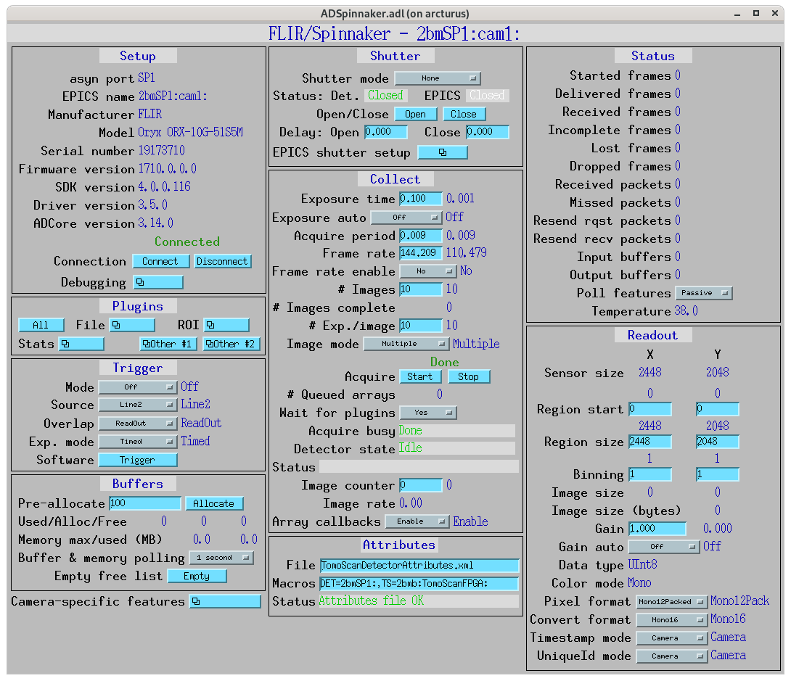

   ``ADSpinnaker.adl`` for camera 0 (``2bmSP1:cam1:``, FLIR Oryx
   5MP). The Setup panel (top-left) is the source of the per-unit
   identification values in the table above.

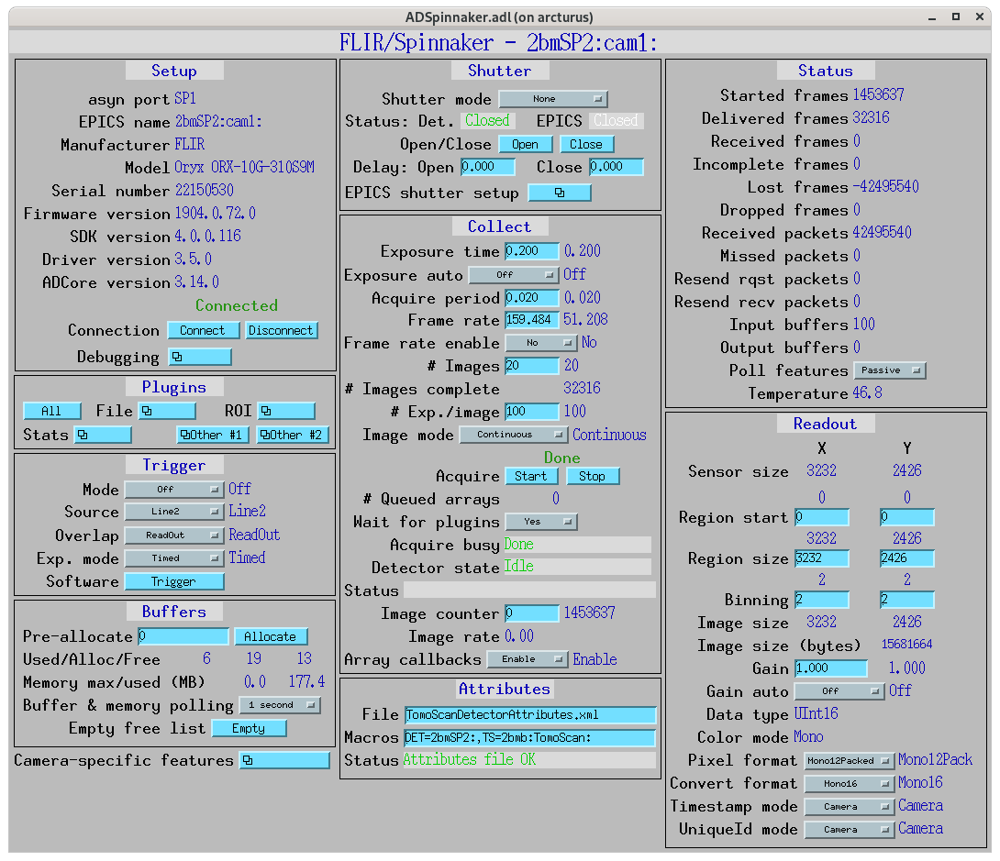

   ``ADSpinnaker.adl`` for camera 1 (``2bmSP2:cam1:``, FLIR Oryx
   31MP). Same screen layout as camera 0; the Readout panel shows
   sensor size 3232 × 2426 because the screen was captured with
   2 × 2 binning enabled (native 6464 × 4852).

MCTOptics — Optique Peter IOC
-----------------------------

:Role: EPICS interface that exposes the Optique Peter microscope
   (objective + camera selectors, per-head focus, per-camera rotation,
   sample-side alignment) as a single high-level API. Implements the
   sequencing required so that selecting a lens or camera moves the
   underlying motors to the calibrated positions and applies the
   per-combination offsets.
:Family: Microscope-IOC (composite)
:Repository: https://github.com/xray-imaging/mctoptics
   (local checkout: ``/Users/decarlo/conda/mctoptics-decarlof/``)
:Documentation: https://mctoptics.readthedocs.io
:Prefix: ``2bm:MCTOptics:``
:Top-level operator PVs:
   - ``2bm:MCTOptics:LensSelect`` — mbbo, ``Pos. 0`` / ``Pos. 1`` /
     ``Pos. 2`` (the three objective slots).
   - ``2bm:MCTOptics:CameraSelect`` — mbbo, ``Pos. 0`` / ``Pos. 1``
     (Adimec / Dimax, via the folding-mirror camera selector).
   - ``2bm:MCTOptics:LensSelected``, ``CameraSelected`` — status
     readbacks (also report intermediate "Moving between …" state).
   - ``2bm:MCTOptics:LensName{0,1,2}``, ``CameraName{0,1}`` — string
     labels (mirror into the ``LensSelect`` / ``CameraSelect`` choice
     strings on init).
   - ``2bm:MCTOptics:ScintillatorType``, ``ScintillatorThickness``,
     ``CameraObjective``, ``CameraTubeLength``, ``ImagePixelSize``,
     ``DetectorPixelSize`` — optics metadata stamped into each scan.
   - ``2bm:MCTOptics:CameraBinning`` (``1x`` / ``2x`` / ``4x``) and
     ``Camera{0,1}Bit`` (``8`` / ``10`` / ``12`` / ``16-bit``).
   - ``2bm:MCTOptics:Cut{Left,Right,Top,Bottom}`` + ``Cut`` (busy)
     for image cropping.

Underlying motor map (from ``iocBoot/iocMCTOptics/mctOptics.substitutions``):

===========================  ======================  ================================
Macro                        PV                      Purpose
===========================  ======================  ================================
``LENS_MOTOR``               ``2bmb:m1``             Objective selector (turret)
``CAMERA_MOTOR``             ``2bmb:m5``             Camera selector (folding mirror)
``LENS0_FOCUS``              ``2bmb:m2``             Objective #0 focus
``LENS1_FOCUS``              ``2bmb:m3``             Objective #1 focus
``LENS2_FOCUS``              ``2bmb:m4``             Objective #2 focus
``CAM0_ROT``                 ``2bmb:m7``             Camera 0 rotation
``CAM1_ROT``                 ``2bmb:m8``             Camera 1 rotation
``LENS_SAMPLE_X``            ``2bmb:m18``            Sample alignment in X
``LENS_SAMPLE_Y``            ``2bmHXP:m3``           Sample alignment in Y (hexapod)
``LENS_SAMPLE_Z``            ``2bmb:m17``            Sample alignment in Z
``CAMERA0``                  ``2bmSP1:``             Camera-0 areaDetector prefix
``CAMERA1``                  ``2bmSP2:``             Camera-1 areaDetector prefix
``TOMOSCAN``                 ``2bmb:TomoScan:``      Linked TomoScan IOC
===========================  ======================  ================================

All eight ``2bmb:m1``–``m8`` motors in this map plus ``m17``
and ``m18`` are slots on the same OMS-VME58 card — cora Asset
``SampleStageDrive``. The hexapod motor ``2bmHXP:m3`` is one
DoF of ``Hexapod``, driven by ``HexapodDrive``.

**Calibrated lens positions are per-camera, not shared.** MCTOptics
stores six turret positions (3 lenses × 2 cameras) so that the
rotation axis stays at the same physical location when the operator
swaps cameras. When ``LensSelect`` or ``CameraSelect`` changes, the
IOC moves ``2bmb:m1`` to the position corresponding to the new
(lens, camera) pair. PVs and operator-verified values
(``caget`` 2026-06-19):

==========  ==============================  ==============================
Lens / mag  Camera 0 (mm)                   Camera 1 (mm)
==========  ==============================  ==============================
Lens 0 / 1.1×  ``2bm:MCTOptics:Camera0LensPos0`` = ``-59.8184``  ``2bm:MCTOptics:Camera1LensPos0`` = ``-60.3784``
Lens 1 / 2×    ``2bm:MCTOptics:Camera0LensPos1`` = ``-0.5734``   ``2bm:MCTOptics:Camera1LensPos1`` = ``-0.9240``
Lens 2 / 10×   ``2bm:MCTOptics:Camera0LensPos2`` = ``58.8707``   ``2bm:MCTOptics:Camera1LensPos2`` = ``59.2300``
==========  ==============================  ==============================

The per-camera offsets are ~0.4–0.6 mm and reflect the slightly
different optical-path alignment between the two cameras on the
dual-port (the folding-mirror selector at ``2bmb:m5`` swings the
beam between the two camera arms). Operators rarely retune this
alignment in routine operation; the per-camera position table is
the mechanism that lets the IOC preserve the rotation-axis
location across camera swaps when the alignment is fresh.

Camera-selector positions (folding-mirror motor ``2bmb:m5``):
Pos. 0 = 20 mm, Pos. 1 = 15 mm.

**Per-(camera, lens) camera rotation offsets** follow the same
lookup pattern as the turret positions above, on a different pair
of motors: ``2bmb:m7`` (``CAM0_ROT``, camera 0 image-rotation
alignment) and ``2bmb:m8`` (``CAM1_ROT``, camera 1). Same
rationale: keep the rotation axis aligned to the image as the
operator swaps lens or camera. Operator-verified values
(``caget`` 2026-06-19):

==========  ==============================  ==============================
Lens / mag  Camera 0 rotation (``2bmb:m7``)  Camera 1 rotation (``2bmb:m8``)
==========  ==============================  ==============================
Lens 0 / 1.1×  ``2bm:MCTOptics:Camera0Lens0Rotation`` = ``0``        ``2bm:MCTOptics:Camera1Lens0Rotation`` = ``-0.781``
Lens 1 / 2×    ``2bm:MCTOptics:Camera0Lens1Rotation`` = ``0.555``    ``2bm:MCTOptics:Camera1Lens1Rotation`` = ``-0.92``
Lens 2 / 10×   ``2bm:MCTOptics:Camera0Lens2Rotation`` = ``0``        ``2bm:MCTOptics:Camera1Lens2Rotation`` = ``-1.06094``
==========  ==============================  ==============================

When the operator changes ``LensSelect`` or ``CameraSelect``, the
IOC reads the matching ``Camera{N}Lens{M}Rotation`` PV and writes
its value to ``2bmb:m7`` (if camera 0) or ``2bmb:m8`` (if camera 1).
This is parallel to the turret-position lookup: same per-(camera,
lens) pair, different motor.

Unit follows the motor record's ``.EGU`` field for ``2bmb:m7`` /
``2bmb:m8`` (typically degrees for a camera rotation stage; verify
with ``caget 2bmb:m7.EGU``).

**Per-(camera, lens) fine focus offsets** are the third 6-PV
lookup family, this time on per-LENS focus motors:
``LENS0_FOCUS`` / ``LENS1_FOCUS`` / ``LENS2_FOCUS`` =
``2bmb:m2`` / ``2bmb:m3`` / ``2bmb:m4``. Structurally different
from turret position (single motor ``m1``) and camera rotation
(per-camera motor ``m7`` or ``m8``): focus has a different motor
per lens, and the per-camera dimension is currently degenerate
(Camera 0 and Camera 1 hold identical focus values for every
lens in the present calibration). Operator-verified values
(``caget`` 2026-06-19):

==========  ==============================  ==============================
Lens / mag  Camera 0 focus                  Camera 1 focus
==========  ==============================  ==============================
Lens 0 / 1.1× → ``2bmb:m2``  ``2bm:MCTOptics:Camera0Lens0Focus`` = ``-0.374848``  ``2bm:MCTOptics:Camera1Lens0Focus`` = ``-0.374848``
Lens 1 / 2× → ``2bmb:m3``    ``2bm:MCTOptics:Camera0Lens1Focus`` = ``11.9161``    ``2bm:MCTOptics:Camera1Lens1Focus`` = ``11.9161``
Lens 2 / 10× → ``2bmb:m4``   ``2bm:MCTOptics:Camera0Lens2Focus`` = ``0``          ``2bm:MCTOptics:Camera1Lens2Focus`` = ``0``
==========  ==============================  ==============================

When ``LensSelect`` changes to slot ``M`` and ``CameraSelect`` is
``N``, the IOC writes ``Camera{N}Lens{M}Focus`` to ``2bmb:m{2+M}``.
The per-camera dimension is supported by the IOC infrastructure
but is not used in the current calibration (``Camera0Lens{M}Focus
== Camera1Lens{M}Focus`` for every ``M``); the PVs exist for
future per-camera focus calibration if needed.

**Summary — three per-(camera, lens) MCTOptics lookups, applied
coordinately on each LensSelect / CameraSelect change:**

==========================  ==============================  ==============================  ==============================
Lookup                      Motor(s)                        Value PVs                       Per-camera dimension today
==========================  ==============================  ==============================  ==============================
Turret position             ``2bmb:m1``                     ``Camera{N}LensPos{M}`` (6)     active (~0.4–0.6 mm offset)
Camera rotation             ``2bmb:m7`` (cam0), ``m8`` (cam1)  ``Camera{N}Lens{M}Rotation`` (6)  active (some zero, some non-zero)
Per-lens fine focus         ``2bmb:m2``/``m3``/``m4`` (per lens)  ``Camera{N}Lens{M}Focus`` (6)     degenerate (Cam0 == Cam1)
==========================  ==============================  ==============================  ==============================

18 calibration PVs in total. Whichever subset is non-degenerate
in any given calibration, all 18 lookups exist and the IOC will
apply each on LensSelect / CameraSelect changes.

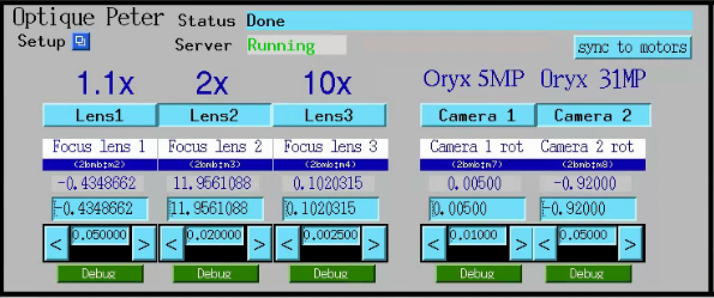

   MCTOptics operator screen. Top: server status and the
   ``sync to motors`` button. Middle: the three lens slots
   (Lens 0 = 1.1×, Lens 1 = 2×, Lens 2 = 10×), each with its own
   focus value. Right: the two cameras (Camera 0 = Oryx 5MP,
   Camera 1 = Oryx 31MP) with their rotation offsets. The
   ``Default`` button restores the per-combination calibrated
   focus / rotation values from the IOC's autosave file.

PropagationDistance
-------------------

(cora Asset identifier. Previously called ``Focus`` (cora #111)
and "Optique Peter Z stage" (this page); both names were
misleading — this stage controls the sample-to-detector distance
along the beam, NOT lens focus. The propagation distance is what
the operator increases for phase-contrast imaging.)

:Role: Sample-to-detector Z stage. Carries the entire microscope
   body along the beam from near-contact with the sample out to
   ~1 m, varying the **propagation distance** used to control
   inline phase contrast.
:Family: LinearStage
:Model: Aerotech **PRO225SL-1000** mechanical-bearing linear stage
   (SL precision class, 1000 mm travel; the longest member of the
   PRO225SL family). cora Model: ``aerotech_pro225sl_1000``.
:Motor: Aerotech **BM250_UF**, 240 VAC AC servo motor, S/N
   ``234848-07``. This is the motor inside the PRO225SL stage that
   drives the ball screw (the stage's product name is PRO225SL-1000;
   the motor's vendor part number is the BM250 series). The
   ``PropagationDistanceDrive`` Aerotech controller is the
   electronics box that runs this motor; see that Asset for the
   drive's own model + serial.
:Mounted on: Detector optical table
:Carries: Optique Peter MICRX080 microscope
:Driven by: ``PropagationDistanceDrive`` (cora ``MotionController``
   Asset wrapping the **Aerotech Ensemble HLe 10-40-A-IO-MXH**
   (HLe subseries, 10 A, 40 V bus, ``-A-`` option, ``-IO-`` option,
   MXH option; full P/N as printed on the label:
   ``EnsembleHLe10-40-A-IO-MXH``), S/N ``228849-02``,
   operator-confirmed against the hardware label 2026-06-16. This
   resolves the prior "specific product line not yet confirmed"
   placeholder and the cora ``aerotech_2bmbaero_drive_unknown_pn``
   Model row. The drive is what the ``2bmbAERO`` IOC manages; the
   Asset was ``FocusDrive`` in cora #111, renamed to match the
   stage it drives.)
:Travel: 1000 mm
:Accuracy: ±18 µm (SL Standard; calibrated grade not offered above 500 mm)
:Resolution: 0.1 µm (high-resolution feedback) / 1.0 µm
:Repeatability: ±1 µm bidirectional
:Straightness: ±9.5 µm horizontal and vertical
:Angular error: 110 µrad pitch, roll, and yaw
:Max speed: 140 mm/s (1000 mm variant; shorter PRO225SL travels reach 220 mm/s)
:Load capacity: 100 kg horizontal, 60 kg vertical (axial), 100 kg side
:Moving mass: 7.3 kg (with tabletop)
:Stage mass: 40.9 kg (without motor)
:Material: anodised aluminium
:MTBF: 20,000 h
:EPICS: ``2bmbAERO:m1`` (motor record; the table-level VAL field is
   ``2bmbAERO:m1.VAL``). Lives in a dedicated Aerotech IOC,
   ``2bmbAERO``, separate from the main ``2bmb`` IOC.

Detector optical table
----------------------

:Role: Floor-referenced support for the Optique Peter Z stage and the
   microscope; used to keep the detector centred on the beam as the Z
   stage moves.
:Family: Table
   (cora ``Table`` Family, declared in the cora catalog at
   ``catalog/catalog.yaml`` and pending registration as Asset
   ``DetectorTable`` in ``docs/deployments/2-bm/assets.md``. The
   six virtual axes on ``2bmb:table3`` are this Asset's
   ``axis_layout = virtual_pose`` settings value, with the composite
   record name held in ``virtual_record`` and the SRI 3-Y / 2-X / 1-Z
   support layout in ``geometry`` — a settings difference from the
   sample ``Table`` Asset, not a Family split.)
:Mounted on: Hutch floor
:Carries: Optique Peter Z stage (and the microscope)
:Degrees of freedom: X, Y, Z, AX (pitch, rotation about lab-X
   outboard, corrects vertical slope), AY (yaw, rotation about
   lab-Y vertical, corrects horizontal slope), AZ (roll, rotation
   about lab-Z beam axis) — six virtual axes computed from six
   underlying support motors.
:Geometry: ``SRI`` (Sector Research Instrumentation: 3 Y supports,
   2 X supports, 1 Z support — 6 motors total).
:EPICS: Virtual table record ``2bmb:table3`` (composite). Loaded in
   the 2-BM-B IOC by
   ``dbLoadRecords("$(DIR)/table.db", "P=2bmb:,Q=Table3,T=table3,
   M0X=m13,M0Y=m14,M1Y=m12,M2X=m10,M2Y=m9,M2Z=m11,GEOM=SRI")``.

Underlying motor map:

=======  ============  ================================
Macro    Motor PV      Role on the table
=======  ============  ================================
``M0X``  ``2bmb:m13``  corner 0 — X support
``M0Y``  ``2bmb:m14``  corner 0 — Y support
``M1Y``  ``2bmb:m12``  corner 1 — Y support (no X here)
``M2X``  ``2bmb:m10``  corner 2 — X support
``M2Y``  ``2bmb:m9``   corner 2 — Y support
``M2Z``  ``2bmb:m11``  corner 2 — Z support (single Z)
=======  ============  ================================

The ``table.db`` template combines these into composite translate /
rotate axes ``2bmb:table3.X``, ``.Y``, ``.Z``, ``.AX``, ``.AY``,
``.AZ``, plus per-leg readbacks under the ``2bmb:table3:`` prefix.

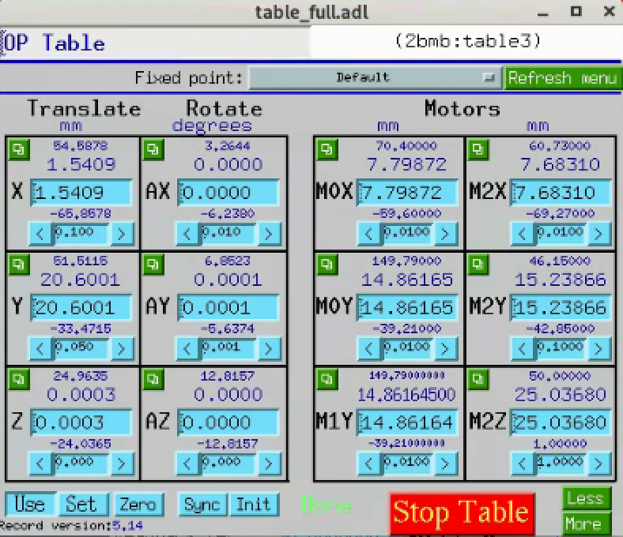

   ``table_full.adl`` MEDM screen for ``2bmb:table3`` (the detector
   optical table under the Optique Peter instrument). The Translate
   and Rotate columns are calc-driven composites; the Motors column
   shows the six underlying motor records listed above.

.. note::

   **Procedure that commands this table.**
   :doc:`../procedures/item_002` (``detector_z_rail_alignment``)
   uses ``2bmb:table3.AX`` (pitch) and ``.AY`` (yaw) to rotate the
   Optique Peter Z rail back parallel to the beam after a small
   square X-ray spot is observed to drift across the camera as the
   Z stage translates. This is the procedure that justifies
   registering a ``DetectorTable`` Asset (cora ``Table`` Family)
   on the cora side.

Trigger and synchronisation
===========================

The Aerotech Ensemble rotary controller emits a position-synchronised
output (PSO) pulse every fixed number of encoder counts of the sample
rotation. Those pulses are not wired straight to the detector — they
pass through a **softGlueZynq** FPGA that conditions them (pulse
width and delay), can mask them through a programmable lookup
pattern, and only then drives the camera trigger input.

softGlueZynq (PSO → camera trigger)
-----------------------------------

:Role: Conditions and gates the Aerotech rotary PSO pulse train into
   the detector trigger input. Provides programmable pulse width and
   delay, a 2:1 MUX between raw PSO and a software-defined custom
   pattern (``trigILF``), and a ``memPulseSeq`` block for arbitrary
   interlaced sequences.
:Family: ``TimingController``
   (cora's Pending entry ``softGlueZynq_FPGA`` carries Family
   ``TimingController`` — the second ``<Domain>Controller`` Family
   after ``MotionController``. Affordance is ``Pulsing`` via the
   ``Controller`` Role: the timing box is itself the actor, not a
   driven device. Substrate "FPGA" is not a Family axis; the
   ``TriggerFPGA`` placeholder we previously cited has been
   superseded by ``TimingController`` per cora's #89.)
:Hardware: APS softGlueZynq — Xilinx Zynq SoC (FPGA + ARM) on a
   MicroZed-class carrier. The EPICS IOC runs on the ARM core and
   starts automatically at boot.
:Mounted on: Hutch electronics rack
:Inputs: PSO output of the Aerotech Ensemble drive that runs the
   rotary ``2bmb:m102``.
:Outputs: Camera trigger input. Per
   ``tomoscan/tomoscan_fpga_2bm.py``, the wiring is FLIR Oryx
   ``Line2`` for the current Oryx 5MP / 31MP cameras; the same
   module also supports Grasshopper3 (``Line0``) and Adimec
   (continuous-timed) modes if those cameras are swapped in.
:Signal path:
   PSO → ``MUX2-1`` (selects raw PSO or ``trigILF``) →
   ``GateDly 1`` (pulse width / delay; default 100 × 100 ns = 10 µs)
   → camera trigger.
:EPICS prefix: ``2bmbMZ1:SG:``. Key PVs:

   ===================================  =========================================================
   PV                                   Purpose
   ===================================  =========================================================
   ``2bmbMZ1:SG:MUX2-1_SEL_Signal``     Selects raw PSO (0) or ``trigILF`` (1) onto the trigger.
   ``2bmbMZ1:SG:memPulseSeq.enable``    Arms (1) / disarms (0) the custom-pattern playback.
   ``2bmbMZ1:SG:GateDly1.DLY``          Delay from input edge to start of output pulse.
   ``2bmbMZ1:SG:GateDly1.Width``        Output pulse width, in 10 MHz clock cycles (100 = 10 µs).
   ===================================  =========================================================

:IOC location: ``/net/s2dserv/xorApps/epics/synApps_SG/ioc/2bmbMZ1/``
   on ``arcturus``. Start with ``./start_epics_2bmbMZ1`` (or the
   matching ``./start_caQtDM_2bmbMZ1`` for the operator screens).
:tomoscan integration:
   ``TomoScan2BM`` (subclass of ``TomoScanFPGAPSO``) in
   `tomoscan/tomoscan_fpga_2bm.py
   <https://github.com/decarlof/tomoscan/blob/master/tomoscan/tomoscan_fpga_2bm.py>`__
   selects the camera-specific trigger mode
   (``set_trigger_mode_oryx`` / ``_grasshopper`` / ``_adimec``);
   the base ``TomoScanFPGAPSO`` class drives the PSO configuration
   on the Aerotech controller.
:Custom pulse patterns:
   For interlaced-fly tomography, pulse subsets are loaded with the
   helper ``macros_ILF.write_PSO_array`` (e.g.
   ``write_PSO_array([0, 2, 4, 6])`` triggers only on PSO edges 0,
   2, 4, 6). See
   `interlaced/fpga/macros_ILF.py
   <https://github.com/decarlof/interlaced/blob/main/fpga/macros_ILF.py>`__.
:Notes:
   :doc:`../ops/item_060` is the operational page for the FPGA —
   MEDM screens, how to set ``DLY`` and ``Width``, how to flip the
   MUX, and the ``memPulseSeq`` workflow.

.. _composite-iocs:

Composite IOCs
==============

Some kinematic relations and motion logic are encapsulated inside
custom EPICS IOCs and exposed to the rest of the beamline as
higher-level PVs. Where this is the case, the underlying stack does
not need to be modelled separately in cora: the IOC presents the
composite as a single addressable surface.

Each entry below declares:

:Encapsulates: underlying motors / devices the IOC drives
:Exposes: higher-level PVs presented to EPICS
:Repository: link to source

Convention: components whose kinematic role is fully captured by a
composite IOC do not need a ``Mounted on`` / ``Carries`` chain in the
sections above; they appear only inside the IOC's ``Encapsulates``
list.

Energy-change IOC
-----------------

:Encapsulates: All motors moved together during an energy change.
   The IOC stores per-energy positions in a configuration file and
   drives them as a coordinated move. Categories from the current
   configuration:

   - **Mirror (M1):** angle (``m1angl``) and average Y (``m1avg``,
     derived from ``2bma:m2`` and ``2bma:m5``) — both are deflection-
     geometry parameters held constant in the current configuration
     (``m1angl`` = 2.615 mrad, ``m1avg`` = 0) and would only change
     if the overall beam-deflection geometry were retuned. The
     per-energy mirror action is horizontal stripe selection via
     ``m1_horizontal`` (= ``2bma:m3``) and the optical-table X stages
     ``m1mox`` and ``m1m2x`` (from the ``table_full`` IOC). The
     stripe sets the high-energy cutoff (low-pass filter via the
     coating's reflectivity edge).
   - **DMM:** all nine motors from the table above except ``M2 Z``
     (``2bma:m8``) — that one is not driven by the IOC. Driven set:
     ``dmm_usx``, ``dmm_dsx``, ``dmm_usy_ob``, ``dmm_usy_ib``,
     ``dmm_dsy``, ``dmm_us_arm``, ``dmm_ds_arm``, ``dmm_m2_y``.
   - **Downstream / B-hutch:** ``table3y``, ``flag``,
     ``b_slit_top``, ``b_slit_bot`` — these track the downstream
     beam position. In Mono mode the DMM Bragg geometry shifts the
     beam exit vertically per energy, so the downstream table, flag,
     and B-hutch slits move with it to keep the beam in the pipe and
     centred on the slits. In Pink mode the DMM is bypassed and no
     per-energy tracking is needed.
   - **Filter:** ``fltr1select`` (downstream filter paddle index).

:Modes: Two operating modes are stored:

   - **Mono** — multilayer monochromator engaged. DMM Y motors held
     at 0 (in beam); Bragg arms (``dmm_us_arm`` / ``dmm_ds_arm``) and
     ``dmm_m2_y`` vary per energy to set the Bragg condition and
     compensate the beam-exit offset. Mirror stripe held at the
     lowest position (``m1_horizontal`` = 1.0, table X = 8.0).
     Downstream (``table3y`` / ``flag`` / B-hutch slits) tracks the
     beam-exit shift per energy. Currently configured: 13.374,
     13.574, 18.0, 20.0, 25.0, 25.584 keV.
   - **Pink** — DMM bypassed (all DMM Y motors at −10, out of beam);
     Bragg arms parked at fixed retracted positions. With the DMM
     out the beam goes straight through, so the downstream motors
     are held at neutral positions (``table3y`` = 0, ``flag`` = 0,
     slits wide open). The mirror's stripe selector handles the
     high-energy cutoff: low energies use the soft Pt / low-d
     stripes, higher energies sweep ``m1_horizontal`` plus the table
     X to reach the harder multilayer stripes. Currently configured:
     30, 40, 50, 60 keV.

:Exposes: Higher-level energy-change command surface (PV / RPC TBD;
   consult ``energyApp/`` in the repository).
:Repository: https://github.com/xray-imaging/energy.git
   (standard EPICS app layout — ``energyApp/``, ``iocBoot/``,
   ``configure/``, ``src/``).

**Mirror stripe travel (Pink mode).** ``m1_horizontal`` (the in-vacuum
``2bma:m3``) reaches the low-energy stripes alone; for higher energies
the table X is extended together with it:

.. list-table::
   :header-rows: 1
   :widths: 25 35 40

   * - Energy [keV]
     - ``m1_horizontal`` [mm]
     - ``m1mox`` / ``m1m2x`` [mm]
   * - 30
     - 3.039
     - 8.0 / 8.0
   * - 40
     - 13.0
     - 10.0 / 10.0
   * - 50
     - 39.0
     - 10.0 / 10.0
   * - 60
     - 49.0
     - 29.0 / 29.0

**Stored configurations.** Per-energy positions are persisted with
ISO-8601 timestamps in a ``store_0`` field, so the most recent saved
values for each energy are what the IOC loads on the next move. The
configuration file is the authoritative source for which motors the
IOC drives — adding a new motor to the energy move means adding its
key to that file, not editing the IOC source.

**Why this matters for cora.** The energy-change IOC is the canonical
example of a kinematic / orchestration relation that is not present in
the asset tree but is real and load-bearing for operation. A single
"set energy to 50 keV" command resolves into ~15 coordinated motor
moves spanning the mirror, the DMM, the downstream table, the B-hutch
slits, and the filter changer. From cora's perspective the energy
change should be one Method on a composite "BeamEnergy" surface; the
underlying motor stack stays hidden inside this IOC.

MCTOptics IOC
-------------

:Encapsulates: All motors and combination logic of the Optique Peter
   triple-objective microscope. From the underlying motor map
   (``iocBoot/iocMCTOptics/mctOptics.substitutions``): lens turret
   (``LENS_MOTOR = 2bmb:m1``), camera selector
   (``CAMERA_MOTOR = 2bmb:m5``), per-objective focus
   (``LENS{0,1,2}_FOCUS = 2bmb:m{2,3,4}``), per-camera rotation
   (``CAM{0,1}_ROT = 2bmb:m{7,8}``), and sample-side alignment
   (``LENS_SAMPLE_X = 2bmb:m18``, ``LENS_SAMPLE_Y = 2bmHXP:m3``,
   ``LENS_SAMPLE_Z = 2bmb:m17``). When the operator changes the
   lens or camera selection, the IOC drives the corresponding
   motor to the calibrated position and applies the per-combination
   focus and rotation offsets from its autosave file.

:Exposes: Higher-level operator surface under prefix
   ``2bm:MCTOptics:``. Setpoints: ``LensSelect``, ``CameraSelect``
   (mbbo, ``Pos. 0`` / ``Pos. 1`` / ``Pos. 2``). Status readbacks:
   ``LensSelected``, ``CameraSelected`` (also report the
   intermediate "Moving between …" state). Labels and stamped scan
   metadata: ``LensName{0,1,2}``, ``CameraName{0,1}``,
   ``ScintillatorType``, ``ScintillatorThickness``,
   ``CameraObjective``, ``CameraTubeLength``, ``ImagePixelSize``,
   ``DetectorPixelSize``, ``CameraBinning``, ``Camera{0,1}Bit``,
   ``Cut{Left,Right,Top,Bottom}``. The full per-PV semantics live
   in the MCTOptics block above (the operator-facing block);
   this entry is the composite-IOC contract that downstream
   consumers (cora included) bind against.

:Repository: https://github.com/xray-imaging/mctoptics
   (documentation: https://mctoptics.readthedocs.io).

**Why this matters for cora.** Lens and camera selection at 2-BM
are not raw motor moves — they are composite operations that depend
on per-combination calibration values held in the IOC's autosave.
Treating ``2bmb:m{2,3,4}`` or ``2bmb:m1`` as bare motors and
addressing them directly from cora would bypass that calibration
and re-implement (badly) what MCTOptics already does. The cora
binding for the microscope should target the ``2bm:MCTOptics:*``
PVs above; the underlying motor stack stays hidden inside this IOC.

.. (Planned entry — to be drafted as the IOC is catalogued.)

.. - **(Planned) Sample-stack IOC** — could encapsulate the
..   hexapod-Y / optical-table-Y handoff so the rest of the beamline
..   sees a single "sample Y" surface with full range.
