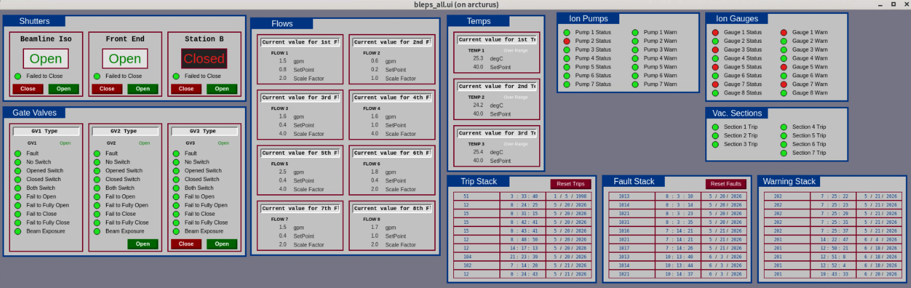
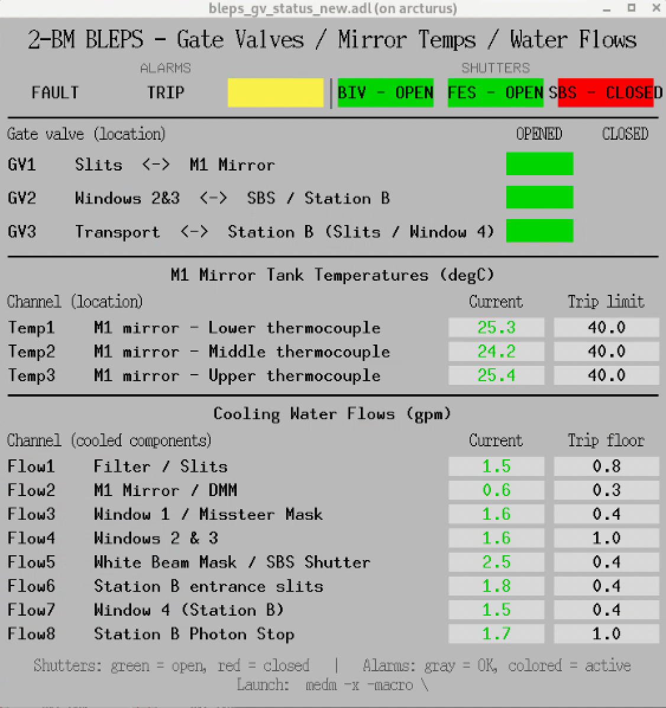

==================================================
Beamline Equipment Protection System (BLEPS)
==================================================

**BLEPS** (Beamline Equipment Protection System) is the PLC-based
safety and interlock system used at the APS to protect beamline
hardware — optics, vacuum components, water-cooled stops — from
physical damage during user experiments. It continuously monitors
the operating state of every protected component and, if any of
them deviates from its safe envelope, either warns staff or
trips a **Fault** condition that automatically closes the main
beamline shutters to block the X-ray beam.

BLEPS protects **equipment**; the **Personnel Safety System (PSS)**
protects **people**. The two are distinct but cooperate — a BLEPS
fault asks the PSS-controlled shutter chain to close. PSS is the
authoritative safety layer for people-in-hutch interlocks; BLEPS
is the layer between PSS and the wear-and-tear of the hardware.

What BLEPS monitors
===================

Typical quantities continuously read by the PLC and compared against
component-specific limits:

- **Water flow** on every water-cooled element (mirror, DMM, slits,
  filters, white-beam stops, beam-defining masks).
- **Vacuum pressure** at every gauge along the front end and the
  beamline transport.
- **Component temperatures** (thermocouples on optics, mirror tank,
  monochromator crystals, etc.).
- **Position / state** of valves, masks, and shutters relevant to
  equipment protection (gate-valve open/closed, mask in/out).

Each input has a **Warning** threshold (notify staff, scan
continues) and a **Fault** threshold (close shutters, latch the
fault until manually cleared).

Response to a fault
===================

When a Fault threshold is crossed, BLEPS:

1. Latches the fault on the PLC and propagates it to the PSS
   shutter chain.
2. Closes the main 2-BM beamline shutters — the **A-shutter**
   (front-end) and the **P6-50 safety shutter / B_shutter**
   further downstream — to block the X-ray beam.
   See the per-shutter blocks in
   :doc:`item_020` for PV names and command surfaces.
3. Surfaces the latched fault on the BLEPS MEDM / operator
   screen so staff can identify the root cause before clearing.

The fault is **latched** — the shutters do not re-open automatically
when the offending parameter returns to normal. A staff member must
verify the underlying condition, acknowledge the fault on the BLEPS
panel, and then re-arm the shutter chain.

2-BM implementation
===================

The full 2-BM-specific BLEPS implementation — interlock matrix
(which inputs trip which outputs), PLC programme, MEDM screens,
fault-recovery procedure — is documented in:

`2-BM BLEPS implementation
<https://anl.box.com/s/eqoj8wfrgb1r20r96jy7h4if57qc8x3n>`__.

That document is the source of truth for the 2-BM interlock
configuration. This page is the conceptual overview only.

Physical assignments at 2-BM
============================

The Excel transfer table refers to the gate valves, mirror
thermocouples and water-flow loops only by numeric index
(``GV1``/``GV2``/``GV3``, ``Temp1``/``Temp2``/``Temp3``,
``Flow1``..``Flow8``). The physical device each index refers to is
configured in the PLC and is not stored in the transfer table — it
is read off the **2 BMBLEPS** Allen-Bradley operator panel, which
surfaces ``Flow1``-``Flow5`` / ``Temp1``-``Temp3`` / ``GV1`` /
``GV2`` on the *Station A* page and ``Flow6``-``Flow8`` / ``GV3``
on the *Station B* page. The mapping below is taken from those
screens.

Gate valves — location in beam direction
----------------------------------------

.. list-table::
   :header-rows: 1
   :widths: 15 85

   * - Tag
     - Physical location
   * - ``GV1``
     - Between the upstream Slits (downstream of the BIV) and the
       M1 mirror tank. Isolates the mirror tank from the front-end
       side.
   * - ``GV2``
     - Between Windows 2 & 3 (downstream end of the Station A
       optics enclosure) and the SBS (Station B Shutter). Isolates
       the Station A optics enclosure from the transport to Station
       B.
   * - ``GV3``
     - Between the transport pipe coming from Station A and the
       Station B optics (Station B entrance slits and Window 4).
       Isolates Station B from the transport.

Mirror tank thermocouples
-------------------------

All three ``Temp`` channels are thermocouples on the M1 mirror
tank; the index maps top-to-bottom on the tank:

.. list-table::
   :header-rows: 1
   :widths: 15 85

   * - Tag
     - Physical location
   * - ``Temp1``
     - M1 mirror tank — Lower thermocouple.
   * - ``Temp2``
     - M1 mirror tank — Middle thermocouple.
   * - ``Temp3``
     - M1 mirror tank — Upper thermocouple.

Water-flow loops
----------------

Each ``Flow`` channel monitors the cooling-water flow through one
group of water-cooled components:

.. list-table::
   :header-rows: 1
   :widths: 15 85

   * - Tag
     - Cooled components
   * - ``Flow1``
     - Filter assembly and upstream Slits.
   * - ``Flow2``
     - M1 mirror tank and the DMM (Double Multilayer Monochromator).
   * - ``Flow3``
     - Window 1 and the Missteer Mask.
   * - ``Flow4``
     - Windows 2 & 3.
   * - ``Flow5``
     - White Beam Mask and the SBS (Station B Shutter).
   * - ``Flow6``
     - Station B entrance slits.
   * - ``Flow7``
     - Window 4 (Station B).
   * - ``Flow8``
     - Station B Photon Stop.

Operator screens
================

Two graphical interfaces are used at 2-BM to monitor the BLEPS:

The **full BLEPS panel** (caQtDM, support-supplied) surfaces every
BLEPS channel — shutters, gate-valve open/close commands and
per-fault flags, ion pumps and gauges, vacuum sections, flows,
temperatures, and the trip / fault / warning FIFOs. Use it for
diagnostics and to acknowledge / reset latched faults.

The **status summary** (MEDM, ``bleps_gv_status.adl``) is a smaller
read-only screen showing the BLEPS state most relevant to daily
operations: the overall fault / trip / warning latches, the three
beamline shutters (BIV, FES, SBS), the three gate-valve open/closed
limit switches with their physical location, the M1 mirror
thermocouples, and the eight cooling-water flows. Every numeric
channel is labelled with the physical device it monitors, so the
indexed PV names below do not need to be cross-referenced by hand.

Launch the summary screen with::

    medm -x -macro "P=2bmBLEPS:" bleps_gv_status.adl

PVs shown on the status summary screen
--------------------------------------

The *Current* and *Trip limit* columns on the summary screen are
driven by the PVs in the table below (all share the prefix
``2bmBLEPS:BLEPS:``).

.. list-table::
   :header-rows: 1
   :widths: 10 35 27 28

   * - Channel
     - Location / cooled components
     - Current value PV
     - Trip limit PV
   * - ``Temp1``
     - M1 mirror tank — Lower thermocouple
     - ``TEMP1_CURRENT``
     - ``TEMP1_SET_POINT``
   * - ``Temp2``
     - M1 mirror tank — Middle thermocouple
     - ``TEMP2_CURRENT``
     - ``TEMP2_SET_POINT``
   * - ``Temp3``
     - M1 mirror tank — Upper thermocouple
     - ``TEMP3_CURRENT``
     - ``TEMP3_SET_POINT``
   * - ``Flow1``
     - Filter / Slits
     - ``FLOW1_CURRENT``
     - ``FLOW1_SET_POINT``
   * - ``Flow2``
     - M1 Mirror / DMM
     - ``FLOW2_CURRENT``
     - ``FLOW2_SET_POINT``
   * - ``Flow3``
     - Window 1 / Missteer Mask
     - ``FLOW3_CURRENT``
     - ``FLOW3_SET_POINT``
   * - ``Flow4``
     - Windows 2 & 3
     - ``FLOW4_CURRENT``
     - ``FLOW4_SET_POINT``
   * - ``Flow5``
     - White Beam Mask / SBS Shutter
     - ``FLOW5_CURRENT``
     - ``FLOW5_SET_POINT``
   * - ``Flow6``
     - Station B entrance slits
     - ``FLOW6_CURRENT``
     - ``FLOW6_SET_POINT``
   * - ``Flow7``
     - Window 4 (Station B)
     - ``FLOW7_CURRENT``
     - ``FLOW7_SET_POINT``
   * - ``Flow8``
     - Station B Photon Stop
     - ``FLOW8_CURRENT``
     - ``FLOW8_SET_POINT``

Temperature trip limits are *high* setpoints (a fault is raised
when the reading rises above the setpoint); flow trip limits are
*low* setpoints (a fault is raised when the reading falls below
the setpoint). The top-row status latches
(``A_FAULT_EXISTS``, ``A_TRIP_EXISTS``, ``WARNING_EXISTS``), the
shutter closed-status inputs (``BIV_CLOSED``, ``FES_CLOSED``,
``SBS_CLOSED``) and the gate-valve limit switches
(``GVx_OPENED_LS`` / ``GVx_CLOSED_LS``) are documented under the
*Faults*, *Inputs* and *Outputs* tables below.

BLEPS PV inventory (2-BM)
=========================

The Excel transfer table that defines the 2-BM BLEPS PLC tag set
contains one worksheet per logical class of signals (FIFOs, Faults,
Trips, Warnings, Info, Flows, Temps, Inputs, Outputs, Display,
EPICS_Inputs). Each row has a ``Used`` flag that marks whether
the row is in the deployed configuration; the subsections below
reproduce **only the rows currently in use** at 2-BM and give the
two fields needed to address each one over Channel Access:

* **EPICS Ethernet Tag** — the controller-side tag that the PLC
  publishes on the EtherNet/IP-to-EPICS gateway.
* **Short Description** — the human-readable label the PLC team
  attached to each row.

Source of truth is the Excel master
(``BLEPS EPICS Transfer Table Master 2BM.xls``), itself part of
the wider 2-BM BLEPS document set on Box (see the Box link in
the *2-BM implementation* section above). The full PV name on
the EPICS gateway is the ``Base Name`` + ``PV Name`` template
``BL:$(xx)$(yy):<base name in caps>``, which is also in the
master Excel.

``FIFOs`` (210 entries)
-----------------------

.. list-table::
   :header-rows: 1
   :widths: 45 55

   * - EPICS Ethernet Tag
     - Short Description
   * - ``Faults.Number[0]``
     - Fault Number 01
   * - ``Faults.Number[1]``
     - Fault Number 02
   * - ``Faults.Number[2]``
     - Fault Number 03
   * - ``Faults.Number[3]``
     - Fault Number 04
   * - ``Faults.Number[4]``
     - Fault Number 05
   * - ``Faults.Number[5]``
     - Fault Number 06
   * - ``Faults.Number[6]``
     - Fault Number 07
   * - ``Faults.Number[7]``
     - Fault Number 08
   * - ``Faults.Number[8]``
     - Fault Number 09
   * - ``Faults.Number[9]``
     - Fault Number 10
   * - ``Faults.Year[0]``
     - Fault Year 01
   * - ``Faults.Year[1]``
     - Fault Year 02
   * - ``Faults.Year[2]``
     - Fault Year 03
   * - ``Faults.Year[3]``
     - Fault Year 04
   * - ``Faults.Year[4]``
     - Fault Year 05
   * - ``Faults.Year[5]``
     - Fault Year 06
   * - ``Faults.Year[6]``
     - Fault Year 07
   * - ``Faults.Year[7]``
     - Fault Year 08
   * - ``Faults.Year[8]``
     - Fault Year 09
   * - ``Faults.Year[9]``
     - Fault Year 10
   * - ``Faults.Month[0]``
     - Fault Month 01
   * - ``Faults.Month[1]``
     - Fault Month 02
   * - ``Faults.Month[2]``
     - Fault Month 03
   * - ``Faults.Month[3]``
     - Fault Month 04
   * - ``Faults.Month[4]``
     - Fault Month 05
   * - ``Faults.Month[5]``
     - Fault Month 06
   * - ``Faults.Month[6]``
     - Fault Month 07
   * - ``Faults.Month[7]``
     - Fault Month 08
   * - ``Faults.Month[8]``
     - Fault Month 09
   * - ``Faults.Month[9]``
     - Fault Month 10
   * - ``Faults.Day[0]``
     - Fault Day 01
   * - ``Faults.Day[1]``
     - Fault Day 02
   * - ``Faults.Day[2]``
     - Fault Day 03
   * - ``Faults.Day[3]``
     - Fault Day 04
   * - ``Faults.Day[4]``
     - Fault Day 05
   * - ``Faults.Day[5]``
     - Fault Day 06
   * - ``Faults.Day[6]``
     - Fault Day 07
   * - ``Faults.Day[7]``
     - Fault Day 08
   * - ``Faults.Day[8]``
     - Fault Day 09
   * - ``Faults.Day[9]``
     - Fault Day 10
   * - ``Faults.Hour[0]``
     - Fault Hour 01
   * - ``Faults.Hour[1]``
     - Fault Hour 02
   * - ``Faults.Hour[2]``
     - Fault Hour 03
   * - ``Faults.Hour[3]``
     - Fault Hour 04
   * - ``Faults.Hour[4]``
     - Fault Hour 05
   * - ``Faults.Hour[5]``
     - Fault Hour 06
   * - ``Faults.Hour[6]``
     - Fault Hour 07
   * - ``Faults.Hour[7]``
     - Fault Hour 08
   * - ``Faults.Hour[8]``
     - Fault Hour 09
   * - ``Faults.Hour[9]``
     - Fault Hour 10
   * - ``Faults.Minute[0]``
     - Fault Minute 01
   * - ``Faults.Minute[1]``
     - Fault Minute 02
   * - ``Faults.Minute[2]``
     - Fault Minute 03
   * - ``Faults.Minute[3]``
     - Fault Minute 04
   * - ``Faults.Minute[4]``
     - Fault Minute 05
   * - ``Faults.Minute[5]``
     - Fault Minute 06
   * - ``Faults.Minute[6]``
     - Fault Minute 07
   * - ``Faults.Minute[7]``
     - Fault Minute 08
   * - ``Faults.Minute[8]``
     - Fault Minute 09
   * - ``Faults.Minute[9]``
     - Fault Minute 10
   * - ``Faults.Second[0]``
     - Fault Second 01
   * - ``Faults.Second[1]``
     - Fault Second 02
   * - ``Faults.Second[2]``
     - Fault Second 03
   * - ``Faults.Second[3]``
     - Fault Second 04
   * - ``Faults.Second[4]``
     - Fault Second 05
   * - ``Faults.Second[5]``
     - Fault Second 06
   * - ``Faults.Second[6]``
     - Fault Second 07
   * - ``Faults.Second[7]``
     - Fault Second 08
   * - ``Faults.Second[8]``
     - Fault Second 09
   * - ``Faults.Second[9]``
     - Fault Second 10
   * - ``Trips.Number[0]``
     - Trip Number 01
   * - ``Trips.Number[1]``
     - Trip Number 02
   * - ``Trips.Number[2]``
     - Trip Number 03
   * - ``Trips.Number[3]``
     - Trip Number 04
   * - ``Trips.Number[4]``
     - Trip Number 05
   * - ``Trips.Number[5]``
     - Trip Number 06
   * - ``Trips.Number[6]``
     - Trip Number 07
   * - ``Trips.Number[7]``
     - Trip Number 08
   * - ``Trips.Number[8]``
     - Trip Number 09
   * - ``Trips.Number[9]``
     - Trip Number 10
   * - ``Trips.Year[0]``
     - Trip Year 01
   * - ``Trips.Year[1]``
     - Trip Year 02
   * - ``Trips.Year[2]``
     - Trip Year 03
   * - ``Trips.Year[3]``
     - Trip Year 04
   * - ``Trips.Year[4]``
     - Trip Year 05
   * - ``Trips.Year[5]``
     - Trip Year 06
   * - ``Trips.Year[6]``
     - Trip Year 07
   * - ``Trips.Year[7]``
     - Trip Year 08
   * - ``Trips.Year[8]``
     - Trip Year 09
   * - ``Trips.Year[9]``
     - Trip Year 10
   * - ``Trips.Month[0]``
     - Trip Month 01
   * - ``Trips.Month[1]``
     - Trip Month 02
   * - ``Trips.Month[2]``
     - Trip Month 03
   * - ``Trips.Month[3]``
     - Trip Month 04
   * - ``Trips.Month[4]``
     - Trip Month 05
   * - ``Trips.Month[5]``
     - Trip Month 06
   * - ``Trips.Month[6]``
     - Trip Month 07
   * - ``Trips.Month[7]``
     - Trip Month 08
   * - ``Trips.Month[8]``
     - Trip Month 09
   * - ``Trips.Month[9]``
     - Trip Month 10
   * - ``Trips.Day[0]``
     - Trip Day 01
   * - ``Trips.Day[1]``
     - Trip Day 02
   * - ``Trips.Day[2]``
     - Trip Day 03
   * - ``Trips.Day[3]``
     - Trip Day 04
   * - ``Trips.Day[4]``
     - Trip Day 05
   * - ``Trips.Day[5]``
     - Trip Day 06
   * - ``Trips.Day[6]``
     - Trip Day 07
   * - ``Trips.Day[7]``
     - Trip Day 08
   * - ``Trips.Day[8]``
     - Trip Day 09
   * - ``Trips.Day[9]``
     - Trip Day 10
   * - ``Trips.Hour[0]``
     - Trip Hour 01
   * - ``Trips.Hour[1]``
     - Trip Hour 02
   * - ``Trips.Hour[2]``
     - Trip Hour 03
   * - ``Trips.Hour[3]``
     - Trip Hour 04
   * - ``Trips.Hour[4]``
     - Trip Hour 05
   * - ``Trips.Hour[5]``
     - Trip Hour 06
   * - ``Trips.Hour[6]``
     - Trip Hour 07
   * - ``Trips.Hour[7]``
     - Trip Hour 08
   * - ``Trips.Hour[8]``
     - Trip Hour 09
   * - ``Trips.Hour[9]``
     - Trip Hour 10
   * - ``Trips.Minute[0]``
     - Trip Minute 01
   * - ``Trips.Minute[1]``
     - Trip Minute 02
   * - ``Trips.Minute[2]``
     - Trip Minute 03
   * - ``Trips.Minute[3]``
     - Trip Minute 04
   * - ``Trips.Minute[4]``
     - Trip Minute 05
   * - ``Trips.Minute[5]``
     - Trip Minute 06
   * - ``Trips.Minute[6]``
     - Trip Minute 07
   * - ``Trips.Minute[7]``
     - Trip Minute 08
   * - ``Trips.Minute[8]``
     - Trip Minute 09
   * - ``Trips.Minute[9]``
     - Trip Minute 10
   * - ``Trips.Second[0]``
     - Trip Second 01
   * - ``Trips.Second[1]``
     - Trip Second 02
   * - ``Trips.Second[2]``
     - Trip Second 03
   * - ``Trips.Second[3]``
     - Trip Second 04
   * - ``Trips.Second[4]``
     - Trip Second 05
   * - ``Trips.Second[5]``
     - Trip Second 06
   * - ``Trips.Second[6]``
     - Trip Second 07
   * - ``Trips.Second[7]``
     - Trip Second 08
   * - ``Trips.Second[8]``
     - Trip Second 09
   * - ``Trips.Second[9]``
     - Trip Second 10
   * - ``Warnings.Number[0]``
     - Warning Number 01
   * - ``Warnings.Number[1]``
     - Warning Number 02
   * - ``Warnings.Number[2]``
     - Warning Number 03
   * - ``Warnings.Number[3]``
     - Warning Number 04
   * - ``Warnings.Number[4]``
     - Warning Number 05
   * - ``Warnings.Number[5]``
     - Warning Number 06
   * - ``Warnings.Number[6]``
     - Warning Number 07
   * - ``Warnings.Number[7]``
     - Warning Number 08
   * - ``Warnings.Number[8]``
     - Warning Number 09
   * - ``Warnings.Number[9]``
     - Warning Number 10
   * - ``Warnings.Year[0]``
     - Warning Year 01
   * - ``Warnings.Year[1]``
     - Warning Year 02
   * - ``Warnings.Year[2]``
     - Warning Year 03
   * - ``Warnings.Year[3]``
     - Warning Year 04
   * - ``Warnings.Year[4]``
     - Warning Year 05
   * - ``Warnings.Year[5]``
     - Warning Year 06
   * - ``Warnings.Year[6]``
     - Warning Year 07
   * - ``Warnings.Year[7]``
     - Warning Year 08
   * - ``Warnings.Year[8]``
     - Warning Year 09
   * - ``Warnings.Year[9]``
     - Warning Year 10
   * - ``Warnings.Month[0]``
     - Warning Month 01
   * - ``Warnings.Month[1]``
     - Warning Month 02
   * - ``Warnings.Month[2]``
     - Warning Month 03
   * - ``Warnings.Month[3]``
     - Warning Month 04
   * - ``Warnings.Month[4]``
     - Warning Month 05
   * - ``Warnings.Month[5]``
     - Warning Month 06
   * - ``Warnings.Month[6]``
     - Warning Month 07
   * - ``Warnings.Month[7]``
     - Warning Month 08
   * - ``Warnings.Month[8]``
     - Warning Month 09
   * - ``Warnings.Month[9]``
     - Warning Month 10
   * - ``Warnings.Day[0]``
     - Warning Day 01
   * - ``Warnings.Day[1]``
     - Warning Day 02
   * - ``Warnings.Day[2]``
     - Warning Day 03
   * - ``Warnings.Day[3]``
     - Warning Day 04
   * - ``Warnings.Day[4]``
     - Warning Day 05
   * - ``Warnings.Day[5]``
     - Warning Day 06
   * - ``Warnings.Day[6]``
     - Warning Day 07
   * - ``Warnings.Day[7]``
     - Warning Day 08
   * - ``Warnings.Day[8]``
     - Warning Day 09
   * - ``Warnings.Day[9]``
     - Warning Day 10
   * - ``Warnings.Hour[0]``
     - Warning Hour 01
   * - ``Warnings.Hour[1]``
     - Warning Hour 02
   * - ``Warnings.Hour[2]``
     - Warning Hour 03
   * - ``Warnings.Hour[3]``
     - Warning Hour 04
   * - ``Warnings.Hour[4]``
     - Warning Hour 05
   * - ``Warnings.Hour[5]``
     - Warning Hour 06
   * - ``Warnings.Hour[6]``
     - Warning Hour 07
   * - ``Warnings.Hour[7]``
     - Warning Hour 08
   * - ``Warnings.Hour[8]``
     - Warning Hour 09
   * - ``Warnings.Hour[9]``
     - Warning Hour 10
   * - ``Warnings.Minute[0]``
     - Warning Minute 01
   * - ``Warnings.Minute[1]``
     - Warning Minute 02
   * - ``Warnings.Minute[2]``
     - Warning Minute 03
   * - ``Warnings.Minute[3]``
     - Warning Minute 04
   * - ``Warnings.Minute[4]``
     - Warning Minute 05
   * - ``Warnings.Minute[5]``
     - Warning Minute 06
   * - ``Warnings.Minute[6]``
     - Warning Minute 07
   * - ``Warnings.Minute[7]``
     - Warning Minute 08
   * - ``Warnings.Minute[8]``
     - Warning Minute 09
   * - ``Warnings.Minute[9]``
     - Warning Minute 10
   * - ``Warnings.Second[0]``
     - Warning Second 01
   * - ``Warnings.Second[1]``
     - Warning Second 02
   * - ``Warnings.Second[2]``
     - Warning Second 03
   * - ``Warnings.Second[3]``
     - Warning Second 04
   * - ``Warnings.Second[4]``
     - Warning Second 05
   * - ``Warnings.Second[5]``
     - Warning Second 06
   * - ``Warnings.Second[6]``
     - Warning Second 07
   * - ``Warnings.Second[7]``
     - Warning Second 08
   * - ``Warnings.Second[8]``
     - Warning Second 09
   * - ``Warnings.Second[9]``
     - Warning Second 10

``Faults`` (46 entries)
-----------------------

.. list-table::
   :header-rows: 1
   :widths: 45 55

   * - EPICS Ethernet Tag
     - Short Description
   * - ``A_Fault_Exists``
     - Any A_Fault Exists
   * - ``Communications_Fault``
     - 1 Communications Fault
   * - ``Flow1.Over_Range_Fault``
     - 11 Flow 1 Over Range Fault
   * - ``Flow2.Over_Range_Fault``
     - 12 Flow 2 Over Range Fault
   * - ``Flow3.Over_Range_Fault``
     - 13 Flow 3 Over Range Fault
   * - ``Flow4.Over_Range_Fault``
     - 14 Flow 4 Over Range Fault
   * - ``Flow5.Over_Range_Fault``
     - 15 Flow 5 Over Range Fault
   * - ``Flow6.Over_Range_Fault``
     - 16 Flow 6 Over Range Fault
   * - ``Flow7.Over_Range_Fault``
     - 17 Flow 7 Over Range Fault
   * - ``Flow8.Over_Range_Fault``
     - 18 Flow 8 Over Range Fault
   * - ``Temp1.Under_Range_Fault``
     - 51 Temp 1 Under Range Fault
   * - ``Temp2.Under_Range_Fault``
     - 52 Temp 2 Under Range Fault
   * - ``Temp3.Under_Range_Fault``
     - 53 Temp 3 Under Range Fault
   * - ``BIV.Fail_to_Close``
     - 100 BIV Fail to Close
   * - ``FES.Fail_to_Close``
     - 101 FES Fail to Close
   * - ``SBS.Fail_to_Close``
     - 102 SBS Fail to Close
   * - ``GV1.Faulted``
     - GV1_Faulted
   * - ``GV1.Fault.Both_Switch``
     - 1011 GV1 Both Switch
   * - ``GV1.Fault.Opened_Switch``
     - 1012 GV1 Opened Switch
   * - ``GV1.Fault.Fail_to_Open``
     - 1013 GV1 Fail to Open
   * - ``GV1.Fault.Fully_Open``
     - 1014 GV1 Fail To Fully Open
   * - ``GV1.Fault.Closed_Switch``
     - 1015 GV1 Closed Switch
   * - ``GV1.Fault.Fail_to_Close``
     - 1016 GV1 Fail to Close
   * - ``GV1.Fault.Fully_Close``
     - 1017 GV1 Fail To Fully Close
   * - ``GV1.Fault.Beam_Exposure``
     - 1018 GV1 Beam Exposure
   * - ``GV1.Fault.No_Switch``
     - 1019 GV1 No Switch
   * - ``GV2.Faulted``
     - GV2_Faulted
   * - ``GV2.Fault.Both_Switch``
     - 1021 GV2 Both Switch
   * - ``GV2.Fault.Opened_Switch``
     - 1022 GV2 Opened Switch
   * - ``GV2.Fault.Fail_to_Open``
     - 1023 GV2 Fail to Open
   * - ``GV2.Fault.Fully_Open``
     - 1024 GV2 Fail To Fully Open
   * - ``GV2.Fault.Closed_Switch``
     - 1025 GV2 Closed Switch
   * - ``GV2.Fault.Fail_to_Close``
     - 1026 GV2 Fail to Close
   * - ``GV2.Fault.Fully_Close``
     - 1027 GV2 Fail To Fully Close
   * - ``GV2.Fault.Beam_Exposure``
     - 1028 GV2 Beam Exposure
   * - ``GV2.Fault.No_Switch``
     - 1029 GV2 No Switch
   * - ``GV3.Faulted``
     - GV3_Faulted
   * - ``GV3.Fault.Both_Switch``
     - 1031 GV3 Both Switch
   * - ``GV3.Fault.Opened_Switch``
     - 1032 GV3 Opened Switch
   * - ``GV3.Fault.Fail_to_Open``
     - 1033 GV3 Fail to Open
   * - ``GV3.Fault.Fully_Open``
     - 1034 GV3 Fail To Fully Open
   * - ``GV3.Fault.Closed_Switch``
     - 1035 GV3 Closed Switch
   * - ``GV3.Fault.Fail_to_Close``
     - 1036 GV3 Fail to Close
   * - ``GV3.Fault.Fully_Close``
     - 1037 GV3 Fail To Fully Close
   * - ``GV3.Fault.Beam_Exposure``
     - 1038 GV3 Beam Exposure
   * - ``GV3.Fault.No_Switch``
     - 1039 GV3 No Switch

``Trips`` (19 entries)
----------------------

.. list-table::
   :header-rows: 1
   :widths: 45 55

   * - EPICS Ethernet Tag
     - Short Description
   * - ``A_Trip_Exists``
     - Any A_Trip Exists
   * - ``Flow1.Below_Set_Point_Trip``
     - 11 Flow 1 Below Set Point
   * - ``Flow2.Below_Set_Point_Trip``
     - 12 Flow 2 Below Set Point
   * - ``Flow3.Below_Set_Point_Trip``
     - 13 Flow 3 Below Set Point
   * - ``Flow4.Below_Set_Point_Trip``
     - 14 Flow 4 Below Set Point
   * - ``Flow5.Below_Set_Point_Trip``
     - 15 Flow 5 Below Set Point
   * - ``Flow6.Below_Set_Point_Trip``
     - 16 Flow 6 Below Set Point
   * - ``Flow7.Below_Set_Point_Trip``
     - 17 Flow 7 Below Set Point
   * - ``Flow8.Below_Set_Point_Trip``
     - 18 Flow 8 Below Set Point
   * - ``Temp1.Above_Set_Point_Trip``
     - 51 Temp 1 Above Set Point
   * - ``Temp2.Above_Set_Point_Trip``
     - 52 Temp 2 Above Set Point
   * - ``Temp3.Above_Set_Point_Trip``
     - 53 Temp 3 Above Set Point
   * - ``VS1.Trip``
     - 101 Vacuum Section 1
   * - ``VS2.Trip``
     - 102 Vacuum Section 2
   * - ``VS3.Trip``
     - 103 Vacuum Section 3
   * - ``VS4.Trip``
     - 104 Vacuum Section 4
   * - ``VS5.Trip``
     - 105 Vacuum Section 5
   * - ``VS6.Trip``
     - 106 Vacuum Section 6
   * - ``VS7.Trip``
     - 107 Vacuum Section 7

``Warnings`` (30 entries)
-------------------------

.. list-table::
   :header-rows: 1
   :widths: 45 55

   * - EPICS Ethernet Tag
     - Short Description
   * - ``Warning_Exists``
     - Any Warn Exists
   * - ``Flow1.Under_Range_Warning``
     - 11 Flow 1 Under Range Warn
   * - ``Flow2.Under_Range_Warning``
     - 12 Flow 2 Under Range Warn
   * - ``Flow3.Under_Range_Warning``
     - 13 Flow 3 Under Range Warn
   * - ``Flow4.Under_Range_Warning``
     - 14 Flow 4 Under Range Warn
   * - ``Flow5.Under_Range_Warning``
     - 15 Flow 5 Under Range Warn
   * - ``Flow6.Under_Range_Warning``
     - 16 Flow 6 Under Range Warn
   * - ``Flow7.Under_Range_Warning``
     - 17 Flow 7 Under Range Warn
   * - ``Flow8.Under_Range_Warning``
     - 18 Flow 8 Under Range Warn
   * - ``Temp1.Over_Range_Warning``
     - 51 Temp 1 Over Range Warn
   * - ``Temp2.Over_Range_Warning``
     - 52 Temp 2 Over Range Warn
   * - ``Temp3.Over_Range_Warning``
     - 53 Temp 3 Over Range Warn
   * - ``IP1.Warning``
     - 101 Ion Pump 1 Warning
   * - ``IP2.Warning``
     - 102 Ion Pump 2 Warning
   * - ``IP3.Warning``
     - 103 Ion Pump 3 Warning
   * - ``IP4.Warning``
     - 104 Ion Pump 4 Warning
   * - ``IP5.Warning``
     - 105 Ion Pump 5 Warning
   * - ``IP6.Warning``
     - 106 Ion Pump 6 Warning
   * - ``IP7.Warning``
     - 107 Ion Pump 7 Warning
   * - ``IG1.Warning``
     - 201 Ion Gauge 1 Warning
   * - ``IG2.Warning``
     - 202 Ion Gauge 2 Warning
   * - ``IG3.Warning``
     - 203 Ion Gauge 3 Warning
   * - ``IG4.Warning``
     - 204 Ion Gauge 4 Warning
   * - ``IG5.Warning``
     - 205 Ion Gauge 5 Warning
   * - ``IG6.Warning``
     - 206 Ion Gauge 6 Warning
   * - ``IG7.Warning``
     - 207 Ion Gauge 7 Warning
   * - ``IG8.Warning``
     - 208 Ion Gauge 8 Warning
   * - ``Power Supply 1.Warning``
     - 3 Power Supply 1 Warning
   * - ``Power Supply 2.Warning``
     - 4 Power Supply 2 Warning
   * - ``OR'ing Module.Warning``
     - 5 OR'ing Module Warning

``Info`` (29 entries)
---------------------

.. list-table::
   :header-rows: 1
   :widths: 45 55

   * - EPICS Ethernet Tag
     - Short Description
   * - ``Info.Beamline_Number``
     - Sector Number
   * - ``Info.Beamline_Type``
     - BM/ID, 0=BM, 1=ID
   * - ``Info.Software_Version``
     - 
   * - ``Info.CPU_Product_Code``
     - Processor Version
   * - ``Info.CPU_Product_Revision``
     - Processor revision
   * - ``Info.CPU_Serial_Number``
     - Processor Serial Number
   * - ``Info.Year``
     - Current Year
   * - ``Info.Month``
     - Current Month
   * - ``Info.Day``
     - Current Day
   * - ``Info.Hour``
     - Current Hour
   * - ``Info.Minute``
     - Current Minute
   * - ``Info.Second``
     - Current Second
   * - ``Info.Last_Scan_Time``
     - Time for Last scan
   * - ``Info.Max_Scan_Time``
     - Time for Longest scan
   * - ``Info.Major_Events``
     - Processor Major Events
   * - ``Info.Major_Fault_Bits``
     - Processor Major Event Bits
   * - ``Info.Major_Fault.Time_Low``
     - Major Fault Time Low
   * - ``Info.Major_Fault.Time_High``
     - Major Fault Time High
   * - ``Info.Major_Fault.Type``
     - Major Fault Type
   * - ``Info.Major_Fault.Code``
     - Major Fault Code
   * - ``Info.Major_Fault.Info``
     - Major Fault info
   * - ``Info.Minor_Events``
     - Processor Minor Fault
   * - ``Info.Minor_Fault_Bits``
     - Processor Minor Event Bits
   * - ``Info.Minor_Fault.Time_Low``
     - Minor Fault Time Low
   * - ``Info.Minor_Fault.Time_High``
     - Minor Fault Time High
   * - ``Info.Minor_Fault.Type``
     - Minor Fault Type
   * - ``Info.Minor_Fault.Code``
     - Minor Fault Code
   * - ``Info.Minor_Fault.Info``
     - Minor Fault info
   * - ``Info.Communication_Faults``
     - Control Net Faults

``Flows`` (24 entries)
----------------------

.. list-table::
   :header-rows: 1
   :widths: 45 55

   * - EPICS Ethernet Tag
     - Short Description
   * - ``Flow1.Scaling_Factor``
     - Scaling factor for 1st Flow
   * - ``Flow1.Set_Point``
     - Low Setpoint for 1st Flow
   * - ``Flow1.Current_Value``
     - Current value for 1st Flow
   * - ``Flow2.Scaling_Factor``
     - Scaling factor for 2nd Flow
   * - ``Flow2.Set_Point``
     - Low Setpoint for 2nd Flow
   * - ``Flow2.Current_Value``
     - Current value for 2nd Flow
   * - ``Flow3.Scaling_Factor``
     - Scaling factor for 3rd Flow
   * - ``Flow3.Set_Point``
     - Low Setpoint for 3rd Flow
   * - ``Flow3.Current_Value``
     - Current value for 3rd Flow
   * - ``Flow4.Scaling_Factor``
     - Scaling factor for 4th Flow
   * - ``Flow4.Set_Point``
     - Low Setpoint for 4th Flow
   * - ``Flow4.Current_Value``
     - Current value for 4th Flow
   * - ``Flow5.Scaling_Factor``
     - Scaling factor for 5th Flow
   * - ``Flow5.Set_Point``
     - Low Setpoint for 5th Flow
   * - ``Flow5.Current_Value``
     - Current value for 5th Flow
   * - ``Flow6.Scaling_Factor``
     - Scaling factor for 6th Flow
   * - ``Flow6.Set_Point``
     - Low Setpoint for 6th Flow
   * - ``Flow6.Current_Value``
     - Current value for 6th Flow
   * - ``Flow7.Scaling_Factor``
     - Scaling factor for 7th Flow
   * - ``Flow7.Set_Point``
     - Low Setpoint for 7th Flow
   * - ``Flow7.Current_Value``
     - Current value for 7th Flow
   * - ``Flow8.Scaling_Factor``
     - Scaling factor for 8th Flow
   * - ``Flow8.Set_Point``
     - Low Setpoint for 8th Flow
   * - ``Flow8.Current_Value``
     - Current value for 8th Flow

``Temps`` (6 entries)
---------------------

.. list-table::
   :header-rows: 1
   :widths: 45 55

   * - EPICS Ethernet Tag
     - Short Description
   * - ``Temp1.Set_Point``
     - High Setpoint for 1st Temp
   * - ``Temp1.Current_Value``
     - Current value for 1st Temp
   * - ``Temp2.Set_Point``
     - High Setpoint for 2nd Temp
   * - ``Temp2.Current_Value``
     - Current value for 2nd Temp
   * - ``Temp3.Set_Point``
     - High Setpoint for 3rd Temp
   * - ``Temp3.Current_Value``
     - Current value for 3rd Temp

``Inputs`` (24 entries)
-----------------------

.. list-table::
   :header-rows: 1
   :widths: 45 55

   * - EPICS Ethernet Tag
     - Short Description
   * - ``BIV.Closed``
     - Beamline Iso Valve Closed
   * - ``FES.Closed``
     - Front End Shutter Closed
   * - ``SBS.Closed``
     - Station B Shutter Closed
   * - ``IP1.Status``
     - Ion Pump 1 Vacuum Status
   * - ``IP2.Status``
     - Ion Pump 2 Vacuum Status
   * - ``IP3.Status``
     - Ion Pump 3 Vacuum Status
   * - ``IP4.Status``
     - Ion Pump 4 Vacuum Status
   * - ``IP5.Status``
     - Ion Pump 5 Vacuum Status
   * - ``IP6.Status``
     - Ion Pump 6 Vacuum Status
   * - ``IP7.Status``
     - Ion Pump 7 Vacuum Status
   * - ``IG1.Status``
     - Ion Gauge 1 Vacuum Status
   * - ``IG2.Status``
     - Ion Gauge 2 Vacuum Status
   * - ``IG3.Status``
     - Ion Gauge 3 Vacuum Status
   * - ``IG4.Status``
     - Ion Gauge 4 Vacuum Status
   * - ``IG5.Status``
     - Ion Gauge 5 Vacuum Status
   * - ``IG6.Status``
     - Ion Gauge 6 Vacuum Status
   * - ``IG7.Status``
     - Ion Gauge 7 Vacuum Status
   * - ``IG8.Status``
     - Ion Gauge 8 Vacuum Status
   * - ``GV1.Closed_LS``
     - Vacuum Gate Valve 1 Closed
   * - ``GV1.Opened_LS``
     - Vacuum Gate Valve 1 Opened
   * - ``GV2.Closed_LS``
     - Vacuum Gate Valve 2 Closed
   * - ``GV2.Opened_LS``
     - Vacuum Gate Valve 2 Opened
   * - ``GV3.Closed_LS``
     - Vacuum Gate Valve 3 Closed
   * - ``GV3.Opened_LS``
     - Vacuum Gate Valve 3 Opened

``Outputs`` (10 entries)
------------------------

.. list-table::
   :header-rows: 1
   :widths: 45 55

   * - EPICS Ethernet Tag
     - Short Description
   * - ``BIV.Permit``
     - Beamline Iso Valve Permit
   * - ``FES.Permit``
     - Front End Shutter Permit
   * - ``SBS.Permit``
     - Station B Shutter Permit
   * - ``GV1.Open_Command``
     - Gate Valve 1 Open Command
   * - ``GV2.Open_Command``
     - Gate Valve 2 Open Command
   * - ``GV3.Open_Command``
     - Gate Valve 3 Open Command
   * - ``Red_Light``
     - Red Beacon Light
   * - ``Yellow_Light``
     - Yellow Beacon Light
   * - ``Green_Light``
     - Green Beacon Light
   * - ``Buzzer``
     - Audio Buzzer

``Display`` (9 entries)
-----------------------

.. list-table::
   :header-rows: 1
   :widths: 45 55

   * - EPICS Ethernet Tag
     - Short Description
   * - ``GV1.Type``
     - GV1 Type
   * - ``GV1.Open_Permit``
     - GV1 Open Permit
   * - ``GV1.Close_Permit``
     - GV1 Close Permit
   * - ``GV2.Type``
     - GV2 Type
   * - ``GV2.Open_Permit``
     - GV2 Open Permit
   * - ``GV2.Close_Permit``
     - GV2 Close Permit
   * - ``GV3.Type``
     - GV3 Type
   * - ``GV3.Open_Permit``
     - GV3 Open Permit
   * - ``GV3.Close_Permit``
     - GV3 Close Permit

``EPICS_Inputs`` (8 entries)
----------------------------

.. list-table::
   :header-rows: 1
   :widths: 45 55

   * - EPICS Ethernet Tag
     - Short Description
   * - ``A_Fault_Reset_EPICS``
     - EPICS A_Fault Reset
   * - ``Trip_Reset_EPICS``
     - EPICS Trip Reset
   * - ``GV1.EPICS_Open``
     - EPICS GV1 Open Request
   * - ``GV1.EPICS_Close``
     - EPICS GV1 Close Request
   * - ``GV2.EPICS_Open``
     - EPICS GV2 Open Request
   * - ``GV2.EPICS_Close``
     - EPICS GV2 Close Request
   * - ``GV3.EPICS_Open``
     - EPICS GV3 Open Request
   * - ``GV3.EPICS_Close``
     - EPICS GV3 Close Request

See also
========

- :doc:`item_020` — beamline components reference (per-component
  PV names; the shutter blocks document the BLEPS-closable
  shutters).
- BLEPS at the APS is a facility-wide standard; equivalent
  systems exist on every beamline, with the interlock matrix
  tailored to that beamline's hardware.
