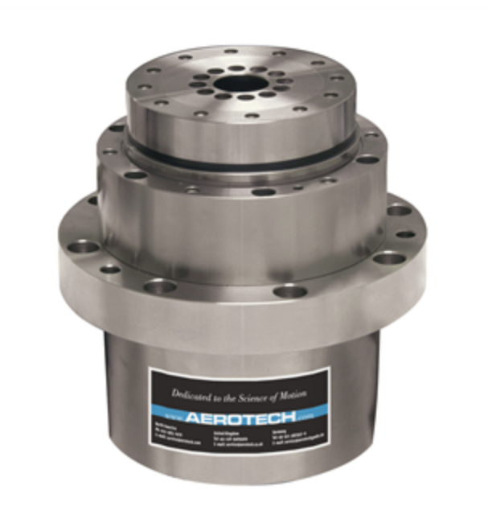
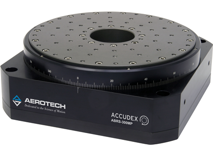
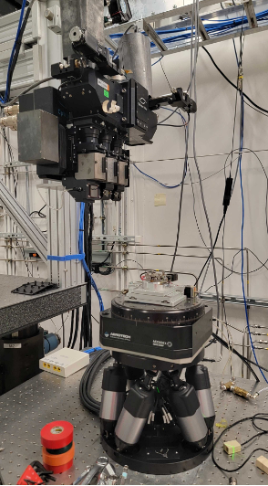
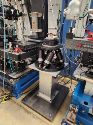
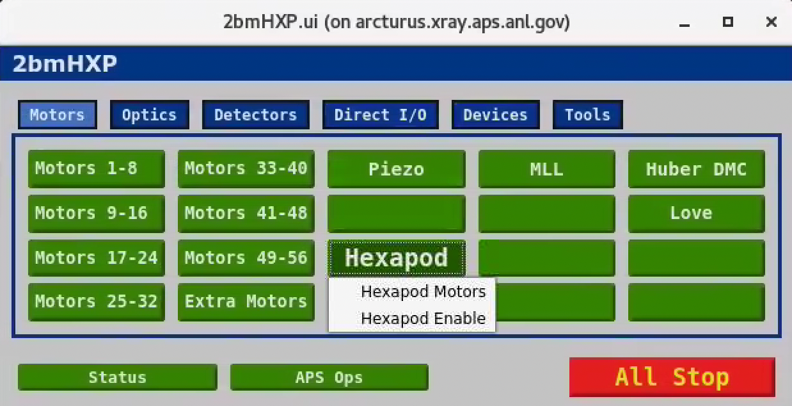
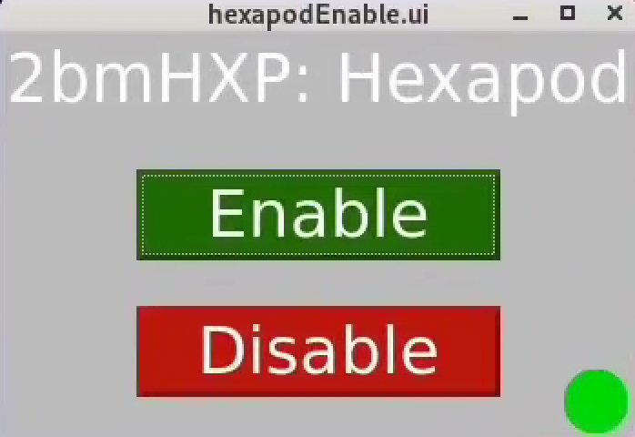
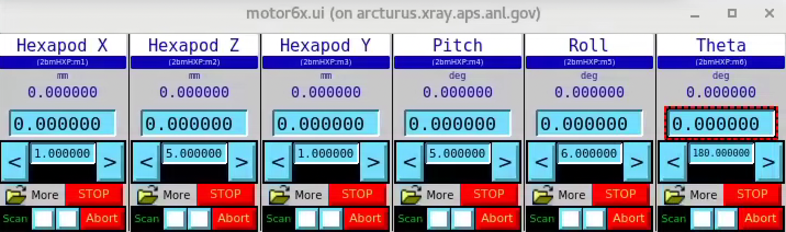

==================
Sample motor stack
==================

The sample motor stack consists of:

#. **Sample top X** (horizontal motion above the rotary stage)
#. **Sample top Z** (horizontal motion orthogonal to "sample top X" above the rotary stage)
#. **Rotary stage** (tomography rotation axis)
#. **Hexapod** (6 axes x, y, z, roll, pitch and theta motion)

Rotary stage
============

.. _box link 0002: https://anl.box.com/s/1ffp00cn1gjkyyelnufp0kef336t4jg9
.. _box link 0003: https://anl.box.com/s/2z5zr200vut71zv07ozsudxqhzvgnv5k
.. _box link 0004: https://anl.box.com/s/i2gkeq8qcu10lvjovbvk1ldl2a4ug57o
.. _order 0004: https://apps.inside.anl.gov/paris/req.jsp?reqNbr=F2-235109
.. _order 0005: https://apps.inside.anl.gov/paris/req.jsp?reqNbr=E8-198024
.. _order 0006: https://apps.inside.anl.gov/paris/req.jsp?reqNbr=E8-078092

we have different sets of rotary stages:

+---------------+-------------------------+-------------------------+--------------------+------------------------------------+----------------------+------------------------+--------------------------------------------------------+
|   **Station** |      **Description**    |  **Model**              |    **Image**       |   **Controller**                   |  **Speed (rpm)**     |    **Load axial (kg)** |  **Info**                                              | 
+---------------+-------------------------+-------------------------+--------------------+------------------------------------+----------------------+------------------------+--------------------------------------------------------+
|     2-BM-B    |        tomo             |    ABS250MP-M-AS        |     |00004|        |     ENSEMBLEHLE10-40-A-MXH (*)     |          500         |            66          |  `box link 0004`_, `box link 0003`_, `order 0005`_     |
+---------------+-------------------------+-------------------------+--------------------+------------------------------------+----------------------+------------------------+--------------------------------------------------------+
|     2-BM-B    |        fast tomo        |    ABRS-150MP-M-AS      |     |00004|        |     ENSEMBLEHLE10-40-A-MXH (*)     |          500         |            8           |  `box link 0004`_, `order 0006`_                       |
+---------------+-------------------------+-------------------------+--------------------+------------------------------------+----------------------+------------------------+--------------------------------------------------------+
|     2-BM-B    |        spindle          |    ABS2000-1000AS-RU    |     |00003|        |     ENSEMBLEHLE10-40-A-MXH (*)     |         6000         |            18          |  `box link 0004`_, `box link 0002`_, `order 0004`_     |
+---------------+-------------------------+-------------------------+--------------------+------------------------------------+----------------------+------------------------+--------------------------------------------------------+

(*) replaced with ENSEMBLEML10-40-IO-MXH

Ensemble
--------

.. _Ensemble Settings: https://anl.app.box.com/s/serp2nlyzk0ljvpqczc3btm7ikn9pvlj

The Ensemble Parameter Setup currently in use at 2-BM can found at `Ensemble Settings`_

+-------------------------------+----------------------+---------------------------+-----------------+
|  **Parameter**                |       **ABRS250MP**  |     **ABRS150MP**         |     **Units**   |
+-------------------------------+----------------------+---------------------------+-----------------+
| Fundamental Encoder Resolution|              11840   |       3600                |     lines/rev   |
+-------------------------------+----------------------+---------------------------+-----------------+
| Encoder scale factor          |                 45   |        148                |                 |
+-------------------------------+----------------------+---------------------------+-----------------+
| Encoder pulses per revolution |             532800   |     532800                |     pulses/rev  |
+-------------------------------+----------------------+---------------------------+-----------------+
| Encoder resolution            |  0.000675675675676   |     0.000675675675676     |     deg/pulse   |
+-------------------------------+----------------------+---------------------------+-----------------+

PSO
---

.. _Aerotech Manual: https://anl.box.com/s/l43qkqlhy21f4a8wetmrqbeqz9c7am72

Details on the Position Synchronized Output (PSO) are in the `Aerotech Manual`_ 

Hexapod
=======

.. _hex300_quote: https://apps.inside.anl.gov/paris/req.jsp?reqNbr=G4-114014
.. _hex300_hw_manual: https://anl.box.com/s/b0uo13zn9f7v1mrnnpvggqguedrl6qzj
.. _hex300_datasheet: https://anl.box.com/s/jn2h32rqxuwmtbygilk509x41ixgsdwf

.. _hex500_quote: https://apps.inside.anl.gov/paris/req.jsp?reqNbr=G4-130071
.. _hex500_hw_manual: https://anl.box.com/s/d36plwk13uhjla39drms2roojgvau2yg
.. _hex500_datasheet: https://anl.box.com/s/4ptepjke1438n2im4zw7as265m4vx9vz

.. _usb1: https://anl.box.com/s/2948hw205r0cb0lvytc539b9ehyxce8c
.. _usb2: https://anl.box.com/s/tlx227jpbvv3h7ix4gtihmrhd63pm52c
.. _programming: https://anl.box.com/s/n3i9dgvs2py3b9leh4iupm5lzgrs7wwv

Avaialble hexapods are:

+--------------+------------------+-------------------------+--------------------------------------+----------------------+----------------------------+------------------------+
|  **Station** |    **Model**     |   **Data Sheet**        |           Images                     |**Hardware Manual**   |  **USB stick delived**     |    **Quote**           |
+--------------+------------------+-------------------------+--------------------------------------+----------------------+----------------------------+------------------------+
|    2-BM      |   HEX300-230HL   |    `hex300_datasheet`_  |          |2-BM Hexapod|              | `hex300_hw_manual`_  |  `usb1`_, `usb2`_          | `hex300_quote`_        |
+--------------+------------------+-------------------------+--------------------------------------+----------------------+----------------------------+------------------------+
|    7-BM      |   HEX500-350HL   |    `hex300_datasheet`_  |          |7-BM Hexapod|              | `hex500_hw_manual`_  |                            | `hex500_quote`_        |
+--------------+------------------+-------------------------+--------------------------------------+----------------------+----------------------------+------------------------+

EPICS support
-------------

:: 

   [2bmb@arcturus ~]$ bash
   (base) 2bmb@arcturus ~ $ hexapod
   Usage: 2bmHXP.pl {caqtdm|console|medm|phoebus|remote|restart|run|start|status|stop|usage}

   (base) 2bmb@arcturus ~ $ hexapod caqtdm

