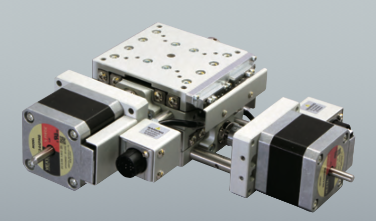
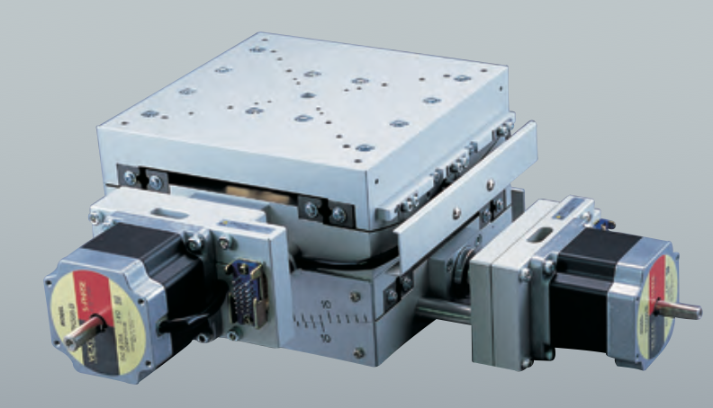

Alignment
=========

`Adjust <https://github.com/xray-imaging/adjust>`_ is a python script that automates all tomography instrument alignemt taks.

.. image:: ../img/tomo_refs.png 
   :width: 480px
   :align: center
   :alt: tomo_user

`Adjust <https://github.com/xray-imaging/adjust>`_  works in combination with a 0.5 mm `tungsten sphere <https://www.vxb.com/0-5mm-Tungsten-Carbide-One-0-0197-inch-Dia-p/0-5mmtungstenballs.htm>`_ that needs to be installed as a sample on top of the rotary stage making sure is in the field of view at least when the rotation axis is at 0 and 10 degrees.

`Adjust <https://github.com/xray-imaging/adjust>`_'s funtions include automatic finding of:

- detector pixel size
- scintillator focus location
- rotation axis location
- centering of the sample on the rotation axis
- rotation axis pitch and roll

First step is to mesaure the image pixel size by running::

    user2bmb@pg10ge $ adjust resolution

then::

    user2bmb@pg10ge $ adjust focus
    user2bmb@pg10ge $ adjust center
    user2bmb@pg10ge $ adjust roll
    user2bmb@pg10ge $ adjust pitch

Swivel Stages
~~~~~~~~~~~~~

| The sample motor stack consists of:
|
| • **Sample top X** (horizontal motion above the rotary stage)
| • **Sample top Z** (horizontal motion normal to "sample top X" above the rotary stage)
| • **Sample Y** (vertical motion)
| • **Sample Swivel Stage** (2 axes roll and pitch motion)
| • **Sample Y** (vertical motion)
| • **Sample X** (horizontal motion perpendicular to the beam)

we have different sets of swivel stages:
+===========+==============+=================+================+=================+==================+========================+==================================================+
| Station   | Descriptiom  | Model           |  Image         | Radius (mm)     |  Base size (mm)  |   Angular range (°)    |    Info                                          | 
+===========+==============+=================+================+=================+==================+========================+==================================================+
| 2-BM-A    | fast tomo    | Kohzu SA16A-RS  | |00001|        |    220/280      |        160       |         ±10/±10        |  `box link 0001`_, `order 0003`_                 |
+-----------+--------------+-----------------+----------------+-----------------+------------------+------------------------+--------------------------------------------------+
| 2-BM-B    | mona tomo    | Kohzu SA07A-R2L | |00002|        |     96/122      |         70       |         ±10/±8         |  `box link 0001`_, `order 0001`_ `order 0002`_   |
+-----------+--------------+-----------------+----------------+-----------------+------------------+------------------------+--------------------------------------------------+

.. _box link 0001: https://anl.box.com/s/n7u8rufnyh5s3w3w62gw0oao1dmy6zqq
.. _order 0001: https://apps.inside.anl.gov/paris/req.jsp?reqNbr=F9-253032
.. _order 0002: https://apps.inside.anl.gov/paris/req.jsp?reqNbr=E5-339016
.. _order 0003: https://apps.inside.anl.gov/paris/req.jsp?reqNbr=E8-345063

