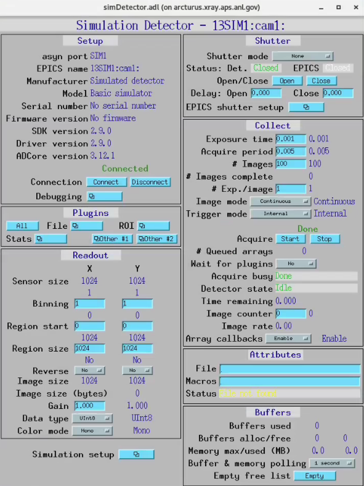
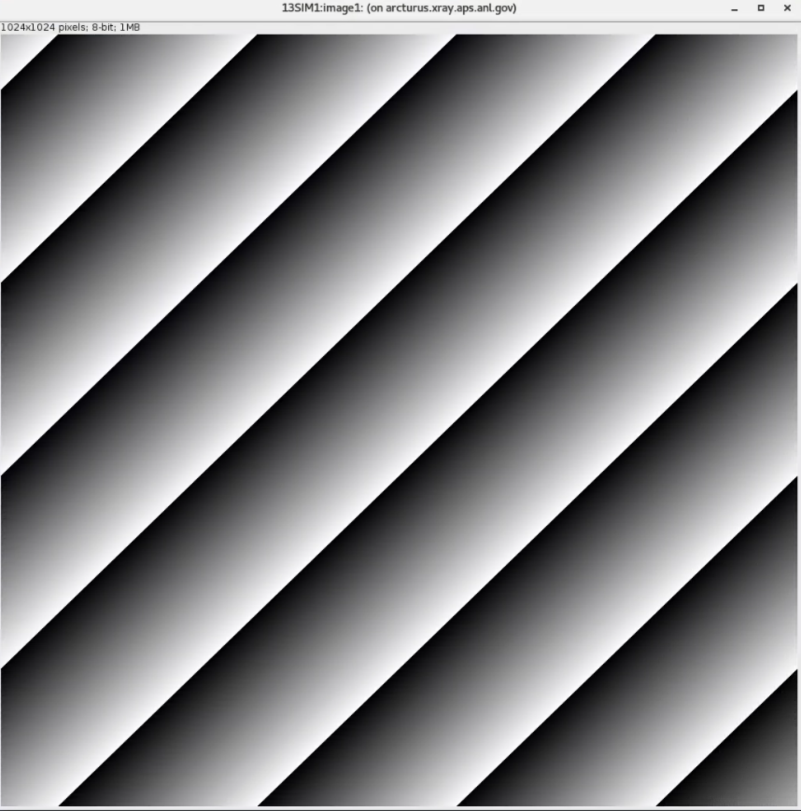
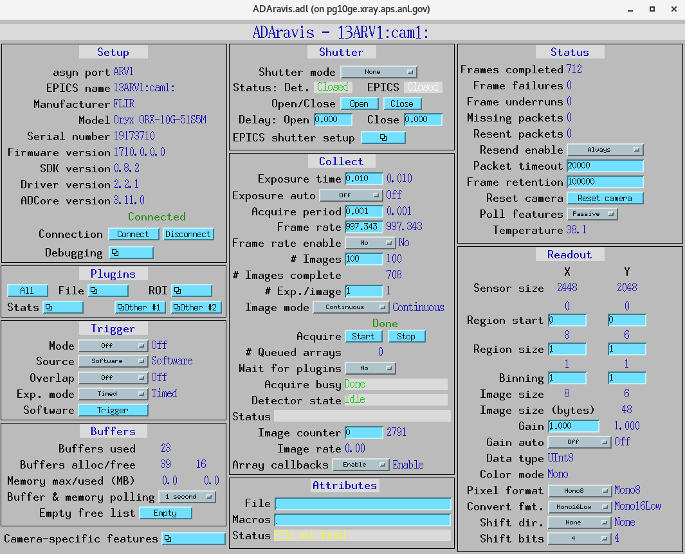
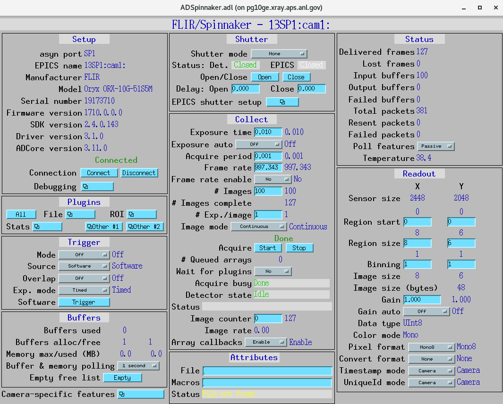

AreaDetector
============

==================
Install directions
==================

Build EPICS base
----------------

.. warning:: Make sure the disk partition hosting ~/epics is not larger than 2 TB. See `tech talk <https://epics.anl.gov/tech-talk/2017/msg00046.php>`_ and  `Diamond Data Storage <https://epics.anl.gov/meetings/2012-10/program/1023-A3_Diamond_Data_Storage.pdf>`_ document.

::

    $ mkdir ~/epics
    $ cd epics
    

- Download EPICS base latest release, i.e. 7.0.3.1., from https://github.com/epics-base/epics-base::

    $ git clone https://github.com/epics-base/epics-base.git
    $ cd epics-base
    $ make -sj

Build ADSimDetector
-------------------

Copy in ~/epics :download:`assemble_synApps.sh <assemble_synApps.sh>` making sure

::

    EPICS_BASE=/home/beams/USER2BMB/epics/epics-base

points to your epics-base location.

then::

    $ chmod +x assemble_synApps
    $ ./assemble_synApps

In the support folder verify that all modules are present in the Makefile::

    $ cd support
    $ vi Makefile

::

    ###### Support Modules ######

    MODULE_LIST =  ALLEN_BRADLEY 
    MODULE_LIST += ALIVE 
    MODULE_LIST += AREA_DETECTOR
    MODULE_LIST += ASYN 
    MODULE_LIST += AUTOSAVE 
    MODULE_LIST += BUSY
    MODULE_LIST += CALC 
    MODULE_LIST += CAMAC
    MODULE_LIST += CAPUTRECORDER
    MODULE_LIST += DAC128V 
    MODULE_LIST += DELAYGEN
    MODULE_LIST += DEVIOCSTATS
    MODULE_LIST += DXP 
    MODULE_LIST += DXPSITORO 
    MODULE_LIST += ETHERIP 
    MODULE_LIST += IPAC 
    MODULE_LIST += IP 
    MODULE_LIST += IP330 
    MODULE_LIST += IPUNIDIG 
    MODULE_LIST += LOVE 
    MODULE_LIST += LUA 
    MODULE_LIST += MCA 
    MODULE_LIST += MEASCOMP 
    MODULE_LIST += MODBUS 
    MODULE_LIST += MOTOR
    MODULE_LIST += OPTICS 
    MODULE_LIST += QUADEM 
    MODULE_LIST += SNCSEQ
    MODULE_LIST += SOFTGLUE 
    MODULE_LIST += SOFTGLUEZYNQ 
    MODULE_LIST += SSCAN 
    MODULE_LIST += STD 
    MODULE_LIST += STREAM 
    MODULE_LIST += VAC 
    MODULE_LIST += VME 
    MODULE_LIST += XXX
    MODULE_LIST += YOKOGAWA_DAS 
    MODULE_LIST += IOCSTATS

configure/RELEASE check all modules are listed::

    ASYN=$(SUPPORT)/asyn-R4-42
    AUTOSAVE=$(SUPPORT)/autosave-R5-10-2
    BUSY=$(SUPPORT)/busy-R1-7-3
    CALC=$(SUPPORT)/calc-R3-7-4
    DEVIOCSTATS=$(SUPPORT)/iocStats-3-1-16
    SSCAN=$(SUPPORT)/sscan-R2-11-5
    AREA_DETECTOR=$(SUPPORT)/areaDetector-R3-11
    ADCORE=$(AREA_DETECTOR)/ADCore
    ADSUPPORT=$(AREA_DETECTOR)/ADSupport
    SNCSEQ=$(SUPPORT)/seq-2-2-9

asyn configure/RELEASE comment out IPAC and SBCEQ::

    #IPAC=$(SUPPORT)/ipac-2-15
    #SNCSEQ=$(SUPPORT)/seq-2-2-5

asyn support/configure/CONFIG_SITE un-comment TIRPC=YES (for RH8 only)::

    TIRPC=YES

Build with::

    $ make -sj

Testing ADSimDetector
---------------------

::

    cd ~/epics/synApps/support/areaDetector-master/ADSimDetector/iocs/simDetectorIOC/iocBoot/iocSimDetector

rename envPaths as envPaths.linux

edit st.cmd.linux from::

    < envPaths.linux
    < st_base.cmd

to::

    < ./envPaths.linux
    < ./st_base.cmd

edit start_epics from::

    #medm -x -macro "P=13SIM1:, R=cam1:" simDetector.adl &
    ../../bin/linux-x86_64/simDetectorApp st.cmd.linux

to::

    #!/bin/csh
    setenv EPICS_APP_AD /home/beams/USER2BMB/epics-ad/synApps/support/areaDetector-master/ADCore
    setenv EPICS_APP_ADSIM /home/beams/USER2BMB/epics-ad/synApps/support/areaDetector-master/ADSimDetector
    #####################
    # prepare MEDM path
    #
    if (! ${?EPICS_DISPLAY_PATH}) setenv EPICS_DISPLAY_PATH '.'
    setenv EPICS_DISPLAY_PATH $EPICS_DISPLAY_PATH':'$EPICS_APP_ADSIM/simDetectorApp/op/adl
    setenv EPICS_DISPLAY_PATH $EPICS_DISPLAY_PATH':'$EPICS_APP_AD/ADApp/op/adl
    medm -x -macro "P=13SIM1:, R=cam1:" ../../../../simDetectorApp/op/adl/simDetector.adl &
    ../../bin/linux-x86_64/simDetectorApp st.cmd.linux

Start ADSimDetector
~~~~~~~~~~~~~~~~~~~

::

    ./start_epics

================
Install ADAravis
================

Detailed instructions are `here <https://areadetector.github.io/master/ADAravis/ADAravis.html>`_.

Make sure the :download:`assemble_synApps.sh <assemble_synApps.sh>` script includes:

::

    git submodule update ADAravis
    git submodule update ADGenICam

in the

::

    if [[ $AREA_DETECTOR ]]
        then 

section, the run :download:`assemble_synApps.sh <assemble_synApps.sh>` again and build ADGenICam

::

    $ cd ~/epics/synApps/support/areaDetector-R3-11/ADGenICam
    $ make -sj

then install the `aravis <https://github.com/AravisProject/aravis>`_ following the `area detector documentation <https://areadetector.github.io/master/ADGenICam/ADGenICam.html#adgenicam-installing-aravis>`_ in the ADAravis directory, i.e. aravis-8_0_1 is located in:

::

    ~/epics/synApps/support/areaDetector-R3-11/ADAravis

edit
::

    ~/epics/synApps/support/areaDetector-R3-11/ADAravis/Makefile

to add
::

    DIRS := $(DIRS) aravis-8_0_1

then build ADAravis:
::

    cd /epics/synApps/support/areaDetector-R3-11/ADAravis/
    make -sj

Testing ADAravis
----------------

::

    cd areaDetector-R3-11/ADAravis/iocs/aravisIOC/iocBoot/iocAravis

and edit this line:

::

    # Name of camera as reported by arv-tool
    epicsEnvSet("CAMERA_NAME", "FLIR-Oryx ORX-10G-51S5M-18011754")

of the st.cmd.Oryx_51S5 file to add the camera information obtained by the output of the arv-tool:

::

    # Name of camera as reported by arv-tool
    epicsEnvSet("CAMERA_NAME", "FLIR-Oryx ORX-10G-51S5M-19173710")
    epicsEnvSet("CAMERA_ID", "FLIR-Oryx ORX-10G-51S5M-19173710")
    epicsEnvSet("CAMERA_INFO", "FLIR-Oryx ORX-10G-51S5M-19173710 (169.254.0.51)")

edit the start_epics file as follows:

::

    #!/bin/csh
    setenv EPICS_APP_AD /home/beams/USER2BMB/epics-test/synApps/support/areaDetector-R3-11/ADCore
    setenv EPICS_APP_ADGENICAM /home/beams/USER2BMB/epics-test/synApps/support/areaDetector-R3-11/ADGenICam
    setenv EPICS_APP_ADARAVIS /home/beams/USER2BMB/epics-test/synApps/support/areaDetector-R3-11/ADAravis
    #####################
    # prepare MEDM path
    #
    if (! ${?EPICS_DISPLAY_PATH}) setenv EPICS_DISPLAY_PATH '.'
    setenv EPICS_DISPLAY_PATH $EPICS_DISPLAY_PATH':'$EPICS_APP_ADARAVIS/aravisApp/op/adl
    setenv EPICS_DISPLAY_PATH $EPICS_DISPLAY_PATH':'$EPICS_APP_ADGENICAM/GenICamApp/op/adl
    setenv EPICS_DISPLAY_PATH $EPICS_DISPLAY_PATH':'$EPICS_APP_AD/ADApp/op/adl

    medm -x -macro "P=13ARV1:, R=cam1:, C=FLIR-Oryx-ORX-10G-310S9M" ../../../../aravisApp/op/adl/ADAravis.adl &

    ../../bin/linux-x86_64/ADAravisApp st.cmd.Oryx_51S5

Start ADAravis
~~~~~~~~~~~~~~

::

    ./start_epics

===================
Install ADSpinnaker
===================

Detailed instructions are at the `areadetector doc page <https://areadetector.github.io/master/ADSpinnaker/ADSpinnaker.html>`_.

Make sure the :download:`assemble_synApps.sh <assemble_synApps.sh>` script includes:

::

    git submodule update ADSpinnaker
    git submodule update ADGenICam

in the

::

    if [[ $AREA_DETECTOR ]]
        then 

section, the run :download:`assemble_synApps.sh <assemble_synApps.sh>` again and build ADGenICam

::

    $ cd ~/epics/synApps/support/areaDetector-R3-11/ADGenICam
    $ make -sj

then install the `Spinnaker SDK <https://www.flir.com/products/spinnaker-sdk/>`_ must be downloaded and installed on the Windows or Linux machine prior to running the IOC because it installs the necessary drivers. in the ADSpinnaker directory, i.e. aravis-8_0_1 is located in:

::

    ~/epics/synApps/support/areaDetector-R3-11/ADSpinnaker

edit
::

    ~/epics/synApps/support/areaDetector-R3-11/ADSpinnaker/Makefile

to add
::

    DIRS := $(DIRS) aravis-8_0_1

then build ADSpinnaker:
::

    cd /epics/synApps/support/areaDetector-R3-11/ADSpinnaker/
    make -sj

Testing ADSpinnaker
----------------~~~

::

    cd areaDetector-R3-11/ADSpinnaker/iocs/aravisIOC/iocBoot/iocAravis

and edit this line:

::

    # Name of camera as reported by arv-tool
    epicsEnvSet("CAMERA_NAME", "FLIR-Oryx ORX-10G-51S5M-18011754")

of the st.cmd.Oryx_51S5 file to add the camera information obtained by the output of the arv-tool:

::

    # Name of camera as reported by arv-tool
    epicsEnvSet("CAMERA_NAME", "FLIR-Oryx ORX-10G-51S5M-19173710")
    epicsEnvSet("CAMERA_ID", "FLIR-Oryx ORX-10G-51S5M-19173710")
    epicsEnvSet("CAMERA_INFO", "FLIR-Oryx ORX-10G-51S5M-19173710 (169.254.0.51)")

edit the start_epics file as follows:

::

    #!/bin/csh
    setenv EPICS_APP_AD /home/beams/USER2BMB/epics-test/synApps/support/areaDetector-R3-11/ADCore
    setenv EPICS_APP_ADGENICAM /home/beams/USER2BMB/epics-test/synApps/support/areaDetector-R3-11/ADGenICam
    setenv EPICS_APP_ADSpinnaker /home/beams/USER2BMB/epics-test/synApps/support/areaDetector-R3-11/ADSpinnaker
    #####################
    # prepare MEDM path
    #
    if (! ${?EPICS_DISPLAY_PATH}) setenv EPICS_DISPLAY_PATH '.'
    setenv EPICS_DISPLAY_PATH $EPICS_DISPLAY_PATH':'$EPICS_APP_ADSpinnaker/aravisApp/op/adl
    setenv EPICS_DISPLAY_PATH $EPICS_DISPLAY_PATH':'$EPICS_APP_ADGENICAM/GenICamApp/op/adl
    setenv EPICS_DISPLAY_PATH $EPICS_DISPLAY_PATH':'$EPICS_APP_AD/ADApp/op/adl

    medm -x -macro "P=13ARV1:, R=cam1:, C=FLIR-Oryx-ORX-10G-310S9M" ../../../../aravisApp/op/adl/ADSpinnaker.adl &

    ../../bin/linux-x86_64/ADSpinnakerApp st.cmd.Oryx_51S5

Start ADSpinnaker
~~~~~~~~~~~~~~~~~

::

    ./start_epics

