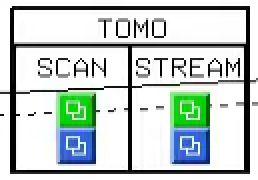

EPICS startup
=============

beamline
--------

To start the main beamline control screens::

   [user2bmb@arcturus]$ start_epics

.. image:: ../img/2bma_beamline.png 
   :width: 720px
   :align: center
   :alt: 2bma_beamline

.. image:: ../img/2bmb_beamline.png 
   :width: 720px
   :align: center
   :alt: 2bmb_beamline

tomography
----------

To start the main tomography control screens for 2-BM-A or 2-BM-B for scanning or streaming data collection select in the main beamline control screens the corresponding screen for user, admin, tomoscan, tomoscan 2-BM:

.. image:: ../img/tomo_02.png 
   :width: 128px
   :align: center
   :alt: tomo_02

.. image:: ../img/tomo_03.png 
   :width: 128px
   :align: center
   :alt: tomo_03

