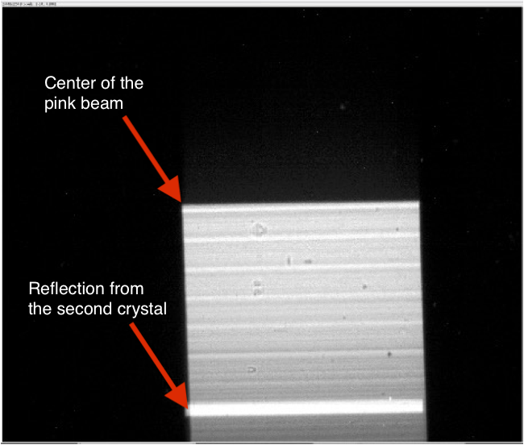
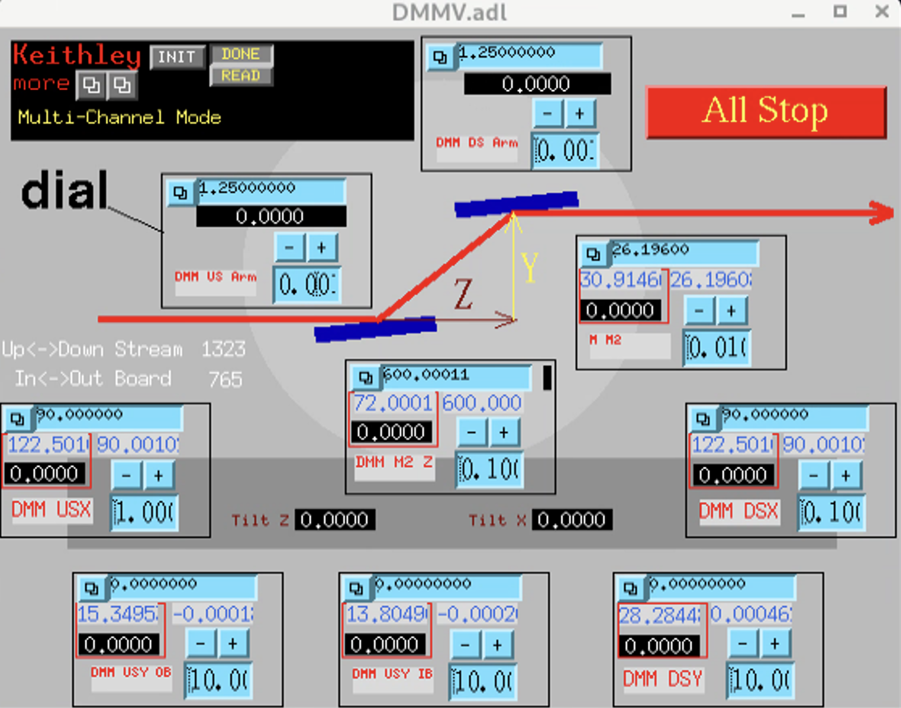
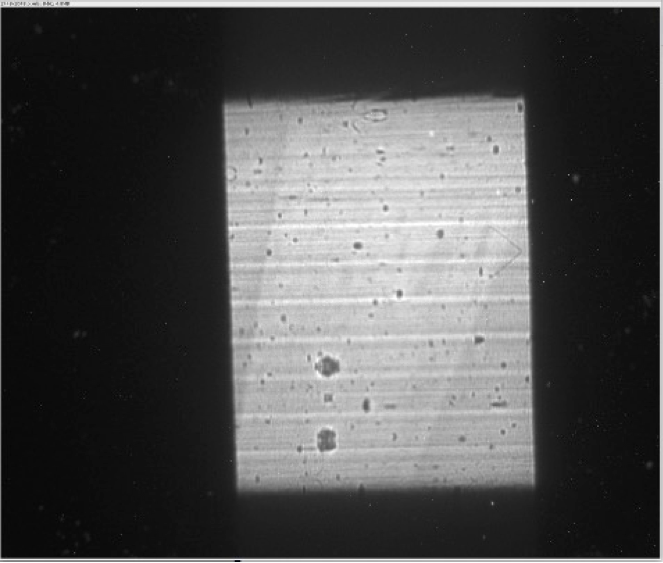

Beamline Alignment
==================

The first alignment to perform is to make sure the source white beam is centered on the beamline (50 mm x 3 mmm) (H x V) fix mask. To do this start the detector in 2-BM-A:

::

    (base) 2bmb@lyra ~ $ 2bmbOryx5MP medm
    (base) 2bmb@lyra ~ $ 2bmbOryx5MP run

.. figure:: ../img/beamline_alignment_001.png
   :width: 720px
   :align: center
   :alt: beamline_alignment_001

   2-BM-A areadetector control screen

Start ImageJ 

::

    (base) 2bmb@lyra ~ $ ImageJ

and configure the EPICS_NTNDA plug-in:

.. figure:: ../img/beamline_alignment_002.png
   :width: 720px
   :align: center
   :alt: beamline_alignment_002

   ImageJ EPICS_NTNDA plug-in

Lower M1 by setting Yaverage to -2 mm and Angle to 0 mrad. 

.. figure:: ../img/beamline_alignment_003.png
   :width: 720px
   :align: center
   :alt: beamline_alignment_003

   2-BM-A M1 mirror control screen

Lower the DMM by setting its 3 vertical stages (USY-OB, USY-IB and DSY) to -10 mm:

.. figure:: ../img/beamline_alignment_004.png
   :width: 720px
   :align: center
   :alt: beamline_alignment_004

   DMM control screen

Adjust the camera vertical position (2bma:m21) to see the white beam:

.. figure:: ../img/beamline_alignment_005.png
   :width: 720px
   :align: center
   :alt: beamline_alignment_005

   White beam at 2-BM-A with 1 mm Al filter -- Exposure 0.004 s 20 mm glass filter

Remove the 1 mm Al filter

.. figure:: ../img/beamline_alignment_006.png
   :width: 720px
   :align: center
   :alt: beamline_alignment_006

   White beam at 2-BM-A without any filter -- Exposure 0.004 s 20 mm glass filter

Plot a vertical line to show the white beam intesity

.. figure:: ../img/beamline_alignment_007.png
   :width: 720px
   :align: center
   :alt: beamline_alignment_007

   White beam vertical intesity plot

If the plot is not simmetric `ask the control room <https://ops.aps.anl.gov/Internal/Reference/Test2/instructions.html>`_ to steer the beam in 10 µrad steps.

Put the mirror in by setting Yaverage to 0 mm and Angle to 0 mrad.

Recalibrate the mirror Yaverage and angle by adjusting:

#. Yaverage until the mirror is cutting the white beam image in half
#. The mirror angle until there is no reflection

Once 1. and 2. are met reset both Yaverage and angle to zero.

Adjust the mirror angle to 2.618 mrad (0.15 deg) and move the camera up until you see the pink beam:

.. figure:: ../img/beamline_alignment_008.png
   :width: 720px
   :align: center
   :alt: beamline_alignment_008

   Pink beam after steering -- Exposure 0.004 s 20 mm glass filter

Adjust the camera vertical position until the image of the pink beam in centered and set the camera Y position to 0.

Set the DMM 3 vertical stages (USY-OB, USY-IB and DSY) to 0 mm. 
Set to 0 deg the DMM Upstream arm.

.. figure:: ../img/beamline_alignment_009.png
   :width: 720px
   :align: center
   :alt: beamline_alignment_009

   Pink beam cut in half by the first DMM crystal

Recalibrate the DMM table high and the first crystal angle by adjusting:

#. The DMM 3 vertical stages (USY-OB, USY-IB and DSY) until the first crystal is cutting the pink beam image in half
#. The first crystal angle (DMM Upstream arm) until there is no reflection

Once 1. and 2. are met reset (USY-OB, USY-IB DSY) and DMM Upstream arm angle to zero.

To recalibrate the second crystal angle:

#. Move the DMM 3 vertical stages (USY-OB, USY-IB and DSY) down by 10 mm
#. Move the DMM M2Y down until the second crystal cut in 1/2 the pink beam 
#. Adjust the second crystal angle until there is no reflection

   Pink beam cut in half by the second DMM crystal

Once 1. 2. and 3. are met reset DMM M2Y to 10 mm and the second crystal angle (DMM Down stream arm) to 0.

To find the DMM monocromatic beam, move the DMM in the beam (set USY-OB, USY-IB and DSY to 0) and set the DMM Upstream arm to 1.25 deg. The distance between the center of the first and second crystal is approximately 600 mm.

:math:`\tan(2 * 1.25) \times 600 = 26.196 mm`

#. Move DMM M2Y to 26.196 mm
#. Move the detector Y (2bma:m21) to 26.196 mm

   DMM in position

Adjust the detector Y (2bma:m21) until you see the DMM monochromatic beam:

   DMM monochromatic beam

Maximize intensity and size by moving DMM downstream ARM and DMM M2Y only.

.. figure:: ../img/beamline_alignment_013.png
   :width: 720px
   :align: center
   :alt: beamline_alignment_013

   Optimized DMM monochromatic beam 

.. figure:: ../img/beamline_alignment_014.png
   :width: 720px
   :align: center
   :alt: beamline_alignment_014

   DMM position after monochromatic beam optimization 

Reset the second crystal angle (DMM Down stream arm) to 1.25.

.. figure:: ../img/beamline_alignment_015.png
   :width: 720px
   :align: center
   :alt: beamline_alignment_015

   DMM position after monochromatic beam optimization and second crystal position reset

Since the optimal DMM M2Y is at 26.046 mm instead of the calculated 26.196 mm it means the correct distance between the center of the first and second crystal is 596.56 mm.

