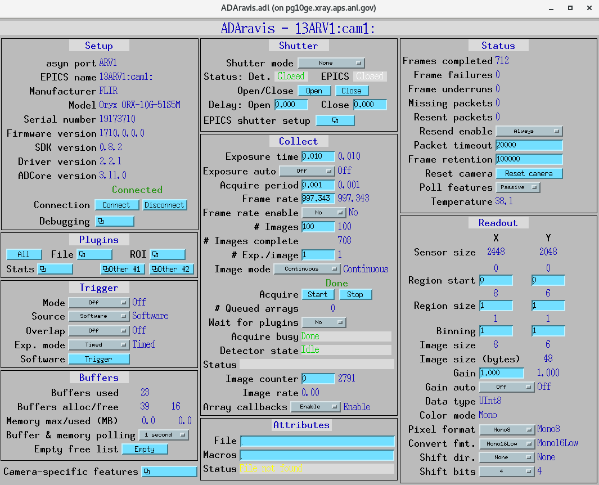

============
AreaDetector
============

Install directions
==================

Build EPICS base
----------------

.. warning::

   Ensure that the disk partition hosting ``~/epics`` is **not** larger than
   2 TB. See the `tech talk
   <https://epics.anl.gov/tech-talk/2017/msg00046.php>`_ and
   `Diamond Data Storage
   <https://epics.anl.gov/meetings/2012-10/program/1023-A3_Diamond_Data_Storage.pdf>`_
   documentation.

Create the base directory::

  $ mkdir ~/epics-ad
  $ cd epics-ad

Download and build EPICS base (latest release)::

  $ git clone https://github.com/epics-base/epics-base.git
  $ cd epics-base
  $ git submodule init
  $ git submodule update
  $ make distclean   # run this if there was an OS update
  $ make -sj

.. warning::

   If you see an error such as
   ``configure/os/CONFIG.rhel9-x86_64.Common: No such file or directory``,
   set the host architecture in your csh terminal and rebuild::

     $ setenv EPICS_HOST_ARCH linux-x86_64

Build ADSimDetector
-------------------

Download ``assemble_synApps.sh`` to ``~/epics-ad`` from:

- `assemble_synApps
  <https://github.com/EPICS-synApps/assemble_synApps/blob/18fff37055bb78bc40a87d3818777adda83c69f9/assemble_synApps>`_

Edit the ``assemble_synApps.sh`` script and include only the following
modules::

  $modules{'ASYN'} = 'R4-44-2';
  $modules{'AUTOSAVE'} = 'R5-11';
  $modules{'AREA_DETECTOR'} = 'R3-12-1';
  $modules{'AREA_DETECTOR_SUBMODULES'} = 'ADSimDetector'; # Space-separated list of extra submodules to check out
  $modules{'BUSY'} = 'R1-7-4';
  $modules{'CALC'} = 'R3-7-5';
  $modules{'DEVIOCSTATS'} = '3.1.16';
  $modules{'SSCAN'} = 'R2-11-6';
  $modules{'SNCSEQ'} = 'R2-2-9';
  $modules{'XXX'} = 'R6-3';

Comment out all other modules (e.g. ``ALLENBRADLEY``, ``ALIVE``, etc.).

Run the script::

  $ cd ~/epics-ad
  $ ./assemble_synApps.sh --dir=synApps --base=/home/beams/FAST/epics-ad/epics-base

.. warning::

   Replace ``/home/beams/FAST/`` with the path of your home directory.

The script creates a ``synApps/support`` directory::

  $ cd synApps/support/

Build synApps::

  $ make release
  $ make -sj

Testing ADSimDetector
---------------------

Move to the IOC boot directory::

  $ cd ~/epics-ad/synApps/support/areaDetector-R3-12-1/ADSimDetector/iocs/simDetectorIOC/iocBoot/iocSimDetector

Rename ``envPaths`` to ``envPaths.linux``::

  $ mv envPaths envPaths.linux

Edit ``st.cmd.linux`` from::

  < envPaths.linux
  < st_base.cmd

to::

  < ./envPaths.linux
  < ./st_base.cmd

Edit ``start_epics`` from::

  #medm -x -macro "P=13SIM1:, R=cam1:" simDetector.adl &
  ../../bin/linux-x86_64/simDetectorApp st.cmd.linux

to::

  #!/bin/csh
  setenv EPICS_APP_AD /home/beams/FAST/epics-ad/synApps/support/areaDetector-R3-12-1/ADCore
  setenv EPICS_APP_ADSIM /home/beams/FAST/epics-ad/synApps/support/areaDetector-R3-12-1/ADSimDetector
  #####################
  # prepare MEDM path
  #
  if (! ${?EPICS_DISPLAY_PATH}) setenv EPICS_DISPLAY_PATH '.'
  setenv EPICS_DISPLAY_PATH $EPICS_DISPLAY_PATH':'$EPICS_APP_ADSIM/simDetectorApp/op/adl
  setenv EPICS_DISPLAY_PATH $EPICS_DISPLAY_PATH':'$EPICS_APP_AD/ADApp/op/adl
  medm -x -macro "P=13SIM1:, R=cam1:" ../../../../simDetectorApp/op/adl/simDetector.adl &
  ../../bin/linux-x86_64/simDetectorApp st.cmd.linux

.. warning::

   Replace ``/home/beams/FAST/`` with the path of your home directory.

Start ADSimDetector
~~~~~~~~~~~~~~~~~~~

Run::

  $ ./start_epics

.. image:: ../img/ADSim_00.png 
   :width: 512px
   :align: center
   :alt: ADSim_00

.. image:: ../img/ADSim_01.png 
   :width: 512px
   :align: center
   :alt: ADSim_01

Install ADAravis
================

Detailed instructions are available at:

- `ADAravis documentation
  <https://areadetector.github.io/areaDetector/ADAravis/ADAravis.html>`_

Ensure that ``assemble_synApps.sh`` includes::

  $modules{'AREA_DETECTOR_SUBMODULES'} = 'ADAravis ADGenICam'; # Space-separated list of extra submodules

Run ``assemble_synApps.sh``::

  $ cd ~/epics-ad
  $ ./assemble_synApps.sh --dir=synApps --base=/home/beams/FAST/epics-ad/epics-base

.. warning::

   Replace ``/home/beams/FAST/`` with the path of your home directory.

.. warning::

   If you see a ``make: No rule to make target ...  Stop`` error, set
   the host architecture in your csh terminal and rebuild::

     $ setenv EPICS_HOST_ARCH linux-x86_64

Build ADGenICam::

  $ cd ~/epics-ad/synApps/support/areaDetector-R3-12-1/ADGenICam
  $ make -sj

*(TODO: add instructions on ``envPaths`` and related files.)*

Testing ADAravis
----------------

Move to the IOC boot directory::

  $ cd areaDetector-R3-11/ADAravis/iocs/aravisIOC/iocBoot/iocAravis

Edit the camera name in ``st.cmd.Oryx_51S5``. Replace the line::

  # Name of camera as reported by arv-tool
  epicsEnvSet("CAMERA_NAME", "FLIR-Oryx ORX-10G-51S5M-18011754")

with the values obtained from ``arv-tool``::

  # Name of camera as reported by arv-tool
  epicsEnvSet("CAMERA_NAME", "FLIR-Oryx ORX-10G-51S5M-19173710")
  epicsEnvSet("CAMERA_ID", "FLIR-Oryx ORX-10G-51S5M-19173710")
  epicsEnvSet("CAMERA_INFO", "FLIR-Oryx ORX-10G-51S5M-19173710 (169.254.0.51)")

Edit ``start_epics`` as follows::

  #!/bin/csh
  setenv EPICS_APP_AD /home/beams/FAST/epics-ad/synApps//support/areaDetector-R3-12-1/ADCore
  setenv EPICS_APP_ADGENICAM /home/beams/FAST/epics-ad/synApps//support/areaDetector-R3-12-1/ADGenICam
  setenv EPICS_APP_ADARAVIS /home/beams/FAST/epics-ad/synApps//support/areaDetector-R3-12-1/ADAravis
  #####################
  # prepare MEDM path
  #
  if (! ${?EPICS_DISPLAY_PATH}) setenv EPICS_DISPLAY_PATH '.'
  setenv EPICS_DISPLAY_PATH $EPICS_DISPLAY_PATH':'$EPICS_APP_ADARAVIS/aravisApp/op/adl
  setenv EPICS_DISPLAY_PATH $EPICS_DISPLAY_PATH':'$EPICS_APP_ADGENICAM/GenICamApp/op/adl
  setenv EPICS_DISPLAY_PATH $EPICS_DISPLAY_PATH':'$EPICS_APP_AD/ADApp/op/adl

  medm -x -macro "P=13ARV1:, R=cam1:, C=FLIR-Oryx-ORX-10G-310S9M" ../../../../aravisApp/op/adl/ADAravis.adl &

  ../../bin/linux-x86_64/ADAravisApp st.cmd.Oryx_51S5

.. warning::

   Replace ``/home/beams/FAST/`` with the path of your home directory.

Start ADAravis
~~~~~~~~~~~~~~

Run::

  $ ./start_epics

Install ADSpinnaker
===================

Detailed instructions are available at:

- `ADSpinnaker documentation
  <https://areadetector.github.io/areaDetector/ADSpinnaker/ADSpinnaker.html>`_

Ensure that ``assemble_synApps.sh`` includes::

  $modules{'AREA_DETECTOR_SUBMODULES'} = 'ADSpinnaker ADGenICam'; # Space-separated list of extra submodules

Run ``assemble_synApps.sh``::

  $ cd ~/epics-ad
  $ ./assemble_synApps.sh --dir=synApps --base=/home/beams/FAST/epics-ad/epics-base

.. warning::

   Replace ``/home/beams/FAST/`` with the path of your home directory.

.. warning::

   If you see a ``make: No rule to make target ...  Stop`` error, set
   the host architecture in your csh terminal and rebuild::

     $ setenv EPICS_HOST_ARCH linux-x86_64

Build ADGenICam::

  $ cd ~/epics-ad/synApps/support/areaDetector-R3-12-1/ADGenICam
  $ make -sj

Install the `Spinnaker SDK
<https://www.flir.com/products/spinnaker-sdk/>`_ on the Windows or Linux
machine that will run the IOC. The SDK installs the required camera
drivers.

*(TODO: add instructions on ``envPaths`` and related files.)*

Testing ADSpinnaker
-------------------

Move to the IOC boot directory::

  $ cd areaDetector-R3-11/ADSpinnaker/iocs/spinnakerIOC/iocBoot/iocSpinnaker

Edit the camera configuration in the appropriate startup script. For
example, set the camera ID and info based on the camera used::

  # Use this line for a specific camera by serial number, in this case a BlackFlyS GigE
  epicsEnvSet("CAMERA_ID", "19173710")  # 2-BM-B 2bmbSP1:
  epicsEnvSet("CAMERA_INFO", "FLIR-Oryx ORX-10G-51S5M-19173710 (169.254.0.51)")

Edit ``start_epics`` as follows::

  #!/bin/csh
  setenv EPICS_APP_AD /home/beams/FAST/epics-ad/synApps//support/areaDetector-R3-12-1/ADCore
  setenv EPICS_APP_ADGENICAM /home/beams/FAST/epics-ad/synApps//support/areaDetector-R3-12-1/ADGenICam
  setenv EPICS_APP_ADSpinnaker /home/beams/FAST/epics-ad/synApps//support/areaDetector-R3-12-1/ADSpinnaker
  #####################
  # prepare MEDM path
  #
  if (! ${?EPICS_DISPLAY_PATH}) setenv EPICS_DISPLAY_PATH '.'
  setenv EPICS_DISPLAY_PATH $EPICS_DISPLAY_PATH':'$EPICS_APP_ADSpinnaker/spinnakerApp/op/adl
  setenv EPICS_DISPLAY_PATH $EPICS_DISPLAY_PATH':'$EPICS_APP_ADGENICAM/GenICamApp/op/adl
  setenv EPICS_DISPLAY_PATH $EPICS_DISPLAY_PATH':'$EPICS_APP_AD/ADApp/op/adl

  medm -x -macro "P=13SP1:, R=cam1:, C=FLIR-Oryx-ORX-10G-310S9M" ../../../../spinnakerApp/op/adl/ADSpinnaker.adl &

  ../../bin/linux-x86_64/spinnakerApp st.cmd.oryx_51S5

Start ADSpinnaker
~~~~~~~~~~~~~~~~~

Run::

  $ ./start_epics

.. image:: ../img/ADSpinnaker_00.png 
   :width: 512px
   :align: center
   :alt: ADSpinnaker_00

arv-tool
========

The ``arv-tool`` utility is part of the Aravis library and is used to
manage and query GenICam-compliant cameras. It can be used to extract
the camera XML description file, which is needed to automatically create
the EPICS database and MEDM screens.

Clone and build Aravis::

  $ git clone https://github.com/AravisProject/aravis.git
  $ cd aravis

Install Meson and Ninja::

  $ pip install --user meson ninja

Add ``~/.local/bin`` to your ``PATH`` (for example in ``.bashrc``)::

  export PATH=$HOME/.local/bin:$PATH

Build and install Aravis::

  $ meson setup builddir --prefix=$HOME/aravis-install
  $ cd builddir
  $ meson compile
  $ meson install

Add the local installation to the environment::

  export PATH=$HOME/aravis-install/bin:$PATH
  export LD_LIBRARY_PATH=$HOME/aravis-install/lib:$LD_LIBRARY_PATH
  export PKG_CONFIG_PATH=$HOME/aravis-install/lib/pkgconfig:$PKG_CONFIG_PATH
  export GI_TYPELIB_PATH=$HOME/aravis-install/lib/girepository-1.0:$GI_TYPELIB_PATH

List all cameras connected to the computer::

  $ arv-tool-0.10 --list

Use ``arv-tool`` to download the camera XML file. This XML file is
required by ADGenICam to generate the EPICS database and MEDM screens.
See the ADGenICam documentation for details:

- `ADGenICam: Downloading the XML file
  <https://areadetector.github.io/areaDetector/ADGenICam/ADGenICam.html#downloading-the-xml-file>`_

Configure NIC on 10 Gbit FLIR cameras
=====================================

1. Requirements:

   - 64 GB memory
   - Cat 6A cable
   - Intel X550T2 Ethernet Converged Network Adapter X550-T2  
     (available from Sorcium as Part#: 3E9073)

2. Enable jumbo packets.
3. Disable DHCP and set a fixed IP address on the Ethernet port
   connected to the FLIR camera.
4. Increase the receive buffer size (MTU ≈ 9000).
5. Increase the relevant network parameters in the kernel.
6. Set the NIC TX queue length.

Steps 2–4 are documented in:

- FLIR: https://www.flir.com/support-center/iis/machine-vision/knowledge-base/lost-ethernet-data-packets-on-linux-systems/

Additional details for step 4 are in:

- FLIR: https://www.flir.com/support-center/iis/machine-vision/knowledge-base/lost-ethernet-data-packets-on-linux-systems/
- ADGenICam: https://areadetector.github.io/master/ADGenICam/ADGenICam.html#linux-usb-and-gige-system-settings

For step 5, edit ``/etc/sysctl.conf``::

  net.core.rmem_default=26214400
  net.core.rmem_max=268435456

For step 6, edit ``/etc/rc.local`` and add::

  # NIC camera settings and 10 Gb NIC settings
  # In this example the camera is attached to ens1f1
  /usr/sbin/ifconfig ens1f1 txqueuelen 3000  # hardware specific; some NICs support up to 4096, others ~512