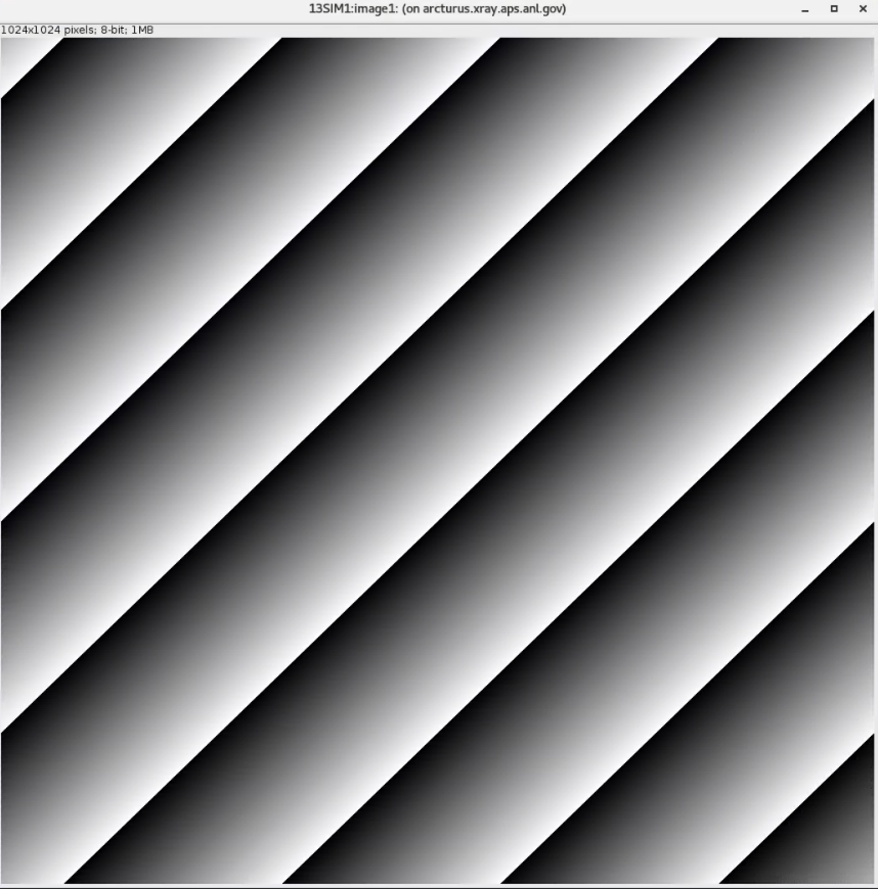

============
AreaDetector
============

Install directions
==================

Build EPICS base
----------------

.. warning:: Make sure the disk partition hosting ~/epics is not larger than 2 TB. See `tech talk <https://epics.anl.gov/tech-talk/2017/msg00046.php>`_ and  `Diamond Data Storage <https://epics.anl.gov/meetings/2012-10/program/1023-A3_Diamond_Data_Storage.pdf>`_ document.

::

    $ mkdir ~/epics-ad
    $ cd epics-ad
    

- Download EPICS base latest release from https://github.com/epics-base/epics-base::

    $ git clone https://github.com/epics-base/epics-base.git
    $ cd epics-base
    $ git submodule init
    $ git submodule update
    $ make distclean (do this in case there was an OS update)
    $ make -sj

.. warning:: if you get a *configure/os/CONFIG.rhel9-x86_64.Common: No such file or directory* error issue this in your csh termimal: $ **setenv EPICS_HOST_ARCH linux-x86_64**

Build ADSimDetector
-------------------

- Download in ~/epics-ad `assemble_synApps <https://github.com/EPICS-synApps/assemble_synApps/blob/18fff37055bb78bc40a87d3818777adda83c69f9/assemble_synApps>`_.sh
- Edit the assemble_synApps.sh script to include only::
  
    $modules{'ASYN'} = 'R4-44-2';
    $modules{'AUTOSAVE'} = 'R5-11';
    $modules{'AREA_DETECTOR'} = 'R3-12-1';
    $modules{'AREA_DETECTOR_SUBMODULES'} = 'ADSimDetector'; # Space-separated #. list of extra submodules to check out
    $modules{'BUSY'} = 'R1-7-4';
    $modules{'CALC'} = 'R3-7-5';
    $modules{'DEVIOCSTATS'} = '3.1.16';
    $modules{'SSCAN'} = 'R2-11-6';
    $modules{'SNCSEQ'} = 'R2-2-9';
    $modules{'XXX'} = 'R6-3';

You can comment out all of the other modules (ALLENBRADLEY, ALIVE, etc.)

- Run::

    $ cd ~/epics-ad
    $ ./assemble_synApps.sh --dir=synApps --base=/home/beams/FAST/epics-ad/epics-base

.. warning:: replace  */home/beams/FAST/* with the path of your home directory

- This will create a synApps/support directory::

    $ cd synApps/support/

Build with::

    $ make release
    $ make -sj

Testing ADSimDetector
---------------------

::

    cd ~/epics-ad/synApps/support/areaDetector-R3-12-1/ADSimDetector/iocs/simDetectorIOC/iocBoot/iocSimDetector

rename envPaths as envPaths.linux::

    mv envPaths envPaths.linux

edit st.cmd.linux from::

    < envPaths.linux
    < st_base.cmd

to::

    < ./envPaths.linux
    < ./st_base.cmd

edit start_epics from::

    #medm -x -macro "P=13SIM1:, R=cam1:" simDetector.adl &
    ../../bin/linux-x86_64/simDetectorApp st.cmd.linux

to::

    #!/bin/csh
    setenv EPICS_APP_AD /home/beams/FAST/epics-ad/synApps/support/areaDetector-R3-12-1/ADCore
    setenv EPICS_APP_ADSIM /home/beams/FAST/epics-ad/synApps/support/areaDetector-R3-12-1/ADSimDetector
    #####################
    # prepare MEDM path
    #
    if (! ${?EPICS_DISPLAY_PATH}) setenv EPICS_DISPLAY_PATH '.'
    setenv EPICS_DISPLAY_PATH $EPICS_DISPLAY_PATH':'$EPICS_APP_ADSIM/simDetectorApp/op/adl
    setenv EPICS_DISPLAY_PATH $EPICS_DISPLAY_PATH':'$EPICS_APP_AD/ADApp/op/adl
    medm -x -macro "P=13SIM1:, R=cam1:" ../../../../simDetectorApp/op/adl/simDetector.adl &
    ../../bin/linux-x86_64/simDetectorApp st.cmd.linux

.. warning:: replace  */home/beams/FAST/* with the path of your home directory

Start ADSimDetector
~~~~~~~~~~~~~~~~~~~

::

    ./start_epics

.. image:: ../img/ADSim_00.png 
   :width: 512px
   :align: center
   :alt: ADSim_00

================
Install ADAravis
================

Detailed instructions are `here <https://areadetector.github.io/areaDetector/ADAravis/ADAravis.html>`_.

Make sure the `assemble_synApps <https://github.com/EPICS-synApps/assemble_synApps/blob/18fff37055bb78bc40a87d3818777adda83c69f9/assemble_synApps>`_.sh script includes:

::

    $modules{'AREA_DETECTOR_SUBMODULES'} = 'ADAravis ADGenICam'; # Space-separated list of extra 

then run `assemble_synApps <https://github.com/EPICS-synApps/assemble_synApps/blob/18fff37055bb78bc40a87d3818777adda83c69f9/assemble_synApps>`_.sh 

::

    $ cd ~/epics-ad
    $ ./assemble_synApps.sh --dir=synApps --base=/home/beams/FAST/epics-ad/epics-base

.. warning:: replace  */home/beams/FAST/* with the path of your home directory

.. warning:: if you get a  *make: No rule to make target ...  Stop* error issue this in your csh termimal: $ **setenv EPICS_HOST_ARCH linux-x86_64**

and build ADGenICam

::

    $ cd ~/epics-ad/synApps/support/areaDetector-R3-12-1/ADGenICam
    $ make -sj

todo: add instruction on envPaths etc.

Testing ADAravis
----------------

::

    cd areaDetector-R3-11/ADAravis/iocs/aravisIOC/iocBoot/iocAravis

and edit this line:

::

    # Name of camera as reported by arv-tool
    epicsEnvSet("CAMERA_NAME", "FLIR-Oryx ORX-10G-51S5M-18011754")

of the st.cmd.Oryx_51S5 file to add the camera information obtained by the output of the arv-tool:

::

    # Name of camera as reported by arv-tool
    epicsEnvSet("CAMERA_NAME", "FLIR-Oryx ORX-10G-51S5M-19173710")
    epicsEnvSet("CAMERA_ID", "FLIR-Oryx ORX-10G-51S5M-19173710")
    epicsEnvSet("CAMERA_INFO", "FLIR-Oryx ORX-10G-51S5M-19173710 (169.254.0.51)")

edit the start_epics file as follows:

::

    #!/bin/csh
    setenv EPICS_APP_AD /home/beams/FAST/epics-ad/synApps//support/areaDetector-R3-12-1/ADCore
    setenv EPICS_APP_ADGENICAM /home/beams/FAST/epics-ad/synApps//support/areaDetector-R3-12-1/ADGenICam
    setenv EPICS_APP_ADARAVIS /home/beams/FAST/epics-ad/synApps//support/areaDetector-R3-12-1/ADAravis
    #####################
    # prepare MEDM path
    #
    if (! ${?EPICS_DISPLAY_PATH}) setenv EPICS_DISPLAY_PATH '.'
    setenv EPICS_DISPLAY_PATH $EPICS_DISPLAY_PATH':'$EPICS_APP_ADARAVIS/aravisApp/op/adl
    setenv EPICS_DISPLAY_PATH $EPICS_DISPLAY_PATH':'$EPICS_APP_ADGENICAM/GenICamApp/op/adl
    setenv EPICS_DISPLAY_PATH $EPICS_DISPLAY_PATH':'$EPICS_APP_AD/ADApp/op/adl

    medm -x -macro "P=13ARV1:, R=cam1:, C=FLIR-Oryx-ORX-10G-310S9M" ../../../../aravisApp/op/adl/ADAravis.adl &

    ../../bin/linux-x86_64/ADAravisApp st.cmd.Oryx_51S5

.. warning:: replace  */home/beams/FAST/* with the path of your home directory

Start ADAravis
~~~~~~~~~~~~~~

::

    ./start_epics

.. image:: ../img/ADAravis_00.png 
   :width: 512px
   :align: center
   :alt: ADSim_00

===================
Install ADSpinnaker
===================

Detailed instructions are at the `areadetector doc page <https://areadetector.github.io/areaDetector/ADSpinnaker/ADSpinnaker.html>`_.

Make sure the `assemble_synApps <https://github.com/EPICS-synApps/assemble_synApps/blob/18fff37055bb78bc40a87d3818777adda83c69f9/assemble_synApps>`_.sh script includes:

::

    $modules{'AREA_DETECTOR_SUBMODULES'} = 'ADSpinnaker ADGenICam'; # Space-separated list of 

then run `assemble_synApps <https://github.com/EPICS-synApps/assemble_synApps/blob/18fff37055bb78bc40a87d3818777adda83c69f9/assemble_synApps>`_.sh

::

    $ cd ~/epics-ad
    $ ./assemble_synApps.sh --dir=synApps --base=/home/beams/FAST/epics-ad/epics-base

.. warning:: replace  */home/beams/FAST/* with the path of your home directory

.. warning:: if you get a  *make: No rule to make target ...  Stop* error issue this in your csh termimal: $ **setenv EPICS_HOST_ARCH linux-x86_64**

and build ADGenICam

::

    $ cd ~/epics-ad/synApps/support/areaDetector-R3-12-1/ADGenICam
    $ make -sj

then install the `Spinnaker SDK <https://www.flir.com/products/spinnaker-sdk/>`_ must be downloaded and installed on the Windows or Linux machine prior to running the IOC because it installs the necessary drivers. 

todo: add instruction on envPaths etc.

Testing ADSpinnaker
-------------------

::

    cd areaDetector-R3-11/ADSpinnaker/iocs/spinnakerIOC/iocBoot/iocSpinnaker

and edit this line:

::

    # Name of camera as reported by arv-tool
    epicsEnvSet("CAMERA_NAME", "FLIR-Oryx ORX-10G-51S5M-18011754")

of the st.cmd.Oryx_51S5 file to add the camera information obtained by the output of the arv-tool:

::

    # Use this line for a specific camera by serial number, in this case a BlackFlyS GigE
    epicsEnvSet("CAMERA_ID", "19173710")  # 2-BM-B 2bmbSP1:
    epicsEnvSet("CAMERA_INFO", "FLIR-Oryx ORX-10G-51S5M-19173710 (169.254.0.51)")

edit the start_epics file as follows:

::

    #!/bin/csh
    setenv EPICS_APP_AD /home/beams/FAST/epics-ad/synApps//support/areaDetector-R3-12-1/ADCore
    setenv EPICS_APP_ADGENICAM /home/beams/FAST/epics-ad/synApps//support/areaDetector-R3-12-1/ADGenICam
    setenv EPICS_APP_ADSpinnaker /home/beams/FAST/epics-ad/synApps//support/areaDetector-R3-12-1/ADSpinnaker
    #####################
    # prepare MEDM path
    #
    if (! ${?EPICS_DISPLAY_PATH}) setenv EPICS_DISPLAY_PATH '.'
    setenv EPICS_DISPLAY_PATH $EPICS_DISPLAY_PATH':'$EPICS_APP_ADSpinnaker/spinnakerApp/op/adl
    setenv EPICS_DISPLAY_PATH $EPICS_DISPLAY_PATH':'$EPICS_APP_ADGENICAM/GenICamApp/op/adl
    setenv EPICS_DISPLAY_PATH $EPICS_DISPLAY_PATH':'$EPICS_APP_AD/ADApp/op/adl

    medm -x -macro "P=13SP1:, R=cam1:, C=FLIR-Oryx-ORX-10G-310S9M" ../../../../spinnakerApp/op/adl/ADSpinnaker.adl &

    ../../bin/linux-x86_64/spinnakerApp st.cmd.oryx_51S5

Start ADSpinnaker
~~~~~~~~~~~~~~~~~

::

    ./start_epics

.. image:: ../img/ADSpinnaker_00.png 
   :width: 512px
   :align: center
   :alt: ADSim_00

========
arv-tool
========

The arv-tool is part of the Aravis library, typically used for managing and controlling GenICam-compliant cameras. You can extract the camera's XML description file, which contains details about the camera's features and configuration, using the following steps:

::

    git clone https://github.com/AravisProject/aravis.git
    cd aravis

to configure and build it install meson or ninja with::

    pip install --user meson ninja

Adding  ~/.local/bin to your PATH to access them by adding in your .bashrc::

    export PATH=$HOME/.local/bin:$PATH

then build aravis with::

    meson setup builddir --prefix=$HOME/aravis-install
    cd builddir
    meson compile
    meson install

Add the local installation directory to your environment variables::

    export PATH=$HOME/aravis-install/bin:$PATH
    export LD_LIBRARY_PATH=$HOME/aravis-install/lib:$LD_LIBRARY_PATH
    export PKG_CONFIG_PATH=$HOME/aravis-install/lib/pkgconfig:$PKG_CONFIG_PATH
    export GI_TYPELIB_PATH=$HOME/aravis-install/lib/girepository-1.0:$GI_TYPELIB_PATH

then find information about any camera connected to the comuter with::

    arv-tool-0.10 --list

The arv-tool is used to download from the camera the XML file tha will be used to automatically create the camera EPICS data base the MEDM scrrens. Please look at the areadetector documentation `here 2 <https://areadetector.github.io/areaDetector/ADGenICam/ADGenICam.html#downloading-the-xml-file>`_ for more details.

====================================
Configure NIC on 10gbit FLIR cameras
====================================

1. Prerequisites:

    64GB memory
    Cat 6A cable
    Intel X550T2 ETHERNET CONVERGED Network Adapter X550-T2

2. Enable jumbo packet
3. Disable DHCP and set a fixed IP address on the Ethernet port connecting to the FLIR
4. Increase the receive buffer size (MTU ~ 9000)
5. Increase the Network parameters in the kernel
6. Set the NIC tx queue length

1. is available from Sorcium as Part#: 3E9073

2. 3. and 4. are documented at:

     FLIR doc: https://www.flir.com/support-center/iis/machine-vision/knowledge-base/lost-ethernet-data-packets-on-linux-systems/

4. is documented both at flir doc and in the areadetector doc:

    FLIR doc: https://www.flir.com/support-center/iis/machine-vision/knowledge-base/lost-ethernet-data-packets-on-linux-systems/

    areadetector doc: https://areadetector.github.io/master/ADGenICam/ADGenICam.html#linux-usb-and-gige-system-settings

5. edit /etc/sysctl.conf and add:

    net.core.rmem_default=26214400
    net.core.rmem_max=268435456 

6. edit /etc/rc.local and add:

    #NIC camera settings and  10GB nic settings  In this example the camera is attached to  ens1f1    
    /usr/sbin/ifconfig ens1f1 txqueuelen 3000 (this is hardware specific . i.e. this card  supports up to 4096, some max out at about 512 etc.)
