==================
Beamline alignment
==================

White beam
==========

Center the source white beam on the 50 mm × 3 mm (H × V) fixed mask.

Start the detector in 2-BM-A::

  (base) 2bmb@lyra ~ $ 2bmbOryx5MP medm
  (base) 2bmb@lyra ~ $ 2bmbOryx5MP run

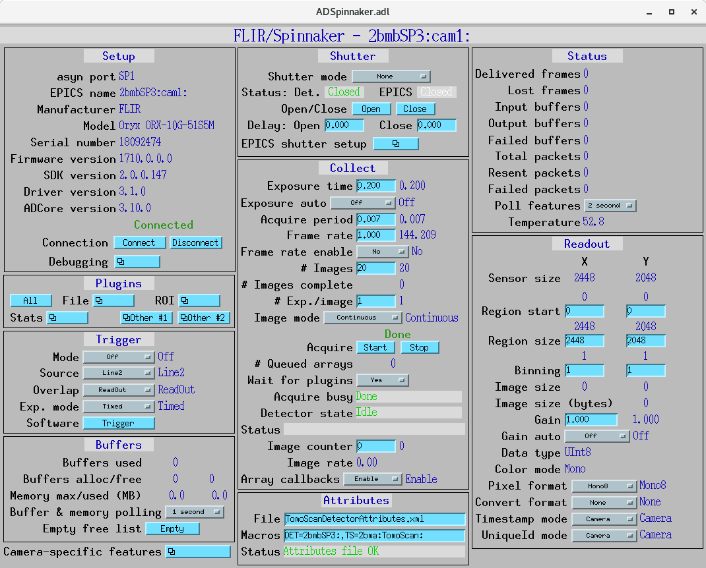

   2-BM-A areadetector control screen

Start ImageJ::

  (base) 2bmb@lyra ~ $ ImageJ

Configure the EPICS_NTNDA plug-in:

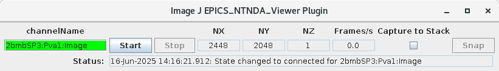

   ImageJ EPICS_NTNDA plug-in

Lower M1 by setting:

- ``Yaverage = -2 mm``
- ``Angle = 0 mrad``

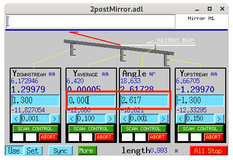

   2-BM-A M1 mirror control screen

Lower the DMM by setting the three vertical stages (USY-OB, USY-IB, and DSY)
to ``-19 mm``.

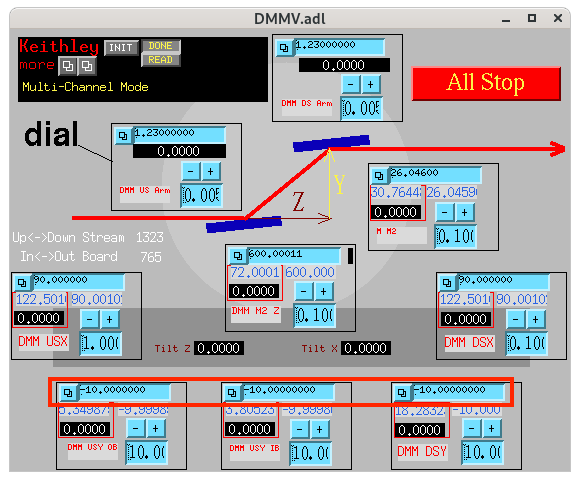

   DMM control screen

Adjust the camera vertical position (``2bma:m21``) until the white beam
is visible:

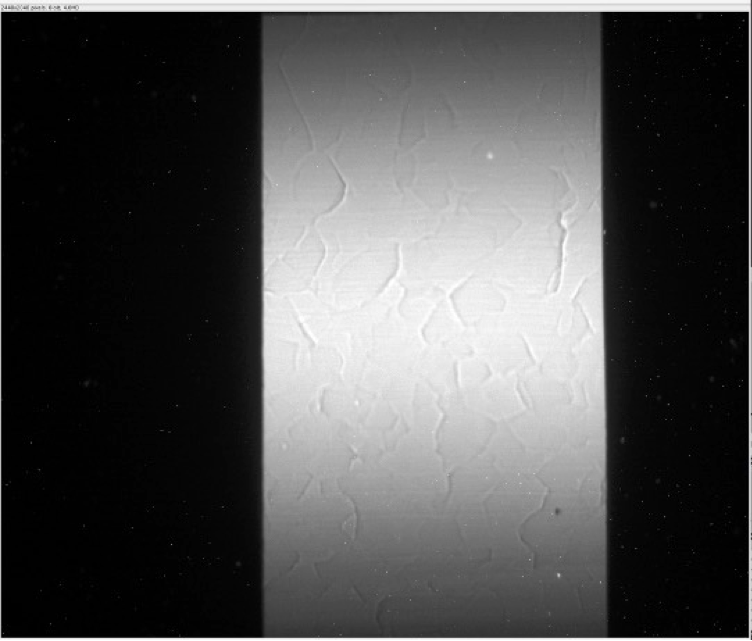

   White beam at 2-BM-A with 1 mm Al filter  
   Exposure 0.004 s, 20 mm glass filter

Remove the 1 mm Al filter.

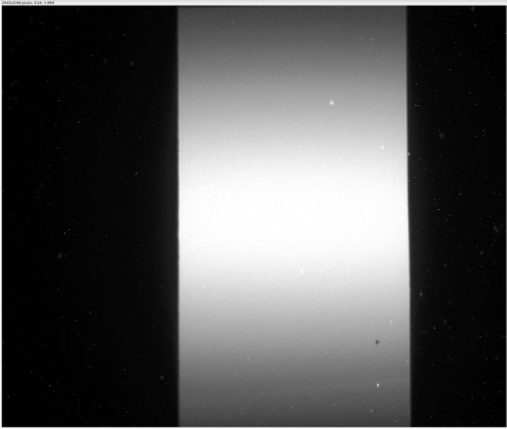

   White beam at 2-BM-A without any filter  
   Exposure 0.004 s, 20 mm glass filter

Plot a vertical line profile of the white beam intensity:

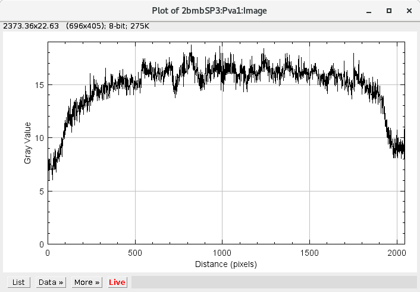

   White beam vertical intensity plot

If the profile is not symmetric, request beam steering from the control room
in 10 µrad steps:

- `Control room instructions
  <https://ops.aps.anl.gov/Internal/Reference/Test2/instructions.html>`_

Insert the mirror by setting:

- ``Yaverage = 0 mm``
- ``Angle = 0 mrad``

Recalibrate the mirror:

#. Adjust ``Yaverage`` until the mirror cuts the white beam image in half.
#. Adjust the mirror angle until the reflected beam disappears.

After completing steps 1 and 2, reset the mirror ``Yaverage`` and angle to
zero.

.. warning::

   To enhance the visibility of the reflected beam, enable the Proc1
   plugin. In the **Flat Field Normalization** section, click **Save Flat
   Field** and **Enable Flat Field**.

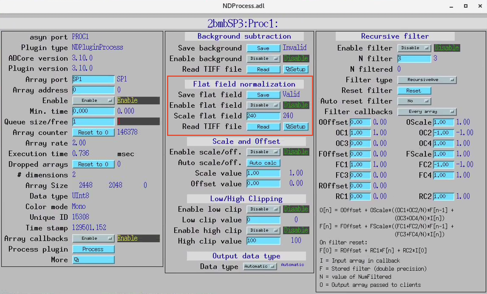

Pink beam
=========

Set the mirror angle to ``2.618 mrad`` (0.15°). Move the camera up until
the pink beam is visible.

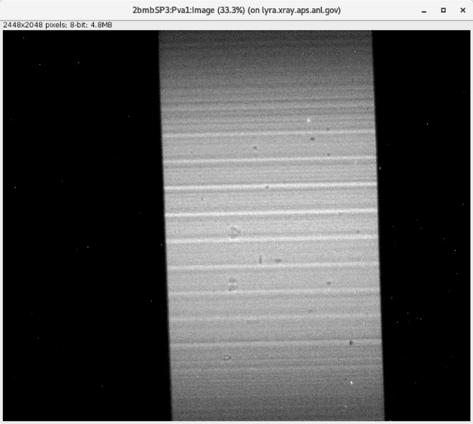

   Pink beam after steering  
   Exposure 0.004 s, 20 mm glass filter

Adjust the camera vertical position until the pink beam image is centered,
then set the camera ``Y`` position to 0.

Mono beam
=========

Set the DMM vertical stages to::

  USY-OB = 0 mm
  USY-IB = 0 mm
  DSY    = 0 mm

Set the DMM Upstream arm angle to ``0°``.

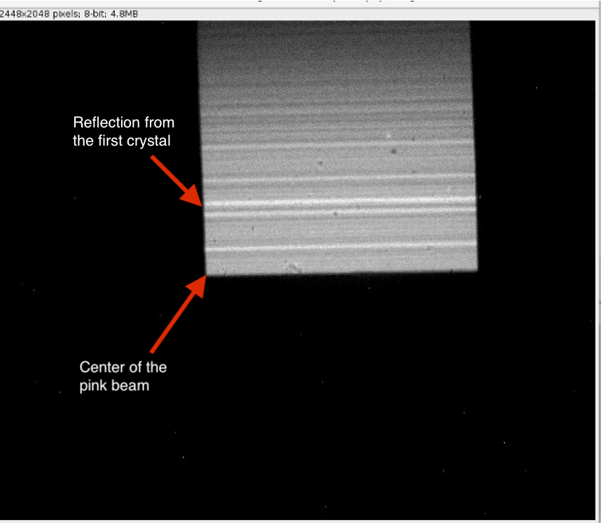

   Pink beam cut in half by the first DMM crystal

Recalibrate the DMM table height and the first crystal angle:

#. Adjust USY-OB, USY-IB, and DSY until the first crystal cuts the pink
   beam image in half.
#. Adjust the first crystal angle (DMM Upstream arm) until the reflected
   beam disappears.

After completing steps 1 and 2, reset USY-OB, USY-IB, DSY, and the DMM
Upstream arm angle to zero.

Recalibrate the second crystal angle:

#. Move the DMM vertical stages (USY-OB, USY-IB, and DSY) down by 10 mm.
#. Move DMM M2Y down until the second crystal cuts the pink beam in half.
#. Adjust the second crystal angle until the reflected beam disappears.

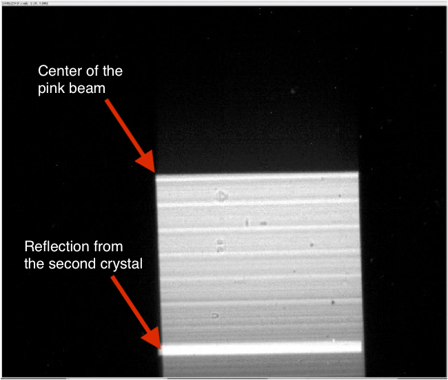

   Pink beam cut in half by the second DMM crystal

After completing steps 1–3, set:

- ``DMM M2Y = 10 mm``
- ``DMM Downstream arm angle = 0°``

Locate the DMM monochromatic beam:

#. Move the DMM into the beam (set USY-OB, USY-IB, and DSY to 0).
#. Set the DMM Upstream arm to ``1.25°``.

The distance between the first and second crystal centers is approximately
600 mm, so:

:math:`\tan(2 \times 1.25^{\circ}) \times 600 \approx 26.196 \text{ mm}`

#. Set ``DMM M2Y = 26.196 mm``.
#. Set detector Y (``2bma:m21``) to ``26.196 mm``.

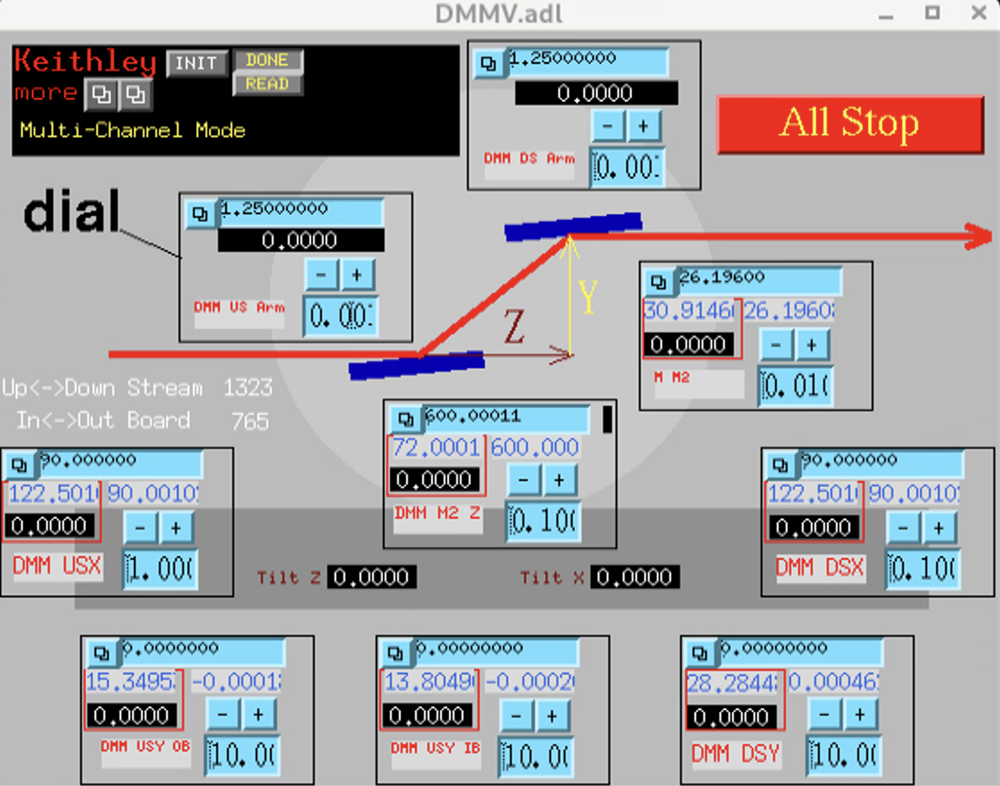

   DMM in position

Adjust detector Y (``2bma:m21``) until the DMM monochromatic beam is
visible:

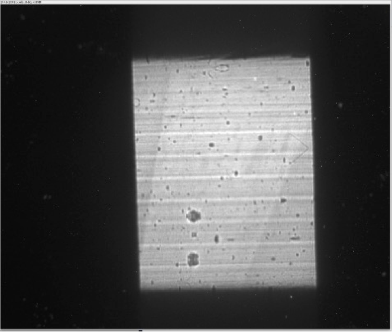

   DMM monochromatic beam

Maximize the intensity and beam size by adjusting **only**:

- DMM Downstream arm
- DMM M2Y

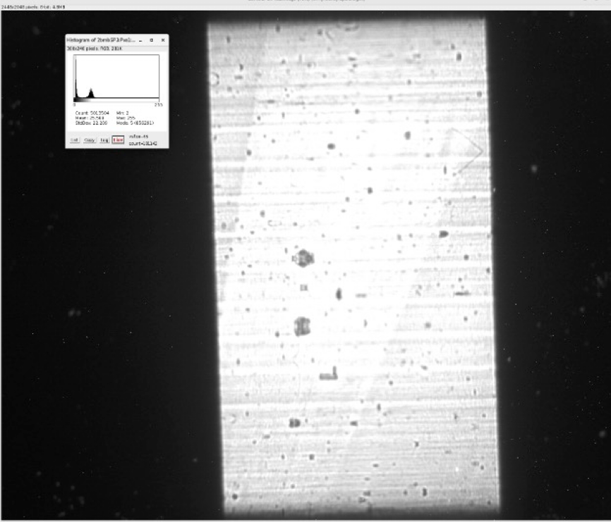

   Optimized DMM monochromatic beam

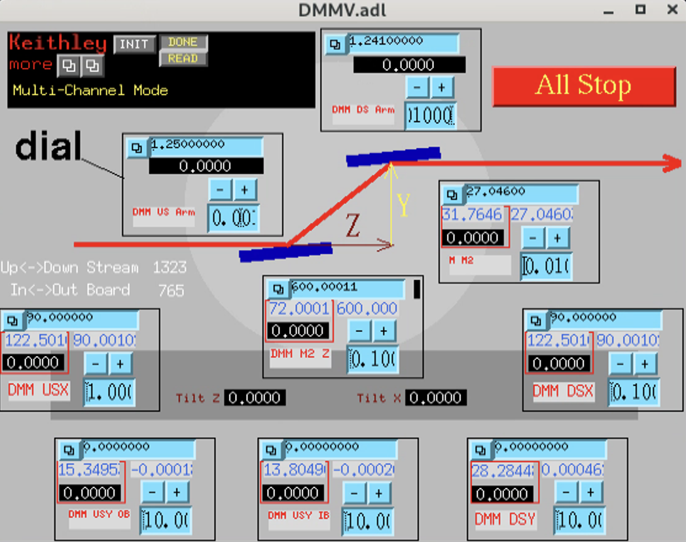

   DMM position after monochromatic beam optimization

Set the second crystal angle (DMM Downstream arm) to ``1.25°``.

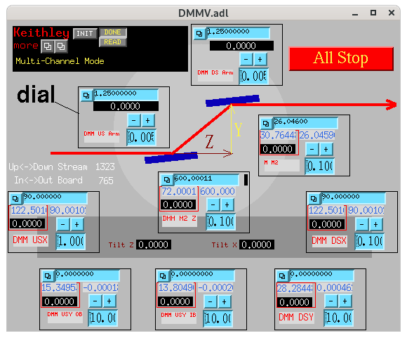

   DMM position after monochromatic beam optimization and second crystal reset

If the optimized DMM M2Y is 26.046 mm instead of the calculated
26.196 mm, the effective distance between the first and second crystal
centers is 596.56 mm.

For the full procedure to calibrate the DMM energy using a channel-cut
crystal and multilayer tables, see :ref:`ops-energy-calibration`.