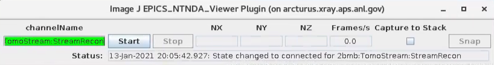
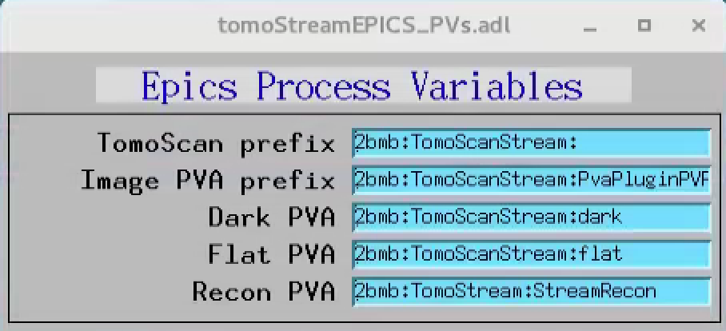

.. _EPICS_NTNDA_Viewer: https://cars9.uchicago.edu/software/epics/areaDetectorViewers.html
.. _tomoScan: https://tomoscan.readthedocs.io/en/latest/index.html
.. _tomoScanStream: https://tomoscan.readthedocs.io/en/latest/api/tomoscan_stream_2bm.html
.. _tomoStream: https://tomostream.readthedocs.io/en/latest/about.html
.. _PVaccess: https://epics-controls.org/resources-and-support/documents/pvaccess/
.. _Data Exchange: https://dxfile.readthedocs.io/en/latest/source/xraytomo.html

Streaming
=========

There are 2 major components supporting streaming at 2-BM:

- Streaming data collection
- Streaming data reconstruction

Streaming data collection
-------------------------

Support for streaming data collection is provided by `tomoScanStream`_ a `tomoScan`_ derived classes to implement the streaming data collection. To run `tomoScanStream`_:

Start area detector
~~~~~~~~~~~~~~~~~~~

- EPICS IOC

::

    [user2bmb@lyra]$ 2bmbPG1 start
    [user2bmb@lyra]$ 2bmbPG1 console

- medm screen

::

    [user2bmb@lyra]$ 2bmbPG1 medm

Start tomoScan
~~~~~~~~~~~~~~

- EPICS IOC

::

    [user2bmb@lyra]$ cd /local/user2bmb/epics/synApps/support/tomoscan/iocBoot/iocTomoScan_2BM/
    [user2bmb@lyra]$ ./start_IOC

- tomoscan_stream python server

::

    [user2bmb@lyra]$ bash
    [user2bmb@lyra]$ cd /local/user2bmb/epics/synApps/support/tomoscan/iocBoot/iocTomoScan_2BM/
    [user2bmb@lyra]$ python -i start_tomoscan_stream.py

- medm screen

::

    [user2bmb@lyra]$ cd /local/user2bmb/epics/synApps/support/tomoscan/iocBoot/iocTomoScan_2BM/
    [user2bmb@lyra]$ ./start_medm

.. image:: ../img/tomoScan.png
    :width: 70%
    :align: center

Streaming data collection features are:

- On-demand retake of dark-flat field images
- On-demand data capturing with saving in a standard `Data Exchange`_ hdf5file
- Set a number of projectons ("Pre count") collected before a triggered data capturing event to be also saved in the same hdf5 file

and can be controlled from:

.. image:: ../img/tomoScan_2BM_stream.png
    :width: 70%
    :align: center

accessible by selecting "Stream" on the tomoScan/Beamline-specific display

.. image:: ../img/tomoScan_2BM.png
    :width: 70%
    :align: center

When collecting data in streaming mode, projections, dark and flat images are broadcasted using `PVaccess`_ and can be retrieved as EPICS PVs. Projections are streamed by the detector PVA1 plugin while dark and flat are streamed by tomoScan with a dark/flat PVA prefix configurable under tomoScan/Beamline-specific/Other PVs screen:  

.. image:: ../img/tomoScan_2BM_otherpvs.png
    :width: 70%
    :align: center

Streaming data reconstruction
-----------------------------

The projection, dark and flat image broadcast provided by `tomoScanStream`_ can be used to reconstruct in real-time 3 orthogonal slices. This task is accomplished by `tomoStream`_.

Start tomoStream
~~~~~~~~~~~~~~~~

- EPICS IOC

::

    [tomo@handyn]$ cd /local/tomo/epics/synApps/support/tomostream/iocBoot/iocTomoStream/
    [tomo@handyn]$ ./start_IOC

- tomostream python server

::

    [tomo@handyn]$ bash
    [tomo@handyn]$ cd /local/tomo/epics/synApps/support/tomostream/iocBoot/iocTomoStream/
    [tomo@handyn]$ source activate streaming
    [tomo@handyn]$ python -i start_tomostream.py

- medm screen	

::

    [tomo@handyn]$ bash
    [tomo@handyn]$ cd /local/tomo/epics/synApps/support/tomostream/iocBoot/iocTomoStream/
    [tomo@handyn]$ ./start_medm

.. image:: ../img/tomoStream.png
    :width: 60%
    :align: center

Streaming data reconstruction features are:

- Streaming reconstruction of 3 (X-Y-Z) ortho-slices through the sample

- On demand adjustment of the

    - X Y Z ortho-slice positions
    - reconstruction rotation center
    - reconstruction filter

and can be controlled from the main tomoStream control screen.

The output of tomostream is a live reconstruction:

.. image:: ../img/tomoStreamRecon.png
    :width: 70%
    :align: center

This is broadcasted as a PVA that can be diplayed by ImageJ using the `EPICS_NTNDA_Viewer`_ plug-in:

.. image:: ../img/ImageJ_NTNDA_01.png
    :width: 70%
    :align: center
    

The PVA name broadcasting the recontruction can be set in the tomoStream/Epics PV names screen:

While the sample is rotating is possible to optimize instrument (alignment, focus, sample to detector distance etc.) and  beamline (energy etc.) conditions and monitor the effect live on the 3 orthogonal slices. It is also possible to automatically trigger data capturing based on events occurring in the sample and its environment as a result of segmentation or machine learning.