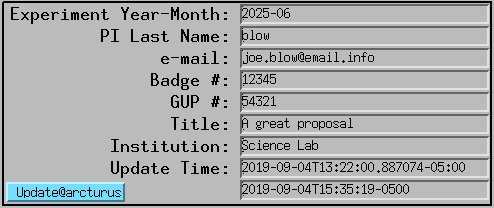
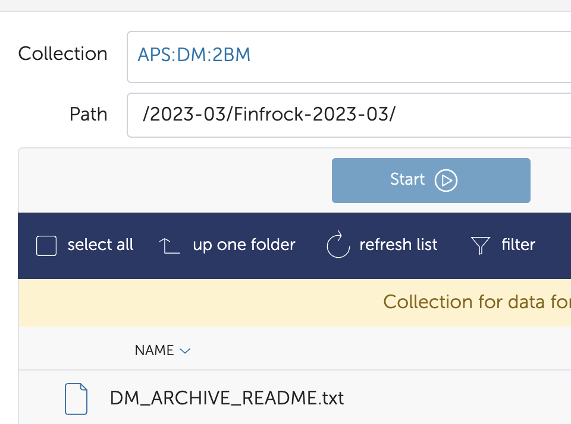
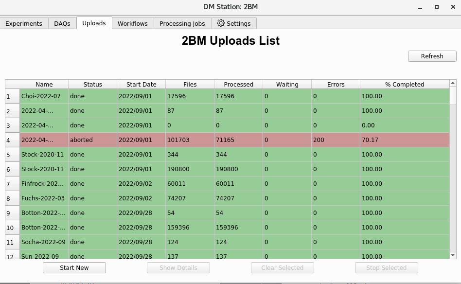
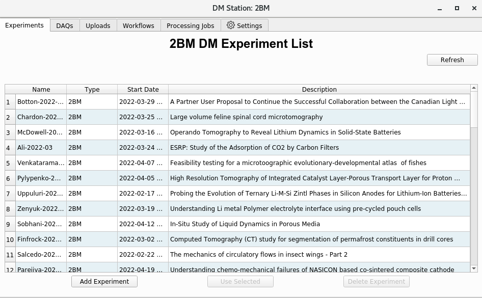
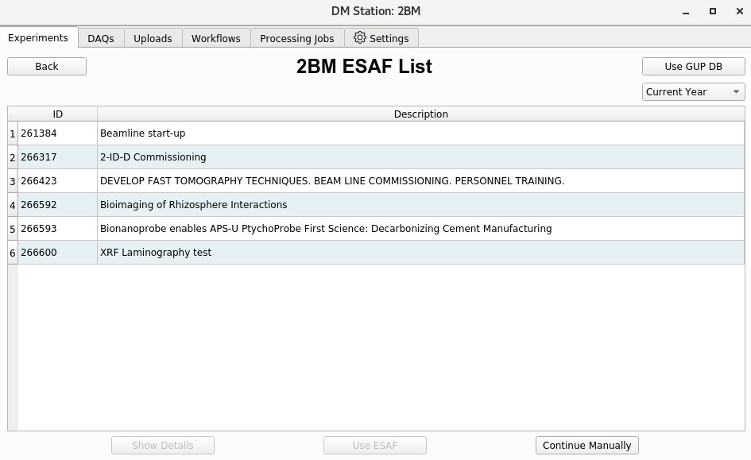
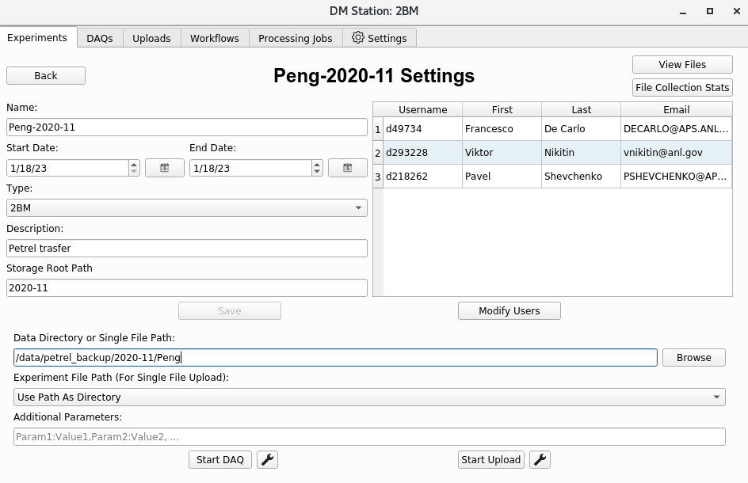

===============
Data management
===============

Data ownership and per-experiment access at 2-BM are managed by
`DMagic <https://dmagic.readthedocs.io/en/latest/index.html>`_, which
retrieves user information from the APS scheduling system and the
experiment's ESAF and updates the user-info PVs:

Run a user-PV update::

  (base) [2bmb@arcturus]$ bash
  (base) [2bmb@arcturus]$ conda activate dm
  (dm)   [2bmb@arcturus]$ dmagic show
  (dm)   [2bmb@arcturus]$ dmagic tag

You can also enter the user last name, email address, and YYYY-MM manually
on the MEDM screen if needed.

Overview
========

The canonical home for every 2-BM experiment is **Sojourner**, the APS Data
Management storage system, mounted on the detector host ``tomdet`` and on
the analysis host ``tomo4`` as ``/gdata``. The per-experiment folder lives
at::

  /gdata/dm/2BM/<yyyy-mm>/<yyyy-mm>-<PIlastname>-<GUP#>/
      data/      raw acquisition (*.h5 + *.config per scan)
      analysis/  reconstructions (<scan>_rec/)
      system/    DMagic-internal state

DMagic creates this folder skeleton when the experiment is registered. The
naming convention is ``<yyyy-mm>-<PIlastname>-<GUP#>``; a GUP number of ``0``
indicates internal beamtime rather than a user proposal.

The default acquisition flow stages data through faster local tiers before
landing on Sojourner:

::

  [Detector]
       |  acquisition write (fast local NVMe)
       v
  tomdet:/local1/2BM/<yyyy-mm>-<PIlast>-<GUP#>/
       |  tomoscan auto-upload, per-scan (FDT or scp)
       v
  /data2  or  /data3   (NFS from tomodata2-ib / tomodata3-ib;
                        Infiniband-fast to the tomo1..tomo5 analysis nodes)
       |  tomocupy reconstruction on tomo1..tomo5  (tomo1 currently OOS)
       v
  <scan>_rec/ alongside raw on /data2 or /data3
       |  operator-driven cp or mv from tomdet or tomo4
       v
  /gdata/dm/2BM/<yyyy-mm>/<exp>/{data,analysis,system}/   (Sojourner, canonical home)
       |  Globus collection APS:DM:2BM, auto-shared to proposal + ESAF users
       v
  [User download]
       |  APS DM tape-archive timer (programmable per experiment;
       |  default 1 year, was 3 months)
       v
  [Tape]   (restorable with dm-restore-experiment)

``tomdet`` and ``tomo4`` are the only hosts with ``/gdata`` mounted directly.
``tomo2``, ``tomo3``, and ``tomo5`` have Infiniband-fast access to ``/data2``
and ``/data3`` but reach Sojourner only via ``dm-download`` (see below) or
Globus.

Writing raw data and reconstructions directly to ``/gdata`` from ``tomdet`` or
``tomo4`` works (both mount it), but performance is worse than the staged
local-tier route, so the staged pipeline is the default.

The supporting codebases are:

- ``/home/beams/2BMB/conda/DMagic-decarlof/`` -- creates experiment folders
  on ``/gdata`` and sets Globus ACLs from the proposal + ESAF user lists.
- ``/home/beams/2BMB/epics/synApps/support/tomoscan/`` -- the 2bmb subclass
  drives the per-scan auto-upload from ``/local1`` to ``/data2`` or ``/data3``
  via FDT or scp.
- ``/home/beams/2BMB/conda/tomocupy-decarlof`` -- the reconstruction code
  that runs on ``tomo1..tomo5``.

Move data to Sojourner
======================

Once data (and reconstructions) are on ``/data2`` or ``/data3``, move them
to the canonical Sojourner home. This step is operator-driven; there is no
continuous DMagic sync at 2-BM. Run it from ``tomdet`` or ``tomo4``, the two
hosts that mount ``/gdata`` directly. Example::

  (base) 2bmb@tomdet $ cp -r /data2/2026-03-Pickering-1008279/data     /gdata/dm/2BM/2026-03/2026-03-Pickering-1008279/
  (base) 2bmb@tomdet $ cp -r /data2/2026-03-Pickering-1008279/analysis /gdata/dm/2BM/2026-03/2026-03-Pickering-1008279/

Either ``cp`` or ``mv`` is acceptable. ``/data2`` and ``/data3`` fill quickly
and are cleared on capacity demand, so plan to migrate to ``/gdata`` while
the working copy is still available.

Delete files
============

To delete a folder of data already on Sojourner::

  (base) [2bmb@arcturus]$ source /home/dm_bm/etc/dm.setup.sh
  (dm-user) [2bmb@arcturus]$ dm-delete-files --experiment 2023-03-Xu --path-pattern LCO15v18b_232_rec

  There are 75 files that match specified criteria. If you continue:

    1) Experiment files will be removed from storage.
    2) Experiment files will be removed from the catalog.

  Proceed (yes|no)? [no]: yes

To delete a subset of files, use a pattern such as ``.*``. For example, to
delete all TIFF files in the ``rkd10_024_rec`` folder::

  (dm-user) [2bmb@arcturus]$ dm-delete-files --experiment test-delete-rec --path-pattern rkd10_024_rec/.*.tiff

  There are 1852 files that match specified criteria. If you continue:
    1) Experiment files will be removed from storage.
    2) Experiment files will be removed from the catalog.

  Proceed (yes|no)? [no]:

To apply this to all folders ending with ``_rec``::

  (dm-user) [2bmb@arcturus]$ dm-delete-files --experiment Stock-2020-11 --path-pattern .*_rec/.*.tiff
  There are 154085 files that match specified criteria. If you continue:
    1) Experiment files will be removed from storage.
    2) Experiment files will be removed from the catalog.

The ``dm-delete-files`` command is recursive. For example, to delete all
``*.tiff`` files in all subfolders of an experiment::

  (dm-user) [2bmb@arcturus]$ dm-delete-files --experiment Parejiya-2022-04 --path-pattern /.*.tiff

Or to delete all ``recon_*.tiff`` files in all subfolders::

  (dm-user) [2bmb@arcturus]$ dm-delete-files --experiment Drummond-2022-09 --path-pattern /recon_.*.tiff

Download
========

For hosts that do not mount ``/gdata`` (``tomo2``, ``tomo3``, ``tomo5``), or
for fetching back from tape, use ``dm-download``. Example: download an
experiment (e.g. ``Finfrock-2022-12``) from Sojourner to ``tomo2:/data2/``::

  (base)    [2bmb@tomo2 ~]$ source /home/dm_bm/etc/dm.setup.sh
  (dm-user) [2bmb@tomo2 ~]$ dm-download --experiment Finfrock-2022-12 --destination-directory /data2/

External users typically pull via Globus instead; see
:doc:`../manual/item_003` (collection ``APS:DM:2BM``).

For additional details see the DM instructions:

- `2-BM Deployment
  <https://git.aps.anl.gov/DM/dm-docs/-/wikis/DM/Deployments/2-BM-Deployment>`_

Tape archive
============

APS Data Management archives each experiment from Sojourner to tape after
a programmable per-experiment timer. The current default at 2-BM is **1
year** (raised from the prior 3-month default). To archive an experiment
(e.g. ``Finfrock-2023-03``) to tape immediately, before the timer fires::

  (base)    [2bmb@arcturus]$ source /home/dm_bm/etc/dm.setup.sh
  (dm-user) [2bmb@arcturus]$ dm-archive-experiment --experiment Finfrock-2023-03

Pin / extend archive-to-tape date
=================================

The default 1-year archive timer can be extended per experiment. If you
receive a notification email like::

  Experiment Lu-2023-03 can be archived in 1 days, 22 hours (168205.33 seconds).

and want to extend the archival to tape date, run::

  (base)    [2bmb@arcturus]$ source /home/dm_bm/etc/dm.setup.sh
  (dm-user) [2bmb@arcturus]$ dm-pin-experiment --experiment Lu-2023-03 --n-days 90
  id=12322 name=Lu-2023-03 experimentTypeId=32 experimentStationId=23 updateDate=2026-02-06 13:21:24.826141-06:00 startDate=2023-03-24 00:00:00-05:00 endDate=2023-03-27 00:00:00-05:00

To verify the pinned status of an experiment::

  (dm-user) dmadmin@s2bmdm> dm-get-experiment --experiment Lu-2023-03 -a -pp | grep pinned
    'pinnedAtTime': '1771565030.0576963',
    'pinnedAtTimestamp': '2026/02/19 23:23:50',
    'pinnedByUser': 'user2bm',
    'pinnedUntilTime': '1779341030.0576963',
    'pinnedUntilTimestamp': '2026/05/21 00:23:50',

Tape restore
============

To restore an experiment (e.g. ``Finfrock-2023-03``) from tape to its
original location on Sojourner:

Run::

  (base)    [2bmb@arcturus]$ source /home/dm_bm/etc/dm.setup.sh
  (dm-user) [2bmb@arcturus]$ dm-restore-experiment --experiment Finfrock-2023-03
  id=0293f99b-c724-402f-af94-1f2606499d96 name=restoreArchive experimentName=Finfrock-2023-03 status=pending

Check the status of the restore process with::

  (dm-user) [2bmb@arcturus]$ dm-restore-experiment --experiment Finfrock-2023-03
  Unfinished archive task with id 0293f99b-c724-402f-af94-1f2606499d96 already exists for experiment Finfrock-2023-03

or::

  (dm-user) [2bmb@arcturus]$ dm-get-archive-task --id 0293f99b-c724-402f-af94-1f2606499d96 --display-keys ALL

To list all tasks::

  (dm-user) [2bmb@arcturus]$ dm-list-archive-tasks

Add users
=========

DMagic auto-populates the per-experiment Globus ACL from the proposal user
list and the ESAF user list. To grant an additional user read access to
datasets in an experiment (for example, when adding a collaborator after
the beamtime)::

  (base)    [2bmb@arcturus]$ source /home/dm_bm/etc/dm.setup.sh
  (dm-user) [2bmb@arcturus]$ dm-add-user-experiment-role --experiment expName --username d<badge> --role User

Find the ``d<badge>`` identifier with::

  (dm-user) dmadmin@s2bmdm> dm-list-users | grep -i decarlo

Example::

  dm-add-user-experiment-role --experiment McDowell-2023-03 --username d240474 --role User
  dm-add-user-experiment-role --experiment Finfrock-2022-12 --username d240474 --role User
  dm-add-user-experiment-role --experiment Finfrock-2023-03 --username d240474 --role User

Search
======

To search for experiments whose name contains ``Pete``::

  (base)    tomo@tomodata1 ~ $ source /home/dm_bm/etc/dm.setup.sh
  (dm-user) tomo@tomodata1 ~ $ dm-list-experiments | grep Pete
  id=8862  name=Peters-2022-03  experimentTypeId=30 experimentStationId=21 startDate=2022-03-04 00:00:00-06:00 endDate=2022-03-07 00:00:00-06:00
  id=11275 name=Peteres-2022-11 experimentTypeId=30 experimentStationId=21 startDate=2022-11-28 00:00:00-06:00 endDate=2022-12-01 00:00:00-06:00

To list files within an experiment::

  (base)    tomo@tomodata1 ~ $ source /home/dm_bm/etc/dm.setup.sh
  (dm-user) tomo@tomodata1 ~ $ dm-list-experiment-files --experiment=Peters-2022-03 | grep Peters | head -10
  id=625daab87f44b25ba39bfdb7 fileName=C4_Zn_01_10keV_980.h5      experimentFilePath=Peters/C4_Zn_01_10keV_980.h5      fileSize=272374112 md5Sum=516bb84b52e5b8d2347aea847fd94a50
  id=625daabb7f44b25ba39bfdb8 fileName=C4_Zn_03_10keV_try2_977.h5 experimentFilePath=Peters/C4_Zn_03_10keV_try2_977.h5 fileSize=171670144 md5Sum=4f8f374f72cea16f5a8325ea44a83338
  id=625daabd7f44b25ba39bfdb9 fileName=C4_Zn_03_10keV_try2_975.h5 experimentFilePath=Peters/C4_Zn_03_10keV_try2_975.h5 fileSize=226080308 md5Sum=21a3f1a5c7e292b0f43cabc96aaa16b7

Legacy upload via dm-station-gui
================================

The DMagic GUI is still available and is occasionally used for retrospective
uploads of legacy data (for example, lifting old datasets off ``tomo1:/data``
into the APS DM catalog). It is not the default for new acquisitions, which
flow through the staged pipeline described in the **Overview** above.

To upload data with the GUI::

  (base) [2bmb@arcturus]$ bash
  (base) [2bmb@arcturus]$ source /home/dm_bm/etc/dm.setup.sh
  (dm-user) [2bmb@arcturus]$ dm-station-gui

Click **Start New**:

Then select **Add Experiment**:

Select the GUP associated with the data set, or choose **Continue Manually**
if there is no GUP (e.g. internal time):

Set the experiment **Name**, **Dates**, **Type**, **Storage Root Path**,
etc., then click **Save**:

After the experiment is created, specify the data location on
``tomo1`` (e.g. ``/data/...``) in the **Data Directory** or **Single file**
field:

.. image:: ../img/dm_05.png
   :width: 480px
   :align: center
   :alt: dm
