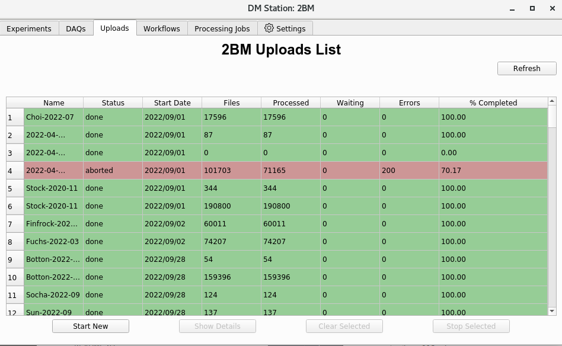
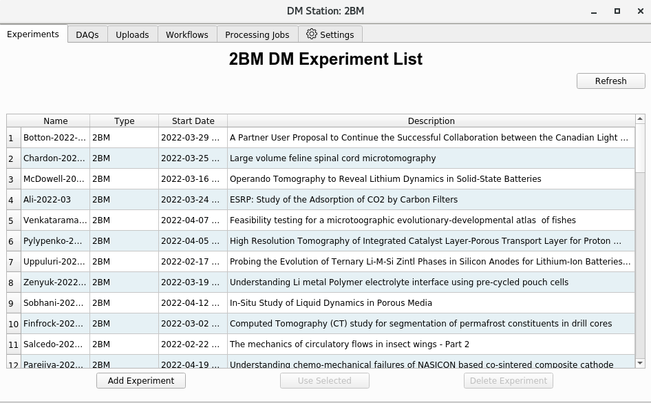

===============
Data management
===============

Data ownership and local storage are managed by
`DMagic <https://dmagic.readthedocs.io/en/latest/index.html>`_, which
retrieves user information from the APS scheduling system and updates the
user-info PVs:

.. image:: ../img/medm_screen.png 
   :width: 480px
   :align: center
   :alt: tomo_user

Run a user-PV update::

  (base) [2bmb@arcturus]$ bash
  (base) [2bmb@arcturus]$ conda activate dm
  (dm)   [2bmb@arcturus]$ dmagic show
  (dm)   [2bmb@arcturus]$ dmagic tag

You can also enter the user last name, email address, and YYYY-MM manually
on the MEDM screen if needed.

Upload
======

To upload data from ``tomo1:/data`` to Voyager::

  (base) [2bmb@arcturus]$ bash
  (base) [2bmb@arcturus]$ source /home/dm_bm/etc/dm.setup.sh
  (dm-user) [2bmb@arcturus]$ dm-station-gui

Click **Start New**:

Then select **Add Experiment**:

Select the GUP associated with the data set, or choose **Continue Manually**
if there is no GUP (e.g., internal time):

.. image:: ../img/dm_03.png 
   :width: 480px
   :align: center
   :alt: dm

Set the experiment **Name**, **Dates**, **Type**, **Storage Root Path**, etc.,
then click **Save**:

.. image:: ../img/dm_04.png 
   :width: 480px
   :align: center
   :alt: dm

After the experiment is created, specify the data location on
``tomo1`` (e.g. ``/data/...``) in the **Data Directory** or **Single file**
field:

.. image:: ../img/dm_05.png 
   :width: 480px
   :align: center
   :alt: dm

Delete
======

To delete a folder of data already uploaded to Voyager::

  (base) [2bmb@arcturus]$ source /home/dm_bm/etc/dm.setup.sh
  (dm-user) [2bmb@arcturus]$ dm-delete-files --experiment 2023-03-Xu --path-pattern LCO15v18b_232_rec

  There are 75 files that match specified criteria. If you continue:

    1) Experiment files will be removed from storage.
    2) Experiment files will be removed from the catalog.

  Proceed (yes|no)? [no]: yes

To delete a subset of files, use a pattern such as ``.*``. For example, to
delete all TIFF files in the ``rkd10_024_rec`` folder::

  (dm-user) [2bmb@arcturus]$ dm-delete-files --experiment test-delete-rec --path-pattern rkd10_024_rec/.*.tiff

  There are 1852 files that match specified criteria. If you continue: 
    1) Experiment files will be removed from storage.
    2) Experiment files will be removed from the catalog.

  Proceed (yes|no)? [no]:

To apply this to all folders ending with ``_rec``::

  (dm-user) [2bmb@arcturus]$ dm-delete-files --experiment Stock-2020-11 --path-pattern .*_rec/.*.tiff
  There are 154085 files that match specified criteria. If you continue: 
    1) Experiment files will be removed from storage.
    2) Experiment files will be removed from the catalog.

The ``dm-delete-files`` command is recursive. For example, to delete all
``*.tiff`` files in all subfolders of an experiment::

  (dm-user) [2bmb@arcturus]$ dm-delete-files --experiment Parejiya-2022-04 --path-pattern /.*.tiff

Or to delete all ``recon_*.tiff`` files in all subfolders::

  (dm-user) [2bmb@arcturus]$ dm-delete-files --experiment Drummond-2022-09 --path-pattern /recon_.*.tiff

Download
========

To download an experiment (e.g. ``Finfrock-2022-12``) from Voyager to
``tomodata1:/data/``::

  (base)   [2bmb@tomo1 ~]$ source /home/dm_bm/etc/dm.setup.sh
  (dm-user) [2bmb@tomo1 ~]$ dm-download --experiment Finfrock-2022-12 --destination-directory /data/

For additional details see the DM instructions:

- `2-BM Deployment
  <https://git.aps.anl.gov/DM/dm-docs/-/wikis/DM/Deployments/2-BM-Deployment>`_

Tape restore
============

To restore an experiment (e.g. ``Finfrock-2023-03``) from tape to its
original location on Voyager:

.. image:: ../img/voyager_on_globus.png 
   :width: 200px
   :align: center
   :alt: dm

Run::

  (base)   [2bmb@arcturus]$ source /home/dm_bm/etc/dm.setup.sh
  (dm-user) [2bmb@arcturus]$ dm-restore-experiment --experiment Finfrock-2023-03
  id=0293f99b-c724-402f-af94-1f2606499d96 name=restoreArchive experimentName=Finfrock-2023-03 status=pending

Check the status of the restore process with::

  (dm-user) [2bmb@arcturus]$ dm-restore-experiment --experiment Finfrock-2023-03
  Unfinished archive task with id 0293f99b-c724-402f-af94-1f2606499d96 already exists for experiment Finfrock-2023-03

or::

  (dm-user) [2bmb@arcturus]$ dm-get-archive-task --id 0293f99b-c724-402f-af94-1f2606499d96 --display-keys ALL

To list all tasks::

  (dm-user) [2bmb@arcturus]$ dm-list-archive-tasks

Tape archive
============

To archive an experiment (e.g. ``Finfrock-2023-03``) from Voyager to tape::

  (base)   [2bmb@arcturus]$ source /home/dm_bm/etc/dm.setup.sh
  (dm-user) [2bmb@arcturus]$ dm-archive-experiment --experiment Finfrock-2023-03

Add users
=========

To grant a user read access to datasets in an experiment::

  (base)   [2bmb@arcturus]$ source /home/dm_bm/etc/dm.setup.sh
  (dm-user) [2bmb@arcturus]$ dm-add-user-experiment-role --experiment expName --username d<badge> --role User

Find the ``d<badge>`` identifier with::

  (dm-user) dmadmin@s2bmdm> dm-list-users | grep -i decarlo

Example::

  dm-add-user-experiment-role --experiment McDowell-2023-03 --username d240474 --role User
  dm-add-user-experiment-role --experiment Finfrock-2022-12 --username d240474 --role User
  dm-add-user-experiment-role --experiment Finfrock-2023-03 --username d240474 --role User

Search
======

To search for experiments whose name contains ``Pete``::

  (base)   tomo@tomodata1 ~ $ source /home/dm_bm/etc/dm.setup.sh
  (dm-user) tomo@tomodata1 ~ $ dm-list-experiments | grep Pete
  id=8862  name=Peters-2022-03  experimentTypeId=30 experimentStationId=21 startDate=2022-03-04 00:00:00-06:00 endDate=2022-03-07 00:00:00-06:00 
  id=11275 name=Peteres-2022-11 experimentTypeId=30 experimentStationId=21 startDate=2022-11-28 00:00:00-06:00 endDate=2022-12-01 00:00:00-06:00 

To list files within an experiment::

  (base)   tomo@tomodata1 ~ $ source /home/dm_bm/etc/dm.setup.sh
  (dm-user) tomo@tomodata1 ~ $ dm-list-experiment-files --experiment=Peters-2022-03 | grep Peters | head -10
  id=625daab87f44b25ba39bfdb7 fileName=C4_Zn_01_10keV_980.h5      experimentFilePath=Peters/C4_Zn_01_10keV_980.h5      fileSize=272374112 md5Sum=516bb84b52e5b8d2347aea847fd94a50 
  id=625daabb7f44b25ba39bfdb8 fileName=C4_Zn_03_10keV_try2_977.h5 experimentFilePath=Peters/C4_Zn_03_10keV_try2_977.h5 fileSize=171670144 md5Sum=4f8f374f72cea16f5a8325ea44a83338 
  id=625daabd7f44b25ba39bfdb9 fileName=C4_Zn_03_10keV_try2_975.h5 experimentFilePath=Peters/C4_Zn_03_10keV_try2_975.h5 fileSize=226080308 md5Sum=21a3f1a5c7e292b0f43cabc96aaa16b7 