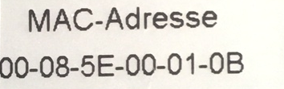
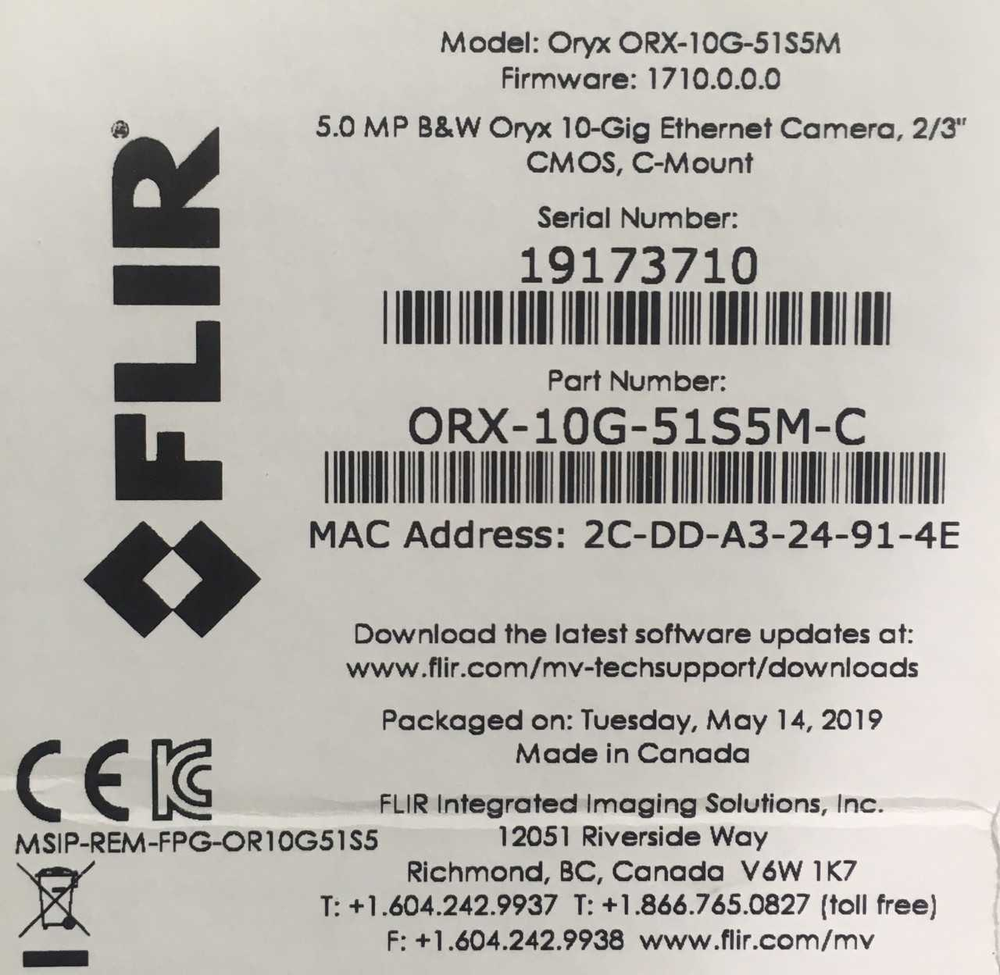
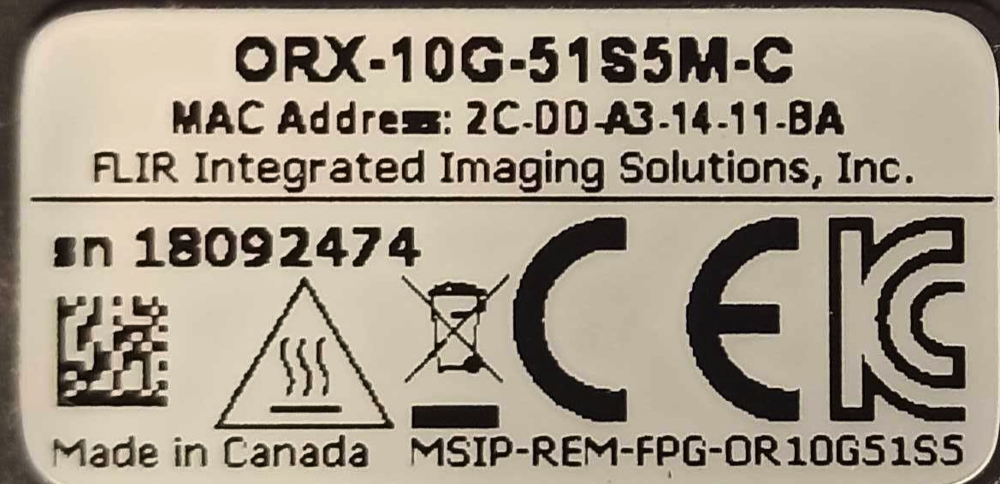

Detectors
=========

These are the computers supporting detectors at 2-BM:

+-----------+--------------+-------------------+-----------------+--------------------------+---------------------+
| Station   | Name         |      Model        |  Product No.    |    Serial No.            |        Manual       |
+-----------+--------------+-------------------+-----------------+--------------------------+---------------------+
| 2-BM-A    | pg10ge       |  HP Z8 G4         | 3GF37UT#ABA     |  `pg10ge label`_         |     `pg10ge SM`_    |
+-----------+--------------+-------------------+-----------------+--------------------------+---------------------+
| 2-BM-B    | lyra         |  HP EliteDesk 800 | P4K18UT#ABA     |  `lyra label`_           |     `lyra SM`_      |
+-----------+--------------+-------------------+-----------------+--------------------------+---------------------+
| 2-BM-B    | tomdet       |  Super Micro      | `SYS 521E WR`_  |  `tomdet label`_         |     `tomdet SM`_    |
+-----------+--------------+-------------------+-----------------+--------------------------+---------------------+

For each machine part list at purchase time and for the list of supported hardware enter the serial numeber in the `HP support <https://partsurfer.hp.com/Search.aspx>`_ web page.

.. _pg10ge label: https://anl.box.com/s/oslaky958be3vyifda2xyq4tv0v9v7pz
.. _pg10ge SM: https://anl.box.com/s/m1u8o62wbr27n26iotfnbhgpncwsapcq
.. _lyra label: https://anl.box.com/s/lrjiwsfzwbe51gueb6vpyinqav86qx6o
.. _lyra SM: https://anl.box.com/s/dv0ub0gdjhs7q3h50ehgro6gaesbxcjf
.. _tomdet label: https://anl.box.com/s/b6qqmbplxsbxjbpmfkdb8ayrzabo9w4x
.. _tomdet SM: https://anl.box.com/s/67l25mjm9vkoxnbkydjubfl3ge9wmvs2
.. _SYS 521E WR: https://www.supermicro.com/en/products/system/up/2u/sys-521e-wr

Cameras
-------

.. _camera_00001:  https://www.ptgrey.com/grasshopper3-91mp-mono-usb3-vision-sony-icx814-camera        
.. _camera_00002:  https://www.ptgrey.com/grasshopper3-23-mp-mono-usb3-vision-sony-pregius-imx174-camera        
.. _camera_00003:  https://www.ptgrey.com/grasshopper3-50-mp-mono-usb3-vision-sony-pregius-imx250         
.. _camera_00004:  http://www.pco.de/fileadmin/user_upload/pco-product_sheets/pco.dimax_hs_data_sheet.pdf       
.. _camera_00005:  https://www.pco.de/scmos-cameras/pcoedge-42/       
.. _camera_00006:  https://www.adimec.com/cameras/machine-vision-cameras/quartz-series/q-12a180/   
.. _camera_00007:  https://www.flir.com/products/oryx-10gige/?model=ORX-10GS-51S5M-C&vertical=machine+vision&segment=iis
.. _camera_00008:  https://www.flir.com/products/oryx-10gige/?model=DEV-ORX-310S9M&vertical=machine+vision&segment=iis
.. _camera_00009:  https://vision.vieworks.com/en/camera/area_scan/VNP_series
.. _camera_00010:  https://anl.box.com/s/89t8lg9ncm5s4kikwctvdbd0ch517xgx
.. _camera_00011:  https://www.photometrics.com/products/kinetix-family/kinetix

.. _camera_order_00001: https://apps.inside.anl.gov/paris/req.jsp?reqNbr=F6-109062
.. _camera_order_00002: https://apps.inside.anl.gov/paris/req.jsp?reqNbr=F8-219026
.. _camera_order_00003: https://apps.inside.anl.gov/paris/req.jsp?reqNbr=F6-161074
.. _camera_order_00004: https://apps.inside.anl.gov/paris/req.jsp?reqNbr=G2-175013

.. _camera_quote_00001: https://anl.box.com/s/6yv344apeox44m5salxmj4tfmdtvdov4
.. _camera_quote_00002: https://anl.box.com/s/u2msg1ln3w3483cmpi2jna3mdmtinhm0

.. |d00001| image:: ../img/dimax_01.png
   :width: 50px
   :alt: dimax_01

.. |d00003| image:: ../img/dimax_03.png
   :width: 50px
   :alt: dimax_03

.. |d00006| image:: ../img/flir_2.png
   :width: 50px
   :alt: flir

These are the model/part number of the cameras in use at 2-BM:

+-------------------------------------------------------------+---------------+------------------+---------+------------+--------------------+-----------------------------------------+-----------------------------+-------------------------------+
|                   Camera                                    |  pixels (HxV) | pixels size (μm) |   bit   | fps        |      Manual        | Part number                             |        Images               |          Purchase orider      |
+=============================================================+===============+==================+=========+============+====================+=========================================+=============================+===============================+
| Grasshopper3 9.1 MP Mono USB3 Vision (Sony ICX814)          |  3376 x 2704  |       3.69       | 14      | 9          |     camera_00001_  | GS3-U3-91S6M-C                          |                             |   camera_order_00001_         |
+-------------------------------------------------------------+---------------+------------------+---------+------------+--------------------+-----------------------------------------+-----------------------------+-------------------------------+
| Grasshopper3 2.3 MP Mono USB3 Vision (Sony Pregius IMX174)  |  1920 x 1200  |       5.86       | 10      | 163        |     camera_00002_  | GS3-U3-23S6M-C                          |                             |   camera_order_00001_         |
+-------------------------------------------------------------+---------------+------------------+---------+------------+--------------------+-----------------------------------------+-----------------------------+-------------------------------+
| Grasshopper3 5.0 MP Mono USB3 Vision (Sony Pregius IMX250)  |  2448 x 2048  |       3.45       | 10      | 75         |     camera_00003_  | GS3-U3-51S5M-C                          |                             |   camera_order_00001_         |
+-------------------------------------------------------------+---------------+------------------+---------+------------+--------------------+-----------------------------------------+-----------------------------+-------------------------------+
| PCO DIMAX HS4  (\*)                                         |  2000 x 2000  |       11         | 12      | 100 (2277) |     camera_00004_  | camera link                             |  |d00001| |d00002| |d00003| |                               |
+-------------------------------------------------------------+---------------+------------------+---------+------------+--------------------+-----------------------------------------+-----------------------------+-------------------------------+
| PCO EDGE 4.2   (\*)                                         |  2048 x 2048  |       6.5        | 16      | 100        |     camera_00005_  | camera link                             |                             |                               |
+-------------------------------------------------------------+---------------+------------------+---------+------------+--------------------+-----------------------------------------+-----------------------------+-------------------------------+
| Adimec 12 MP (\*\*)                                         |  4000 x 3000  |       5.5        | 8       | 187        |     camera_00006_  | Quartz quad CoaXPress Q-12A180 CMV12000 |                             |   camera_order_00003_         |
+-------------------------------------------------------------+---------------+------------------+---------+------------+--------------------+-----------------------------------------+-----------------------------+-------------------------------+
| Oryx 5.0 MP Mono 10GigE  (\*\*\*)                           |  2448 x 2048  |       3.45       | 8-12    | 162        |     camera_00007_  | ORX-10G-51S5M-C                         |   |d00004| |d00005|         |   camera_order_00002_         |
+-------------------------------------------------------------+---------------+------------------+---------+------------+--------------------+-----------------------------------------+-----------------------------+-------------------------------+
| Oryx 31.0 MP Mono 10GigE (\*\*\*)                           |  6464 x 4852  |       3.45       | 8-12    | 26         |     camera_00008_  | ORX-10G-310S9M                          |   |d00006|                  |   camera_order_00004_         |
+-------------------------------------------------------------+---------------+------------------+---------+------------+--------------------+-----------------------------------------+-----------------------------+-------------------------------+
| Viewworks VNP-604MX-M6H00 (SONY IMX411) (\*\*\*\*)          | 14192 × 10640 |       3.76       | 11-16   | 6.2        |     camera_00009_  | VNP-604MX-M6H00                         |                             |                               |
+-------------------------------------------------------------+---------------+------------------+---------+------------+--------------------+-----------------------------------------+-----------------------------+-------------------------------+
| pco.edge 10 BI CLHS   (\*\*\*\*\*)                          |  4432 ×  2368 |       4.6        | 16      | 120        |     camera_00010_  | 10 BI CLHS                              |                             |    camera_quote_00001_        |
+-------------------------------------------------------------+---------------+------------------+---------+------------+--------------------+-----------------------------------------+-----------------------------+-------------------------------+
| Teledyne Kinetix 10                                         |  3200 x 3200  |       6.5        | 8-12-16 | 498        |     camera_00011_  | O1_KINETIX_10MP_PCIE                    |                             |    camera_quote_00002_        |
+-------------------------------------------------------------+---------------+------------------+---------+------------+--------------------+-----------------------------------------+-----------------------------+-------------------------------+

(\*)    use MicroEnable IV VD4-CL

(\*\*)    use Euresys Quad-G3 CXP framegrabber

(\*\*\*)   use Myricom ARC Series C-Class Network adapter 

(\*\*\*\*)  use Euresys Coaxlink Quad CXP-12 framegrabber
  
(\*\*\*\*\*) use Kaya Instrument Komodo II Camera Link

fps () Only applies to detector with on board memory, transfer speed to on boad memory. 

Different combinations of camera, lens and scintillator screensare are possible allowing for flexible data collection speed, pixel size, resolution and field of view.  Here are few examples:

+-------------+-------------+---------------------------------+-----------+-----------------------------+----------------------------+------------------------+
|  Pixels (H) |  Pixels (V) | Detector pixel size  (μm)       |  Lens Mag |   Sample pixel size (μm)    |    H filed of view (mm)    |  V filed of view (mm)  |
+=============+=============+=================================+===========+=============================+============================+========================+
|     2448    |     2048    |          3.45                   |      2    |          1.73               |         4.22               |     3.53               | 
+-------------+-------------+---------------------------------+-----------+-----------------------------+----------------------------+------------------------+
|     2448    |     2048    |          3.45                   |      5    |          0.69               |         1.69               |     1.41               | 
+-------------+-------------+---------------------------------+-----------+-----------------------------+----------------------------+------------------------+
|     2448    |     2048    |          3.45                   |      7.5  |          0.46               |         1.13               |     0.94               | 
+-------------+-------------+---------------------------------+-----------+-----------------------------+----------------------------+------------------------+
|     2448    |     2048    |          3.45                   |      10   |          0.35               |         0.84               |     0.71               | 
+-------------+-------------+---------------------------------+-----------+-----------------------------+----------------------------+------------------------+
|     2448    |     2048    |          3.45                   |      20   |          0.17               |         0.42               |     0.35               | 
+-------------+-------------+---------------------------------+-----------+-----------------------------+----------------------------+------------------------+
|     2448    |     2048    |          6.5                    |      2    |          3.25               |         7.96               |     6.66               | 
+-------------+-------------+---------------------------------+-----------+-----------------------------+----------------------------+------------------------+
|     2448    |     2048    |          6.5                    |      5    |          1.30               |         3.18               |     2.66               | 
+-------------+-------------+---------------------------------+-----------+-----------------------------+----------------------------+------------------------+
|     2448    |     2048    |          6.5                    |      7.5  |          0.87               |         2.12               |     1.77               | 
+-------------+-------------+---------------------------------+-----------+-----------------------------+----------------------------+------------------------+
|     2448    |     2048    |          6.5                    |      10   |          0.65               |         1.59               |     1.33               | 
+-------------+-------------+---------------------------------+-----------+-----------------------------+----------------------------+------------------------+
|     2448    |     2048    |          6.5                    |      20   |          0.33               |         0.80               |     0.67               | 
+-------------+-------------+---------------------------------+-----------+-----------------------------+----------------------------+------------------------+
