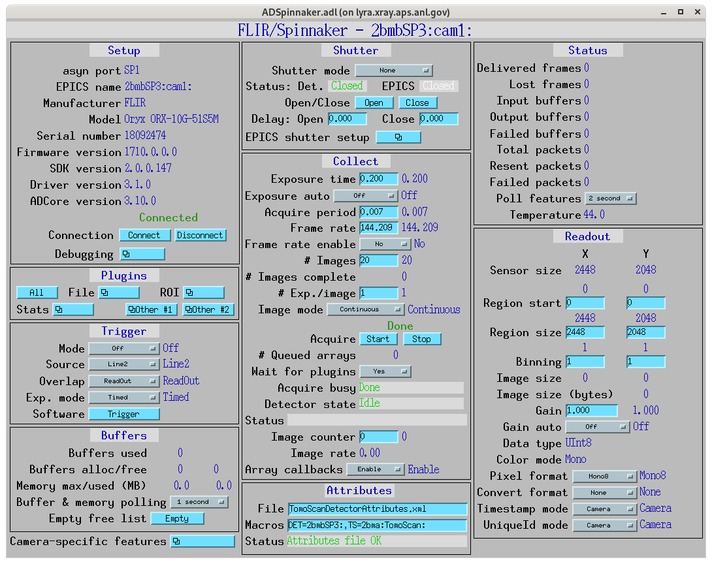
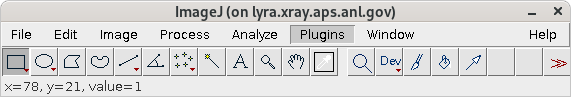
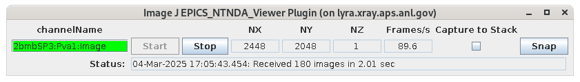
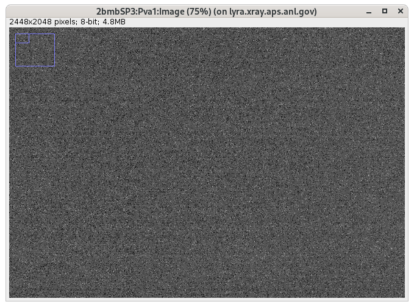
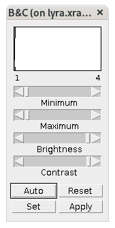

==========
Diagnostic
==========

Start areadetector
==================

To start the disgnostic detector in 2-BM-A:

::

    (base) 2bmb@arcturus ~ $ ssh lyra
    (base) 2bmb@lyra ~ $ 2bmbOryx5MP medm
    (base) 2bmb@lyra ~ $ 2bmbOryx5MP run

press Acquire Start to collect images.

Start ImageJ
============

To start imageJ:

::

    (base) 2bmb@lyra ~ $ imagej_2bm

then select ImageJ/Plugins/Epics_areaDetector/EPICS NTNDA Viewer:

To get images start on the NTNDA plugin

If needed scale the image palette with ImageJ/Image/Adjust/Brightness/Contrast...

