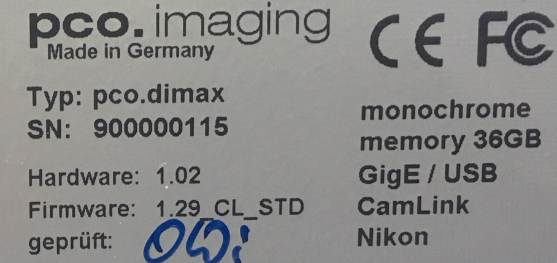
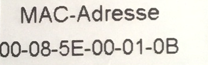
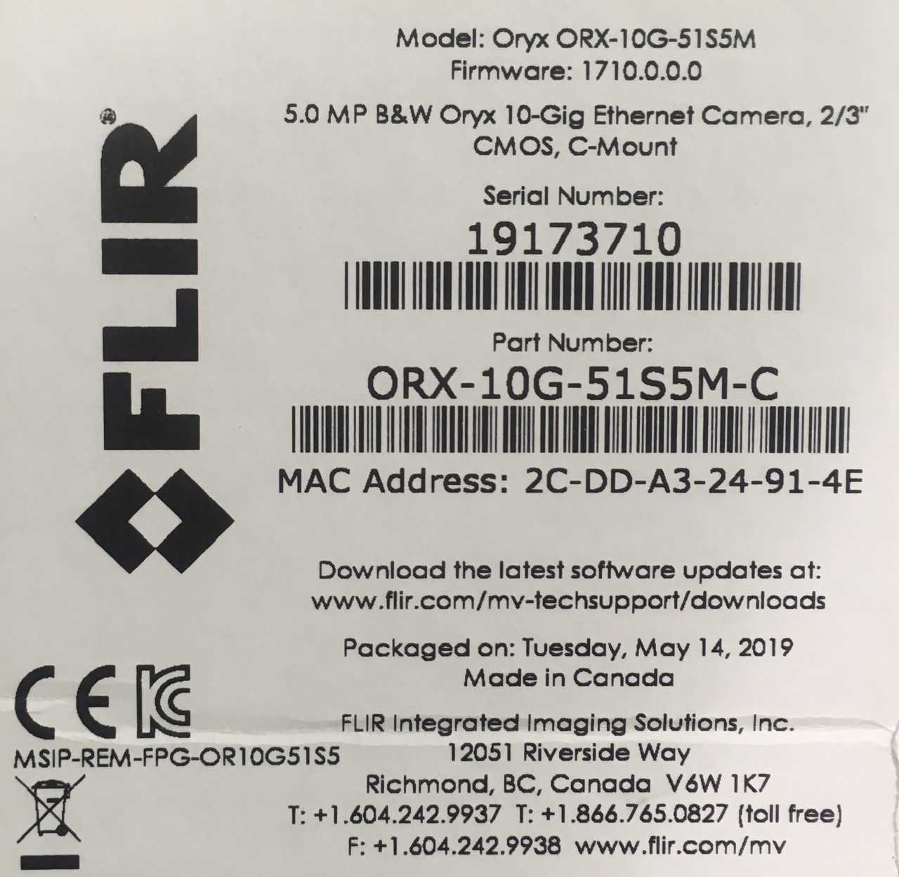
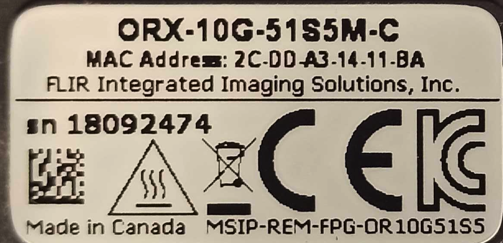
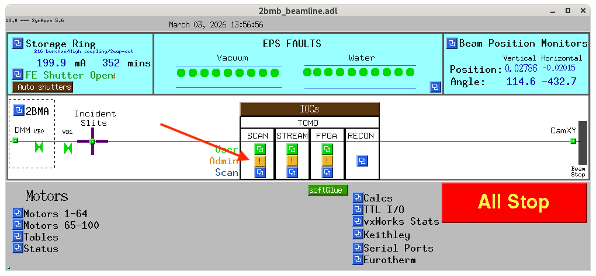
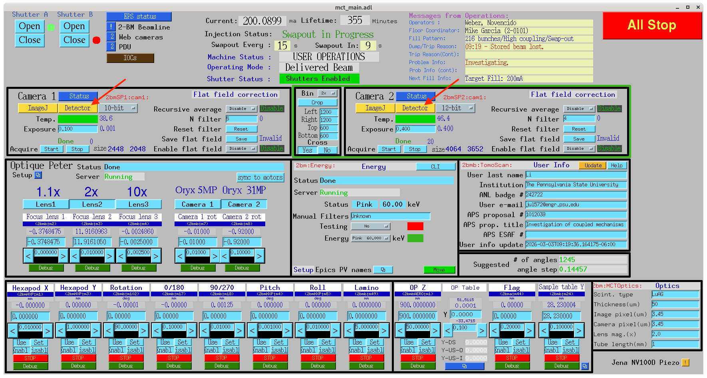
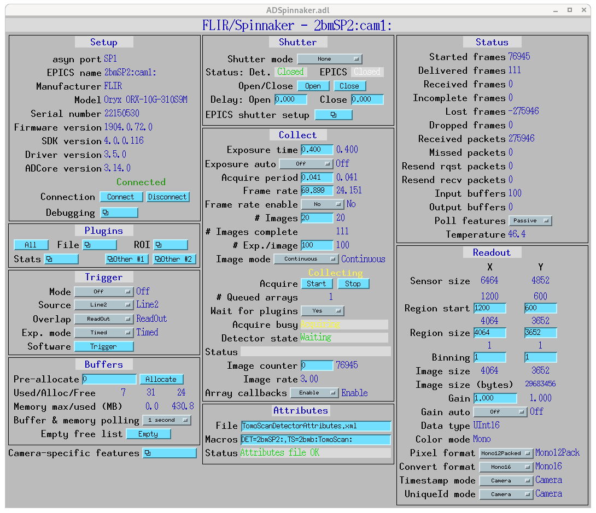

Detection
=========

The detection system consists of a camera, lens, and scintillator screen.
Below is a list of all camera, lens, and scintillator screen options available at 2-BM.

These are the computers supporting detectors at 2-BM:

+-----------+--------------+-------------------+-----------------+--------------------------+---------------------+
| Station   | Name         |      Model        |  Product No.    |    Serial No.            |        Manual       |
+===========+==============+===================+=================+==========================+=====================+
| 2-BM-B    | tomdet       |  Super Micro      | `SYS 521E WR`_  |  `tomdet label`_         | `tomdet SM`_        |
+-----------+--------------+-------------------+-----------------+--------------------------+---------------------+

.. _tomdet label: https://anl.box.com/s/b6qqmbplxsbxjbpmfkdb8ayrzabo9w4x
.. _tomdet SM: https://anl.box.com/s/67l25mjm9vkoxnbkydjubfl3ge9wmvs2
.. _SYS 521E WR: https://www.supermicro.com/en/products/system/up/2u/sys-521e-wr

These are the model/part number of the cameras in use at 2-BM:

.. _camera_00001:  https://www.ptgrey.com/grasshopper3-91mp-mono-usb3-vision-sony-icx814-camera
.. _camera_00002:  https://www.ptgrey.com/grasshopper3-23-mp-mono-usb3-vision-sony-pregius-imx174-camera
.. _camera_00003:  https://www.ptgrey.com/grasshopper3-50-mp-mono-usb3-vision-sony-pregius-imx250
.. _camera_00004:  http://www.pco.de/fileadmin/user_upload/pco-product_sheets/pco.dimax_hs_data_sheet.pdf
.. _camera_00005:  https://www.pco.de/scmos-cameras/pcoedge-42/
.. _camera_00006:  https://www.adimec.com/cameras/machine-vision-cameras/quartz-series/q-12a180/
.. _camera_00007:  https://www.flir.com/products/oryx-10gige/?model=ORX-10GS-51S5M-C&vertical=machine+vision&segment=iis
.. _camera_00008:  https://www.flir.com/products/oryx-10gige/?model=DEV-ORX-310S9M&vertical=machine+vision&segment=iis
.. _camera_00009:  https://vision.vieworks.com/en/camera/area_scan/VNP_series
.. _camera_00010:  https://anl.box.com/s/89t8lg9ncm5s4kikwctvdbd0ch517xgx
.. _camera_00011:  https://www.photometrics.com/products/kinetix-family/kinetix

.. _camera_order_00001: https://apps.inside.anl.gov/paris/req.jsp?reqNbr=F6-109062
.. _camera_order_00002: https://apps.inside.anl.gov/paris/req.jsp?reqNbr=F8-219026
.. _camera_order_00003: https://apps.inside.anl.gov/paris/req.jsp?reqNbr=F6-161074
.. _camera_order_00004: https://apps.inside.anl.gov/paris/req.jsp?reqNbr=G2-175013

.. _camera_quote_00001: https://anl.box.com/s/6yv344apeox44m5salxmj4tfmdtvdov4
.. _camera_quote_00002: https://anl.box.com/s/u2msg1ln3w3483cmpi2jna3mdmtinhm0

.. |d00006| image:: ../img/flir_2.png
   :width: 50px
   :alt: flir

Cameras
-------

+---------------------------------------------------------------+---------------+------------------+---------+------------+--------------------+-----------------------------------------+-----------------------------+-------------------------------+
|                   Camera                                      |  pixels (H×V) | pixel size (μm)  |   bit   | fps        |      Manual        | Part number                             |        Images               |          Purchase order       |
+===============================================================+===============+==================+=========+============+====================+=========================================+=============================+===============================+
| Grasshopper3 9.1 MP Mono USB3 Vision (Sony ICX814)            |  3376 × 2704  |       3.69       | 14      | 9          |     camera_00001_  | GS3-U3-91S6M-C                          |                             |   camera_order_00001_         |
+---------------------------------------------------------------+---------------+------------------+---------+------------+--------------------+-----------------------------------------+-----------------------------+-------------------------------+
| Grasshopper3 2.3 MP Mono USB3 Vision (Sony Pregius IMX174)    |  1920 × 1200  |       5.86       | 10      | 163        |     camera_00002_  | GS3-U3-23S6M-C                          |                             |   camera_order_00001_         |
+---------------------------------------------------------------+---------------+------------------+---------+------------+--------------------+-----------------------------------------+-----------------------------+-------------------------------+
| Grasshopper3 5.0 MP Mono USB3 Vision (Sony Pregius IMX250)    |  2448 × 2048  |       3.45       | 10      | 75         |     camera_00003_  | GS3-U3-51S5M-C                          |                             |   camera_order_00001_         |
+---------------------------------------------------------------+---------------+------------------+---------+------------+--------------------+-----------------------------------------+-----------------------------+-------------------------------+
| PCO DIMAX HS4  `(*)`                                          |  2000 × 2000  |       11         | 12      | 100 (2277) |     camera_00004_  | camera link                             |  |d00001| |d00002| |d00003| |                               |
+---------------------------------------------------------------+---------------+------------------+---------+------------+--------------------+-----------------------------------------+-----------------------------+-------------------------------+
| PCO EDGE 4.2   `(*)`                                          |  2048 × 2048  |       6.5        | 16      | 100        |     camera_00005_  | camera link                             |                             |                               |
+---------------------------------------------------------------+---------------+------------------+---------+------------+--------------------+-----------------------------------------+-----------------------------+-------------------------------+
| Adimec 12 MP `(**)`                                           |  4000 × 3000  |       5.5        | 8       | 187        |     camera_00006_  | Quartz quad CoaXPress Q-12A180 CMV12000 |                             |   camera_order_00003_         |
+---------------------------------------------------------------+---------------+------------------+---------+------------+--------------------+-----------------------------------------+-----------------------------+-------------------------------+
| **Oryx 5.0 MP Mono 10GigE** `(***)` **(†)**                   |  2448 × 2048  |       3.45       | 8–12    | 162        |     camera_00007_  | ORX-10G-51S5M-C                         |   |d00004| |d00005|         |   camera_order_00002_         |
+---------------------------------------------------------------+---------------+------------------+---------+------------+--------------------+-----------------------------------------+-----------------------------+-------------------------------+
| **Oryx 31.0 MP Mono 10GigE** `(***)` **(†)**                  |  6464 × 4852  |       3.45       | 8–12    | 26         |     camera_00008_  | ORX-10G-310S9M                          |   |d00006|                  |   camera_order_00004_         |
+---------------------------------------------------------------+---------------+------------------+---------+------------+--------------------+-----------------------------------------+-----------------------------+-------------------------------+
| Vieworks VNP-604MX-M6H00 (SONY IMX411) `(****)`               | 14192 × 10640 |       3.76       | 11–16   | 6.2        |     camera_00009_  | VNP-604MX-M6H00                         |                             |                               |
+---------------------------------------------------------------+---------------+------------------+---------+------------+--------------------+-----------------------------------------+-----------------------------+-------------------------------+
| pco.edge 10 BI CLHS `(*****)`                                 |  4432 × 2368  |       4.6        | 16      | 120        |     camera_00010_  | 10 BI CLHS                              |                             |    camera_quote_00001_        |
+---------------------------------------------------------------+---------------+------------------+---------+------------+--------------------+-----------------------------------------+-----------------------------+-------------------------------+
| Teledyne Kinetix 10                                           |  3200 × 3200  |       6.5        | 8/12/16 | 498        |     camera_00011_  | O1_KINETIX_10MP_PCIE                    |                             |    camera_quote_00002_        |
+---------------------------------------------------------------+---------------+------------------+---------+------------+--------------------+-----------------------------------------+-----------------------------+-------------------------------+

- `(*)`     Use MicroEnable IV VD4-CL.
- `(**)`    Use Euresys Quad-G3 CXP framegrabber.
- `(***)`   Use Myricom ARC Series C-Class network adapter.
- `(****)`  Use Euresys Coaxlink Quad CXP-12 framegrabber.
- `(*****)` Use Kaya Instruments Komodo II Camera Link.
- `(†)`     Typically installed on the Optique Peter system.

For cameras with on-board memory, the fps value in parentheses refers to
the maximum transfer rate to on-board memory.

Typical field-of-view configurations for the Optique Peter system:

+---------------+--------------------+----------------------+------------------------+
| Magnification | Pixel size (μm/px) | Oryx 5 MP FOV (mm)   | Oryx 31 MP FOV (mm)    |
+===============+====================+======================+========================+
|    1.1x       |       3.136        |   7.678 × 6.423      |   20.273 × 15.218      |
+---------------+--------------------+----------------------+------------------------+
|    2x         |       1.725        |   4.223 × 3.533      |   11.150 × 8.370       |
+---------------+--------------------+----------------------+------------------------+
|    5x         |       0.69         |   1.689 × 1.413      |   4.460 × 3.348        |
+---------------+--------------------+----------------------+------------------------+
|    7.5x       |       0.46         |   1.126 × 0.942      |   2.973 × 2.232        |
+---------------+--------------------+----------------------+------------------------+
|    10x        |       0.345        |   0.845 × 0.707      |   2.230 × 1.674        |
+---------------+--------------------+----------------------+------------------------+

Oryx
^^^^

To use the Flir Oryx camera ORX-10G-310S9M or ORX-10G-51S5M installed at
2-BM-B and connected to tomdet::

  [2bmb@tomdet]$ start_epics

then select Scan/Admin from:

to obtain the FLIR Oryx areadetector main control in the mct_main screen select:

To collect an image press Acquire Start.

Startup
~~~~~~~

.. contents::
   :local:

To start/stop the area detector IOC for the FLIR Oryx camera ORX-10G-310S9M
or ORX-10G-51S5M cameras login into 2bmb@tomdet then type::

    [2bmb@tomdet]$ bash
    (base) 2bmb@tomdet ~ $ 2bmbOryx5mp
    Usage: 2bmSP1.pl {caqtdm|console|edm|imagej|medm|phoebus|remote|restart|run|start|status|stop|usage}

::

    [2bmb@tomdet]$ bash
    (base) 2bmb@tomdet ~ $ 2bmbOryx31mp
    Usage: 2bmSP1.pl {caqtdm|console|edm|imagej|medm|phoebus|remote|restart|run|start|status|stop|usage}
