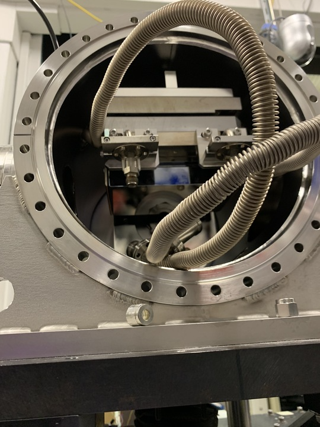

.. _ops-dmm:

===
DMM
===

2-BM has a double crystal multi-layer monochromator (DMM) to change energy.
The beamline x-ray energy change is managed by the `energy cli <https://github.com/xray-imaging/energy>`_ python library.

Login into user2bmb@arcturus then::

    [user2bmb@arcturus,42,~]$ bash
    [user2bmb@arcturus,42,~]$ energy set --mode Mono --energy-value 20

for help::

    energy -h

More detailed instructions are here the `energy cli <https://github.com/xray-imaging/energy>`_

Technical information about the DMM are available at the links below:

+-----------+--------------+-------------------+------------------------------------------------------------------------+
| Station   | Description  |   Images          |   Info                                                                 |
+===========+==============+===================+========================================================================+
| 2-BM-A    |     DMM      | |00001|, |00002|  | `drawings1`_, `drawings2`_, `crystals specs`_, `documentation folder`_ |
+-----------+--------------+-------------------+------------------------------------------------------------------------+

.. |00001| image:: ../img/dmm_01.png
    :width: 20pt
    :height: 20pt

.. _drawings1: https://anl.box.com/s/0whx6hy3lcqllocolhee8kq72y0f4wnn
.. _drawings2: https://anl.box.com/s/0sa7gjm3nbmacwjknxth0k98y21sa7iy
.. _crystals specs: https://anl.box.com/s/4o7fewu63rwm2tj0l9ezr79ccjozyn77
.. _documentation folder: https://anl.box.com/s/w1eg4cxw43715bnzk8jcg3hd64rdnsdl
