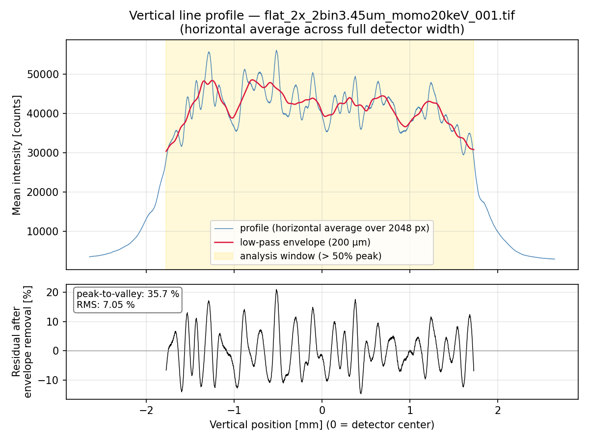

.. _ops-dmm:

===
DMM
===

2-BM has a double crystal multi-layer monochromator (DMM) to change energy.
The beamline x-ray energy change is managed by the `energy cli <https://github.com/xray-imaging/energy>`_ python library.

Login into 2bmb@arcturus then::

    [2bmb@arcturus,42,~]$ bash
    [2bmb@arcturus,42,~]$ energy set --mode Mono --energy-value 20

for help::

    energy -h

More detailed instructions are here the `energy cli <https://github.com/xray-imaging/energy>`_

Technical information about the DMM are available at the links below:

+-----------+--------------+-------------------+------------------------------------------------------------------------+
| Station   | Description  |   Images          |   Info                                                                 |
+===========+==============+===================+========================================================================+
| 2-BM-A    |     DMM      | |00001|, |00002|  | `drawings1`_, `drawings2`_, `crystals specs`_, `documentation folder`_ |
+-----------+--------------+-------------------+------------------------------------------------------------------------+

.. |00001| image:: ../img/dmm_01.png
    :width: 20pt
    :height: 20pt

.. |00002| image:: ../img/dmm_02.png
    :width: 20pt
    :height: 20pt

.. _drawings1: https://anl.box.com/s/0whx6hy3lcqllocolhee8kq72y0f4wnn
.. _drawings2: https://anl.box.com/s/0sa7gjm3nbmacwjknxth0k98y21sa7iy
.. _crystals specs: https://anl.box.com/s/4o7fewu63rwm2tj0l9ezr79ccjozyn77
.. _documentation folder: https://anl.box.com/s/w1eg4cxw43715bnzk8jcg3hd64rdnsdl

Substrate Specifications (Si <100>)
------------------------------------

+----------------------------+-------------------------------------------------------------+
| Parameter                  | Value                                                       |
+============================+=============================================================+
| Material                   | Si <100> flat                                               |
+----------------------------+-------------------------------------------------------------+
| Quantity                   | 2 pieces                                                    |
+----------------------------+-------------------------------------------------------------+
| Dimensions                 | 145.57 × 101.60 × 34.04 mm³ ± 0.25 mm                       |
+----------------------------+-------------------------------------------------------------+
| Optical Surface            | 140 × 92 mm²                                                |
+----------------------------+-------------------------------------------------------------+
| Spherical Radius           | > 20 km                                                     |
+----------------------------+-------------------------------------------------------------+
| Meridional Slope Error     | 1.0 µrad (rms)                                              |
+----------------------------+-------------------------------------------------------------+
| Sagittal Slope Error       | 1.0 µrad (rms)                                              |
+----------------------------+-------------------------------------------------------------+
| Microroughness             | ≤ 0.3 nm (rms) HSFR                                         |
+----------------------------+-------------------------------------------------------------+
| HSFR Spatial Sampling      | 0.004–1 µm                                                  |
+----------------------------+-------------------------------------------------------------+
| Manufacturing Note         | Grooves per ANL drawing "X2-230001-00" (28 Jan 1998)        |
+----------------------------+-------------------------------------------------------------+

Coating Specifications (W–B₄C Multilayer)
------------------------------------------

+---------------------------+----------------------------------------------+
| Parameter                 | Value                                        |
+===========================+==============================================+
| Coating Type              | W–B₄C multilayer on Si substrate             |
+---------------------------+----------------------------------------------+
| Adhesion Layer            | 5 nm Cr                                      |
+---------------------------+----------------------------------------------+
| Stripe Dimension          | 140 × 44 mm²                                 |
+---------------------------+----------------------------------------------+
| Distance Between Stripes  | 4 mm                                         |
+---------------------------+----------------------------------------------+
| Multilayer Period         | 13.8 Å and 24 Å ± <1%                        |
+---------------------------+----------------------------------------------+
| Interface Roughness       | 2–3 Å rms                                    |
+---------------------------+----------------------------------------------+
| Number of Layer Pairs     | 200 / 150                                    |
+---------------------------+----------------------------------------------+
| Gamma (Γ)                 | 0.5                                          |
+---------------------------+----------------------------------------------+

Stripe-Free Multilayer
----------------------

This section collects all information related to the Stripe-Free Multilayer project.

Reference documents
~~~~~~~~~~~~~~~~~~~

The documents below describe the 2-BM beamline layout before and after the APS-U upgrade,
and are used as the geometric reference for the Stripe-Free Multilayer design.

- `A342-RT1000-00 LAY.pdf`_ — pre-APS-U beamline layout and ray-tracing drawing.
- `02-BM Beamline Component Reference Table.docx`_ — pre-APS-U component reference table listing the elements along the beamline and their distances from the source.
- `APSU_FDR_Summary_2-BM.docx`_ — APS-U Final Design Review summary for 2-BM. The new bending-magnet source is repositioned so that components sit **1822 mm farther** from the source than in the original lattice. To keep the existing enclosures usable, the beamline centerline is **rotated 1.35 mrad inboard** around the new source and **offset 42.295 mm inboard** laterally relative to the original APS lattice BM centerline, accepting a 2.7 mrad fan (1.85 mrad through the front end).

.. _A342-RT1000-00 LAY.pdf: https://anl.box.com/s/0wv87wgi53qhrn12r0pwnvp4yzguty67
.. _02-BM Beamline Component Reference Table.docx: https://anl.box.com/s/afme9vpllerzzvsuzqiyxn7aukh7292j
.. _APSU_FDR_Summary_2-BM.docx: https://anl.box.com/s/wekd7eymzjjhs6mba2f7zu8x6kbokkl5

Post APS-U component Z positions
~~~~~~~~~~~~~~~~~~~~~~~~~~~~~~~~

Z is measured along the beam direction from the center of the straight section.
Post APS-U values are obtained from the pre APS-U Z (component reference table) plus the
**+1822 mm** source repositioning specified in the FDR summary.

+--------------------------------------+------------------+-------------------+
| Component                            | Pre APS-U Z [mm] | Post APS-U Z [mm] |
+======================================+==================+===================+
| :doc:`Y3-30 Mirror <item_045>`       | 27626.2          | 29448.2           |
+--------------------------------------+------------------+-------------------+
| DMM — first mirror                   | 29335.2          | 31157.2           |
+--------------------------------------+------------------+-------------------+
| DMM — second mirror                  | 29934.2          | 31756.2           |
+--------------------------------------+------------------+-------------------+

Vertical intensity modulation
~~~~~~~~~~~~~~~~~~~~~~~~~~~~~

This section quantifies the vertical intensity modulation currently observed in the
monochromatic beam delivered by the DMM. The modulation is the main motivation for the
Stripe-Free Multilayer project: residual stripe structure in the W–B₄C coating prints a
periodic intensity pattern along the vertical direction of the beam, which in turn shows
up as horizontal bands in the projection images and as ring/streak artifacts in the
reconstructed volumes.

Measurement setup
^^^^^^^^^^^^^^^^^

The flat fields used for this analysis are the white fields collected during the
:doc:`Flat Field Stability Measurement <item_070>` (``flats_01``, Feb 22, 2026),
available via
`Globus (flats_01) <https://app.globus.org/file-manager?origin_id=054a0877-97ca-4d80-947f-47ca522b173e&origin_path=%2F2026-03%2F2026-03-DeCarlo-0%2Fdata%2Fflats_01%2F>`_.
File-naming convention: ``flat_2x_2bin3.45um_momo20keV_NNNN.tif`` (4710 frames in 471
sets of 10, one set every 60 s over ~8 hours).

The beamline (energy, M1, DMM) and the imaging chain (scintillator, objective, effective
pixel size) match the :doc:`Vibration Frequency Measurement <item_070>` used earlier;
what differs in ``flats_01`` is the detector ROI (2048 × 1536 px instead of 1024 × 1024),
the exposure time (0.1 s instead of 0.009999 s), and the cadence/format (10 frames every
60 s saved as TIFFs, rather than a continuous 99 fps HDF5 stream). The values below
reflect the ``flats_01`` configuration.

+----------------------------------------------+-----------------------------------------------+
| Item                                         | Value                                         |
+==============================================+===============================================+
| X-ray energy                                 | 20.0 keV                                      |
+----------------------------------------------+-----------------------------------------------+
| Monochromator                                | 2-BM-A double multilayer monochromator        |
+----------------------------------------------+-----------------------------------------------+
| DMM upstream arm angle (``us_arm``)          | 0.72579 ° (≈ 12.668 mrad)                     |
+----------------------------------------------+-----------------------------------------------+
| DMM downstream arm angle (``ds_arm``)        | 0.73808 ° (≈ 12.882 mrad)                     |
+----------------------------------------------+-----------------------------------------------+
| Mirror (M1)                                  | 2-BM Mirror, Pt stripe                        |
+----------------------------------------------+-----------------------------------------------+
| M1 grazing-incidence angle                   | 0.15 ° (≈ 2.618 mrad)                         |
+----------------------------------------------+-----------------------------------------------+
| Scintillator                                 | LuAG, 50 µm active thickness                  |
+----------------------------------------------+-----------------------------------------------+
| Objective magnification / tube length        | 2.0× / 1.0 mm                                 |
+----------------------------------------------+-----------------------------------------------+
| Camera                                       | FLIR Oryx ORX-10G-51S5M (s/n 19173710)        |
+----------------------------------------------+-----------------------------------------------+
| Camera pixel size (sensor)                   | 3.45 µm                                       |
+----------------------------------------------+-----------------------------------------------+
| Effective image pixel size                   | 3.45 µm (1.725 µm native × 2× binning)        |
+----------------------------------------------+-----------------------------------------------+
| ROI (X × Y) / binning                        | 2048 × 1536 px / 2× binning                   |
+----------------------------------------------+-----------------------------------------------+
| Field of view at detector (H × V)            | ≈ 7.07 × 5.30 mm                              |
+----------------------------------------------+-----------------------------------------------+
| Exposure time                                | 0.1 s                                         |
+----------------------------------------------+-----------------------------------------------+
| Acquisition cadence                          | 10 frames / set, 1 set every 60 s, ~8 h total |
+----------------------------------------------+-----------------------------------------------+
| Flat-field source files                      | ``flat_2x_2bin3.45um_momo20keV_NNNN.tif``     |
|                                              | (4710 TIFFs in ``flats_01``, Feb 22, 2026)    |
+----------------------------------------------+-----------------------------------------------+
| Detector Z from source (post APS-U)          | ≈ 54000 mm (54 m)                             |
+----------------------------------------------+-----------------------------------------------+
| Distance DMM 2nd mirror → detector           | ≈ 22244 mm (54000 − 31756.2)                  |
+----------------------------------------------+-----------------------------------------------+

Quantitative metrics
^^^^^^^^^^^^^^^^^^^^

The following metrics will be reported from a vertical line profile through the flat
field (averaged horizontally over the usable beam width):

+---------------------------------------+----------------------------------------------+
| Metric                                | Value                                        |
+=======================================+==============================================+
| Peak-to-valley modulation [%]         | 35.7                                         |
+---------------------------------------+----------------------------------------------+
| RMS modulation [%]                    | 7.0                                          |
+---------------------------------------+----------------------------------------------+
| Dominant vertical period [µm]         | ≈ 130                                        |
+---------------------------------------+----------------------------------------------+
| Number of visible bands across beam   | 33 (in the ~3.5 mm analysis window)          |
+---------------------------------------+----------------------------------------------+
| Stability over time (drift) [%/h]     | *to be filled in*                            |
+---------------------------------------+----------------------------------------------+

Modulation is defined as:

.. math::

    M_\mathrm{pv} = \frac{I_\mathrm{max} - I_\mathrm{min}}{I_\mathrm{max} + I_\mathrm{min}}
    \qquad
    M_\mathrm{rms} = \frac{\sigma_I}{\langle I \rangle}

computed on the flat-field profile after dark subtraction and normalization to the slowly
varying envelope (low-pass filtered profile), so that only the high-frequency stripe
contribution is retained.

Reference flat-field images and line profiles
^^^^^^^^^^^^^^^^^^^^^^^^^^^^^^^^^^^^^^^^^^^^^

.. figure:: ../img/flat_2x_2bin3.45um_momo20keV_001.png
   :width: 1024px
   :align: center
   :alt: Reference flat-field image from flats_01

   Reference flat-field image from the ``flats_01`` dataset
   (``flat_2x_2bin3.45um_momo20keV_0001``), showing the horizontal stripe pattern
   imprinted on the beam by the W–B₄C multilayer coating of the DMM. The vertical
   intensity modulation quantified in this section is extracted from this and similar
   frames.

   Vertical line profile obtained from
   ``flat_2x_2bin3.45um_momo20keV_001.tif`` by averaging horizontally across the full
   2048-pixel detector width. **Top:** raw profile (blue) with the low-pass envelope
   (red, 200 µm moving average) overlaid; the yellow band marks the analysis window
   where the beam intensity exceeds 50 % of its peak (~3.5 mm vertical extent).
   **Bottom:** residual after envelope removal — the high-frequency stripe contribution
   isolated by :math:`(I - I_\mathrm{env}) / I_\mathrm{env}`. From this profile the
   peak-to-valley modulation is **35.7 %** and the RMS modulation is **7.0 %**, with
   a dominant vertical period of **≈ 130 µm** (≈ 33 bright bands across the
   illuminated window).
