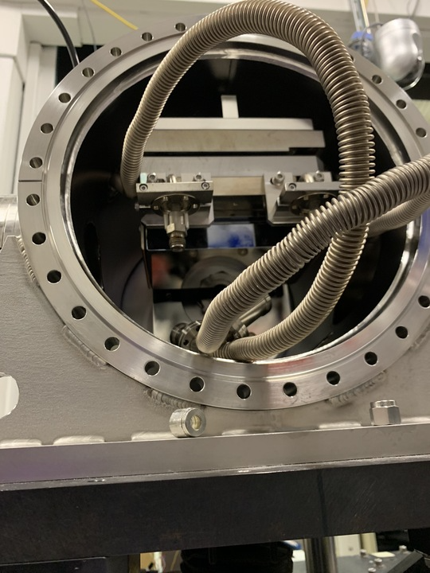
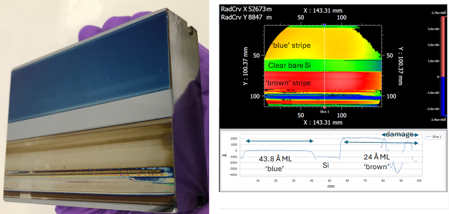
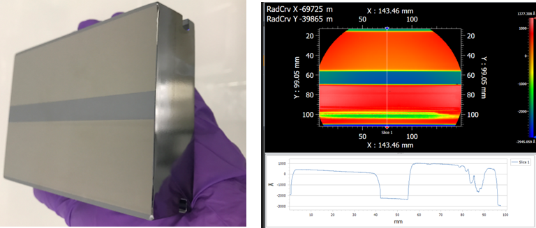
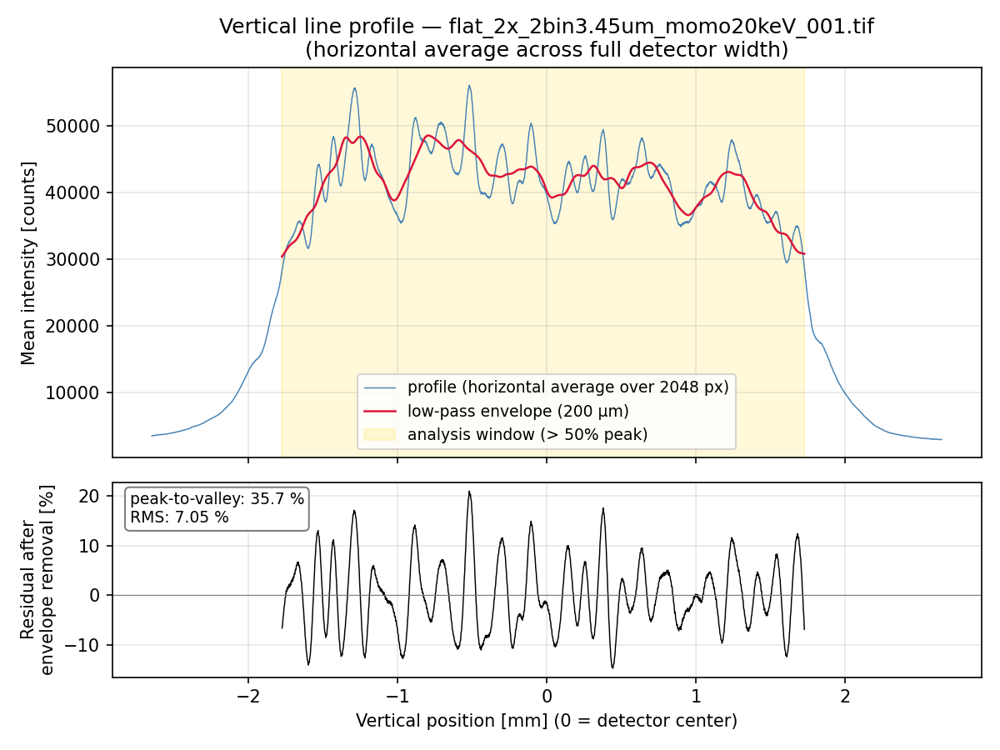
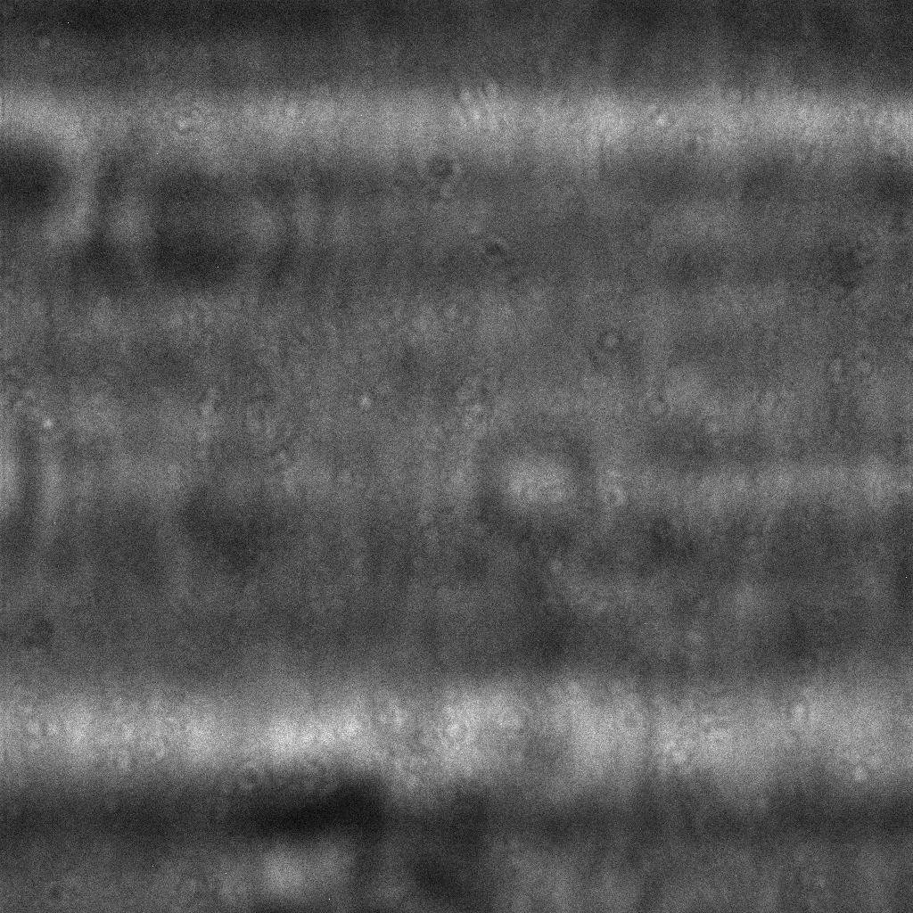

.. _ops-dmm:

===
DMM
===

2-BM has a double crystal multi-layer monochromator (DMM) to change energy.
The beamline x-ray energy change is managed by the `energy cli <https://github.com/decarlof/energy>`_ python library.

Login into 2bmb@arcturus then::

    [2bmb@arcturus,42,~]$ bash
    [2bmb@arcturus,42,~]$ energy set --mode Mono --energy-value 20

for help::

    energy -h

More detailed instructions are here the `energy cli <https://github.com/decarlof/energy>`_

Technical information about the DMM are available at the links below:

+-----------+--------------+-------------------+------------------------------------------------------------------------+
| Station   | Description  |   Images          |   Info                                                                 |
+===========+==============+===================+========================================================================+
| 2-BM-A    |     DMM      | |00001|, |00002|  | `drawings1`_, `drawings2`_, `crystals specs`_, `documentation folder`_ |
+-----------+--------------+-------------------+------------------------------------------------------------------------+

.. |00001| image:: ../img/dmm_01.png
    :width: 20pt
    :height: 20pt

.. _drawings1: https://anl.box.com/s/0whx6hy3lcqllocolhee8kq72y0f4wnn
.. _drawings2: https://anl.box.com/s/0sa7gjm3nbmacwjknxth0k98y21sa7iy
.. _crystals specs: https://anl.box.com/s/4o7fewu63rwm2tj0l9ezr79ccjozyn77
.. _documentation folder: https://anl.box.com/s/w1eg4cxw43715bnzk8jcg3hd64rdnsdl

Substrate Specifications (Si <100>)
------------------------------------

+----------------------------+-------------------------------------------------------------+
| Parameter                  | Value                                                       |
+============================+=============================================================+
| Material                   | Si <100> flat                                               |
+----------------------------+-------------------------------------------------------------+
| Quantity                   | 2 pieces                                                    |
+----------------------------+-------------------------------------------------------------+
| Dimensions                 | 145.57 × 101.60 × 34.04 mm³ ± 0.25 mm                       |
+----------------------------+-------------------------------------------------------------+
| Optical Surface            | 140 × 92 mm²                                                |
+----------------------------+-------------------------------------------------------------+
| Spherical Radius           | > 20 km                                                     |
+----------------------------+-------------------------------------------------------------+
| Meridional Slope Error     | 1.0 µrad (rms)                                              |
+----------------------------+-------------------------------------------------------------+
| Sagittal Slope Error       | 1.0 µrad (rms)                                              |
+----------------------------+-------------------------------------------------------------+
| Microroughness             | ≤ 0.3 nm (rms) HSFR                                         |
+----------------------------+-------------------------------------------------------------+
| HSFR Spatial Sampling      | 0.004–1 µm                                                  |
+----------------------------+-------------------------------------------------------------+
| Manufacturing Note         | Grooves per ANL drawing "X2-230001-00" (28 Jan 1998)        |
+----------------------------+-------------------------------------------------------------+

Coating Specifications (W–B₄C Multilayer)
------------------------------------------

+---------------------------+----------------------------------------------+
| Parameter                 | Value                                        |
+===========================+==============================================+
| Coating Type              | W–B₄C multilayer on Si substrate             |
+---------------------------+----------------------------------------------+
| Adhesion Layer            | 5 nm Cr                                      |
+---------------------------+----------------------------------------------+
| Stripe Dimension          | 140 × 44 mm²                                 |
+---------------------------+----------------------------------------------+
| Distance Between Stripes  | 4 mm                                         |
+---------------------------+----------------------------------------------+
| Multilayer Period         | 13.8 Å and 24 Å ± <1%                        |
+---------------------------+----------------------------------------------+
| Interface Roughness       | 2–3 Å rms                                    |
+---------------------------+----------------------------------------------+
| Number of Layer Pairs     | 200 / 150                                    |
+---------------------------+----------------------------------------------+
| Gamma (Γ)                 | 0.5                                          |
+---------------------------+----------------------------------------------+

Second Crystal Cleaning (Sep 2026)
-----------------------------------

The two-stripe W–B₄C multilayer second crystal (fabricated in 2007) was removed from the
beamline and sent to the APS Optics Group for cleaning. Bing Shi performed the cleaning and
Gary Navrotski measured the optic before and after. Results reported Sep 29, 2026.

On removal, the ``d`` = 24 Å stripe showed physical damage and various contamination, and the
``d`` ≈ 44 Å stripe showed contamination. After cleaning **all contamination was removed and
the surface roughness was significantly reduced**, but the **damage on the**
``d`` **= 24 Å stripe remains**.

The metrology maps identify the two stripes as follows, separated by a band of clear bare Si:

+--------------------------+----------------------+-------------------------------------------+
| Stripe (as labelled)     | Multilayer period    | Condition                                 |
+==========================+======================+===========================================+
| Top — "blue"             | 43.8 Å               | Contaminated only; fully recovered        |
+--------------------------+----------------------+-------------------------------------------+
| Bottom — "brown"         | 24 Å                 | Contaminated **and** damaged; damage      |
|                          |                      | remains after cleaning                    |
+--------------------------+----------------------+-------------------------------------------+

Before cleaning
~~~~~~~~~~~~~~~

   DMM second crystal as removed from the beamline: photograph (left) and metrology height map
   with vertical line profile (right), over a 143.31 × 100.37 mm² area. The top ("blue") and
   bottom ("brown") multilayer stripes are separated by a band of clear bare Si. Contamination
   is visible on both stripes and is heaviest along the lower edge of the brown stripe, where
   the profile also marks the damaged region at the far edge of the 24 Å stripe.

After cleaning
~~~~~~~~~~~~~~

   DMM second crystal after cleaning: photograph (left) and metrology height map with vertical
   line profile (right), over a 143.46 × 99.05 mm² area. All contamination is gone and the
   surface roughness is much improved, but the trough structure at the far edge of the 24 Å
   stripe persists.

Metrology summary
~~~~~~~~~~~~~~~~~

+-------------------------------------------+---------------------------+---------------------------+
| Region                                    | Before cleaning           | After cleaning            |
+===========================================+===========================+===========================+
| Top stripe (blue) — RMS                   | 7.6 ± 2.7 Å               | 4.6 ± 1.8 Å               |
+-------------------------------------------+---------------------------+---------------------------+
| Top stripe (blue) — P-V                   | 80.7 ± 50.7 Å             | 44.3 ± 24.6 Å             |
+-------------------------------------------+---------------------------+---------------------------+
| Bottom stripe (brown), top 2/3 — RMS      | 5.8 ± 0.9 Å               | 2.7 ± 0.91 Å              |
+-------------------------------------------+---------------------------+---------------------------+
| Bottom stripe (brown), top 2/3 — P-V      | 49.6 ± 8.2 Å              | 34.0 ± 25.0 Å             |
+-------------------------------------------+---------------------------+---------------------------+
| Bottom stripe (brown), bottom 1/3 — RMS   | 93.1 ± 18.6 Å             | 5.5 ± 1.6 Å               |
+-------------------------------------------+---------------------------+---------------------------+
| Bottom stripe (brown), bottom 1/3 — P-V   | 620.2 ± 70.1 Å            | 42.5 ± 19.1 Å             |
+-------------------------------------------+---------------------------+---------------------------+

Observations
~~~~~~~~~~~~

**Top (blue) stripe.** Before cleaning it had uniform polishing texturing and a uniform
distribution of scratches, pits and defects. After cleaning the stripe is clean; the uniform
polishing texture and the uniform distribution of scratches and pits remain, and the roughness
improved by a factor of ≈ 2×.

**Bottom (brown) stripe, upper 2/3.** Good and uniform before cleaning, with further improved
roughness after cleaning.

**Bottom (brown) stripe, lower 1/3.** Before cleaning this region had deep troughs 500–1000 Å
deep along the entire length. After cleaning the troughs remain — measured up to 2000 Å deep
along the entire length — and surface pitting remains. Surface peak contaminants are gone and
the reported roughness is much improved.

.. note::

   Three different values appear for the period of the top ("blue") stripe: the coating
   specification above lists **13.8 Å**, the metrology map is annotated **43.8 Å**, and Bing
   Shi's cover note quotes **48 Å**. The bottom ("brown") stripe is consistently **24 Å**. The
   13.8 / 43.8 pair differs by a single digit and looks like a transcription error in one of
   the two documents; the as-built period should be confirmed against the `crystals specs`_
   before it is used for energy calibration.

Stripe-Free Multilayer
----------------------

This section collects all information related to the Stripe-Free Multilayer project.

Reference documents
~~~~~~~~~~~~~~~~~~~

The documents below describe the 2-BM beamline layout before and after the APS-U upgrade,
and are used as the geometric reference for the Stripe-Free Multilayer design.

- `A342-RT1000-00 LAY.pdf`_ — pre-APS-U beamline layout and ray-tracing drawing.
- `02-BM Beamline Component Reference Table.docx`_ — pre-APS-U component reference table listing the elements along the beamline and their distances from the source.
- `APSU_FDR_Summary_2-BM.docx`_ — APS-U Final Design Review summary for 2-BM. The new bending-magnet source is repositioned so that components sit **1822 mm farther** from the source than in the original lattice. To keep the existing enclosures usable, the beamline centerline is **rotated 1.35 mrad inboard** around the new source and **offset 42.295 mm inboard** laterally relative to the original APS lattice BM centerline, accepting a 2.7 mrad fan (1.85 mrad through the front end).

.. _A342-RT1000-00 LAY.pdf: https://anl.box.com/s/0wv87wgi53qhrn12r0pwnvp4yzguty67
.. _02-BM Beamline Component Reference Table.docx: https://anl.box.com/s/afme9vpllerzzvsuzqiyxn7aukh7292j
.. _APSU_FDR_Summary_2-BM.docx: https://anl.box.com/s/wekd7eymzjjhs6mba2f7zu8x6kbokkl5

Post APS-U component Z positions
~~~~~~~~~~~~~~~~~~~~~~~~~~~~~~~~

Z is measured along the beam direction from the center of the straight section.
Post APS-U values are obtained from the pre APS-U Z (component reference table) plus the
**+1822 mm** source repositioning specified in the FDR summary.

+--------------------------------------+-------------------+
| Component                            | Post APS-U Z [mm] |
+======================================+===================+
| :doc:`Y3-30 Mirror <item_045>`       | 27626.2           |
+--------------------------------------+-------------------+
| DMM — first mirror                   | 29335.2           |
+--------------------------------------+-------------------+
| DMM — second mirror                  | 29934.2           |
+--------------------------------------+-------------------+

Vertical intensity modulation
~~~~~~~~~~~~~~~~~~~~~~~~~~~~~

This section quantifies the vertical intensity modulation currently observed in the
monochromatic beam delivered downstream of M1 + DMM. The modulation is the main
motivation for the Stripe-Free Multilayer project: it shows up as horizontal bands in
the projection images and as ring/streak artifacts in the reconstructed volumes.

Two distinct contributions can be separated by the choice of exposure time:

- A **slow, stationary modulation** from the **M1 mirror** (figure error / coating),
  best characterised with the long-exposure ``flats_01`` dataset.
- A **fast, moving stripe pattern** from the **DMM** (residual W–B₄C stripe
  structure), best characterised with the short-exposure, high-rate
  ``S11-AHU505_1000frms_99fps_001.h5`` stream, which freezes the motion.

Measurement setup
^^^^^^^^^^^^^^^^^

The flat fields used for this analysis are the white fields collected during the
:doc:`Flat Field Stability Measurement <item_070>` (``flats_01``, Feb 22, 2026),
available via
`Globus (flats_01) <https://app.globus.org/file-manager?origin_id=054a0877-97ca-4d80-947f-47ca522b173e&origin_path=%2F2026-03%2F2026-03-DeCarlo-0%2Fdata%2Fflats_01%2F>`_.
File-naming convention: ``flat_2x_2bin3.45um_momo20keV_NNNN.tif`` (4710 frames in 471
sets of 10, one set every 60 s over ~8 hours).

The beamline (energy, M1, DMM) and the imaging chain (scintillator, objective, effective
pixel size) match the :doc:`Vibration Frequency Measurement <item_070>` used earlier;
what differs in ``flats_01`` is the detector ROI (2048 × 1536 px instead of 1024 × 1024),
the exposure time (0.1 s instead of 0.009999 s), and the cadence/format (10 frames every
60 s saved as TIFFs, rather than a continuous 99 fps HDF5 stream). The values below
reflect the ``flats_01`` configuration.

+----------------------------------------------+-----------------------------------------------+
| Item                                         | Value                                         |
+==============================================+===============================================+
| X-ray energy                                 | 20.0 keV                                      |
+----------------------------------------------+-----------------------------------------------+
| Monochromator                                | 2-BM-A double multilayer monochromator        |
+----------------------------------------------+-----------------------------------------------+
| DMM upstream arm angle (``us_arm``)          | 0.72579 ° (≈ 12.668 mrad)                     |
+----------------------------------------------+-----------------------------------------------+
| DMM downstream arm angle (``ds_arm``)        | 0.73808 ° (≈ 12.882 mrad)                     |
+----------------------------------------------+-----------------------------------------------+
| Mirror (M1)                                  | 2-BM Mirror, Pt stripe                        |
+----------------------------------------------+-----------------------------------------------+
| M1 grazing-incidence angle                   | 0.15 ° (≈ 2.618 mrad)                         |
+----------------------------------------------+-----------------------------------------------+
| Scintillator                                 | LuAG, 50 µm active thickness                  |
+----------------------------------------------+-----------------------------------------------+
| Objective magnification / tube length        | 2.0× / 1.0 mm                                 |
+----------------------------------------------+-----------------------------------------------+
| Camera                                       | FLIR Oryx ORX-10G-51S5M (s/n 19173710)        |
+----------------------------------------------+-----------------------------------------------+
| Camera pixel size (sensor)                   | 3.45 µm                                       |
+----------------------------------------------+-----------------------------------------------+
| Effective image pixel size                   | 3.45 µm (1.725 µm native × 2× binning)        |
+----------------------------------------------+-----------------------------------------------+
| ROI (X × Y) / binning                        | 2048 × 1536 px / 2× binning                   |
+----------------------------------------------+-----------------------------------------------+
| Field of view at detector (H × V)            | ≈ 7.07 × 5.30 mm                              |
+----------------------------------------------+-----------------------------------------------+
| Exposure time                                | 0.1 s                                         |
+----------------------------------------------+-----------------------------------------------+
| Acquisition cadence                          | 10 frames / set, 1 set every 60 s, ~8 h total |
+----------------------------------------------+-----------------------------------------------+
| Flat-field source files                      | ``flat_2x_2bin3.45um_momo20keV_NNNN.tif``     |
|                                              | (4710 TIFFs in ``flats_01``, Feb 22, 2026)    |
+----------------------------------------------+-----------------------------------------------+
| Detector Z from source (post APS-U)          | ≈ 54000 mm (54 m)                             |
+----------------------------------------------+-----------------------------------------------+
| Distance DMM 2nd mirror → detector           | ≈ 24066 mm (54000 − 29934.2)                  |
+----------------------------------------------+-----------------------------------------------+

Quantitative metrics (mirror contribution, ``flats_01``)
^^^^^^^^^^^^^^^^^^^^^^^^^^^^^^^^^^^^^^^^^^^^^^^^^^^^^^^^

The following metrics are computed from a vertical line profile through a single
``flats_01`` frame, averaged horizontally over the usable beam width. They characterise
the **mirror-induced** modulation only; the DMM stripe contribution is averaged out by
the 0.1 s exposure (see next subsection).

+---------------------------------------+----------------------------------------------+
| Metric                                | Value                                        |
+=======================================+==============================================+
| Peak-to-valley modulation [%]         | 35.7                                         |
+---------------------------------------+----------------------------------------------+
| RMS modulation [%]                    | 7.0                                          |
+---------------------------------------+----------------------------------------------+
| Dominant vertical period [µm]         | ≈ 130                                        |
+---------------------------------------+----------------------------------------------+
| Number of visible bands across beam   | 33 (in the ~3.5 mm analysis window)          |
+---------------------------------------+----------------------------------------------+
| Stability over time (drift) [%/h]     | *to be filled in*                            |
+---------------------------------------+----------------------------------------------+

Modulation is defined as:

.. math::

    M_\mathrm{pv} = \frac{I_\mathrm{max} - I_\mathrm{min}}{I_\mathrm{max} + I_\mathrm{min}}
    \qquad
    M_\mathrm{rms} = \frac{\sigma_I}{\langle I \rangle}

computed on the flat-field profile after dark subtraction and normalization to the slowly
varying envelope (low-pass filtered profile), so that only the high-frequency stripe
contribution is retained.

Mirror-induced modulation (from ``flats_01``)
^^^^^^^^^^^^^^^^^^^^^^^^^^^^^^^^^^^^^^^^^^^^^

The ``flats_01`` exposures average out the fast DMM stripe motion (0.1 s exposure
covers many cycles of the moving DMM pattern, see next subsection) and therefore
reveal mainly the **slowly varying, stationary modulation that originates at the M1
mirror**. The ~130 µm vertical period quantified below is attributed to figure error
on M1, not to the DMM coating.

.. figure:: ../img/flat_2x_2bin3.45um_momo20keV_001.png
   :width: 1024px
   :align: center
   :alt: Reference flat-field image from flats_01

   Reference flat-field image from the ``flats_01`` dataset
   (``flat_2x_2bin3.45um_momo20keV_0001``). The smooth horizontal banding visible here
   is the **mirror** contribution; the much faster DMM stripes are averaged out by the
   0.1 s exposure.

   Vertical line profile obtained from
   ``flat_2x_2bin3.45um_momo20keV_001.tif`` by averaging horizontally across the full
   2048-pixel detector width. **Top:** raw profile (blue) with the low-pass envelope
   (red, 200 µm moving average) overlaid; the yellow band marks the analysis window
   where the beam intensity exceeds 50 % of its peak (~3.5 mm vertical extent).
   **Bottom:** residual after envelope removal — the high-frequency mirror contribution
   isolated by :math:`(I - I_\mathrm{env}) / I_\mathrm{env}`. From this profile the
   peak-to-valley modulation is **35.7 %** and the RMS modulation is **7.0 %**, with
   a dominant vertical period of **≈ 130 µm** (≈ 33 bright bands across the
   illuminated window).

DMM-induced stripes (from ``S11-AHU505_1000frms_99fps_001.h5``)
^^^^^^^^^^^^^^^^^^^^^^^^^^^^^^^^^^^^^^^^^^^^^^^^^^^^^^^^^^^^^^^

The DMM contribution sits **on top** of the mirror-induced modulation and is best
seen in the short-exposure, high-rate stream of the
:doc:`Vibration Frequency Measurement <item_070>` — file
``S11-AHU505_1000frms_99fps_001.h5`` (1000 frames at 99 fps, 0.009999 s exposure),
available via
`Globus (test_20251219_APS_PVs) <https://app.globus.org/file-manager?origin_id=054a0877-97ca-4d80-947f-47ca522b173e&origin_path=%2F2025-12%2F2025-12-DeCarlo-0%2Fdata%2Ftest_20251219_APS_PVs%2F&two_pane=true>`_.
Played back as a movie, the horizontal stripes shift **vertically and rapidly**
frame-to-frame — a clear fingerprint of the DMM (the mirror pattern is static).

   Single frame extracted from ``S11-AHU505_1000frms_99fps_001.h5`` (one of the 1000
   frames stored in the HDF5 file), representative of the DMM-induced horizontal
   stripes. Two stripe periodicities are visible: a fine spacing of ~83 px between
   adjacent bright stripes, and a coarser envelope with spacing of ~700 px between
   the strongest bands.

Two characteristic vertical spacings can be measured on the DMM stripe pattern
(detector effective pixel size = 3.45 µm):

+--------------------------------------+----------+-----------+
| Feature                              | Distance | Distance  |
|                                      | [px]     | [µm]      |
+======================================+==========+===========+
| Fine spacing (adjacent stripes)      | ≈ 83     | ≈ 286     |
+--------------------------------------+----------+-----------+
| Coarse spacing (envelope of strong   | ≈ 700    | ≈ 2415    |
| bands)                               |          | (≈ 2.4 mm)|
+--------------------------------------+----------+-----------+

Substrate correction specification
~~~~~~~~~~~~~~~~~~~~~~~~~~~~~~~~~~

An engineering analysis of the substrate height power-spectral-density
(PSD) has been produced as the basis for a substrate-improvement
specification: `2-BM Multilayer Substrate Stripe-Reduction Specification`_.
The report derives the mirror-surface height and slope tolerances that
would produce <2% RMS detector-intensity variation, and compares the
measured PSD from the ``S11-AHU505_1000frms_99fps_001.h5`` dataset
(the same acquisition characterised in the *Vertical intensity
modulation* subsection above) against that target.

The analysis uses the geometry documented in this page: grazing
angle 12.882 mrad, source-to-optic distance ``p = 29.9342 m``,
optic-to-detector distance ``q = 24.0658 m``, point-source
magnification ``M = (p+q)/p = 1.804``, a 3.45 µm detector pixel, and
a 12 µm RMS vertical source producing a 9.647 µm RMS Gaussian blur
at the detector plane.

Main findings:

- The measured substrate height PSD **exceeds** the specification
  required for <2% RMS detector-intensity variation across the
  mid- to low-spatial-frequency range.
- Recommended correction: best-effort broadband ion-beam figuring
  (IBF) over mirror-surface periods from **8.1 mm to the full mirror
  length** (145 mm).
- Overall measured height RMS on the current substrate is **6.9 nm**.
  Corresponding total-band targets are 3.11 nm (5% intensity-RMS
  target), 1.24 nm (2%), and 0.62 nm (1%).
- Two spectral maxima in the PSD sit at mirror periods of 14.50 mm
  and 48.33 mm, but these are maxima within predefined search bands
  rather than deterministic narrow spectral lines. The data support
  broadband correction, not cancellation of two discrete sinusoidal
  periods.
- Both a geometric ray-density model and a Fresnel wavefront-
  propagation calculation are given in the report; the two agree
  closely for mirror periods above ~8 mm and diverge only at the
  shortest periods where diffraction dominates.

Analytic single-frequency height and slope tolerances at the two
identified spectral maxima (excerpted from Section 3 of the report):

.. list-table::
   :header-rows: 1
   :widths: 25 20 25 30

   * - Mirror period (mm)
     - Intensity RMS target
     - Height RMS limit (nm)
     - Slope RMS limit (nrad)
   * - 14.50
     - 2%
     - 0.053
     - 22.8
   * - 48.33
     - 2%
     - 0.565
     - 73.4

Full derivation, the analytic single-frequency model, the measured
PSD plot with 1% / 2% / 5% envelopes overlaid, and the height/slope
tolerance curves across the full mirror-period range are in the
report.

.. _2-BM Multilayer Substrate Stripe-Reduction Specification: https://anl.box.com/s/vnpnet5n9ep67v5luilggwg5852u5zaa
