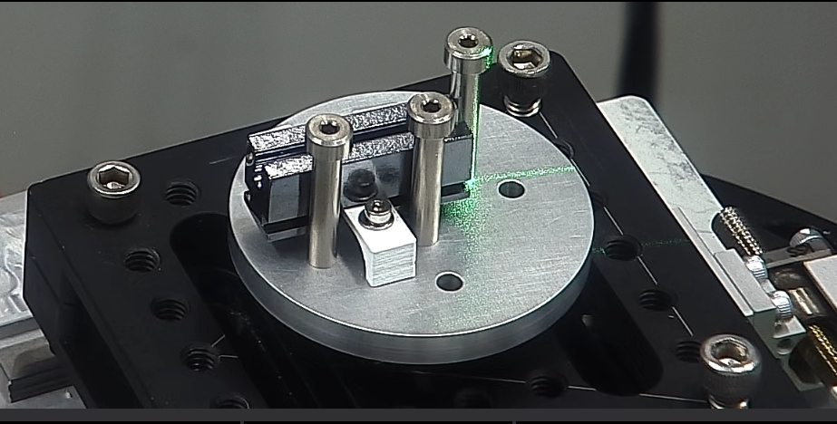
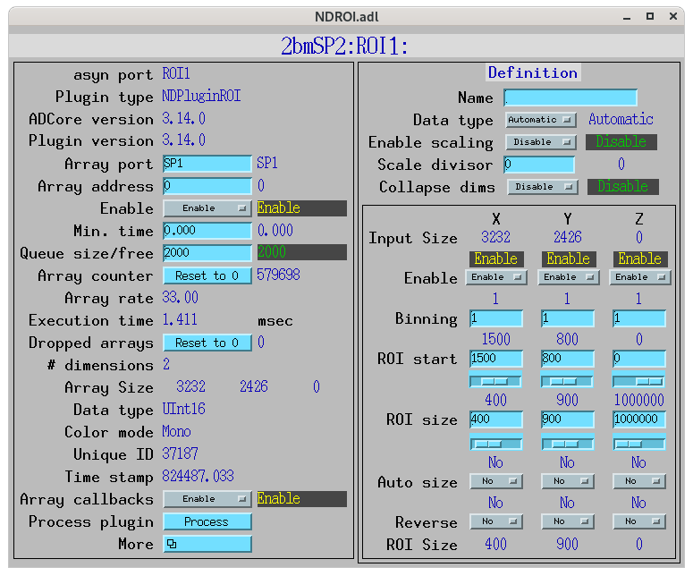
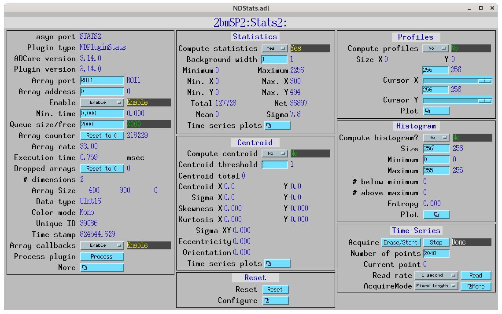
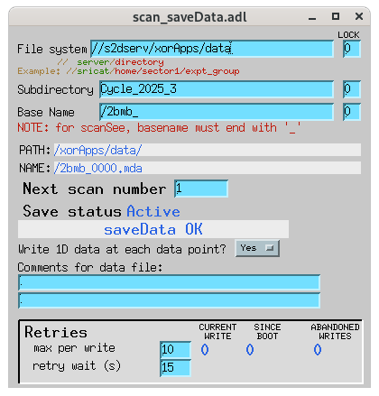
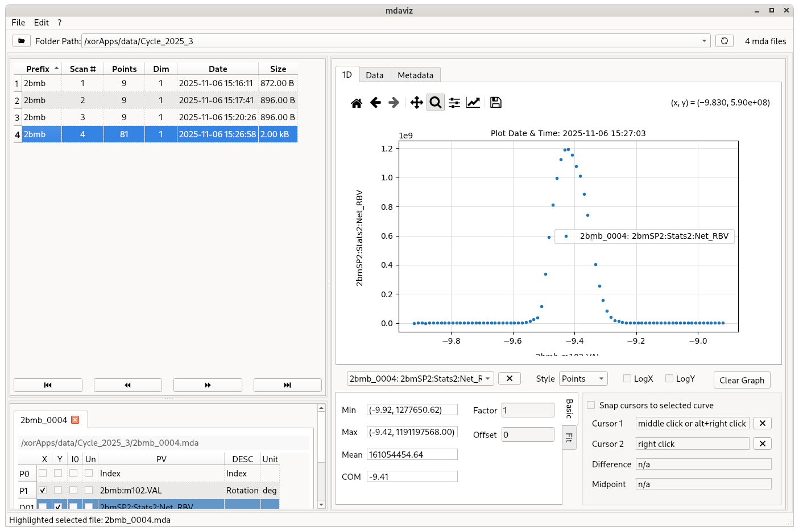

==================
Energy Calibration
==================

X-ray Energy Calibration Using Channel-Cut Crystal
==================================================

**Channel-cut crystal parameters:**

- Length: **36 mm**
- Width: **3 mm**
- Lattice spacing (2d): **3.84 Å**

Purpose
-------

To accurately calibrate the monochromator energy using the known lattice spacing of the channel-cut crystal.

Procedure
---------

1. **Mount the Channel-Cut Crystal**

- Secure the channel-cut crystal on the rotation stage in the x-ray beam path.
- Align the crystal so that the incident beam fully illuminates the 3 mm width and the reflection geometry is symmetric and set the rotation angle to zero.

2. **Set Initial Conditions**

   - Set the monochromator energy to approximately **20 keV**.
   - Compute the expected Bragg angle :math:`\theta` using Bragg’s law:

     .. math::

        E = \frac{12.3984}{2d \sin\theta} \quad [\text{keV}]

     which can be rearranged as:

     .. math::

        \theta = \arcsin\!\left(\frac{12.3984}{2d\,E}\right)

     where :math:`2d = 3.84\,\text{Å}` and :math:`E = 20\,\text{keV}`.

   - For a 20 keV x-ray beam, the expected Bragg angle is approximately **9.29°**.

   Example Python code to compute the expected angle:

   .. code-block:: python

      import numpy as np

      # Parameters
      two_d = 3.84         # 2d in Å
      E_nom = 20.0         # nominal energy in keV
      hc = 12.3984         # hc in keV·Å

      # Compute Bragg angle (radians and degrees)
      theta_rad = np.arcsin(hc / (two_d * E_nom))
      theta_deg = np.degrees(theta_rad)

      print(f"Bragg angle at {E_nom} keV: {theta_deg:.6f}°")

3. **Record the reflected x-ray**

   - Rotate the crystal at the calculated Bragg angle until you find the reflection. 
   - Select an ROI around the reflection using the ROI plugin fi area detector together with the Stat2 plugin to calculate the mean value.

4. **Perform Rocking Curve Scan**

   - Perform a fine angular scan (rocking curve) around the calculated Bragg angle to record the reflected x-ray intensity versus angle.

 .. figure:: ../img/energy_cal_01.png
   :width: 512px
   :align: center
   :alt: energy_cal_01

     

5. **Identify the Peak Position**

   - Fit the rocking curve to find the precise Bragg peak angle :math:`\theta_B`.
   - This corresponds to the true Bragg condition for that energy.

6. **Calculate the True Energy**

   - Compute the actual energy using Bragg’s law:

     .. math::

        E = \frac{12.3984}{2d \sin\theta_B} \quad [\text{keV}]

   Example Python code to compute the true energy from the measured peak angle:

   .. code-block:: python

      import numpy as np

      # Parameters
      two_d = 3.84         # 2d in Å
      E_nom = 20.0         # nominal energy in keV
      hc = 12.3984         # hc in keV·Å

      # Example: replace this with your measured peak angle in degrees
      theta_B_deg = 9.2903
      theta_B_rad = np.radians(theta_B_deg)

      # Compute measured energy and offset
      E_meas = hc / (two_d * np.sin(theta_B_rad))
      offset_keV = E_meas - E_nom

      print(f"Measured energy: {E_meas:.6f} keV")
      print(f"Offset from nominal: {offset_keV:.6f} keV")

7. **Adjust Monochromator Calibration**

   - Compare the calculated true energy to the nominal monochromator value (20 keV).
   - Apply an energy offset correction in the control software if necessary.

8. **Verify Calibration**

   - Repeat the procedure at another energy (e.g., 19 keV or 21 keV) to confirm linearity and consistency.

Notes
-----

- Allow the crystal to reach thermal equilibrium before measurement.
- Use small angular steps (≈ 1–2 µrad) for high precision.
- Document environmental conditions (temperature, beam current, slit settings).
- Average multiple scans to improve accuracy.

