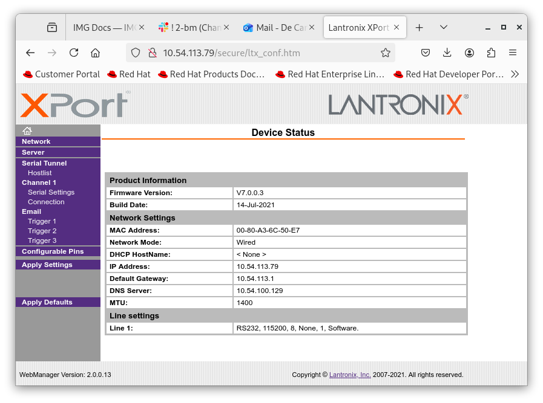
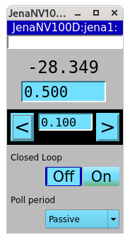
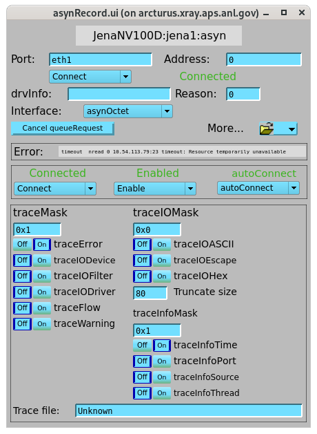

===========
Jena NV100D
===========

The piezo controller Jena NV100D epics support can be started with:

::

    [2bmb@arcturus]$ cd /net/s2dserv/xorApps/epics/synApps_6_3/ioc/JenaNV100D/iocBoot/iocJenaNV100D
    [2bmb@arcturus]$ ../../bin/rhel9-x86_64/JenaNV100D st.cmd.Linux

Network configuration:

::

   X 10.54.113.79
   Y 10.54.113.29

Device configuration:

   Web configuration

The caqtdm with:
::

    [2bmb@arcturus]$ /net/s2dserv/xorApps/epics/synApps_6_3/ioc/JenaNV100D/iocBoot/iocJenaNV100D/softioc/JenaNV100D.pl caqtdm

.. figure:: ../img/jena_000.png
   :width: 720px
   :align: center
   :alt: jena_000

   caqtdm main screen

You will find the control screen under Jena NV100D

   caqtdm to control the Jena NV100D. The units are Volts in open loop mode and µm in closed loop mode.

   caqtdm to control the Jena NV100D 
