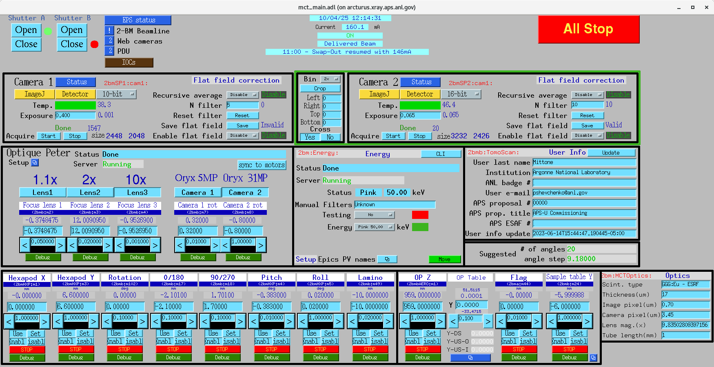

===========
Jena NV100D
===========

EPICS IOC startup
=================

Start the Jena NV100D EPICS support on ``arcturus``::

  [2bmb@arcturus]$ cd /net/s2dserv/xorApps/epics/synApps_6_3/ioc/JenaNV100D/iocBoot/iocJenaNV100D
  [2bmb@arcturus]$ ../../bin/rhel9-x86_64/JenaNV100D st.cmd.Linux

Network configuration
=====================

Controller IP addresses::

  X: 10.54.113.79
  Y: 10.54.113.29

MEDM control screens
====================

Access the MEDM control screen for both motors from the lower-right corner
of the **mct_optics** screen:

   mct_optics control screen

.. figure:: ../img/jena_005.png
   :width: 512px
   :align: center
   :alt: jena_005

   Jena NV100D MEDM screen

Device configuration
====================

The controller can be configured via its web interface:

.. figure:: ../img/jena_002.png
   :width: 512px
   :align: center
   :alt: jena_000

   Web configuration

caqtdm interface
================

Start the caqtdm interface::

  [2bmb@arcturus]$ /net/s2dserv/xorApps/epics/synApps_6_3/ioc/JenaNV100D/iocBoot/iocJenaNV100D/softioc/JenaNV100D.pl caqtdm

.. figure:: ../img/jena_000.png
   :width: 512px
   :align: center
   :alt: jena_000

   caqtdm main screen

The Jena NV100D control panel is available under **Jena NV100D**:

.. figure:: ../img/jena_001.png
   :width: 128px
   :align: center
   :alt: jena_001

   caqtdm panel for Jena NV100D. Units are Volts in open-loop mode and µm in closed-loop mode.

.. figure:: ../img/jena_003.png
   :width: 512px
   :align: center
   :alt: jena_003

   caqtdm control screen for Jena NV100D