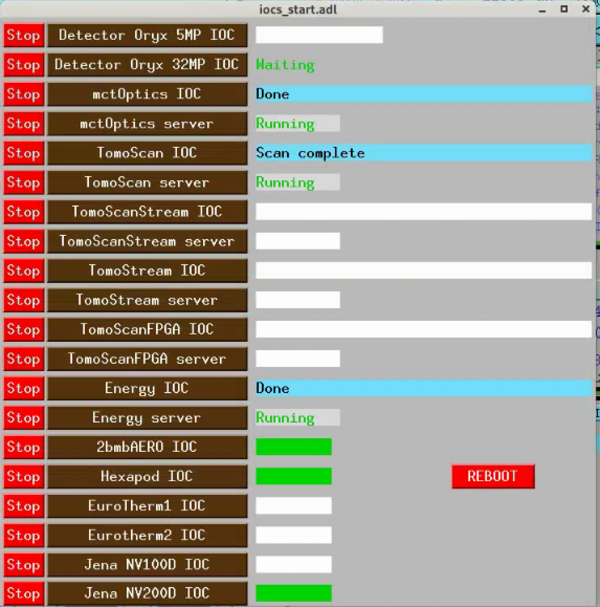
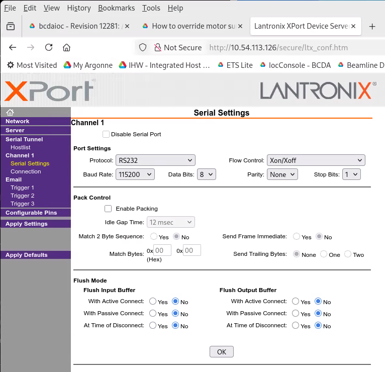
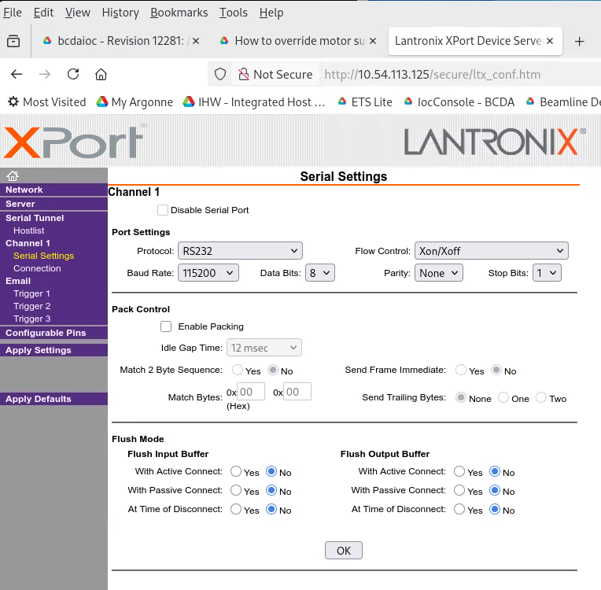
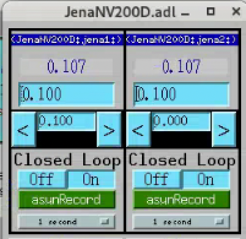
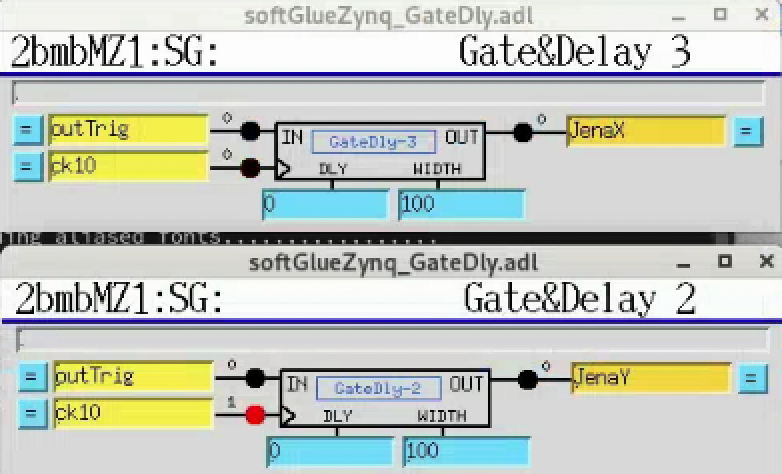

===========
Jena NV200D
===========

The Jena NV200D/NET controllers drive two piezo axes (X and Y) at 2-BM-A.
They complement the existing :doc:`Jena NV100D <item_027>` and are integrated
with the FPGA trigger to step through a pre-loaded position list during
tomography acquisitions.

EPICS IOC startup
=================

Start the Jena NV200D EPICS support on ``arcturus``::

  [2bmb@arcturus]$ cd /net/s2dserv/xorApps/epics/synApps_6_3/ioc/JenaNV200D/iocBoot/iocJenaNV200D
  [2bmb@arcturus]$ ../../bin/rhel9-x86_64/JenaNV200D st.cmd.Linux

The IOC can also be started and stopped from the **iocs_start** screen:

   iocs_start control screen showing the Jena NV200D IOC entry.

Network configuration
=====================

Controller IP addresses::

  X: 10.54.113.126
  Y: 10.54.113.125

.. note::

   Only one Telnet connection is allowed at a time. The EPICS IOC must be
   stopped before running the triggered-step Python script (see
   `Triggered step mode`_), and restarted afterwards.

Device configuration
====================

Both controllers must be set to **Xon/Xoff** (software) flow control via
the Lantronix XPort web interface for the EPICS support to work correctly.

   Lantronix XPort Serial Settings — Channel 1 flow control configuration (X axis).

   Lantronix XPort Serial Settings — Channel 1 flow control configuration (Y axis).

MEDM control screens
====================

The Jena NV200D control is accessible from the lower-right corner of the
**mct_main** screen under **Jena NV200D Piezo**:

.. figure:: ../img/nv200_mct_main.png
   :width: 720px
   :align: center
   :alt: nv200_mct_main

   mct_main screen — Jena NV200D Piezo entry in the lower-right corner.

   Jena NV200D MEDM screen showing both axes in closed-loop mode.

caqtdm interface
================

Start the caqtdm interface::

  [2bmb@arcturus]$ /net/s2dserv/xorApps/epics/synApps_6_3/ioc/JenaNV200D/iocBoot/iocJenaNV200D/softioc/JenaNV200D.pl caqtdm

FPGA trigger integration
========================

The FPGA sends a TTL pulse to the NV200D controllers to step to the next
position during the camera readout interval. The JenaX and JenaY coaxial
cables are connected to **FPGA out2** and **out3** respectively.

The delay before each pulse is set via two softGlue PVs (units: number of
10 MHz clock cycles, i.e. 100 ns per unit)::

  2bmbMZ1:SG:GateDly-2_DLY    # Y axis delay
  2bmbMZ1:SG:GateDly-3_DLY    # X axis delay

Set the DLY field to the detector exposure time plus a safety margin:

   softGlueZync GateDelay screens for the two NV200D trigger channels.

Triggered step mode
===================

Up to 1024 positions can be pre-loaded into each controller's waveform
buffer. Each rising TTL edge on the **TRG IN** connector (pin 3 of the I/O
D-Sub, 0/3.3–5 V) advances the actuator to the next position.

.. warning::

   Stop the EPICS IOC before running the script — only one Telnet
   connection is allowed at a time. Restart the IOC when done.

Install the required Python library::

  pip install nv200 numpy

Run the script on a computer on the beamline's private subnet (e.g.
``arcturus``)::

  [2bmb@arcturus]$ python nv200_trigger_step_lib.py [--n N] [--random]

Arguments:

- ``--n N`` — number of positions to load (default: 256, max: 1024)
- ``--random`` — use random positions instead of evenly spaced (linspace)

Example output::

  Connecting to X (10.54.113.126)...
  Connecting to Y (10.54.113.125)...
  --- X axis ---
    Actuator stroke: 0.0 … 100.0 µm
    Auto-generated 256 evenly-spaced positions.
    Loading 256 positions into buffer...
      128/256
      256/256
    Running. 256 positions loaded. Current position: 0.000 µm
  --- Y axis ---
    Actuator stroke: 0.0 … 100.0 µm
    Auto-generated 256 evenly-spaced positions.
    Loading 256 positions into buffer...
      128/256
      256/256
    Running. 256 positions loaded. Current position: 0.000 µm

  Running. Each rising edge on TRG IN (I/O connector pin 3) steps to the next position.
  Press Enter to stop...
  Stopping...
  Stopped. Manual control restored.

.. note::

   Positions are stored in the controller's RAM and are lost on power
   cycle. Once operation is confirmed, they can be persisted to EEPROM
   using the ``save_to_eeprom()`` method in the library.
