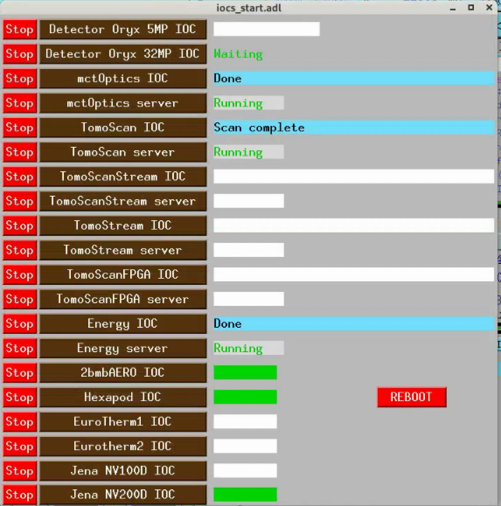
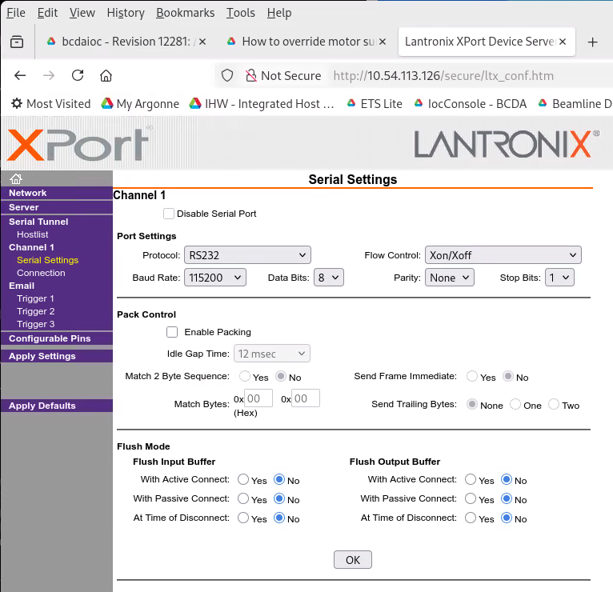
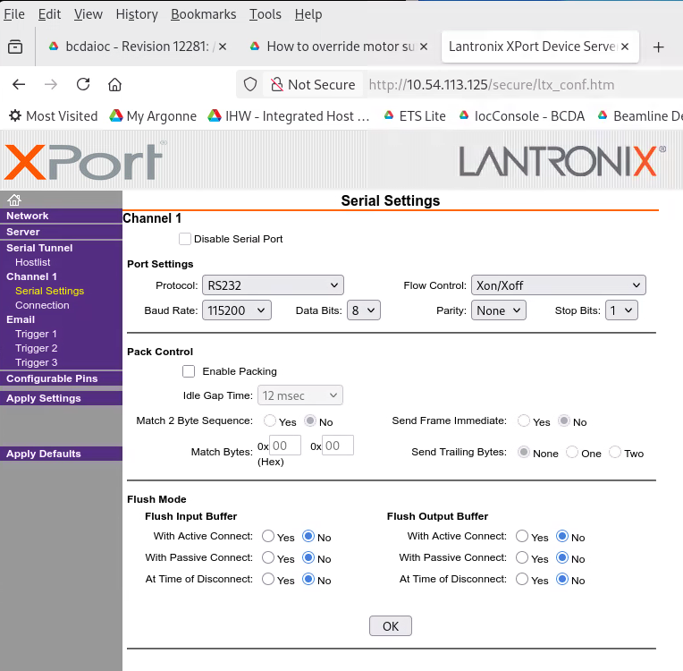
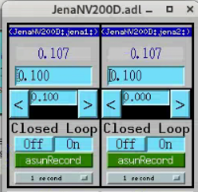
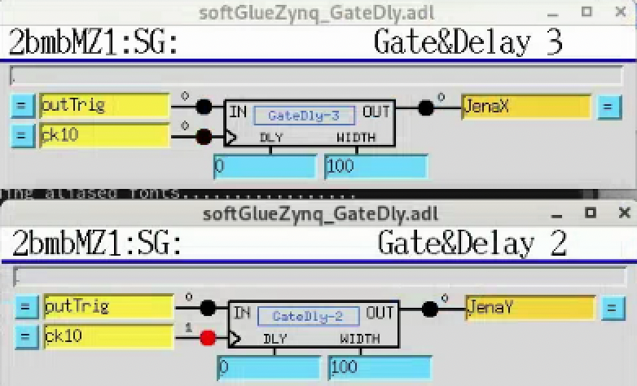

===========
Jena NV200D
===========

The Jena NV200D/NET controllers drive two piezo axes (X and Y) at 2-BM-B.
They complement the existing :doc:`Jena NV100D <item_027>` and are integrated
with the FPGA trigger to step through a pre-loaded position list during
tomography acquisitions.

EPICS IOC startup
=================

Start the Jena NV200D EPICS support on ``arcturus``::

  [2bmb@arcturus]$ cd /net/s2dserv/xorApps/epics/synApps_6_3/ioc/JenaNV200D/iocBoot/iocJenaNV200D
  [2bmb@arcturus]$ ../../bin/rhel9-x86_64/JenaNV200D st.cmd.Linux

The IOC can also be started and stopped from the **iocs_start** screen:

   iocs_start control screen showing the Jena NV200D IOC entry.

Network configuration
=====================

Controller IP addresses::

  X: 10.54.113.126
  Y: 10.54.113.125

.. note::

   Only one Telnet connection is allowed at a time. The EPICS IOC must be
   stopped before running the triggered-step Python script (see
   `Triggered step mode`_), and restarted afterwards.

Device configuration
====================

Both controllers must be set to **Xon/Xoff** (software) flow control via
the Lantronix XPort web interface for the EPICS support to work correctly.

   Lantronix XPort Serial Settings — Channel 1 flow control configuration (X axis).

   Lantronix XPort Serial Settings — Channel 1 flow control configuration (Y axis).

.. warning::

   The ``nv200`` Python library (see `Triggered step mode`_ below) calls
   ``configure_flow_control(XON_XOFF_PASS_TO_HOST)`` on connect when
   ``auto_adjust_comm_params=True`` (its default). This is a **persistent
   NVM write** to the XPort and silently flips the flow-control mode
   from ``Xon/Xoff`` (Flow 01) to ``XON_XOFF_PASS_TO_HOST`` (Flow 05).

   In Flow 05, controller replies come wrapped with XOFF/XON bytes
   (``\x13meas,-10.750\r\x00\n\x11``) that the shared stream proto
   (``$(IP)/db/JenaNV100D.proto``) cannot parse; the EPICS IOC's
   ``read`` records then sit at ``SEVR=INVALID``, ``STAT=CALC`` even
   though `write` still forwards to the controller.

   If the EPICS side stops updating after a Python session, either:

   1. Reset the XPort back to ``Xon/Xoff`` (Flow 01) via the web UI,
      **and** either patch the ``nv200_trigger_step.py`` call site to
      pass ``auto_adjust_comm_params=False`` or refuse to run any
      library code that would flip the mode again. Fragile — the next
      default-parameter Python run breaks it again.
   2. Or install a local proto override at
      ``iocBoot/iocJenaNV200D/JenaNV100D.proto`` that accepts the
      framed reply (add a leading ``\x13`` on each ``read*`` ``in``
      line). Because ``STREAM_PROTOCOL_PATH=".:$(IP)/db"``, the local
      file wins over the shared support module for this IOC only.
      See the 32-ID equivalent page in the 32-ID docs
      (``manual/manual_030`` "Device configuration") for the concrete
      diff applied at 32-ID.

MEDM control screens
====================

The Jena NV200D control is accessible from the lower-right corner of the
**mct_main** screen under **Jena NV200D Piezo**:

.. figure:: ../img/nv200_mct_main.png
   :width: 720px
   :align: center
   :alt: nv200_mct_main

   mct_main screen — Jena NV200D Piezo entry in the lower-right corner.

   Jena NV200D MEDM screen showing both axes in closed-loop mode.

caqtdm interface
================

Start the caqtdm interface::

  [2bmb@arcturus]$ /net/s2dserv/xorApps/epics/synApps_6_3/ioc/JenaNV200D/iocBoot/iocJenaNV200D/softioc/JenaNV200D.pl caqtdm

FPGA trigger integration
========================

The FPGA sends a TTL pulse to the NV200D controllers to step to the next
position during the camera readout interval. The JenaX and JenaY coaxial
cables are connected to **FPGA out2** and **out3** respectively.

The delay before each pulse is set via two softGlue PVs (units: number of
10 MHz clock cycles, i.e. 100 ns per unit)::

  2bmbMZ1:SG:GateDly-2_DLY    # X axis delay
  2bmbMZ1:SG:GateDly-3_DLY    # Y axis delay

Set the DLY field to the detector exposure time plus a safety margin:

   softGlueZync GateDelay screens for the two NV200D trigger channels.

Triggered step mode
===================

Up to 1024 positions can be pre-loaded into each controller's waveform
buffer. Each rising TTL edge on the **TRG IN** connector (pin 3 of the I/O
D-Sub, 0/3.3–5 V) advances the actuator to the next position.

.. warning::

   Stop the EPICS IOC before running the script — only one Telnet
   connection is allowed at a time. Restart the IOC when done.

Activate the dedicated ``nv200`` conda env (Python 3.12,
``/home/beams/2BMB/conda/anaconda/envs/nv200``), which already has the
required ``nv200`` + ``numpy`` libraries installed::

  conda activate nv200

To recreate the env from scratch::

  conda create -n nv200 python=3.12 -y
  conda activate nv200
  pip install nv200 numpy

The script lives in the ``2bm-procedures`` repository
(`procedures/nv200_trigger_step.py
<https://github.com/decarlof/2bm-procedures/blob/main/procedures/nv200_trigger_step.py>`__).
Change to that directory before invoking it — the script writes
``positions_x.txt`` / ``positions_y.txt`` to the current working
directory and looks for no input files. Run on a computer on the
beamline's private subnet (e.g. ``arcturus``)::

  [2bmb@arcturus]$ cd <path-to-2bm-procedures>/procedures
  [2bmb@arcturus]$ python nv200_trigger_step.py [--n N] [--random]

(Replace ``<path-to-2bm-procedures>`` with wherever the
`2bm-procedures <https://github.com/decarlof/2bm-procedures>`__
repository is checked out — e.g.
``~/conda/2bm-procedures-decarlof``.)

Arguments:

- ``--n N`` — number of positions to load (default: 256, max: 1024)
- ``--random`` — use random positions instead of evenly spaced (linspace)

See the procedure page :doc:`../procedures/item_013` for the formal
procedure definition (preconditions, parameters, steps,
postconditions, failure modes) that this operational walk-through
implements.

Example output::

  Connecting to X (10.54.113.126)...
  Connecting to Y (10.54.113.125)...
  --- X axis ---
    Actuator stroke: 0.0 … 100.0 µm
    Auto-generated 256 evenly-spaced positions.
    Loading 256 positions into buffer...
      128/256
      256/256
    Running. 256 positions loaded. Current position: 0.000 µm
  --- Y axis ---
    Actuator stroke: 0.0 … 100.0 µm
    Auto-generated 256 evenly-spaced positions.
    Loading 256 positions into buffer...
      128/256
      256/256
    Running. 256 positions loaded. Current position: 0.000 µm

  Running. Each rising edge on TRG IN (I/O connector pin 3) steps to the next position.
  Press Enter to stop...
  Stopping...
  Stopped. Manual control restored.

On a clean exit (Enter pressed at the prompt), the script's ``finally``
block stops the waveform generator, disables the trigger input, forces
``PidLoopMode.CLOSED_LOOP``, and issues a ``move_to_position(0.0)`` on
each device before closing the Telnet connection. The
``move_to_position`` call is what actually restores serial-driven
setpoint control on the controller, so the EPICS IOC (or a subsequent
Python session) can drive the piezo immediately after the script exits.

If a Python session is killed uncleanly (``kill -9``, crash) and the
IOC's ``JenaNV200D:jena1:write`` no longer moves the piezo afterwards,
the controller is stuck in waveform / trigger-driven mode. Recover by
re-running ``nv200_trigger_step.py`` and pressing Enter immediately
(so the ``finally`` block runs), or by opening a short Python session
that calls ``dev.move_to_position(0.0)`` on each controller.

.. note::

   Positions are stored in the controller's RAM and are lost on power
   cycle. Once operation is confirmed, they can be persisted to EEPROM
   using the ``save_to_eeprom()`` method in the library.
