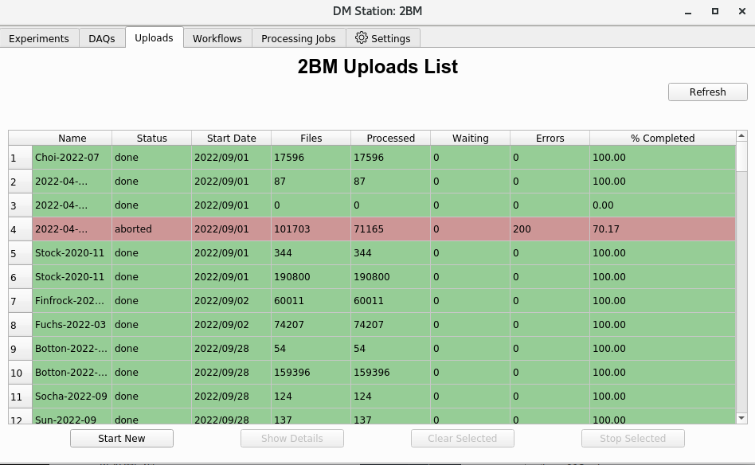
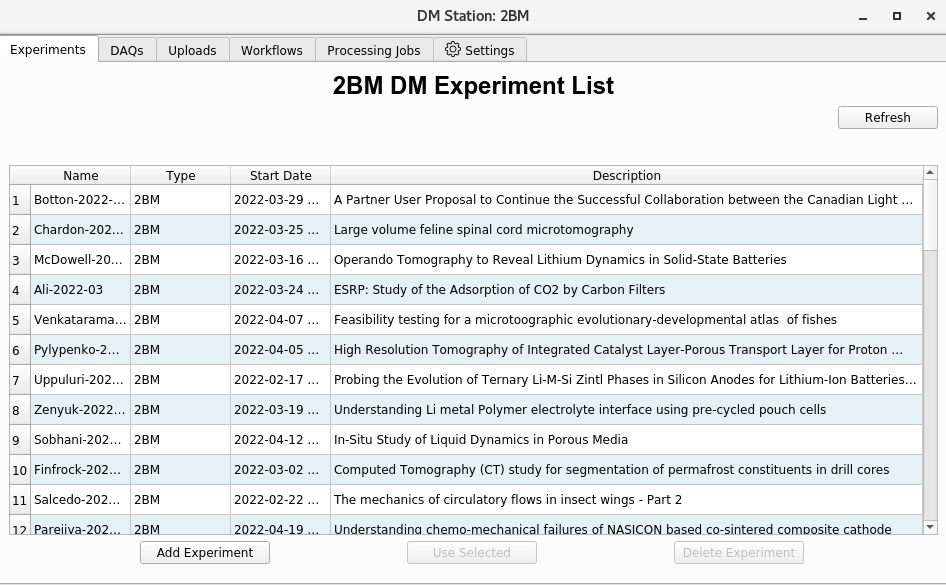
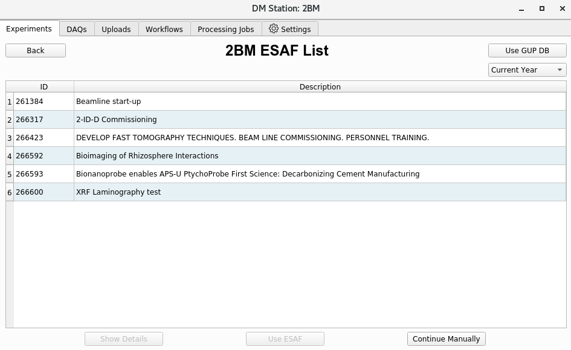
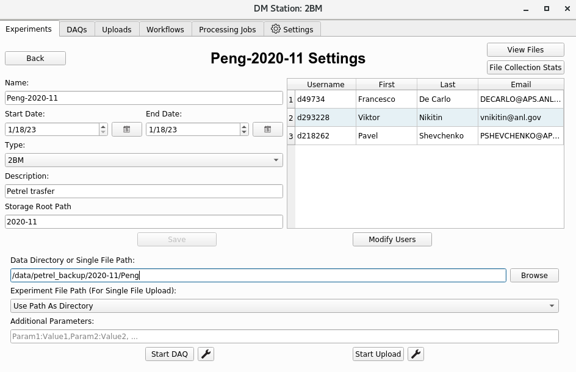

Data Management
===============

Data ownership and local storage location is managed by `Dmagic <https://dmagic.readthedocs.io/en/latest/index.html>`_ by automatically retrieving user information from the APS scheduling system and updating the user info PVs at:

.. image:: ../img/medm_screen.png 
   :width: 480px
   :align: center
   :alt: tomo_user

To run a user PV adptate::

    [user2bmb@arcturus]$ bash
    [user2bmb@arcturus]$ source /home/dm_bm/etc/dm.setup.sh
    [user2bmb@arcturus]$ dmagic show
    [user2bmb@arcturus]$ dmagic tag

you can also enter manually the user last name/email address/YYYY-MM.

Data management and sharing with users is manged by `Globus <https://dmagic.readthedocs.io/en/latest/index.html>`_. The Globus servers available at Argonnne are petrel#tomography and aps#data both accessible from the `Globus portal <https://www.globus.org/>`_.

You can select with server to use with::

    [user2bmb@arcturus]$ bash
    [user2bmb@arcturus]$ globus-server-name voyager (or petrel)

To automatically create YYYY-MM/PI_lastName/ on the globus server::

    [user2bmb@arcturus]$ bash
    [user2bmb@arcturus]$ globus dirs

and you can share this folder will all users listed in the scheduled proposal with::

    [user2bmb@arcturus]$ globus email --schedule

To upload data from the beamline to the Globus server

If using petrel#tomography, make a Globus copy between::

    [user2bmb@pg10ge]$  /local/data/YYYY-MM/PI_lastName/

and the same YYYY-MM/PI_lastName/ on  `petrel <https://app.globus.org/file-manager?origin_id=e133a81a-6d04-11e5-ba46-22000b92c6ec&origin_path=%2F2-BM%2F>`_.

If using the aps#tomography::

    [user2bmb@arcturus]$ bash
    [user2bmb@arcturus]$ source /home/dm_bm/etc/dm.setup.sh
    [user2bmb@arcturus]$ dm-station-gui

For more details see the `DM instruction <https://confluence.aps.anl.gov/display/DMGT/2-BM+Deployment>`_.

Petrel#tomography status is avaialble `here <https://virtualhelpdesk.cels.anl.gov/blog/>`_.

Example
-------

Upload data from tomo1:/data to voyager::

    (base) [user2bmb@handyn]$ bash
    (base) [user2bmb@handyn]$ source /home/dm_bm/etc/dm.setup.sh
    (base) [user2bmb@handyn]$ dm-station-gui

and presss Start New:

then select Add Experiment

Select the GUP associated with the data set or Continue Manually if there is no GUP (e.g. internal time):

Set the experiment Name, Dates, Type, Storage Root Path etc., then press Save

Once the experiment is created you can enter in the Data Directory or single file path the location of the data on tomo1 as /data/ ...

Delete
------

To delete a folder of data already uploaded to voyager use:

::

    (base) [user2bmb@handyn]$ dm-delete-files --experiment 2023-03-Xu --path-pattern LCO15v18b_232_rec

    There are 75 files that match specified criteria. If you continue:

      1) Experiment files will be removed from storage.
      2) Experiment files will be removed from the catalog.

    Proceed (yes|no)? [no]: yes

To delete a subset of files use ``.*``, for example to delete all tiff contained in the rkd10_024_rec folder:

::

    (base) [user2bmb@handyn]$ dm-delete-files --experiment test-delete-rec --path-pattern rkd10_024_rec/.*.tiff

    There are 1852 files that match specified criteria. If you continue: 
      1) Experiment files will be removed from storage.
      2) Experiment files will be removed from the catalog.

    Proceed (yes|no)? [no]:

to apply this to all _rec folders:

::

    dm-delete-files --experiment Stock-2020-11 --path-pattern .*_rec/.*.tiff
    There are 154085 files that match specified criteria. If you continue: 
      1) Experiment files will be removed from storage.
      2) Experiment files will be removed from the catalog.

The dm-delete-files is recursive, so to delete all ``*.tiff`` files part of an experiment, in all subfolder: 

::

dm-delete-files --experiment Parejiya-2022-04 --path-pattern /.*.tiff
