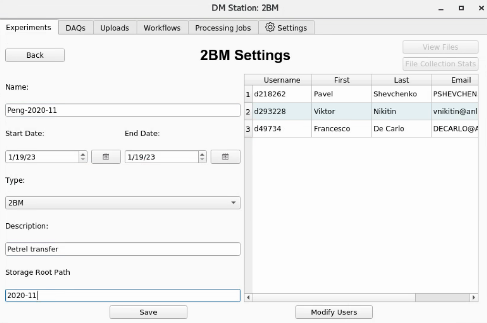

Data Management
===============

Data ownership and local storage location is managed by `Dmagic <https://dmagic.readthedocs.io/en/latest/index.html>`_ by automatically retrieving user information from the APS scheduling system and updating the user info PVs at:

.. image:: ../img/medm_screen.png 
   :width: 480px
   :align: center
   :alt: tomo_user

To run a user PV adptate::

    (base) [user2bmb@arcturus]$ bash
    (base) [user2bmb@arcturus]$ conda activate dm
    (dm) [user2bmb@arcturus]$ dmagic show
    (dm) [user2bmb@arcturus]$ dmagic tag

you can also enter manually the user last name/email address/YYYY-MM.

Upload
------

To upload data from tomo1:/data to voyager::

    (base) [user2bmb@handyn]$ bash
    (base) [user2bmb@handyn]$ source /home/dm_bm/etc/dm.setup.sh
    (dm-user) [user2bmb@handyn]$ dm-station-gui

and presss Start New:

.. image:: ../img/dm_01.png 
   :width: 480px
   :align: center
   :alt: dm

then select Add Experiment

.. image:: ../img/dm_02.png 
   :width: 480px
   :align: center
   :alt: dm

Select the GUP associated with the data set or Continue Manually if there is no GUP (e.g. internal time):

.. image:: ../img/dm_03.png 
   :width: 480px
   :align: center
   :alt: dm

Set the experiment Name, Dates, Type, Storage Root Path etc., then press Save

Once the experiment is created you can enter in the Data Directory or single file path the location of the data on tomo1 as /data/ ...

.. image:: ../img/dm_05.png 
   :width: 480px
   :align: center
   :alt: dm

Delete
------

To delete a folder of data already uploaded to voyager use:

::

    (base) [user2bmb@handyn]$ source /home/dm_bm/etc/dm.setup.sh
    (dm-user) [user2bmb@handyn]$ dm-delete-files --experiment 2023-03-Xu --path-pattern LCO15v18b_232_rec

    There are 75 files that match specified criteria. If you continue:

      1) Experiment files will be removed from storage.
      2) Experiment files will be removed from the catalog.

    Proceed (yes|no)? [no]: yes

To delete a subset of files use ``.*``, for example to delete all tiff contained in the rkd10_024_rec folder:

::

    (dm-user) [user2bmb@handyn]$ dm-delete-files --experiment test-delete-rec --path-pattern rkd10_024_rec/.*.tiff

    There are 1852 files that match specified criteria. If you continue: 
      1) Experiment files will be removed from storage.
      2) Experiment files will be removed from the catalog.

    Proceed (yes|no)? [no]:

to apply this to all _rec folders:

::

    (dm-user) [user2bmb@handyn]$ dm-delete-files --experiment Stock-2020-11 --path-pattern .*_rec/.*.tiff
    There are 154085 files that match specified criteria. If you continue: 
      1) Experiment files will be removed from storage.
      2) Experiment files will be removed from the catalog.

The dm-delete-files is recursive, so to delete all ``*.tiff`` files part of an experiment, in all subfolder: 

::

    (dm-user) [user2bmb@handyn]$ dm-delete-files --experiment Parejiya-2022-04 --path-pattern /.*.tiff

or to delete all ``recon_*.tiff`` files part of an experiment, in all subfolder: 

::

    (dm-user) [user2bmb@handyn]$ dm-delete-files --experiment Drummond-2022-09 --path-pattern /recon_.*.tiff

Download
--------

To download an experiment, e.g. Finfrock-2022-12, from voyager to tomodata1:/data/

::

    (base) tomo@tomodata1 ~ $ source /home/dm_bm/etc/dm.setup.sh
    (dm-user) tomo@tomodata1 ~ $ dm-download --experiment Finfrock-2022-12 --destination-directory  /data/

For more details see the `DM instruction <https://git.aps.anl.gov/DM/dm-docs/-/wikis/DM/Deployments/2-BM-Deployment>`_.

Restore
-------

To restore an experiment, e.g. Finfrock-2023-03, from tape to its original location on voyager

::

    (base) [user2bmb@handyn]$ source /home/dm_bm/etc/dm.setup.sh
    (dm-user) [user2bmb@handyn]$ dm-restore-experiment --experiment Finfrock-2023-03
    id=0293f99b-c724-402f-af94-1f2606499d96 name=restoreArchive experimentName=Finfrock-2023-03 status=pending

You can check the status of the restore process with:

::

   (dm-user) [user2bmb@handyn]$ dm-restore-experiment --experiment Finfrock-2023-03
   Unfinished archive task with id 0293f99b-c724-402f-af94-1f2606499d96 already exists for experiment Finfrock-2023-03

or with:

::

   (dm-user) [user2bmb@handyn]$ dm-get-archive-task --id 0293f99b-c724-402f-af94-1f2606499d96 --display-keys ALL

Add users
---------

To grant a user read access to a datasets

::

    (base) [user2bmb@handyn]$ source /home/dm_bm/etc/dm.setup.sh
    (dm-user) [user2bmb@handyn]$ dm-add-user-experiment-role --experiment expName --username d<badge> --role User

You can find the d<badge> with

::
 
    (dm-user) dmadmin@s2bmdm> dm-list-users | grep -i decarlo

dm-add-user-experiment-role --experiment  McDowell-2023-03 --username d240474 --role User
dm-add-user-experiment-role --experiment  Finfrock-2022-12 --username d240474 --role User
dm-add-user-experiment-role --experiment  Finfrock-2023-03 --username d240474 --role User

Search
------

To search for an experiment containing in its name Pete

::

    (base) tomo@tomodata1 ~ $ source /home/dm_bm/etc/dm.setup.sh
    (dm-user) tomo@tomodata1 ~ $ dm-list-experiments | grep Pete
    id=8862 name=Peters-2022-03 experimentTypeId=30 experimentStationId=21 startDate=2022-03-04 00:00:00-06:00 endDate=2022-03-07 00:00:00-06:00 
    id=11275 name=Peteres-2022-11 experimentTypeId=30 experimentStationId=21 startDate=2022-11-28 00:00:00-06:00 endDate=2022-12-01 00:00:00-06:00 
    to see the files within an experiment

::

    (base) tomo@tomodata1 ~ $ source /home/dm_bm/etc/dm.setup.sh
    (dm-user) tomo@tomodata1 ~ $ dm-list-experiment-files --experiment=Peters-2022-03 | grep Peters | head -10
    id=625daab87f44b25ba39bfdb7 fileName=C4_Zn_01_10keV_980.h5 experimentFilePath=Peters/C4_Zn_01_10keV_980.h5 fileSize=272374112 md5Sum=516bb84b52e5b8d2347aea847fd94a50 
    id=625daabb7f44b25ba39bfdb8 fileName=C4_Zn_03_10keV_try2_977.h5 experimentFilePath=Peters/C4_Zn_03_10keV_try2_977.h5 fileSize=171670144 md5Sum=4f8f374f72cea16f5a8325ea44a83338 
    id=625daabd7f44b25ba39bfdb9 fileName=C4_Zn_03_10keV_try2_975.h5 experimentFilePath=Peters/C4_Zn_03_10keV_try2_975.h5 fileSize=226080308 md5Sum=21a3f1a5c7e292b0f43cabc96aaa16b7 

