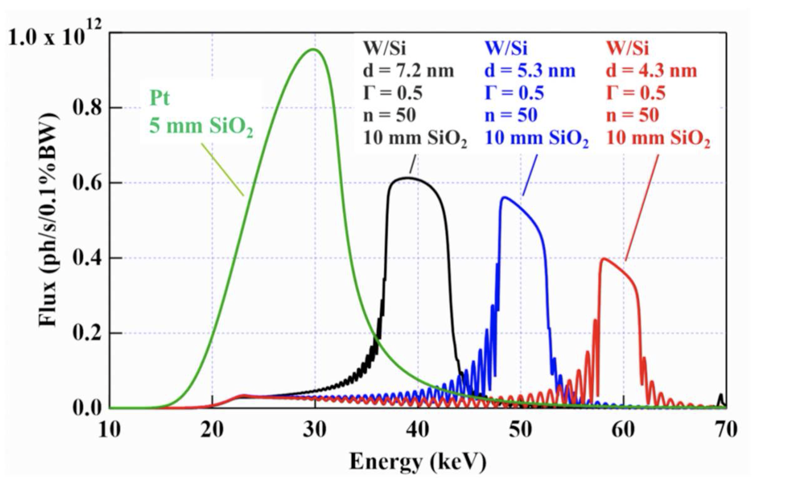

======
Mirror
======

The current mirror installed at 2-BM-A is the original `APS-M1 mirror <https://anl.box.com/s/nyvibklz6ckkm148aoo02ht3e0bowxs9>`_
(pre-APS-U), which has been recoated and returned to service post APS-U. The new mirror (APS-U-M1) is not yet in use.

Substrate
---------

+---------------------+--------------------+
| Parameter           | Value              |
+---------------------+--------------------+
| Dimensions          | 1200 x 100 x 75 mm |
+---------------------+--------------------+
| Substrate material  | Silicon            |
+---------------------+--------------------+

Recoating
---------

The original Cr coating was stripped, the substrate cleaned and measured with optical metrology, then overcoated with 10 nm Cr on the entire surface, followed by:

+----------+-----------------------+------------------------------------+
| Stripe   | Coating               | Note                               |
+----------+-----------------------+------------------------------------+
| a        | 5 nm Pt               |                                    |
+----------+-----------------------+------------------------------------+
| b        | W(1.2nm)/Si(5.37nm)   | × 50 multilayer, d-spacing 8.8%    |
|          | × 50 multilayer       | below spec                         |
+----------+-----------------------+------------------------------------+
| c        | W(1.2nm)/Si(3.56nm)   | × 50 multilayer, d-spacing 10.1%   |
|          | × 50 multilayer       | below spec                         |
+----------+-----------------------+------------------------------------+
| d        | W(1.2nm)/Si(2.73nm)   | × 50 multilayer, d-spacing 9.4%    |
|          | × 50 multilayer       | below spec                         |
+----------+-----------------------+------------------------------------+

The figure below shows the expected flux for the Pt stripe and the three multilayer stripes:

For more details see the deposition lab recoating report available `here <https://anl.box.com/s/ai0n9z7vtr98aaveoj869kbe3kushtzj>`_.

Reference Documents
-------------------

- Mirror substrate drawing: `mirror reference <https://anl.box.com/s/nyvibklz6ckkm148aoo02ht3e0bowxs9>`_
- Disassembly process: `photos <https://anl.box.com/s/1qicl7o2mo9byuadmc0gs12g0s33v6ww>`_
- Metrology on original M1: `metrology report <https://anl.box.com/s/2ki5fhawdckqkdjkzxjrudjmqkpllpkc>`_
- M1 to APS-U-M1 retrofit: `retrofit document <https://anl.box.com/s/m3m0j77m081az932ae4lqrbz4lgebw4u>`_
