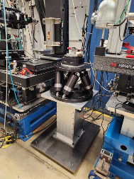

==================
Sample motor stack
==================

The sample motor stack consists of:

#. **Sample top X** – horizontal motion above the rotary stage
#. **Sample top Z** – horizontal motion orthogonal to Sample top X, above the rotary stage
#. **Rotary stage** – tomography rotation axis
#. **Hexapod** – six axes (x, y, z, roll, pitch, yaw)

Rotary stage
============

.. _box link 0001: https://anl.box.com/s/vw4rkyhfqwg7zlrerv1dhrtphfs86ndg
.. _box link 0002: https://anl.box.com/s/1ffp00cn1gjkyyelnufp0kef336t4jg9
.. _box link 0003: https://anl.box.com/s/beje6d9h51ti1sukpd61ke7ow4qdqasj
.. _box link 0004: https://anl.box.com/s/fcbrn0tv7jgrkxmreu4y54kj313q2grv
.. _order 0004: https://apps.inside.anl.gov/paris/req.jsp?reqNbr=F2-235109
.. _order 0005: https://apps.inside.anl.gov/paris/req.jsp?reqNbr=E8-198024
.. _order 0006: https://apps.inside.anl.gov/paris/req.jsp?reqNbr=E8-078092

.. |00003| image:: ../img/aerotech_00001.png
   :width: 20pt
   :height: 20pt

.. |00004| image:: ../img/aerotech_00002.png
   :width: 20pt
   :height: 20pt

Rotary stages in use:

+---------------+-------------------------+-------------------------+--------------------+------------------------------------+----------------------+------------------------+--------------------------------------------------------+
| **Station**   | **Description**         | **Model**               | **Image**          | **Controller**                     | **Speed (rpm)**      | **Axial load (kg)**    | **Info**                                               |
+---------------+-------------------------+-------------------------+--------------------+------------------------------------+----------------------+------------------------+--------------------------------------------------------+
| 2-BM-B        | tomo                    | ABS250MP-M-AS           | |00004|            | ENSEMBLEHLE10-40-A-MXH (*)         | 500                  | 66                     | `box link 0003`_, `box link 0004`_, `order 0005`_      |
+---------------+-------------------------+-------------------------+--------------------+------------------------------------+----------------------+------------------------+--------------------------------------------------------+
| 2-BM-B        | fast tomo               | ABRS-150MP-M-AS         | |00004|            | ENSEMBLEHLE10-40-A-MXH (*)         | 500                  | 8                      | `box link 0003`_, `box link 0004`_, `order 0006`_      |
+---------------+-------------------------+-------------------------+--------------------+------------------------------------+----------------------+------------------------+--------------------------------------------------------+
| 2-BM-B        | spindle                 | ABS2000-1000AS-RU       | |00003|            | ENSEMBLEHLE10-40-A-MXH (*)         | 6000                 | 18                     | `box link 0001`_, `box link 0002`_, `order 0004`_      |
+---------------+-------------------------+-------------------------+--------------------+------------------------------------+----------------------+------------------------+--------------------------------------------------------+

(*) Replaced with ENSEMBLEML10-40-IO-MXH.

Ensemble
--------

.. _Ensemble Settings: https://anl.app.box.com/s/serp2nlyzk0ljvpqczc3btm7ikn9pvlj

The Ensemble parameter setup currently in use at 2-BM is documented in
`Ensemble Settings`_.

+-------------------------------+----------------------+---------------------------+-----------------+
| **Parameter**                 | **ABRS250MP**        | **ABRS150MP**             | **Units**       |
+-------------------------------+----------------------+---------------------------+-----------------+
| Fundamental encoder resolution| 11840                | 3600                      | lines/rev       |
+-------------------------------+----------------------+---------------------------+-----------------+
| Encoder scale factor          | 45                   | 148                       |                 |
+-------------------------------+----------------------+---------------------------+-----------------+
| Encoder pulses per revolution | 532800               | 532800                    | pulses/rev      |
+-------------------------------+----------------------+---------------------------+-----------------+
| Encoder resolution            | 0.000675675675676    | 0.000675675675676         | deg/pulse       |
+-------------------------------+----------------------+---------------------------+-----------------+

PSO
---

.. _Aerotech Manual: https://anl.box.com/s/l43qkqlhy21f4a8wetmrqbeqz9c7am72

Details on Position Synchronized Output (PSO) are provided in the
`Aerotech Manual`_.

Hexapod
=======

.. _hex300_quote: https://apps.inside.anl.gov/paris/req.jsp?reqNbr=G4-114014
.. _hex300_hw_manual: https://anl.box.com/s/b0uo13zn9f7v1mrnnpvggqguedrl6qzj
.. _hex300_datasheet: https://anl.box.com/s/jn2h32rqxuwmtbygilk509x41ixgsdwf

.. _hex500_quote: https://apps.inside.anl.gov/paris/req.jsp?reqNbr=G4-130071
.. _hex500_hw_manual: https://anl.box.com/s/d36plwk13uhjla39drms2roojgvau2yg
.. _hex500_datasheet: https://anl.box.com/s/4ptepjke1438n2im4zw7as265m4vx9vz

.. _usb1: https://anl.box.com/s/2948hw205r0cb0lvytc539b9ehyxce8c
.. _usb2: https://anl.box.com/s/tlx227jpbvv3h7ix4gtihmrhd63pm52c
.. _programming: https://anl.box.com/s/n3i9dgvs2py3b9leh4iupm5lzgrs7wwv

Available hexapods:

+--------------+---------------------------------+-------------------------+--------------------------------------+----------------------+----------------------------+------------------------+
| **Station**  | **Model**                       | **Data sheet**          | **Images**                           | **Hardware manual**  | **USB stick delivered**    | **Quote**              |
+--------------+---------------------------------+-------------------------+--------------------------------------+----------------------+----------------------------+------------------------+
| 2-BM         | HEX300-230HL-E1-PL4-TAS         | `hex300_datasheet`_     | |2-BM Hexapod|                       | `hex300_hw_manual`_  | `usb1`_, `usb2`_           | `hex300_quote`_        |
+--------------+---------------------------------+-------------------------+--------------------------------------+----------------------+----------------------------+------------------------+
| 7-BM         | HEX500-350HL-E3-PL4-TAS         | `hex500_datasheet`_     | |7-BM Hexapod|                       | `hex500_hw_manual`_  |                            | `hex500_quote`_        |
+--------------+---------------------------------+-------------------------+--------------------------------------+----------------------+----------------------------+------------------------+

.. |2-BM Hexapod| image:: ../img/hexapod_04.png
   :width: 50px
   :alt: hexapod_04

EPICS support
-------------

Start the hexapod tools on ``arcturus``::

  [2bmb@arcturus ~]$ bash
  (base) 2bmb@arcturus ~ $ hexapod
  Usage: 2bmHXP.pl {caqtdm|console|medm|phoebus|remote|restart|run|start|status|stop|usage}

Launch the caqtdm interface::

  (base) 2bmb@arcturus ~ $ hexapod caqtdm

.. figure:: ../img/hexapod_01.png 
   :width: 720px
   :align: center
   :alt: hexapod_control

   Hexapod control screen

.. figure:: ../img/hexapod_02.png 
   :width: 256px
   :align: center
   :alt: hexapod_enable

   Hexapod enable screen

.. figure:: ../img/hexapod_03.png 
   :width: 720px
   :align: center
   :alt: hexapod_motion

   Hexapod motion control screen

Drive error recovery
--------------------

A controller error can occur if the hexapod is commanded beyond its travel
range, causing all axis drivers to disconnect. In this case, the
Enable/Fault indicator, normally green, turns off.

   Hexapod controller. The arrow indicates the Enable/Fault status light.

To recover:

#. Stop the EPICS IOC controlling the hexapod.

   .. figure:: ../img/hexapod_07.png 
      :width: 360px
      :align: center
      :alt: hexapod_ioc_control

      Hexapod EPICS IOC control

#. From the Tomo control screen, select **PDU 1**.

   .. figure:: ../img/PDU_01.png 
      :width: 256px
      :align: center
      :alt: pdu_selector

      PDU selector

   .. figure:: ../img/PDU_02.png 
      :width: 360px
      :align: center
      :alt: pdu_web_interface

      PDU web interface

#. Power-cycle outlet #5 (Hexapod).
#. Wait approximately 2 minutes, then restart the Hexapod EPICS IOC.
#. Verify that the controller is enabled.

After a few minutes, the hexapod will restart.

.. warning::

   After reboot, the hexapod Y stage does not correctly reset its dial
   position. Follow the procedure below until a permanent fix is in place.

After reboot, all motions home correctly (dial position and encoder
readback both zero) **except** for Y. For Y:

- Dial position is reset to zero (red arrow).
- Encoder readback dial is at 350 (green arrow).

Attempting to move Y in this state will trigger a drive error.

.. figure:: ../img/hexapod_08.png 
   :width: 360px
   :align: center
   :alt: hexapod_y_after_reboot

   Hexapod Y after controller reboot

Set the Y dial manually to 350, as shown below:

   Hexapod Y dial must be manually set to 350 after controller reboot.