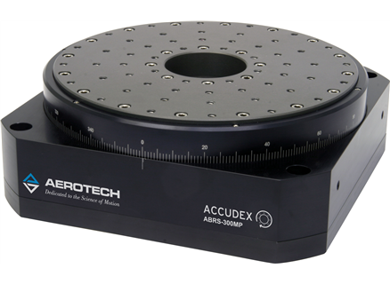
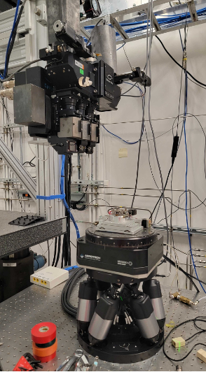
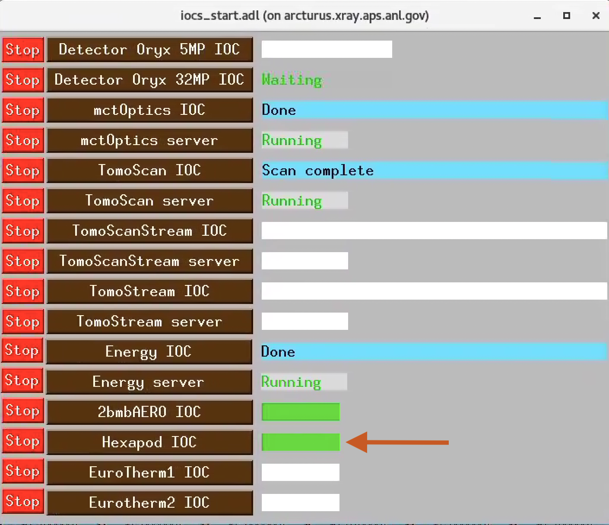

==================
Sample motor stack
==================

The sample motor stack consists of:

#. **Sample top X** (horizontal motion above the rotary stage)
#. **Sample top Z** (horizontal motion orthogonal to "sample top X" above the rotary stage)
#. **Rotary stage** (tomography rotation axis)
#. **Hexapod** (6 axes x, y, z, roll, pitch and theta motion)

Rotary stage
============

.. _box link 0001: https://anl.box.com/s/vw4rkyhfqwg7zlrerv1dhrtphfs86ndg
.. _box link 0002: https://anl.box.com/s/1ffp00cn1gjkyyelnufp0kef336t4jg9
.. _box link 0003: https://anl.box.com/s/beje6d9h51ti1sukpd61ke7ow4qdqasj
.. _box link 0004: https://anl.box.com/s/fcbrn0tv7jgrkxmreu4y54kj313q2grv
.. _order 0004: https://apps.inside.anl.gov/paris/req.jsp?reqNbr=F2-235109
.. _order 0005: https://apps.inside.anl.gov/paris/req.jsp?reqNbr=E8-198024
.. _order 0006: https://apps.inside.anl.gov/paris/req.jsp?reqNbr=E8-078092

.. |00003| image:: ../img/aerotech_00001.png
    :width: 20pt
    :height: 20pt

we have different sets of rotary stages:

+---------------+-------------------------+-------------------------+--------------------+------------------------------------+----------------------+------------------------+--------------------------------------------------------+
|   **Station** |      **Description**    |  **Model**              |    **Image**       |   **Controller**                   |  **Speed (rpm)**     |    **Load axial (kg)** |  **Info**                                              | 
+---------------+-------------------------+-------------------------+--------------------+------------------------------------+----------------------+------------------------+--------------------------------------------------------+
|     2-BM-B    |        tomo             |    ABS250MP-M-AS        |     |00004|        |     ENSEMBLEHLE10-40-A-MXH (*)     |          500         |            66          |  `box link 0003`_, `box link 0004`_, `order 0005`_     |
+---------------+-------------------------+-------------------------+--------------------+------------------------------------+----------------------+------------------------+--------------------------------------------------------+
|     2-BM-B    |        fast tomo        |    ABRS-150MP-M-AS      |     |00004|        |     ENSEMBLEHLE10-40-A-MXH (*)     |          500         |            8           |  `box link 0003`_, `box link 0004`_, `order 0006`_     |
+---------------+-------------------------+-------------------------+--------------------+------------------------------------+----------------------+------------------------+--------------------------------------------------------+
|     2-BM-B    |        spindle          |    ABS2000-1000AS-RU    |     |00003|        |     ENSEMBLEHLE10-40-A-MXH (*)     |         6000         |            18          |  `box link 0001`_, `box link 0002`_, `order 0004`_     |
+---------------+-------------------------+-------------------------+--------------------+------------------------------------+----------------------+------------------------+--------------------------------------------------------+

(*) replaced with ENSEMBLEML10-40-IO-MXH

Ensemble
--------

.. _Ensemble Settings: https://anl.app.box.com/s/serp2nlyzk0ljvpqczc3btm7ikn9pvlj

The Ensemble Parameter Setup currently in use at 2-BM can found at `Ensemble Settings`_

+-------------------------------+----------------------+---------------------------+-----------------+
|  **Parameter**                |       **ABRS250MP**  |     **ABRS150MP**         |     **Units**   |
+-------------------------------+----------------------+---------------------------+-----------------+
| Fundamental Encoder Resolution|              11840   |       3600                |     lines/rev   |
+-------------------------------+----------------------+---------------------------+-----------------+
| Encoder scale factor          |                 45   |        148                |                 |
+-------------------------------+----------------------+---------------------------+-----------------+
| Encoder pulses per revolution |             532800   |     532800                |     pulses/rev  |
+-------------------------------+----------------------+---------------------------+-----------------+
| Encoder resolution            |  0.000675675675676   |     0.000675675675676     |     deg/pulse   |
+-------------------------------+----------------------+---------------------------+-----------------+

PSO
---

.. _Aerotech Manual: https://anl.box.com/s/l43qkqlhy21f4a8wetmrqbeqz9c7am72

Details on the Position Synchronized Output (PSO) are in the `Aerotech Manual`_ 

Hexapod
=======

.. _hex300_quote: https://apps.inside.anl.gov/paris/req.jsp?reqNbr=G4-114014
.. _hex300_hw_manual: https://anl.box.com/s/b0uo13zn9f7v1mrnnpvggqguedrl6qzj
.. _hex300_datasheet: https://anl.box.com/s/jn2h32rqxuwmtbygilk509x41ixgsdwf

.. _hex500_quote: https://apps.inside.anl.gov/paris/req.jsp?reqNbr=G4-130071
.. _hex500_hw_manual: https://anl.box.com/s/d36plwk13uhjla39drms2roojgvau2yg
.. _hex500_datasheet: https://anl.box.com/s/4ptepjke1438n2im4zw7as265m4vx9vz

.. _usb1: https://anl.box.com/s/2948hw205r0cb0lvytc539b9ehyxce8c
.. _usb2: https://anl.box.com/s/tlx227jpbvv3h7ix4gtihmrhd63pm52c
.. _programming: https://anl.box.com/s/n3i9dgvs2py3b9leh4iupm5lzgrs7wwv

Avaialble hexapods are:

+--------------+------------------+-------------------------+--------------------------------------+----------------------+----------------------------+------------------------+
|  **Station** |    **Model**     |   **Data Sheet**        |           Images                     |**Hardware Manual**   |  **USB stick delived**     |    **Quote**           |
+--------------+------------------+-------------------------+--------------------------------------+----------------------+----------------------------+------------------------+
|    2-BM      |   HEX300-230HL   |    `hex300_datasheet`_  |          |2-BM Hexapod|              | `hex300_hw_manual`_  |  `usb1`_, `usb2`_          | `hex300_quote`_        |
+--------------+------------------+-------------------------+--------------------------------------+----------------------+----------------------------+------------------------+
|    7-BM      |   HEX500-350HL   |    `hex500_datasheet`_  |          |7-BM Hexapod|              | `hex500_hw_manual`_  |                            | `hex500_quote`_        |
+--------------+------------------+-------------------------+--------------------------------------+----------------------+----------------------------+------------------------+

.. |7-BM Hexapod| image:: ../img/hexapod_05.png
   :width: 50px
   :alt: hexapod_04

EPICS support
-------------

:: 

   [2bmb@arcturus ~]$ bash
   (base) 2bmb@arcturus ~ $ hexapod
   Usage: 2bmHXP.pl {caqtdm|console|medm|phoebus|remote|restart|run|start|status|stop|usage}

   (base) 2bmb@arcturus ~ $ hexapod caqtdm

.. figure:: ../img/hexapod_01.png 
   :width: 720px
   :align: center
   :alt: 2bma_beamline

   Hexapod control screen

.. figure:: ../img/hexapod_02.png 
   :width: 256px
   :align: center
   :alt: 2bma_beamline

   Hexapod enable screen

.. figure:: ../img/hexapod_03.png 
   :width: 720px
   :align: center
   :alt: 2bma_beamline

   Hexapod motion control screen

Drive Error Recover
-------------------

In some situations—such as when the hexapod is commanded to move far beyond its travel range—a controller error may be triggered, causing all axis controller drivers to disconnect. When this happens, the Enable/Fault indicator light, which is normally green, will turn off.

.. figure:: ../img/hexapod_06.png 
   :width: 720px
   :align: center
   :alt: 2bma_beamline

   Hxapod controller. The arrow indicates the Enable/Fault status light.

To recover from this situation, follow these steps:

- Stop the EPICS IOC running the hexapod.

   Hexapod EPICS IOC control

- From the Tomo control screen, select PDU 1.

   PDU selector

   PDU web interface

- Power cycle Outlet #5, labeled Hexapod.
- Wait approximately 2 minutes, then start the Hexapod EPICS IOC.
- Ensure the controller is enabled.

After a few minutes, the hexapod will restart.

.. warning:: After rebooting, the Hexapod Y stage does not correctly reset its dial position. Please follow the procedure below until a permanent fix is implemented.

Upon reboot, all motions are homed correctly — meaning the dial position and encoder readback dial are both set to zero — except for the Y motion. In this case, the dial position is correctly set to zero (see red arrow), but the encoder readback dial is set at 350 (see green arrow in the figure).

Attempting to move the Y axis in this state will result in a driver error.

   Hexapod Y after controller reboot

Solution: Manually set the Y axis dial to 350, as shown in the figure below:

.. figure:: ../img/hexapod_09.png 
   :width: 360px
   :align: center
   :alt: 2bma_beamline

   Hexapod Y dial must be manually set to 350 after controller reboot.
