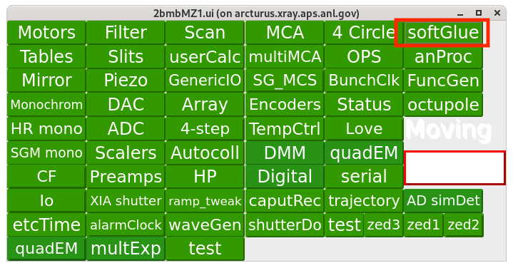
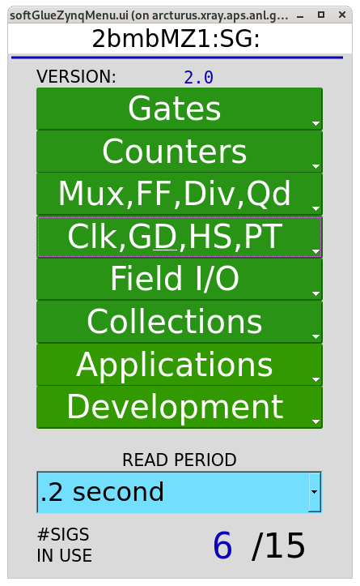
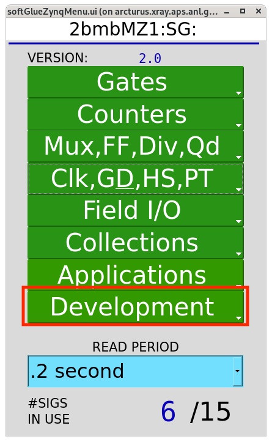
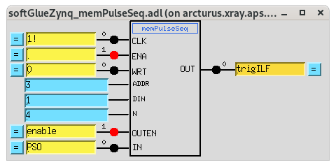
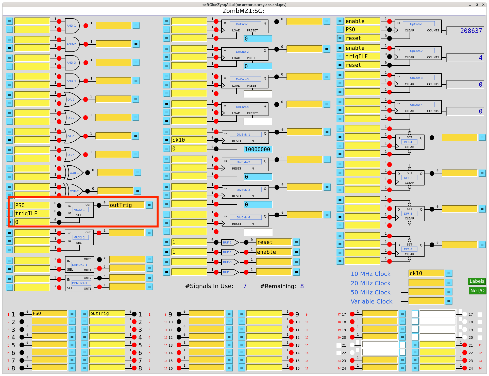

========
Softglue
========

The IOC runs directly on the MicroZed module and starts automatically at boot time.

Start the MEDM or caQtDM interface with:

::

   [2bmb@arcturus ~]$ cd /net/s2dserv/xorApps/epics/synApps_SG/ioc/2bmbMZ1/
   [2bmb@arcturus ~]$ ./start_epics_2bmbMZ1

or

::

   [2bmb@arcturus 2bmbMZ1]$ cd /net/s2dserv/xorApps/epics/synApps_SG/ioc/2bmbMZ1/
   [2bmb@arcturus 2bmbMZ1]$ ./start_caQtDM_2bmbMZ1 &

to display:

   Softglue control

Next, select softGlue/softGlueZynqMenu to open:

   softGlueZynqMenu control

The screen for the new component can be accessed through -> Development

   softGlueZynqMenu control

then -> memPulseSeq:

   New component

The trigILF pulses are used as the camera trigger. These pulses form a subset of the PSO pulse train and are selected using the Python function `write_pso_array <https://github.com/decarlof/interlaced/blob/main/macros_ILF.py>`_.

::

   (ops) 2bmb@arcturus]$ python
   Python 3.12.2 | packaged by conda-forge | (main, Feb 16 2024, 20:50:58) [GCC 12.3.0] on linux
   Type "help", "copyright", "credits" or "license" for more information.
   >>> import macros_ILF as m
   >>> m.write_PSO_array([0,2,4,6])
   >>> 

In this example, PSO pulses 0, 2, 4, and 6 will be used as camera triggers.

After loading the pulse array in Python, setting memPulseSeq.enable = 1 arms the component. When armed, the module triggers on the next incoming PSO pulses. Setting enable back to 0 returns the component to its idle (unarmed) state.

To allow either the raw PSO pulses or the custom pulse pattern generated by write_PSO_array() to trigger the detector, a 2:1 multiplexer (MUX2-1) is used. The MUX is configured with input0 = PSO and input1 = trigILF. Changing the MUX select PV to 0 or 1 determines which signal is routed to the camera trigger.

The MUX settings can be adjusted from the Collections/all softGlueZynq screen:

   Softglue control

To route the PSO pulses:  

::

   [2bmb@arcturus]$ caput 2bmbMZ1:SG:MUX2-1_SEL_Signal 0 

To route the trigILF pulses:

::

   [2bmb@arcturus]$ caput 2bmbMZ1:SG:MUX2-1_SEL_Signal 1