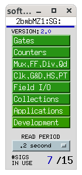
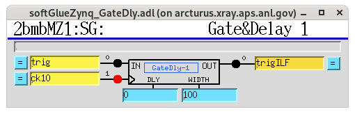

========
Softglue
========

softGlueZynq is an EPICS-based FPGA I/O module developed at APS (Argonne) for flexible, user-configurable digital logic and timing.

In practical terms, it combines:

* Hardware: a board based on a Xilinx Zynq SoC (FPGA + ARM processor) that provides digital I/O (and often counters, encoders, and timing signals) to interface with beamline or experimental equipment.

* Firmware + EPICS IOC: the FPGA is preloaded with a “soft glue” fabric consisting of building blocks such as counters, dividers, gates, flip-flops, encoders, and delay generators. These blocks are exposed as EPICS PVs so you can “wire” them together in software (no FPGA HDL development required). The Zynq’s ARM core runs the EPICS IOC that talks both to the FPGA and the external control system.

softGlueZynq is typically used to implement programmable logic, timing, and signal conditioning between devices—for example, generating or conditioning triggers, combining signals for interlocks, or creating position-synchronized triggers from encoders—without designing custom FPGA firmware.

The Softglue IOC runs directly on the MicroZed module and starts automatically at boot.

Start MEDM or caQtDM
====================

Start the MEDM interface::

  [2bmb@arcturus ~]$ cd /net/s2dserv/xorApps/epics/synApps_SG/ioc/2bmbMZ1/
  [2bmb@arcturus 2bmbMZ1]$ ./start_epics_2bmbMZ1

or start the caQtDM interface::

  [2bmb@arcturus ~]$ cd /net/s2dserv/xorApps/epics/synApps_SG/ioc/2bmbMZ1/
  [2bmb@arcturus 2bmbMZ1]$ ./start_caQtDM_2bmbMZ1 &

This opens the main Softglue control screen:

.. figure:: ../img/softglue_001.png
   :width: 360px
   :align: center
   :alt: softglue_001

   Softglue control

Accessing memPulseSeq
=====================

From the main Softglue panel, select:

- **softGlue → softGlueZynqMenu**

.. figure:: ../img/softglue_002.png
   :width: 128px
   :align: center
   :alt: softglue_002

   softGlueZynqMenu control

Then use:

- **Development → memPulseSeq**

.. figure:: ../img/softglue_005.png
   :width: 128px
   :align: center
   :alt: softglue_005

   Development menu

.. figure:: ../img/softglue_004.png
   :width: 512px
   :align: center
   :alt: softglue_004

   memPulseSeq component

Setting the pulse delay/width (GateDly)
=======================================

You can adjust the timing (delay) and duration (width) of the output pulse using the
**GateDly** block.

From the main Softglue panel, select:

- **softGlue → softGlueZynqMenu**

to open the **Clk, G&D, HS, PT** page:

   softGlueZynqMenu control

Select **GateDly 1**:

   GateDly 1 selection

Set:

- ``DLY = 0``
- ``Width = 100``

Notes:

- ``DLY`` sets the delay from the incoming edge to the start of the output pulse.
- ``Width`` sets how long the output pulse stays high.
- ``Width`` is in units of **10 MHz clock cycles** (100 ns per count). Therefore,
  ``Width = 100`` produces a :math:`100 × 100\,\mathrm{ns} = 10\,μ\mathrm{s}` pulse.

Custom trigger pattern (trigILF)
================================

The **trigILF** pulses are used as camera triggers. These pulses form a
subset of the PSO pulse train and are selected using the Python function
`write_PSO_array
<https://github.com/decarlof/interlaced/blob/main/macros_ILF.py>`_.

Example::

  (ops) [bmb@arcturus]$ python
  Python 3.12.2 | packaged by conda-forge | (main, Feb 16 2024, 20:50:58) [GCC 12.3.0] on linux
  >>> import macros_ILF as m
  >>> m.write_PSO_array([0, 2, 4, 6])
  >>>

In this example, PSO pulses 0, 2, 4, and 6 are used as camera triggers.

After loading the pulse array in Python:

- Set ``memPulseSeq.enable = 1`` to arm the component. When armed, the
  module triggers on the next incoming PSO pulses.
- Set ``memPulseSeq.enable = 0`` to return the component to the idle
  (unarmed) state.

MUX selection (PSO vs trigILF)
==============================

To select between the raw PSO pulse train and the custom pattern generated
by ``write_PSO_array()``, a 2:1 multiplexer (``MUX2-1``) is used.

- ``input0`` = PSO
- ``input1`` = trigILF

Changing the MUX select PV (``MUX2-1_SEL_Signal``) determines which signal
is routed to the camera trigger.

The MUX settings can be adjusted from the **Collections / all
softGlueZynq** screen:

.. figure:: ../img/softglue_003.png
   :width: 512px
   :align: center
   :alt: softglue_003

   Softglue control – MUX settings

Route PSO pulses to the camera::

  [2bmb@arcturus]$ caput 2bmbMZ1:SG:MUX2-1_SEL_Signal 0

Route trigILF pulses to the camera::

  [2bmb@arcturus]$ caput 2bmbMZ1:SG:MUX2-1_SEL_Signal 1