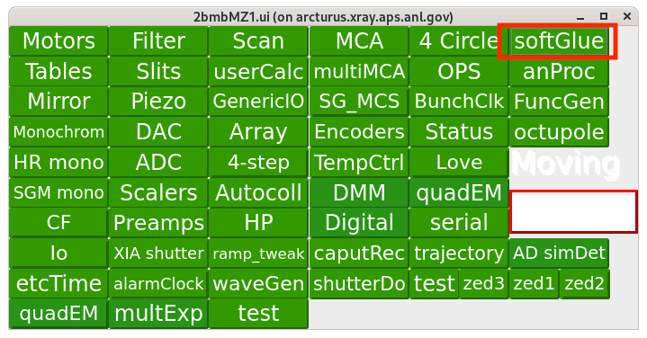
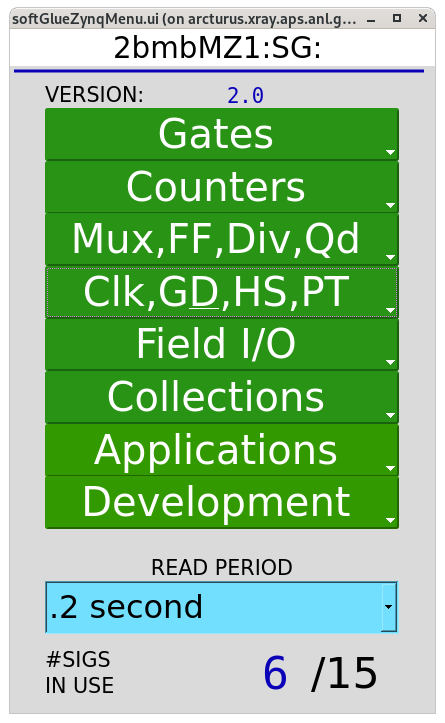
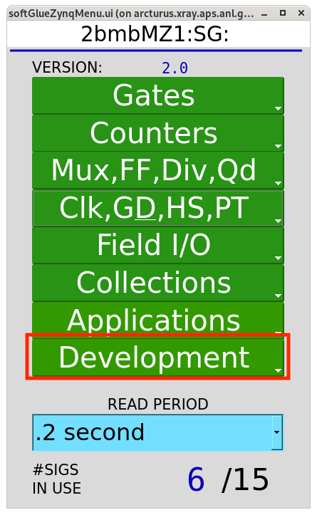
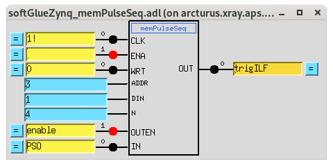
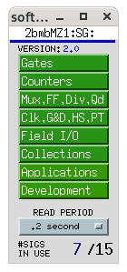
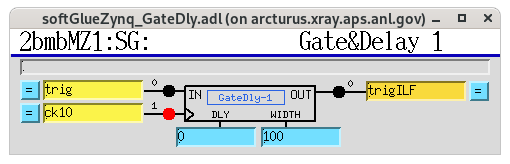
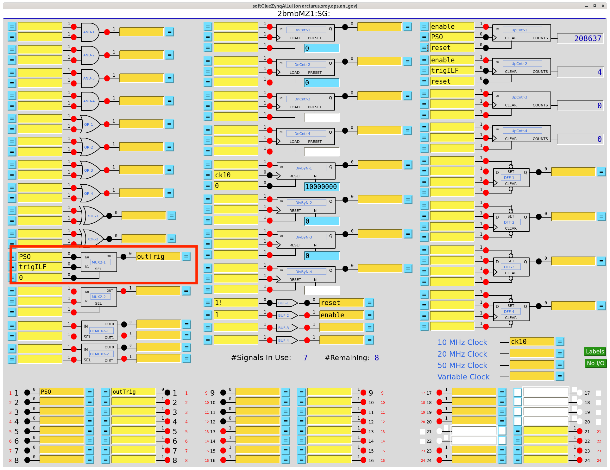
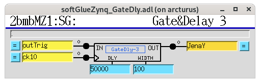
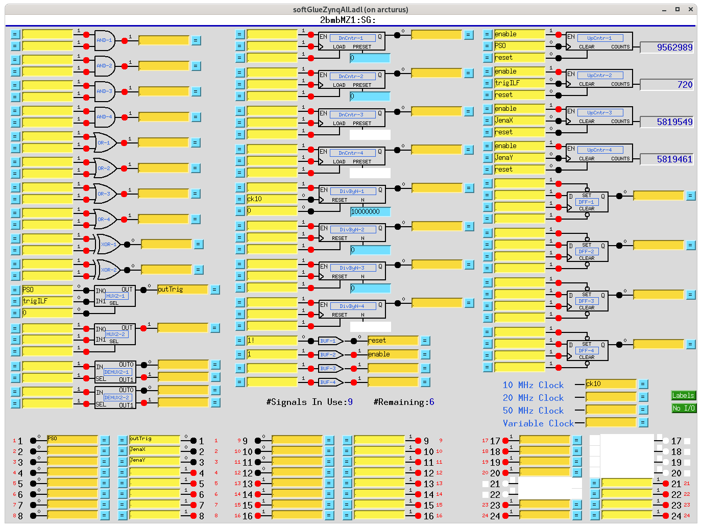

========
Softglue
========

softGlueZynq is an EPICS-based FPGA I/O module developed at APS (Argonne) for flexible, user-configurable digital logic and timing.

In practical terms, it combines:

* Hardware: a board based on a Xilinx Zynq SoC (FPGA + ARM processor) that provides digital I/O (and often counters, encoders, and timing signals) to interface with beamline or experimental equipment.

* Firmware + EPICS IOC: the FPGA is preloaded with a “soft glue” fabric consisting of building blocks such as counters, dividers, gates, flip-flops, encoders, and delay generators. These blocks are exposed as EPICS PVs so you can “wire” them together in software (no FPGA HDL development required). The Zynq’s ARM core runs the EPICS IOC that talks both to the FPGA and the external control system.

softGlueZynq is typically used to implement programmable logic, timing, and signal conditioning between devices—for example, generating or conditioning triggers, combining signals for interlocks, or creating position-synchronized triggers from encoders—without designing custom FPGA firmware.

The Softglue IOC runs directly on the MicroZed module and starts automatically at boot.

Start MEDM or caQtDM
====================

Start the MEDM interface::

  [2bmb@arcturus ~]$ cd /net/s2dserv/xorApps/epics/synApps_SG/ioc/2bmbMZ1/
  [2bmb@arcturus 2bmbMZ1]$ ./start_epics_2bmbMZ1

or start the caQtDM interface::

  [2bmb@arcturus ~]$ cd /net/s2dserv/xorApps/epics/synApps_SG/ioc/2bmbMZ1/
  [2bmb@arcturus 2bmbMZ1]$ ./start_caQtDM_2bmbMZ1 &

This opens the main Softglue control screen:

   Softglue control

Accessing memPulseSeq
=====================

From the main Softglue panel, select:

- **softGlue → softGlueZynqMenu**

   softGlueZynqMenu control

Then use:

- **Development → memPulseSeq**

   Development menu

   memPulseSeq component

Setting the pulse delay/width (GateDly)
=======================================

You can adjust the timing (delay) and duration (width) of the output pulse using the
**GateDly** block.

From the main Softglue panel, select:

- **softGlue → softGlueZynqMenu**

to open the **Clk, G&D, HS, PT** page:

   softGlueZynqMenu control

Select **GateDly 1**:

   GateDly 1 selection

Set:

- ``DLY = 0``
- ``Width = 100``

Notes:

- ``DLY`` sets the delay from the incoming edge to the start of the output pulse.
- ``Width`` sets how long the output pulse stays high.
- ``Width`` is in units of **10 MHz clock cycles** (100 ns per count). Therefore,
  ``Width = 100`` produces a :math:`100 × 100\,\mathrm{ns} = 10\,μ\mathrm{s}` pulse.

Custom trigger pattern (trigILF)
================================

The **trigILF** pulses are used as camera triggers. These pulses form a
subset of the PSO pulse train and are selected using the Python function
`write_PSO_array
<https://github.com/decarlof/interlaced/blob/main/fpga/macros_ILF.py>`_.

Example::

  (ops) [bmb@arcturus]$ python
  Python 3.12.2 | packaged by conda-forge | (main, Feb 16 2024, 20:50:58) [GCC 12.3.0] on linux
  >>> import macros_ILF as m
  >>> m.write_PSO_array([0, 2, 4, 6])
  >>>

In this example, PSO pulses 0, 2, 4, and 6 are used as camera triggers.

After loading the pulse array in Python:

- Set ``memPulseSeq.enable = 1`` to arm the component. When armed, the
  module triggers on the next incoming PSO pulses.
- Set ``memPulseSeq.enable = 0`` to return the component to the idle
  (unarmed) state.

MUX selection (PSO vs trigILF)
==============================

To select between the raw PSO pulse train and the custom pattern generated
by ``write_PSO_array()``, a 2:1 multiplexer (``MUX2-1``) is used.

- ``input0`` = PSO
- ``input1`` = trigILF

Changing the MUX select PV (``MUX2-1_SEL_Signal``) determines which signal
is routed to the camera trigger.

The MUX settings can be adjusted from the **Collections / all
softGlueZynq** screen:

   Softglue control – MUX settings

Route PSO pulses to the camera::

  [2bmb@arcturus]$ caput 2bmbMZ1:SG:MUX2-1_SEL_Signal 0

Route trigILF pulses to the camera::

  [2bmb@arcturus]$ caput 2bmbMZ1:SG:MUX2-1_SEL_Signal 1

Driving the two Jena piezo stages
=================================

During coded-aperture fly-scans, two additional GateDly blocks
(``GateDly-2`` and ``GateDly-3``) generate the step pulses that
advance the two Piezosystem Jena NV200D/NET controllers (X and Y
axes of the ``nanoSXY 120 CAP`` XY flexure stage; see the
NV200D block of :doc:`../manual/item_020` for the hardware
description and the physical FPGA-out → axis wiring table).

Each block takes the camera trigger (``outTrig``) as input and
produces a delayed step pulse that lands during the readout
interval, after the exposure finishes:

   ``GateDly-2`` — takes ``outTrig`` as IN, ``ck10`` (10 MHz) as
   clock, ``DLY = 50000`` (50000 × 100 ns = **5 ms** delay), and
   ``WIDTH = 100`` (100 × 100 ns = 10 µs pulse width). Output is
   the ``JenaX`` softGlue signal, routed through the field-I/O to
   FPGA ``out2`` and cabled to the **X-axis** NV200D ``TRG IN``.

   ``GateDly-3`` — identical shape and settings; output is the
   ``JenaY`` softGlue signal, routed through the field-I/O to FPGA
   ``out3`` and cabled to the **Y-axis** NV200D ``TRG IN``. Same
   5 ms delay, 10 µs pulse width.

The 5 ms delay is set to detector exposure time + a small safety
margin, so the piezo step happens **after** the sensor has
integrated the frame. Adjust ``DLY`` when the exposure time changes:

- ``DLY`` and ``WIDTH`` are in **10 MHz clock cycles**
  (100 ns per count).
- ``DLY = 50000`` → 5 ms. Increase for longer exposures.
- ``WIDTH = 100`` → 10 µs pulse (comfortably above the NV200D
  ``TRG IN`` minimum sensitivity).

PVs (set from the caQtDM Gate&Delay page or with ``caput``):

- ``2bmbMZ1:SG:GateDly-2_DLY`` and ``2bmbMZ1:SG:GateDly-2_WIDTH``
- ``2bmbMZ1:SG:GateDly-3_DLY`` and ``2bmbMZ1:SG:GateDly-3_WIDTH``

Verifying the pulses are actually reaching the piezos
-----------------------------------------------------

Two dedicated ``UpCntr`` blocks count the delivered step pulses so
an operator can confirm that both axes are stepping in lock-step
with the camera. Open the *Collections → all softGlueZynq*
(``softGlueZynqAll.adl``) screen:

   ``softGlueZynqAll.adl`` during an active fly-scan. Right column,
   top-to-bottom: ``UpCntr-1`` (PSO master pulse count = 9,562,989),
   ``UpCntr-2`` (``trigILF`` = 720, interlaced-trigger subset),
   ``UpCntr-3`` (X piezo pulse count = 5,819,549) and ``UpCntr-4``
   (Y piezo pulse count = 5,819,461). ``UpCntr-3`` and ``UpCntr-4``
   should stay within one count of each other during any scan
   (both are stepped by the same camera trigger); a drift between
   them means one of the two piezo trigger paths is dropping
   pulses.

The softGlue internal signal names ``JenaX`` and ``JenaY`` are set
to match the axis they drive: ``GateDly-2`` → ``JenaX`` → FPGA
``out2`` → Jena X controller; ``GateDly-3`` → ``JenaY`` → FPGA
``out3`` → Jena Y controller. Signal name, GateDly index, FPGA out
number, and axis are all consistent — no need to cross-check
against the wiring table for axis identification, though the
physical wiring in the NV200D block of :doc:`../manual/item_020`
is still the authoritative record for which cable runs where.
