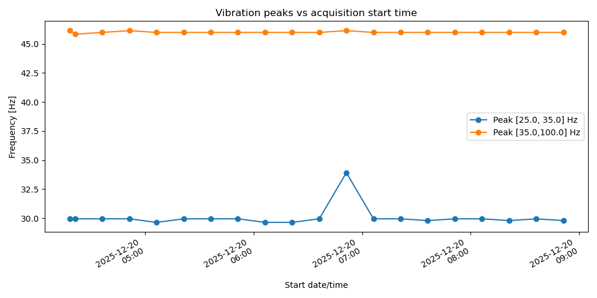
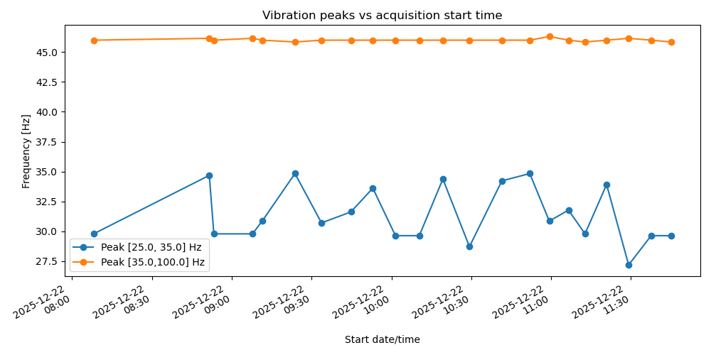
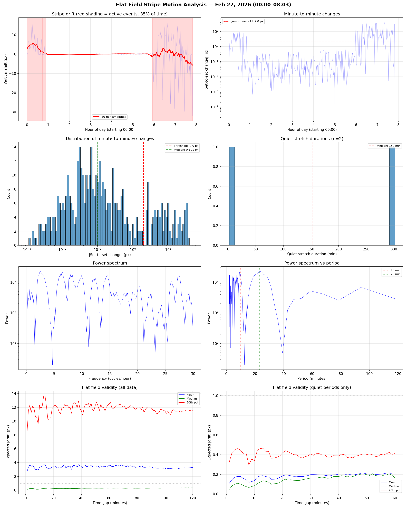

===============================
Vibration Frequency Measurement
===============================

Baseline Measurement
====================

This measurement was performed at the Advanced Photon Source (APS), beamline
2-BM (Micro-tomography), as part of the vibration test activities.
The data analyzed here were collected before the APS air handler are turned off. 
As such, this dataset serves primarily to validate the vibration-analysis method
and to establish a reference measurement of the vertical vibration level under 
the current (house-ventilated) operating conditions.

The goal of the test was to characterize the vertical vibration of the
x-ray image formed on a scintillator screen by analyzing a high-speed image
sequence acquired with the 2-BM micro-CT detector system.

Experiment Summary
------------------

A stack of projection images was acquired with a FLIR Oryx camera viewing a
LuAG scintillator at 20 keV beam energy. The camera operated at
approximately **99 fps** (from file name ``S01-AHU401_1000frms_99fps_001.h5``),
and the detector configuration (objective lens, binning, and ROI) was chosen for
micro-tomography imaging with relatively large field of view. The resulting 3D
dataset (frames × height × width) was analyzed to determine the dominant
vertical vibration frequencies of the image.

The analysis used the script
`frequency.py <https://github.com/decarlof/sandbox/blob/master/vibration/frequency_folder.py>`_ 
and applied a **position-based cross-correlation method** to estimate frame-to-frame
vertical motion, followed by FFT-based frequency analysis. The frequency search
was partitioned into two bands:

* **25–35 Hz**: typically associated with the ventilation / mechanical lines.
* **35–100 Hz**: to capture possible structural resonance modes.

Instrument and Acquisition Metadata
-----------------------------------

General information
^^^^^^^^^^^^^^^^^^^

+-----------------------------------+---------------------------------------------------------------------+
| Item                              | Value                                                               |
+===================================+=====================================================================+
| Facility                          | Advanced Photon Source (APS)                                        |
+-----------------------------------+---------------------------------------------------------------------+
| Beamline                          | 2-BM                                                                |
+-----------------------------------+---------------------------------------------------------------------+
| Instrument                        | Micro-tomography                                                    |
+-----------------------------------+---------------------------------------------------------------------+
| Experiment title                  | APS-U Commissioning Vibration Test                                  |
+-----------------------------------+---------------------------------------------------------------------+
| Experimenter                      | DeCarlo                                                             |
+-----------------------------------+---------------------------------------------------------------------+
| Institution                       | Argonne National Laboratory                                         |
+-----------------------------------+---------------------------------------------------------------------+
| Proposal ID                       | 00000                                                               |
+-----------------------------------+---------------------------------------------------------------------+
| Raw data file                     | ``Baseline_10000frms_99fps_002.h5``                                 |
+-----------------------------------+---------------------------------------------------------------------+
| File path                         | ``/data2/2025-12/DeCarlo/run_20251222/``                            |
+-----------------------------------+---------------------------------------------------------------------+
| Acquisition start                 | 2025-12-22T08:53:16-0600                                            |
+-----------------------------------+---------------------------------------------------------------------+
| Acquisition end                   | 2025-12-22T09:07:46-0600                                            |
+-----------------------------------+---------------------------------------------------------------------+
| Storage ring current              | 130.13843732064413 mA                                               |
+-----------------------------------+---------------------------------------------------------------------+
| Fill mode                         | 130 mA / 48 singlets / High Coupling                                |
+-----------------------------------+---------------------------------------------------------------------+

X-ray source and optics
^^^^^^^^^^^^^^^^^^^^^^^

+-------------------------------------------+------------------------------------------------------+
| Item                                      | Value                                                |
+===========================================+======================================================+
| Source name                               | Advanced Photon Source                               |
+-------------------------------------------+------------------------------------------------------+
| Beamline                                  | 2-BM                                                 |
+-------------------------------------------+------------------------------------------------------+
| Monochromator name                        | 2-BM-A double multilayer monochromator               |
+-------------------------------------------+------------------------------------------------------+
| Monochromator mode                        | 0 (mono)                                             |
+-------------------------------------------+------------------------------------------------------+
| X-ray energy                              | 20.0 keV                                             |
+-------------------------------------------+------------------------------------------------------+
| Monochromator upstream arm (us\_arm)      | 0.7257932810105996 °                                 |
+-------------------------------------------+------------------------------------------------------+
| Monochromator downstream arm (ds\_arm)    | 0.7380825000000035 °                                 |
+-------------------------------------------+------------------------------------------------------+
| Mirror name                               | 2-BM Mirror                                          |
+-------------------------------------------+------------------------------------------------------+
| Mirror angle                              | 2.614850181232382 mrad                               |
+-------------------------------------------+------------------------------------------------------+
| Mirror stripe                             | 0 (Pt)                                               |
+-------------------------------------------+------------------------------------------------------+
| Mirror position x                         | 2.3624250000000018 mm                                |
+-------------------------------------------+------------------------------------------------------+
| Mirror position y                         | 0.00014500000000072788 mm                            |
+-------------------------------------------+------------------------------------------------------+

Slits configuration
^^^^^^^^^^^^^^^^^^^

+-------------------------------------------+------------------------------------------------------+
| Item                                      | Value                                                |
+===========================================+======================================================+
| Slits name                                | 2-BM slits                                           |
+-------------------------------------------+------------------------------------------------------+
| Upstream H center / size                  | -0.16999999999999993 mm / 2.000000000000001 mm       |
+-------------------------------------------+------------------------------------------------------+
| Upstream V center / size                  | -0.36 mm / 1.4000000000000001 mm                     |
+-------------------------------------------+------------------------------------------------------+
| Downstream H center / size                | 0.20599999999999952 mm / 3.7 mm                      |
+-------------------------------------------+------------------------------------------------------+
| Downstream V center / size                | 19.895787499999987 mm / 3.542425000000026 mm         |
+-------------------------------------------+------------------------------------------------------+

Attenuator configuration
^^^^^^^^^^^^^^^^^^^^^^^^

+-------------------------------------------+------------------------------------------------------+
| Item                                      | Value                                                |
+===========================================+======================================================+
| Attenuator name                           | 2-BM-A user filters                                  |
+-------------------------------------------+------------------------------------------------------+
| Upstream position                         | 4 mm                                                 |
+-------------------------------------------+------------------------------------------------------+
| Upstream filter list                      | 0: 1 mm C; 1: 150 µm Al; 2: 600 µm Al; 3: 1 mm Al;   |
|                                           | 4: None; 5: LowLimit                                 |
+-------------------------------------------+------------------------------------------------------+
| Additional filters                        | Manually added filters: None                         |
+-------------------------------------------+------------------------------------------------------+

Detector and imaging chain
^^^^^^^^^^^^^^^^^^^^^^^^^^

+-------------------------------------------+------------------------------------------------------+
| Item                                      | Value                                                |
+===========================================+======================================================+
| Detection system type                     | Micro-CT with scintillator + objective + FLIR camera |
+-------------------------------------------+------------------------------------------------------+
| Scintillator type                         | LuAG                                                 |
+-------------------------------------------+------------------------------------------------------+
| Scintillator active thickness             | 50.0 µm                                              |
+-------------------------------------------+------------------------------------------------------+
| Objective magnification                   | 2.0×                                                 |
+-------------------------------------------+------------------------------------------------------+
| Objective tube length                     | 1.0 mm                                               |
+-------------------------------------------+------------------------------------------------------+
| Objective effective pixel size            | 1.725 µm                                             |
+-------------------------------------------+------------------------------------------------------+
| Camera manufacturer / model               | FLIR Oryx ORX-10G-51S5M                              |
+-------------------------------------------+------------------------------------------------------+
| Camera serial number                      | 19173710                                             |
+-------------------------------------------+------------------------------------------------------+
| Camera pixel size (sensor)                | 3.45 µm                                              |
+-------------------------------------------+------------------------------------------------------+
| Detector data type                        | UInt8 (Mono8)                                        |
+-------------------------------------------+------------------------------------------------------+
| Detector temperature                      | 41.375 °C                                            |
+-------------------------------------------+------------------------------------------------------+
| Max sensor size (X × Y)                   | 1224 × 1024 pixels                                   |
+-------------------------------------------+------------------------------------------------------+
| ROI size (X × Y)                          | 1024 × 1024 pixels                                   |
+-------------------------------------------+------------------------------------------------------+
| Binning (X, Y)                            | 2 × 2                                                |
+-------------------------------------------+------------------------------------------------------+
| Effective field of view (X, Y)            | 1024 px × 1.725 µm ≈ 1.77 mm                         |
|                                           | (per dimension, for 1×1; scaled accordingly for 2×2) |
+-------------------------------------------+------------------------------------------------------+
| Detector gain                             | 22.997265890825133                                   |
+-------------------------------------------+------------------------------------------------------+
| Exposure time                             | 0.009999 s                                           |
+-------------------------------------------+------------------------------------------------------+
| Acquire period                            | 0.006934384 s                                        |
+-------------------------------------------+------------------------------------------------------+
| Frame rate (from file name)               | 99 fps                                               |
+-------------------------------------------+------------------------------------------------------+
| Frame rate control                        | frame\_rate\_enable = No                             |
+-------------------------------------------+------------------------------------------------------+
| HDF5 plugin version                       | NDFileHDF5 ver1.10.1                                 |
+-------------------------------------------+------------------------------------------------------+
| ADCore version                            | 3.14.0                                               |
+-------------------------------------------+------------------------------------------------------+
| Detector driver version                   | 3.5.0                                                |
+-------------------------------------------+------------------------------------------------------+
| Detector SDK version                      | 4.0.0.116                                            |
+-------------------------------------------+------------------------------------------------------+

Vibration Analysis Method
-------------------------

The image sequence stored in ``/exchange/data`` of the HDF5 file was processed
using `frequency.py <https://github.com/decarlof/sandbox/blob/master/vibration/frequency_folder.py>`_.

Two complementary methods are implemented in the script; in this experiment
the reported values come from the **position-based method**:

1. **Position-based method**

   * For each frame, the vertical shift relative to the first frame is
     estimated using ``skimage.registration.phase_cross_correlation`` with
     an upsampling factor of 100.
   * The resulting series of absolute vertical positions (in pixels) is
     mean-subtracted and transformed with a real FFT (``np.fft.rfft``).
   * The magnitude spectrum is examined, and the dominant peak is located in
     a specified frequency band.

2. **Detrended shift-based method** (optionally available)

   * Frame-to-frame vertical shifts are computed (each frame relative to the
     next).
   * The shift series is linearly detrended and Hann-windowed.
   * FFT is applied and peaks are searched in the same band as above.

For this analysis, the script will typically be run with:

* Sampling rate derived from acquisition:  
  ``sampling_rate ≈ 1 / acquire_period ≈ 99 Hz``  
  (consistent with the acquisition period from the file name).

* Frequency bands:
  
  * ``[25.0, 35.0] Hz`` 
  * ``[35.0, 100.0] Hz`` 

* Frames used: a subset of the available frames (e.g., first 600–1000 frames)
  for robust FFT statistics.

Vibration Analysis Results
--------------------------

Processing configuration
^^^^^^^^^^^^^^^^^^^^^^^^

+-------------------------------------------+------------------------------------------------------+
| Item                                      | Value                                                |
+===========================================+======================================================+
| Script                                    | ``vibration/frequency.py``                           |
+-------------------------------------------+------------------------------------------------------+ 
| Input file                                | ``Baseline_10000frms_99fps_002.h5``                  |
+-------------------------------------------+------------------------------------------------------+
| Dataset path                              | ``/exchange/data``                                   |
+-------------------------------------------+------------------------------------------------------+
| Sampling rate used                        | 99.0 Hz (``dt = 0.010101010101010102 s``)            |
+-------------------------------------------+------------------------------------------------------+
| Frames loaded                             | 1000                                                 |
+-------------------------------------------+------------------------------------------------------+
| Frames used for analysis (position-based) | 648                                                  |
+-------------------------------------------+------------------------------------------------------+
| Upsampling factor (phase correlation)     | 100                                                  |
+-------------------------------------------+------------------------------------------------------+
| Frequency resolution (FFT)                | 0.15278 Hz                                           |
+-------------------------------------------+------------------------------------------------------+
| Frequency bands analyzed                  | [25.0, 35.0] Hz and [35.0, 100.0] Hz                 |
+-------------------------------------------+------------------------------------------------------+

Dual-band vibration frequencies
^^^^^^^^^^^^^^^^^^^^^^^^^^^^^^^

The dual-band analysis was performed with the **position-based method**:

+-------------------------------------------+-----------------+--------------------------------------------+
| Frequency band                            | Peak frequency  | Interpretation                             |
+===========================================+=================+============================================+
| 25.0–35.0 Hz                              | 29.792 Hz       | Dominant line in the "vent/line" band      |
+-------------------------------------------+-----------------+--------------------------------------------+
| 35.0–100.0 Hz                             | 45.986 Hz       | Dominant structural/resonance component    |
+-------------------------------------------+-----------------+--------------------------------------------+

Below are the results for the same measurement obtained repeated every 15 min one day ahead of the APS wide test.

.. table:: Measured dominant vertical vibration frequencies for each (`Sxx-AHUyyy_1000frms_99fps_zzz.h5`) file, 
           together with the corresponding (simulated) APS air handler status (1) or stopped (0) during that run.
   :align: center

   +--------------------------------------------+-------+--------------------------+------------------------+-------------------------+---+---+---+---+---+---+---+---+---+---+---+---+---+---+---+---+---+---+---+---+
   | file                                       | fps   |  start_date              |  Peak [25.0, 35.0] Hz  |   Peak [35.0,100.0] Hz  | AH| AH| AH| AH| AH| AH| AH| AH| AH| AH| AH| AH| AH| AH| AH| AH| AH| AH| AH| AH|
   +--------------------------------------------+-------+--------------------------+------------------------+-------------------------+---+---+---+---+---+---+---+---+---+---+---+---+---+---+---+---+---+---+---+---+
   |                                            |       |                          |                        |                         |S01|S03|S05|S07|S09|S11|S13|S15|S17|S19|S21|S23|S25|S27|S29|S31|S33|S35|S37|S39|
   +============================================+=======+==========================+========================+=========================+===+===+===+===+===+===+===+===+===+===+===+===+===+===+===+===+===+===+===+===+
   | S01-AHU401_1000frms_99fps_001.h5           | 99.0  | 2025-12-19T22:18:10-0600 |         29.944         |         46.139          | 0 | 1 | 1 | 1 | 1 | 1 | 1 | 1 | 1 | 1 | 1 | 1 | 1 | 1 | 1 | 1 | 1 | 1 | 1 | 1 |
   +--------------------------------------------+-------+--------------------------+------------------------+-------------------------+---+---+---+---+---+---+---+---+---+---+---+---+---+---+---+---+---+---+---+---+
   | S03-AHU501_1000frms_99fps_002.h5           | 99.0  | 2025-12-19T22:21:13-0600 |         29.944         |         45.833          | 0 | 1 | 1 | 1 | 1 | 1 | 1 | 1 | 1 | 1 | 1 | 1 | 1 | 1 | 1 | 1 | 1 | 1 | 1 | 1 |
   +--------------------------------------------+-------+--------------------------+------------------------+-------------------------+---+---+---+---+---+---+---+---+---+---+---+---+---+---+---+---+---+---+---+---+
   | S05-AHU502_1000frms_99fps_003.h5           | 99.0  | 2025-12-19T22:36:13-0600 |         29.944         |         45.986          | 0 | 0 | 1 | 1 | 1 | 1 | 1 | 1 | 1 | 1 | 1 | 1 | 1 | 1 | 1 | 1 | 1 | 1 | 1 | 1 |
   +--------------------------------------------+-------+--------------------------+------------------------+-------------------------+---+---+---+---+---+---+---+---+---+---+---+---+---+---+---+---+---+---+---+---+
   | S07-AHU503_1000frms_99fps_004.h5           | 99.0  | 2025-12-19T22:51:13-0600 |         29.944         |         46.139          | 0 | 0 | 0 | 1 | 1 | 1 | 1 | 1 | 1 | 1 | 1 | 1 | 1 | 1 | 1 | 1 | 1 | 1 | 1 | 1 |
   +--------------------------------------------+-------+--------------------------+------------------------+-------------------------+---+---+---+---+---+---+---+---+---+---+---+---+---+---+---+---+---+---+---+---+
   | S09-AHU504_1000frms_99fps_005.h5           | 99.0  | 2025-12-19T23:06:13-0600 |         29.639         |         45.986          | 0 | 0 | 0 | 0 | 1 | 1 | 1 | 1 | 1 | 1 | 1 | 1 | 1 | 1 | 1 | 1 | 1 | 1 | 1 | 1 |
   +--------------------------------------------+-------+--------------------------+------------------------+-------------------------+---+---+---+---+---+---+---+---+---+---+---+---+---+---+---+---+---+---+---+---+
   | S11-AHU505_1000frms_99fps_006.h5           | 99.0  | 2025-12-19T23:21:13-0600 |         29.944         |         45.986          | 0 | 0 | 0 | 0 | 0 | 1 | 1 | 1 | 1 | 1 | 1 | 1 | 1 | 1 | 1 | 1 | 1 | 1 | 1 | 1 |
   +--------------------------------------------+-------+--------------------------+------------------------+-------------------------+---+---+---+---+---+---+---+---+---+---+---+---+---+---+---+---+---+---+---+---+
   | S13-AHU506_1000frms_99fps_007.h5           | 99.0  | 2025-12-19T23:36:14-0600 |         29.944         |         45.986          | 0 | 0 | 0 | 0 | 0 | 0 | 1 | 1 | 1 | 1 | 1 | 1 | 1 | 1 | 1 | 1 | 1 | 1 | 1 | 1 |
   +--------------------------------------------+-------+--------------------------+------------------------+-------------------------+---+---+---+---+---+---+---+---+---+---+---+---+---+---+---+---+---+---+---+---+
   | S15-AHU507_1000frms_99fps_008.h5           | 99.0  | 2025-12-19T23:51:14-0600 |         29.944         |         45.986          | 0 | 0 | 0 | 0 | 0 | 0 | 0 | 1 | 1 | 1 | 1 | 1 | 1 | 1 | 1 | 1 | 1 | 1 | 1 | 1 |
   +--------------------------------------------+-------+--------------------------+------------------------+-------------------------+---+---+---+---+---+---+---+---+---+---+---+---+---+---+---+---+---+---+---+---+
   | S17-AHU508_1000frms_99fps_009.h5           | 99.0  | 2025-12-20T00:06:14-0600 |         29.639         |         45.986          | 0 | 0 | 0 | 0 | 0 | 0 | 0 | 0 | 1 | 1 | 1 | 1 | 1 | 1 | 1 | 1 | 1 | 1 | 1 | 1 |
   +--------------------------------------------+-------+--------------------------+------------------------+-------------------------+---+---+---+---+---+---+---+---+---+---+---+---+---+---+---+---+---+---+---+---+
   | S19-AHU509_1000frms_99fps_010.h5           | 99.0  | 2025-12-20T00:21:14-0600 |         29.639         |         45.986          | 0 | 0 | 0 | 0 | 0 | 0 | 0 | 0 | 0 | 1 | 1 | 1 | 1 | 1 | 1 | 1 | 1 | 1 | 1 | 1 |
   +--------------------------------------------+-------+--------------------------+------------------------+-------------------------+---+---+---+---+---+---+---+---+---+---+---+---+---+---+---+---+---+---+---+---+
   | S21-AHU510_1000frms_99fps_011.h5           | 99.0  | 2025-12-20T00:36:14-0600 |         29.944         |         45.986          | 0 | 0 | 0 | 0 | 0 | 0 | 0 | 0 | 0 | 0 | 1 | 1 | 1 | 1 | 1 | 1 | 1 | 1 | 1 | 1 |
   +--------------------------------------------+-------+--------------------------+------------------------+-------------------------+---+---+---+---+---+---+---+---+---+---+---+---+---+---+---+---+---+---+---+---+
   | S23-AHU511_1000frms_99fps_012.h5           | 99.0  | 2025-12-20T00:51:14-0600 |         33.917         |         46.139          | 0 | 0 | 0 | 0 | 0 | 0 | 0 | 0 | 0 | 0 | 0 | 1 | 1 | 1 | 1 | 1 | 1 | 1 | 1 | 1 |
   +--------------------------------------------+-------+--------------------------+------------------------+-------------------------+---+---+---+---+---+---+---+---+---+---+---+---+---+---+---+---+---+---+---+---+
   | S25-AHU512_1000frms_99fps_013.h5           | 99.0  | 2025-12-20T01:06:14-0600 |         29.944         |         45.986          | 0 | 0 | 0 | 0 | 0 | 0 | 0 | 0 | 0 | 0 | 0 | 0 | 1 | 1 | 1 | 1 | 1 | 1 | 1 | 1 |
   +--------------------------------------------+-------+--------------------------+------------------------+-------------------------+---+---+---+---+---+---+---+---+---+---+---+---+---+---+---+---+---+---+---+---+
   | S27-AHU513_1000frms_99fps_014.h5           | 99.0  | 2025-12-20T01:21:14-0600 |         29.944         |         45.986          | 0 | 0 | 0 | 0 | 0 | 0 | 0 | 0 | 0 | 0 | 0 | 0 | 0 | 1 | 1 | 1 | 1 | 1 | 1 | 1 |
   +--------------------------------------------+-------+--------------------------+------------------------+-------------------------+---+---+---+---+---+---+---+---+---+---+---+---+---+---+---+---+---+---+---+---+
   | S29-AHU514_1000frms_99fps_015.h5           | 99.0  | 2025-12-20T01:36:14-0600 |         29.792         |         45.986          | 0 | 0 | 0 | 0 | 0 | 0 | 0 | 0 | 0 | 0 | 0 | 0 | 0 | 0 | 1 | 1 | 1 | 1 | 1 | 1 |
   +--------------------------------------------+-------+--------------------------+------------------------+-------------------------+---+---+---+---+---+---+---+---+---+---+---+---+---+---+---+---+---+---+---+---+
   | S31-AHU515_1000frms_99fps_016.h5           | 99.0  | 2025-12-20T01:51:14-0600 |         29.944         |         45.986          | 0 | 0 | 0 | 0 | 0 | 0 | 0 | 0 | 0 | 0 | 0 | 0 | 0 | 0 | 0 | 1 | 1 | 1 | 1 | 1 |
   +--------------------------------------------+-------+--------------------------+------------------------+-------------------------+---+---+---+---+---+---+---+---+---+---+---+---+---+---+---+---+---+---+---+---+
   | S33-AHU516_1000frms_99fps_017.h5           | 99.0  | 2025-12-20T02:06:14-0600 |         29.944         |         45.986          | 0 | 0 | 0 | 0 | 0 | 0 | 0 | 0 | 0 | 0 | 0 | 0 | 0 | 0 | 0 | 0 | 1 | 1 | 1 | 1 |
   +--------------------------------------------+-------+--------------------------+------------------------+-------------------------+---+---+---+---+---+---+---+---+---+---+---+---+---+---+---+---+---+---+---+---+
   | S35-AHU517_1000frms_99fps_018.h5           | 99.0  | 2025-12-20T02:21:14-0600 |         29.792         |         45.986          | 0 | 0 | 0 | 0 | 0 | 0 | 0 | 0 | 0 | 0 | 0 | 0 | 0 | 0 | 0 | 0 | 0 | 1 | 1 | 1 |
   +--------------------------------------------+-------+--------------------------+------------------------+-------------------------+---+---+---+---+---+---+---+---+---+---+---+---+---+---+---+---+---+---+---+---+
   | S37-AHU518_1000frms_99fps_019.h5           | 99.0  | 2025-12-20T02:36:14-0600 |         29.944         |         45.986          | 0 | 0 | 0 | 0 | 0 | 0 | 0 | 0 | 0 | 0 | 0 | 0 | 0 | 0 | 0 | 0 | 0 | 0 | 1 | 1 |
   +--------------------------------------------+-------+--------------------------+------------------------+-------------------------+---+---+---+---+---+---+---+---+---+---+---+---+---+---+---+---+---+---+---+---+
   | S39-AHU403_1000frms_99fps_020.h5           | 99.0  | 2025-12-20T02:51:15-0600 |         29.792         |         45.986          | 0 | 0 | 0 | 0 | 0 | 0 | 0 | 0 | 0 | 0 | 0 | 0 | 0 | 0 | 0 | 0 | 0 | 0 | 0 | 1 |
   +--------------------------------------------+-------+--------------------------+------------------------+-------------------------+---+---+---+---+---+---+---+---+---+---+---+---+---+---+---+---+---+---+---+---+

.. warning:: 

  The file names were intentionally set as part of a test to verify the APS root name assignment. 
  During the measurements described above, all AHUs were operating.

   Reference run ahead of the vibration test

Summary and Remarks
-------------------

* Under the given beamline and detector conditions (20 keV, LuAG scintillator,
  2× objective, 2×2 binning, nominal 99 fps), the vertical image motion for
  run ``S01-AHU401_1000frms_99fps_001.h5`` is dominated by frequency components
  near **29.792 Hz** and **45.986 Hz**.

* The **29.792 Hz** component lies in the 25–35 Hz band and is consistent with a
  ventilation / mechanical line contribution.

* The **45.986 Hz** component lies in the 35–100 Hz band and indicates a higher
  frequency resonance, potentially associated with the detector mechanics,
  sample stage, or beamline infrastructure.

These values provide a quantitative baseline for comparison with future
measurements that will be taken after the air handler is turned off, enabling
assessment of the impact of HVAC-related vibrations on the imaging system.

Measurements
============

The following series of measurements was collected during the APS-wide air handler shutdown test on December 22, 2025.
Air handling units (AHUs) were turned off one at a time, and immediately after each AHU stopped we received an EPICS process variable (PV) 
signal to start an Acquire sequence with the micro-CT detector. 
All runs in this section were acquired under the same beamline and detector configuration as the baseline and were completed 
between 08:00 and 13:00 (local time).

.. table:: Air handler status (1) or stopped (0) during that test.
    :align: center

    +------------------------+----------+---+---+---+---+---+---+---+---+---+---+---+---+---+---+---+---+---+---+---+---+
    |       start_time       |   Run    | AH| AH| AH| AH| AH| AH| AH| AH| AH| AH| AH| AH| AH| AH| AH| AH| AH| AH| AH| AH|
    +------------------------+----------+---+---+---+---+---+---+---+---+---+---+---+---+---+---+---+---+---+---+---+---+
    |                        |          |S01|S03|S05|S07|S09|S11|S13|S15|S17|S19|S21|S23|S25|S27|S29|S31|S33|S35|S37|S39|
    +------------------------+----------+---+---+---+---+---+---+---+---+---+---+---+---+---+---+---+---+---+---+---+---+
    |2025-12-22T08:08:04-0600|Baseline  | 1 | 1 | 1 | 1 | 1 | 1 | 1 | 1 | 1 | 1 | 1 | 1 | 1 | 1 | 1 | 1 | 1 | 1 | 1 | 1 |
    +------------------------+----------+---+---+---+---+---+---+---+---+---+---+---+---+---+---+---+---+---+---+---+---+
    |2025-12-22T08:51:33-0600|Baseline  | 1 | 1 | 1 | 1 | 1 | 1 | 1 | 1 | 1 | 1 | 1 | 1 | 1 | 1 | 1 | 1 | 1 | 1 | 1 | 1 |
    +------------------------+----------+---+---+---+---+---+---+---+---+---+---+---+---+---+---+---+---+---+---+---+---+
    |2025-12-22T09:07:46-0600|S03-AHU501| 1 | 0 | 1 | 1 | 1 | 1 | 1 | 1 | 1 | 1 | 1 | 1 | 1 | 1 | 1 | 1 | 1 | 1 | 1 | 1 |
    +------------------------+----------+---+---+---+---+---+---+---+---+---+---+---+---+---+---+---+---+---+---+---+---+
    |2025-12-22T09:11:26-0600|S05-AHU502| 1 | 0 | 1 | 1 | 1 | 1 | 1 | 1 | 1 | 1 | 1 | 1 | 1 | 1 | 1 | 1 | 1 | 1 | 1 | 1 |
    +------------------------+----------+---+---+---+---+---+---+---+---+---+---+---+---+---+---+---+---+---+---+---+---+
    |2025-12-22T09:23:44-0600|S07-AHU503| 1 | 0 | 0 | 1 | 1 | 1 | 1 | 1 | 1 | 1 | 1 | 1 | 1 | 1 | 1 | 1 | 1 | 1 | 1 | 1 |
    +------------------------+----------+---+---+---+---+---+---+---+---+---+---+---+---+---+---+---+---+---+---+---+---+
    |2025-12-22T09:33:43-0600|S09-AHU504| 1 | 0 | 0 | 0 | 1 | 1 | 1 | 1 | 1 | 1 | 1 | 1 | 1 | 1 | 1 | 1 | 1 | 1 | 1 | 1 |
    +------------------------+----------+---+---+---+---+---+---+---+---+---+---+---+---+---+---+---+---+---+---+---+---+
    |2025-12-22T09:44:45-0600|S11-AHU505| 1 | 0 | 0 | 0 | 0 | 1 | 1 | 1 | 1 | 1 | 1 | 1 | 1 | 1 | 1 | 1 | 1 | 1 | 1 | 1 |
    +------------------------+----------+---+---+---+---+---+---+---+---+---+---+---+---+---+---+---+---+---+---+---+---+
    |2025-12-22T09:53:00-0600|S13-AHU506| 1 | 0 | 0 | 0 | 0 | 0 | 1 | 1 | 1 | 1 | 1 | 1 | 1 | 1 | 1 | 1 | 1 | 1 | 1 | 1 |
    +------------------------+----------+---+---+---+---+---+---+---+---+---+---+---+---+---+---+---+---+---+---+---+---+
    |2025-12-22T10:01:30-0600|S15-AHU507| 1 | 0 | 0 | 0 | 0 | 0 | 0 | 1 | 1 | 1 | 1 | 1 | 1 | 1 | 1 | 1 | 1 | 1 | 1 | 1 |
    +------------------------+----------+---+---+---+---+---+---+---+---+---+---+---+---+---+---+---+---+---+---+---+---+
    |2025-12-22T10:10:27-0600|S17-AHU508| 1 | 0 | 0 | 0 | 0 | 0 | 0 | 0 | 1 | 1 | 1 | 1 | 1 | 1 | 1 | 1 | 1 | 1 | 1 | 1 |
    +------------------------+----------+---+---+---+---+---+---+---+---+---+---+---+---+---+---+---+---+---+---+---+---+
    |2025-12-22T10:19:19-0600|S19-AHU509| 1 | 0 | 0 | 0 | 0 | 0 | 0 | 0 | 0 | 1 | 1 | 1 | 1 | 1 | 1 | 1 | 1 | 1 | 1 | 1 |
    +------------------------+----------+---+---+---+---+---+---+---+---+---+---+---+---+---+---+---+---+---+---+---+---+
    |2025-12-22T10:29:18-0600|S21-AHU510| 1 | 0 | 0 | 0 | 0 | 0 | 0 | 0 | 0 | 0 | 1 | 1 | 1 | 1 | 1 | 1 | 1 | 1 | 1 | 1 |
    +------------------------+----------+---+---+---+---+---+---+---+---+---+---+---+---+---+---+---+---+---+---+---+---+
    |2025-12-22T10:41:29-0600|S23-AHU511| 1 | 0 | 0 | 0 | 0 | 0 | 0 | 0 | 0 | 0 | 0 | 1 | 1 | 1 | 1 | 1 | 1 | 1 | 1 | 1 |
    +------------------------+----------+---+---+---+---+---+---+---+---+---+---+---+---+---+---+---+---+---+---+---+---+
    |2025-12-22T10:51:58-0600|S25-AHU512| 1 | 0 | 0 | 0 | 0 | 0 | 0 | 0 | 0 | 0 | 0 | 0 | 1 | 1 | 1 | 1 | 1 | 1 | 1 | 1 |
    +------------------------+----------+---+---+---+---+---+---+---+---+---+---+---+---+---+---+---+---+---+---+---+---+
    |2025-12-22T10:59:18-0600|S27-AHU513| 1 | 0 | 0 | 0 | 0 | 0 | 0 | 0 | 0 | 0 | 0 | 0 | 0 | 1 | 1 | 1 | 1 | 1 | 1 | 1 |
    +------------------------+----------+---+---+---+---+---+---+---+---+---+---+---+---+---+---+---+---+---+---+---+---+
    |2025-12-22T11:06:31-0600|S29-AHU514| 1 | 0 | 0 | 0 | 0 | 0 | 0 | 0 | 0 | 0 | 0 | 0 | 0 | 0 | 1 | 1 | 1 | 1 | 1 | 1 |
    +------------------------+----------+---+---+---+---+---+---+---+---+---+---+---+---+---+---+---+---+---+---+---+---+
    |2025-12-22T11:12:44-0600|S31-AHU515| 1 | 0 | 0 | 0 | 0 | 0 | 0 | 0 | 0 | 0 | 0 | 0 | 0 | 0 | 0 | 1 | 1 | 1 | 1 | 1 |
    +------------------------+----------+---+---+---+---+---+---+---+---+---+---+---+---+---+---+---+---+---+---+---+---+
    |2025-12-22T11:20:50-0600|S33-AHU516| 1 | 0 | 0 | 0 | 0 | 0 | 0 | 0 | 0 | 0 | 0 | 0 | 0 | 0 | 0 | 0 | 1 | 1 | 1 | 1 |
    +------------------------+----------+---+---+---+---+---+---+---+---+---+---+---+---+---+---+---+---+---+---+---+---+
    |2025-12-22T11:29:07-0600|S35-AHU517| 1 | 0 | 0 | 0 | 0 | 0 | 0 | 0 | 0 | 0 | 0 | 0 | 0 | 0 | 0 | 0 | 0 | 1 | 1 | 1 |
    +------------------------+----------+---+---+---+---+---+---+---+---+---+---+---+---+---+---+---+---+---+---+---+---+
    |2025-12-22T11:37:35-0600|S37-AHU518| 1 | 0 | 0 | 0 | 0 | 0 | 0 | 0 | 0 | 0 | 0 | 0 | 0 | 0 | 0 | 0 | 0 | 0 | 1 | 1 |
    +------------------------+----------+---+---+---+---+---+---+---+---+---+---+---+---+---+---+---+---+---+---+---+---+
    |2025-12-22T11:45:12-0600|S39-AHU403| 1 | 0 | 0 | 0 | 0 | 0 | 0 | 0 | 0 | 0 | 0 | 0 | 0 | 0 | 0 | 0 | 0 | 0 | 0 | 1 |
    +------------------------+----------+---+---+---+---+---+---+---+---+---+---+---+---+---+---+---+---+---+---+---+---+

.. warning:: 

  For the last measurement, two air handlers (Sectors 1 and 39), which are of different designs, were turned off simultaneously. 
  The root file name for this last measurement is S39-AHU403. Please ignore the AH status for these two measurement.

   vibration test results

Flat Field Stability Measurement
=================================

A flat field stability study was conducted at beamline 2-BM to monitor the vertical
motion of horizontal stripes in the X-ray beam over an extended period.

Beamline Setup
--------------

The images were collected at the APS beamline 2-BM. The X-ray beam is conditioned by:

1. **Mirror M1** with a Pt coating operating at 0.15° grazing incidence angle, used as a
   low-pass energy filter.
2. **Double Multilayer Monochromator (DMM)** set to select 20 keV X-rays.

The X-ray beam illuminates a **scintillator screen**, which converts X-rays into visible
light. The visible light image is then captured by an optical camera coupled to the
scintillator via a 2× magnification objective.

.. note::

   The beam exhibits **horizontal stripes that move vertically** over time. These stripes
   are characteristic of the DMM optics and are a primary motivation for this flat field
   stability study. Because the stripe pattern drifts during data collection, a single
   flat field image may not adequately correct projection data acquired at a different
   time. Understanding the temporal behavior of these stripes is essential for developing
   improved flat field correction strategies.

Experimental Parameters
-----------------------

.. list-table::
   :header-rows: 1
   :widths: 40 60

   * - Parameter
     - Value
   * - Beamline
     - 2-BM (APS)
   * - Mirror M1
     - Pt coating, 0.15° grazing angle
   * - Monochromator
     - Double Multilayer Monochromator (DMM)
   * - Energy
     - 20 keV
   * - Detector
     - Visible light camera imaging a scintillator screen
   * - Objective
     - 2×
   * - Pixel size
     - 3.45 µm (with 2× binning)
   * - Image dimensions
     - 2048 × 1536 pixels
   * - Start time
     - 2026-02-22 00:00
   * - End time
     - 2026-02-22 08:03
   * - Duration
     - ~8 hours
   * - Exposure time
     - 0.1 s
   * - Images per set
     - 10
   * - Acquisition interval
     - 60 s
   * - Total sets acquired
     - 471 (sets 0–470)
   * - Total images acquired
     - 4710 (flat\_...\_0000.tif – flat\_...\_4709.tif)
   * - Image file size
     - ~6.3 MB each
   * - Total data volume
     - ~29 GB
   * - File name prefix
     - ``flat_2x_2bin3.45um_momo20keV_``
   * - Beam current threshold
     - 100 mA

Acquisition Details
-------------------

The camera was configured in **Multiple** image mode, collecting 10 consecutive frames
per trigger at 0.1 s exposure time. A new set of 10 images was triggered every 60 seconds.
The script monitored the APS storage ring current (``S-DCCT:CurrentM``) and was set to
stop automatically if the current dropped below 100 mA.

All images are open-beam (flat field) exposures with no sample in the beam path. Each image
captures the full X-ray beam profile after the M1 mirror and DMM optics, including the
characteristic horizontal stripe pattern produced by the multilayer optics.

The file naming convention follows sequential numbering:

- **Set 0:** ``flat_2x_2bin3.45um_momo20keV_0000.tif`` – ``flat_2x_2bin3.45um_momo20keV_0009.tif``
- **Set 1:** ``flat_2x_2bin3.45um_momo20keV_0010.tif`` – ``flat_2x_2bin3.45um_momo20keV_0019.tif``
- ...
- **Set 470:** ``flat_2x_2bin3.45um_momo20keV_4700.tif`` – ``flat_2x_2bin3.45um_momo20keV_4709.tif``

Each set of 10 images can be averaged to produce a single flat field frame, yielding
471 averaged flat field images spanning the 8-hour measurement window.

Analysis Results
----------------

The vertical stripe motion was analyzed at two timescales using cross-correlation of
horizontally-averaged vertical profiles:

1. **Fast motion** (within each 1-second set of 10 frames at 0.1 s intervals)
2. **Slow motion** (across 471 sets over 8 hours at 1-minute intervals)

   Flat field stripe motion analysis for Feb 22, 2026 (00:00–08:03). **Top left:**
   Vertical stripe drift over 8 hours; the blue trace shows the raw shift (in pixels)
   measured by cross-correlation of each set's averaged vertical profile relative to the
   first set, the red line is the 30-minute moving average, and red shaded regions mark
   active events where set-to-set jumps exceeded 2 pixels (35% of total time). Three
   active events are visible: initial settling (0–0.73 h), a brief disturbance
   (0.78–0.88 h), and a large sustained instability in the last 2 hours (5.93–7.83 h).
   **Top right:** Absolute set-to-set change (log scale) showing the bimodal character —
   most intervals have sub-pixel changes while occasional jumps reach up to 40 pixels.
   **Middle left:** Log-scale histogram of minute-to-minute changes confirming the
   heavy-tailed distribution with a median of 0.1 px but a long tail extending to 40 px.
   **Middle right:** Quiet stretch duration histogram showing two quiet periods (2 and
   302 minutes). **Bottom left:** Power spectrum of the raw signal with dominant peaks
   near 10-minute and 23-minute periods, though the spectral power is dominated by the
   intermittent jump events. **Bottom right:** Power spectrum plotted versus period.
   **Lower left:** Flat field validity for all data — expected drift as a function of
   time gap between flat field and scan, showing mean (blue), median (green), and 90th
   percentile (red). **Lower right:** Same analysis restricted to quiet periods only,
   showing that during stable beam conditions the drift remains below 0.5 pixels even
   for time gaps exceeding 60 minutes.

Overall Behavior
^^^^^^^^^^^^^^^^

The stripe motion is characterized by **intermittent large jumps on a quiet background**:

.. list-table::
   :header-rows: 1
   :widths: 50 50

   * - Metric
     - Value
   * - Total drift range
     - 48.5 pixels
   * - Median minute-to-minute change
     - 0.10 pixels
   * - Intervals exceeding 2 px jump
     - 100 of 470 (21.3%)
   * - Active time (near jumps)
     - 35.5%
   * - Quiet time
     - 64.5%
   * - 30-min smoothed trend range
     - 11.4 pixels
   * - Linear drift rate
     - −0.38 pixels/hour

Active Events
^^^^^^^^^^^^^

Three distinct active events were identified where the stripes exhibited large, rapid
vertical jumps:

.. list-table::
   :header-rows: 1
   :widths: 15 20 20 20 25

   * - Event
     - Time (h)
     - Duration (min)
     - Range (px)
     - Notes
   * - 0
     - 0.00 – 0.73
     - 45
     - 16.6
     - Initial settling after beam-up
   * - 1
     - 0.78 – 0.88
     - 7
     - 4.7
     - Brief disturbance
   * - 2
     - 5.93 – 7.83
     - 115
     - 48.5
     - Large sustained instability

The first event likely corresponds to thermal settling of the DMM optics after beam
delivery began. The third event, spanning the last 2 hours, dominates the total drift
range and may be related to thermal or mechanical changes in the monochromator or
storage ring orbit drifts.

Quiet Period Stability
^^^^^^^^^^^^^^^^^^^^^^

Between the active events (0.9 – 5.9 hours, approximately 5 hours), the stripes were
remarkably stable:

.. list-table::
   :header-rows: 1
   :widths: 50 50

   * - Metric
     - Value
   * - Duration
     - ~5 hours (302 minutes, sets 54–355)
   * - Median minute-to-minute change
     - 0.046 pixels
   * - Mean minute-to-minute change
     - 0.108 pixels
   * - 90th percentile change
     - 0.323 pixels
   * - Maximum change
     - 0.764 pixels
   * - Autocorrelation 1/e decay
     - 3 minutes
   * - Autocorrelation first zero crossing
     - 107 minutes

Flat Field Validity
^^^^^^^^^^^^^^^^^^^

The practical question is: **how much stripe drift should be expected between a flat field
acquisition and a tomographic scan?**

During **quiet periods**, flat fields remain valid for extended durations:

.. list-table::
   :header-rows: 1
   :widths: 20 20 20 20 20

   * - Time gap
     - Mean \|drift\|
     - Median \|drift\|
     - 90th pct
     - 95th pct
   * - 1 min
     - 0.108 px
     - 0.046 px
     - 0.323 px
     - 0.458 px
   * - 5 min
     - 0.178 px
     - 0.101 px
     - 0.446 px
     - 0.541 px
   * - 10 min
     - 0.136 px
     - 0.084 px
     - 0.338 px
     - 0.483 px
   * - 30 min
     - 0.197 px
     - 0.162 px
     - 0.407 px
     - 0.508 px
   * - 60 min
     - 0.201 px
     - 0.165 px
     - 0.412 px
     - 0.467 px
   * - 120 min
     - 0.230 px
     - 0.210 px
     - 0.445 px
     - 0.531 px
   * - 240 min
     - 0.332 px
     - 0.358 px
     - 0.536 px
     - 0.596 px

However, when considering **all data** (including active events), the drift is much larger:

.. list-table::
   :header-rows: 1
   :widths: 20 20 20 20 20

   * - Time gap
     - Mean \|drift\|
     - Median \|drift\|
     - 90th pct
     - 95th pct
   * - 1 min
     - 2.695 px
     - 0.101 px
     - 8.275 px
     - 18.949 px
   * - 5 min
     - 3.646 px
     - 0.242 px
     - 12.141 px
     - 21.826 px
   * - 30 min
     - 3.396 px
     - 0.251 px
     - 12.356 px
     - 18.801 px
   * - 60 min
     - 3.616 px
     - 0.300 px
     - 12.528 px
     - 17.593 px
   * - 240 min
     - 4.898 px
     - 0.654 px
     - 13.591 px
     - 19.301 px

The large difference between mean and median in the all-data table reflects the
intermittent nature of the jumps: most of the time the drift is sub-pixel, but
occasional large jumps (up to 40 pixels) dramatically increase the mean and upper
percentiles.

Spectral Analysis
^^^^^^^^^^^^^^^^^

The dominant oscillation periods in the stripe motion are:

.. list-table::
   :header-rows: 1
   :widths: 25 25 25 25

   * - Period band
     - % of power
     - RMS amplitude
     - Peak-to-peak
   * - 2–5 min
     - 43.6%
     - 0.73 px
     - 9.4 px
   * - 5–10 min
     - 31.9%
     - 0.63 px
     - 7.8 px
   * - 10–20 min
     - 10.1%
     - 0.35 px
     - 3.5 px
   * - 20–30 min
     - 10.8%
     - 0.37 px
     - 2.9 px
   * - 30–60 min
     - 1.5%
     - 0.14 px
     - 0.8 px
   * - >60 min
     - 2.1%
     - 0.16 px
     - 0.8 px

The strongest spectral peaks are at periods of ~9 min and ~23 min. However, the spectral
power is dominated by the intermittent jump events rather than continuous periodic
oscillations.

Fast Motion (Sub-second)
^^^^^^^^^^^^^^^^^^^^^^^^

Within each 1-second acquisition set (10 frames at 0.1 s):

.. list-table::
   :header-rows: 1
   :widths: 50 50

   * - Metric
     - Value
   * - Frame-to-frame std
     - 0.37 pixels
   * - Frame-to-frame median \|shift\|
     - 0.11 pixels
   * - Mean within-set range
     - 1.99 pixels
   * - Maximum within-set range
     - 8.92 pixels

Conclusions
-----------

1. **The stripe motion is intermittent, not continuous.** The beam is stable ~65% of the
   time with sub-pixel drift, punctuated by sudden jumps of up to 40 pixels.

2. **During quiet periods, flat fields are valid for hours.** Even with a 4-hour gap
   between flat field and scan, the expected drift is less than 0.6 pixels (95th
   percentile).

3. **Active events are the primary concern.** Three events were observed: an initial
   settling period (~45 min), a brief disturbance (~7 min), and a prolonged instability
   in the last 2 hours (~115 min).

4. **Practical recommendation:** Acquire flat fields as close to scan time as possible.
   If the beam is in a quiet state, a flat field acquired within 30 minutes will
   typically have less than 0.5 pixels of drift. However, if an active event occurs
   during the scan, no pre-acquired flat field will be adequate — real-time or
   adaptive flat field correction would be needed.

Analysis Scripts
----------------

The analysis was performed using two Python scripts available on GitHub:

1. `analyze_stripe_motion.py <https://github.com/decarlof/sandbox/blob/master/flats/analyze_stripe_motion.py>`_
   — Processes all 4710 TIFF images, computes vertical profiles and cross-correlation
   shifts, saves results to ``stripe_motion_results.npz``.

2. `analyze_slow_detail_v3.py <https://github.com/decarlof/sandbox/blob/master/flats/analyze_slow_detail_v3.py>`_
   — Loads the saved results and performs detailed characterization of jump behavior,
   quiet/active periods, spectral analysis, and flat field validity assessment.

.. code-block:: bash

   # Step 1: Process images (reads all TIFFs, ~30 min)
   python analyze_stripe_motion.py /path/to/flat/images/

   # Step 2: Detailed analysis (reads .npz, ~1 sec)
   python analyze_slow_detail_v3.py /path/to/flat/images/

Acquisition Script
------------------

The acquisition was controlled by a Python script using
`pyepics <https://pyepics.github.io/pyepics/>`_ to interface with the EPICS control
system. The full source is available at
`collect_flats.py <https://github.com/decarlof/sandbox/blob/master/flats/collect_flats.py>`_.

The script:

1. Configures the camera for Multiple image mode with 10 images per trigger.
2. Triggers acquisition every 60 seconds.
3. Monitors the APS beam current and stops if it drops below 100 mA.
4. Handles ``Ctrl-C`` for clean shutdown.

Key EPICS PVs used:

.. list-table::
   :header-rows: 1
   :widths: 50 50

   * - PV Name
     - Purpose
   * - ``2bmSP1:cam1:Acquire``
     - Trigger acquisition
   * - ``2bmSP1:cam1:ImageMode``
     - Set to Multiple (1)
   * - ``2bmSP1:cam1:NumImages``
     - Set to 10
   * - ``S-DCCT:CurrentM``
     - APS storage ring current
