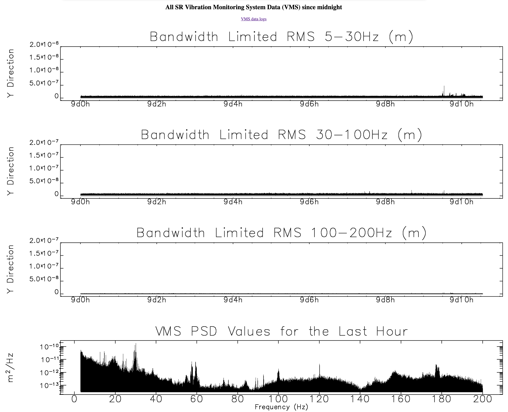

Vibration Monitors
==================

.. contents:: 
   :local:

The APS provides a list of `EPICS PVs monitoring the vibration <https://ops.aps.anl.gov/logging/VMS.html>`_ of the APS floor.
To access the PVs::

    [user2bmb@arcturus]$ caget caget S31:VMS:Y:RMS:200HzBW
    [user2bmb@arcturus]$ S31:VMS:Y:RMS:200HzBW      2.75468e-10

`live plots <https://ops.aps.anl.gov/VMS/VMS.html>`_ like the one below are also available: 

