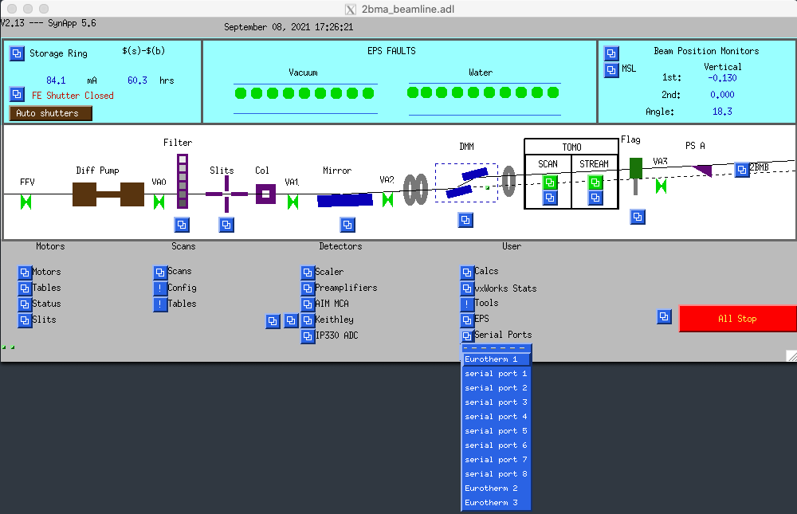
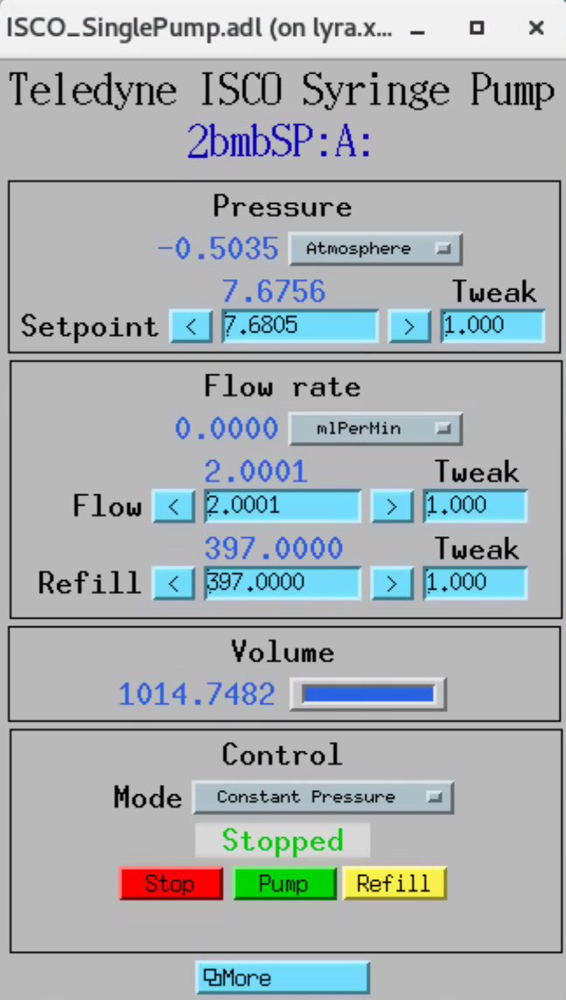

Sample environments
===================

The 2-BM microCT instrument has been designed to accomodate different kind of *in situ* cells.

Furnace
-------

+----------------+--------------+------------+---------+-------------------------+------+-------------------+----+-----------------------------------------------------------------------------------------------------------------------------------+
|  Type          | Temp. Range  | Atmosphere |  Image  | Contact                 | Loan |  Info             |    | More info                                                                                                                         |
+----------------+--------------+------------+---------+-------------------------+------+-------------------+----+-----------------------------------------------------------------------------------------------------------------------------------+
| Induction      | up to 1000 °C| Air        | |00001| | `Pavel Shevchenko`_     | Ask  |  `box link 0001`_ |  1 | Custom: water cooled                                                                                                              |
+----------------+--------------+------------+---------+-------------------------+------+-------------------+----+-----------------------------------------------------------------------------------------------------------------------------------+
| Induction      | up to 1500 °C| Air        | |00002| | `Alex Deriy`_           | Ask  |  `box link 0002`_ |  2 | Commercial parts: `THM 200 heater`_, `BK power supply`_, `PTC 10 controller`_, `3 AWG welding wires`_, plus custom water cooler   |
+----------------+--------------+------------+---------+-------------------------+------+-------------------+----+-----------------------------------------------------------------------------------------------------------------------------------+

.. _THM 200 heater: https://mhi-inc.com/microtube_heaters.html
.. _BK power supply: https://www.bkprecision.com/products/power-supplies/1693-1-15v-60a-switching-dc-power-supply-with-remote-sense.html
.. _PTC 10 controller: https://www.thinksrs.com/products/ptc10.html
.. _3 AWG welding wires: https://www.mcmaster.com/welding-wire

.. _box link 0001: https://anl.box.com/s/9qeu4xcm0bahty4pxgj7qhgt87277vci
.. _box link 0002: https://anl.box.com/s/i6t27uspatnpqdlhcne9pitkhg3m3axm

.. |00001| image:: ../img/furnace_00001.png
    :width: 20pt
    :height: 20pt

.. |00002| image:: ../img/furnace_00002.png
    :width: 20pt
    :height: 20pt

.. _Pavel Shevchenko: mail to:  pshevchenko@anl.gov
.. _Alex Deriy: mail to: deriy@anl.gov

The furnaces use a Eurotherm temperature controller. To access the MEDM screen select Eurotherm on:

Pressure
--------

+--------------------------------+--------------+-------------------+----------+--------------------------------------------+-------------------------+---------------------------+------+
| Type                           | Temp. Range  | Pressure          |  Image   | Commercial                                 | Contact                 |  Info                     |      |
+--------------------------------+--------------+-------------------+----------+--------------------------------------------+-------------------------+---------------------------+------+
| Teledyne ISCO 65D Syringe Pump |      -       | up to 20,000 psi  | |p00001| | Yes                                        | `Mark Rivers`_          |  `box link p0001`_        |  1   |
+--------------------------------+--------------+-------------------+----------+--------------------------------------------+-------------------------+---------------------------+------+
| Teledyne 1000D Syringe Pump    |   120 °C     | up to 12,000 psi  | |p00002| | Yes                                        | `Pavel Shevchenko`_     |  `box link p0002`_        |  1   |
+--------------------------------+--------------+-------------------+----------+--------------------------------------------+-------------------------+---------------------------+------+
| Vindum VP-12K dual-piston Pump |   120 °C     | up to 12,000 psi  | |p00003| | Yes                                        | `Mark Rivers`_          |  `web link p0003`_        |  1   |
+--------------------------------+--------------+-------------------+----------+--------------------------------------------+-------------------------+---------------------------+------+

To run the Teledyne 1000D Syringe Pump at 2-BM::

    [user2bmb@lyra,478,~]$ 2bmbSP 
        Usage: 2bmbSP.sh {start|stop|restart|status|console|run|medm|caqtdm}

::

    [user2bmb@lyra,478,~]$ 2bmbSP medm 

opens the pump control screen:

.. _box link p0001: https://anl.box.com/s/3xw458cbs0t1k80l2jzxjon148uftqqq
.. _box link p0002: https://anl.box.com/s/3xw458cbs0t1k80l2jzxjon148uftqqq
.. _web link p0003: https://vindum.com/products/vp-series-high-pressure-metering-pumps

.. |p00001| image:: ../img/press_00001.png
    :width: 20pt
    :height: 20pt

.. |p00002| image:: ../img/press_00002.png
    :width: 20pt
    :height: 20pt

.. |p00003| image:: ../img/press_00003.png
    :width: 20pt
    :height: 20pt

.. _Pavel Shevchenko: mail to:  pshevchenko@anl.gov
.. _Mark Rivers: mail to:  rivers@cars.uchicago.edu

Battery cell
~~~~~~~~~~~~

to be completed

