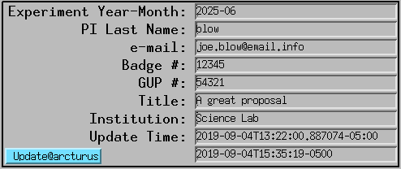

Check list
==========

At the beginning of a new user beamtime login into user2bmb@arcturus then::

    [user2bmb@arcturus]$ start_tomo 

and check the user info screen:

make sure the user PV are updated correctly from the scheduling system if not hit the update button for instructions or::

    [user2bmb@arcturus]$ bash
    [user2bmb@arcturus]$ conda activate dm
    [user2bmb@arcturus]$ source /home/dm_bm/etc/dm.setup.sh
    [user2bmb@arcturus]$ dmagic show
    [user2bmb@arcturus]$ dmagic tag

you can also enter manually the user last name/email address then you can create standard (YYYY_MM/pi_last_name) user folders on petrel with:

as user2bmb@arcturus::

    [user2bmb@arcturus]$ bash
    [user2bmb@arcturus]$ globus dirs

and you can share this folder will all users listed in the scheduled proposal with::

    [user2bmb@arcturus]$ globus email --schedule

At the end of the user beamtime make a Globus copy between

    [user2bmb@pg10ge]$  /local/data/YYYY-MM/PI_lastName/

    and the same YYYY-MM/PI_lastName/ on  `petrel <https://app.globus.org/file-manager?origin_id=e133a81a-6d04-11e5-ba46-22000b92c6ec&origin_path=%2F2-BM%2F>`_.
