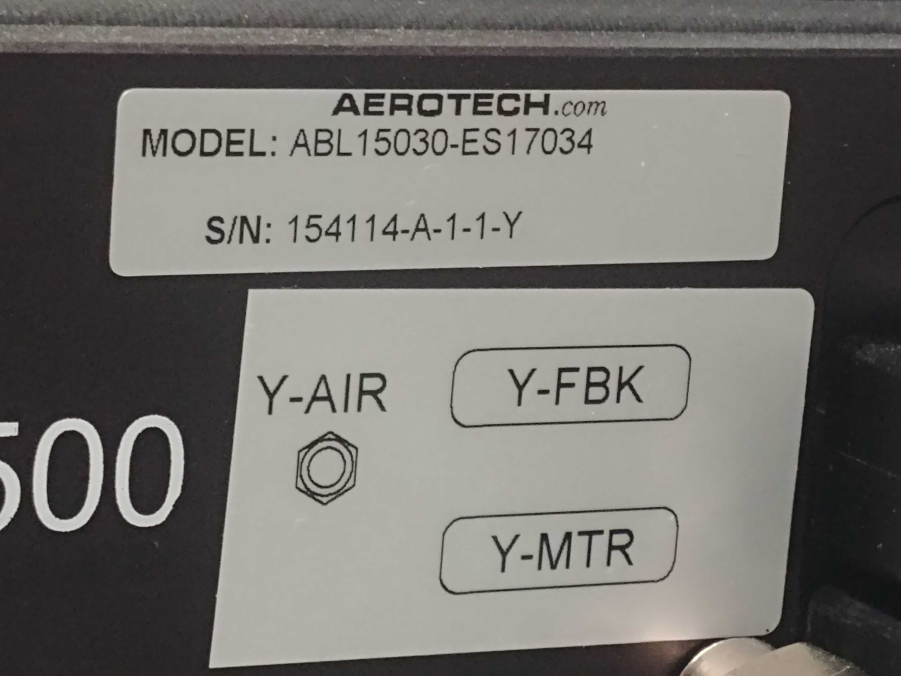
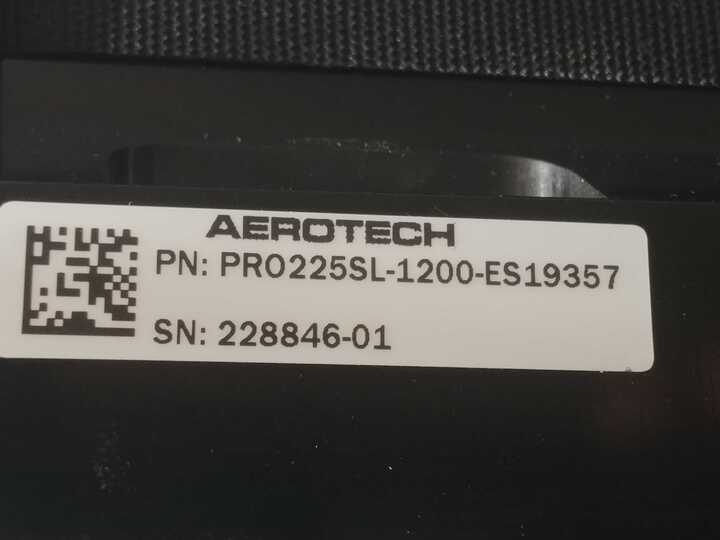

Linear Stages
=============

Camera to detector distance can be adjusted by moving the camera on a linear stage along Z.

These are the linear stages available at 2-BM:

+-----------+--------------+--------------------------+------------------------+---------+----------------------------+----------------------------------+
| Station   | Descriptiom  | Model                    |     Travel (mm)        |  Image  | Controller                 |     Info                         | 
+-----------+--------------+--------------------------+------------------------+---------+----------------------------+----------------------------------+
| 2-BM-B    | Air bearing  | ABL 15030-ES17034        |       300              | |00003| | ENSEMBLE CL 10-40-MXU      |   `box link 0001`_, `order 0001`_|
+-----------+--------------+--------------------------+------------------------+---------+----------------------------+----------------------------------+
| 2-BM-B    | mechanical   | PRO 225SL-1200-ES19357   |      1200              | |00004| |                            |                                  |
+-----------+--------------+--------------------------+------------------------+---------+----------------------------+----------------------------------+

Start IOC for PRO 225SL-1200-ES19357 (moving the Optique Peter system in Z):

::

    [user2bmb@arcturus,~]$ 2bmbAERO start

.. _box link 0001: https://anl.box.com/s/ni1rtky64dj7iskozxkvmoc3uuvhg2be
.. _order 0001: https://apps.inside.anl.gov/paris/req.jsp?reqNbr=F0-165119

