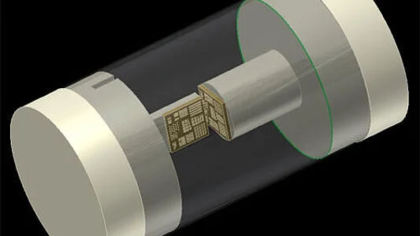
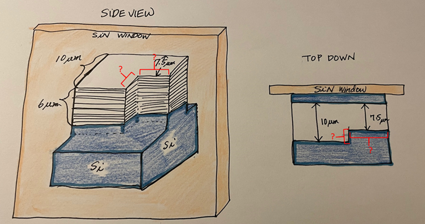
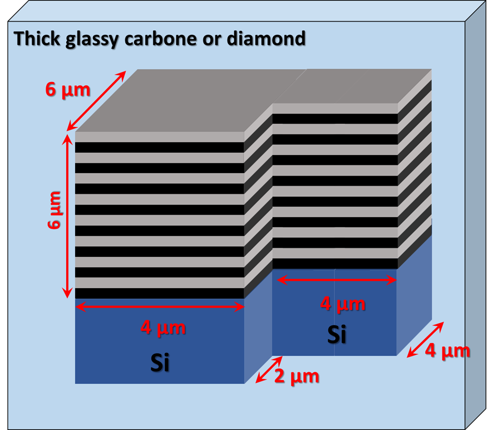
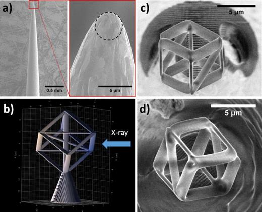

Phantoms
========

The following resolution patterns are available:

.. _QRM: https://www.qrm.de/en/products/micro-ct-bar-pattern-phantoms
.. _HighRI_Optics: https://highrioptics.com/
.. _ref_01: https://anl.app.box.com/s/hqfay9yue394plj5l0aeubywa2vngsd5
.. _order_01: https://apps.inside.anl.gov/paris/req.jsp?reqNbr=G1-055067
.. _quote_01: https://anl.box.com/s/9ah4y9y7selznrikg02xtky06x2b63v3
.. _ald_paper: https://doi.org/10.1116/1.5025240

+---------------------------------+---------------------------------+------------------------------------+---------------------------------+
|             Type                |          Supplier               |   Image                            |             Documents           |  
+=================================+=================================+====================================+=================================+
|             µCT                 |             QRM_                |  |00100|                           |       ref_01_                   |  
+---------------------------------+---------------------------------+------------------------------------+---------------------------------+
|             nanoCT 1            |             HighRI_Optics_      |  |00200|, |00201|                  |       order_01_, quote_01_      |  
+---------------------------------+---------------------------------+------------------------------------+---------------------------------+
|             nanoCT 2            |  3D printed by Nanoscribe       |  |00300|                           |       ald_paper_                |  
+---------------------------------+---------------------------------+------------------------------------+---------------------------------+
