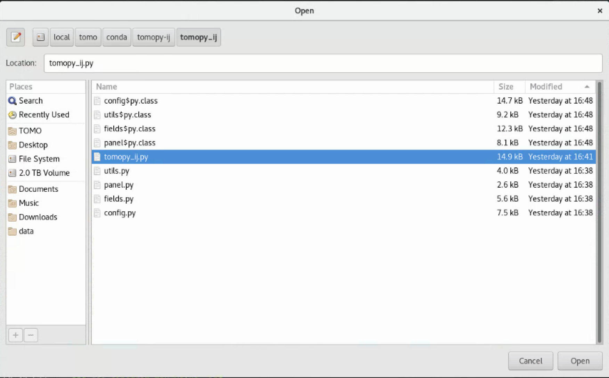
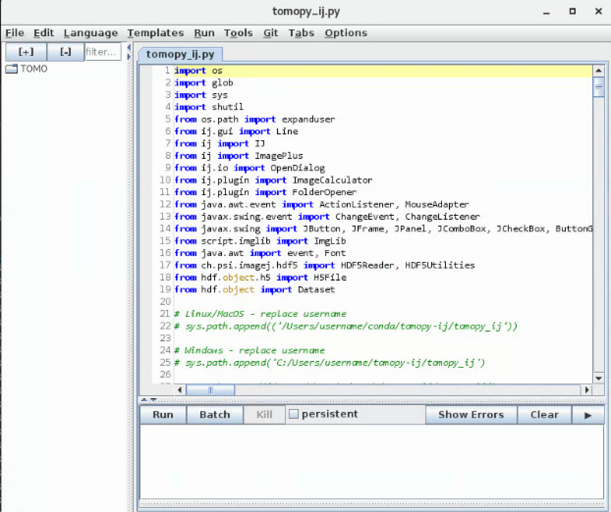
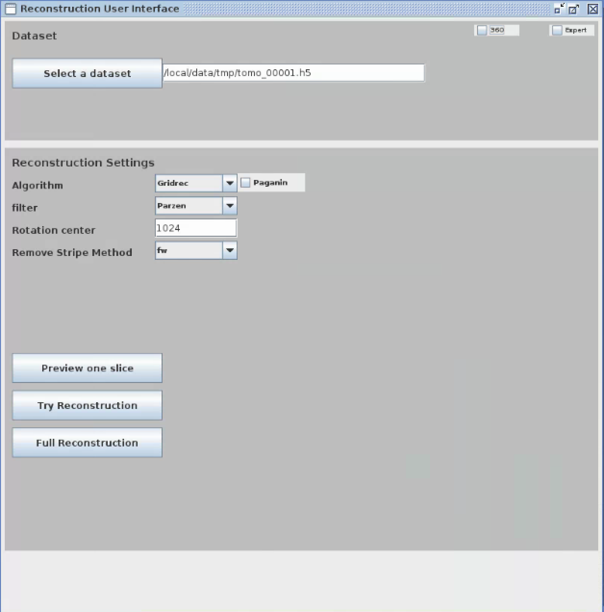

Reconstruction
==============

tomopy-ij
---------

To reconstruct using the `tomopy ij <https://github.com/xray-imaging/tomopy-ij>`_:

::

    [tomo@handyn]$ bash
    [tomo@handyn]$ activate tomopy-cli

start Fiji::

    (tomopy-cli) tomo@handyn ~ $ /home/beams/TOMO/Software/Fiji.app/ImageJ-linux64

then ImageJ->File->Open and select /local/tomo/conda/tomopy-ij/tomopy_ij.py:

then press run on:

to obtain the main tomopy-ij screen:

for more details check `tomopy ij <https://github.com/xray-imaging/tomopy-ij>`_.

tomopy-cli
----------

To manually reconstruct a data set, use the `tomopy cli <https://github.com/tomography/tomopy-cli>`_:

::

    [tomo@handyn]$ tomopy recon --file-name /local/data/YYYY-MM/PI_lastName/file.h5 

To automatically find the center for all data sets in a directory use::

    [tomo@handyn]$ tomopy find_center --file-name /local/data/2021-02/Stock/180/

this command will generate a parameter file (extra_params.yaml) containing the centers.

To run a single slice reconstruction on all the data sets using the parameter file use::

    [tomo@handyn]$ tomopy recon  --rotation-axis-auto manual  --gridrec-padding True --nsino 0.5 --reconstruction-type slice --file-name  /local/data/2021-02/Stock/180/ --parameter-file /local/data/2021-02/Stock/180/extra_params.yaml

After inspecting the reconstructed slices, you can adjust the center by editing the parameter file, then you can run the full reconstruction for all data sets with::

    [tomo@handyn]$ tomopy recon  --gridrec-padding True --remove-stripe-method fw --fw-pad True --nsino-per-chunk 128 --reconstruction-type full --file-name  /local/data/2021-02/Stock/180/ --parameter-file /local/data/2021-02/Stock/180/extra_params.yaml

360 deg data sets
~~~~~~~~~~~~~~~~~

To do a try reconstrution on a 0-360 deg data set run::

    [tomo@handyn]$ tomopy recon --reconstruction-type try --rotation-axis-auto manual --gridrec-padding True --remove-stripe-method fw --fw-pad True  --file-type double_fov --rotation-axis 50 --center-search-width 45 --file-name /local/data/2021-02/Stock/360/01_010.h5

once the center is selected run the full reconstruction with::

    [tomo@handyn]$ tomopy recon --reconstruction-type full --rotation-axis-auto manual --gridrec-padding True --remove-stripe-method fw --fw-pad True  --nsino-per-chunk 128 --file-type double_fov   --file-name /local/data/2021-02/Stock/360/01_010.h5 --rotation-axis 30.0
