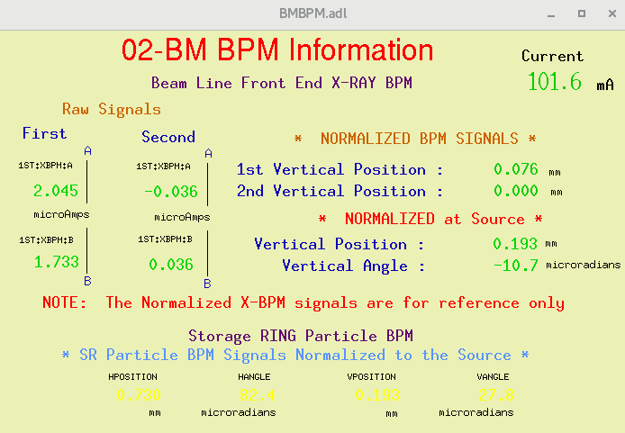
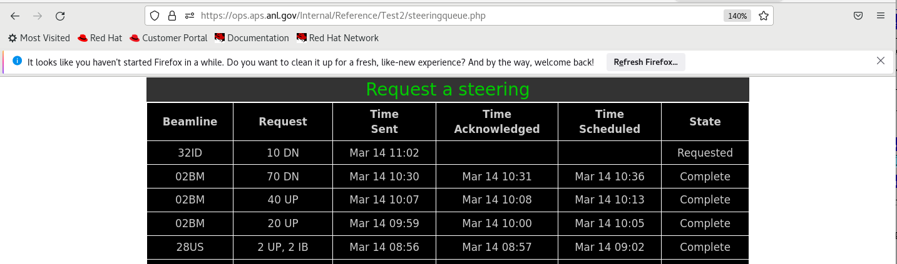
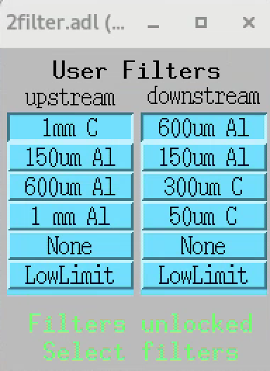
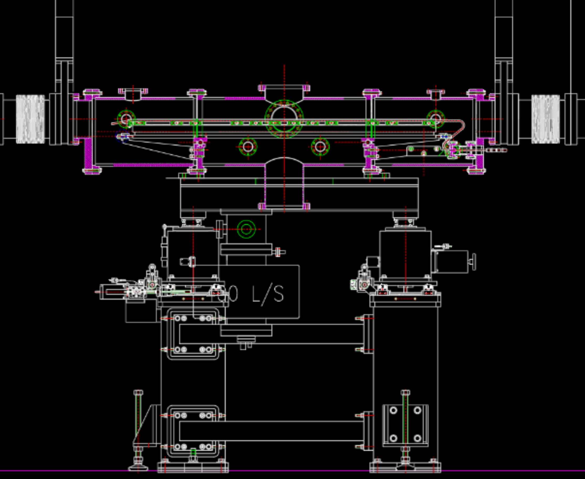
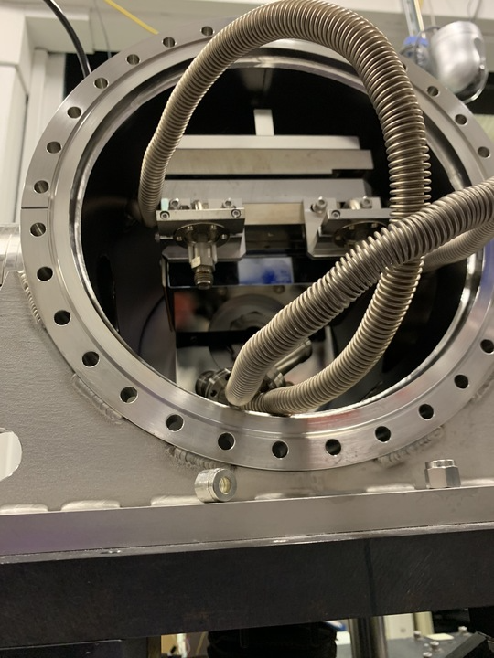

Reference
=========

Here you can find links to  2-BM technical reference material like drawings, hardware manuals etc.

Source
------

+-----------------------------------------+-------------+------------------------+
|  Parameters                             |    Value    |       Units            |
+-----------------------------------------+-------------+------------------------+
|  Storage Ring Electron Energy           |    7.0      |       GeV              |
+-----------------------------------------+-------------+------------------------+
|  Storage Ring Electron Current          |    100.0    |       mA               |
+-----------------------------------------+-------------+------------------------+
|  Bend Radius                            |    38.96    |       m                |
+-----------------------------------------+-------------+------------------------+
|  Peak Magnetic Field                    |    0.6      |       Tesla            |
+-----------------------------------------+-------------+------------------------+
|  Critical X-ray Energy                  |    19.5     |       keV              |
+-----------------------------------------+-------------+------------------------+
|  Horizontal Source Size                 |    198      |       μm FWHM          |
+-----------------------------------------+-------------+------------------------+
|  Vertical Source Size                   |    78       |       μm FWHM          |
+-----------------------------------------+-------------+------------------------+
|  Vertical Source Divergence at 11 keV   |    157      |       μ rad FWHM       |
+-----------------------------------------+-------------+------------------------+
|  Flux at 19.5 keV                       |  1.12x10^13 |    /sec/0.1%BW/mrad(H) | 
+-----------------------------------------+-------------+------------------------+

Steering correction
~~~~~~~~~~~~~~~~~~~

To adjust the beam position Vertical Angle or Vertical Position reported in the BMP control screen:

use the `APS steering request <https://ops.aps.anl.gov/Internal/Reference/Test2/steeringqueue.php>`_ web page.

.. warning:: The APS steering request web page shows the green request a steering button only on the beamline authorized computer. 

Filters
-------

Mirror
------

The pre-APS-U `mirror <https://anl.box.com/s/nyvibklz6ckkm148aoo02ht3e0bowxs9>`_ was a flat mirror with two coatings: 

+-------------+----------------------+
| Coating     | Nominal angle (mrad) |
+-------------+----------------------+
| Cr          |      2.657           |
+-------------+----------------------+
| Pt          |      2.657           |
+-------------+----------------------+

Mirror reference documents:

The mirror installed at 2-BM (APS-M1) has been recoated and put back in service post APS-U. The disassembly process is documented by `these photos <https://anl.box.com/s/1qicl7o2mo9byuadmc0gs12g0s33v6ww>`_.

In a second phase the original mirror installed at 2-BM (APS-M1) will be replaced with a new mirror (APS-U-M1). Below we capture all associated docuemnts:

    #. M1 to APS-U-M1 `Retrofit <https://anl.box.com/s/m3m0j77m081az932ae4lqrbz4lgebw4u>`_
    #. `Metrology <https://anl.box.com/s/2ki5fhawdckqkdjkzxjrudjmqkpllpkc>`_ on the original M1

DMM Multi-layer
---------------

2-BM has a double crystal multi-layer monochromator (DMM) to change energy. 
The beamline x-ray energy change is managed by the `energy cli <https://github.com/xray-imaging/energy>`_ python library. 

Login into user2bmb@arcturus then::

    [user2bmb@arcturus,42,~]$ bash
    [user2bmb@arcturus,42,~]$ energy set --mode Mono --energy-value 20

for help::

    energy -h

More detailed instructions are here the `energy cli <https://github.com/xray-imaging/energy>`_

Technical infomation about the DMM are available at the links below:

+-----------+--------------+-------------------+------------------------------------------------------------------------+
| Station   | Descriptiom  |   Images          |   Info                                                                 | 
+-----------+--------------+-------------------+------------------------------------------------------------------------+
| 2-BM-A    |     DMM      | |00001|, |00002|  | `drawings1`_, `drawings2`_, `crystals specs`_, `documentation folder`_ |
+-----------+--------------+-------------------+------------------------------------------------------------------------+

.. |00001| image:: ../img/dmm_01.png 
    :width: 20pt
    :height: 20pt

.. _drawings1: https://anl.box.com/s/0whx6hy3lcqllocolhee8kq72y0f4wnn
.. _drawings2: https://anl.box.com/s/0sa7gjm3nbmacwjknxth0k98y21sa7iy
.. _crystals specs: https://anl.box.com/s/4o7fewu63rwm2tj0l9ezr79ccjozyn77
.. _documentation folder: https://anl.box.com/s/w1eg4cxw43715bnzk8jcg3hd64rdnsdl

Beam-Sample Distance
--------------------

The distance between the table and the scintillator center (current setup) at 2-BM-B is 415 mm

Slits Drawings
--------------

The slits at 2-BM are standard APS L3-20. Technical as-built drawings are available `here <https://anl.box.com/s/sgmoux6db8tsx71pvifzkf2ajopfidqx>`_.

