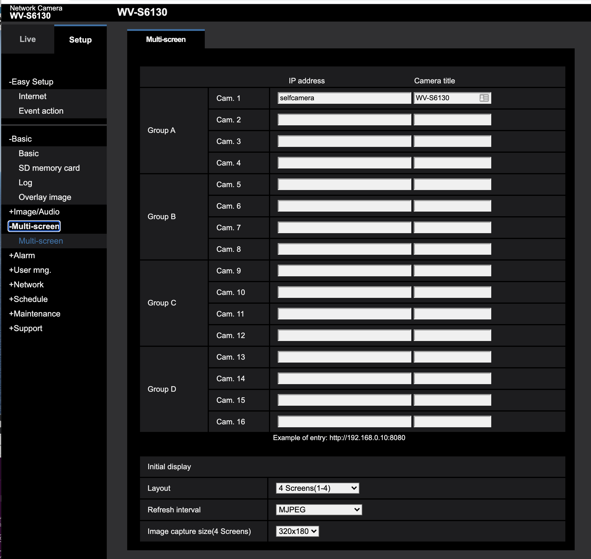
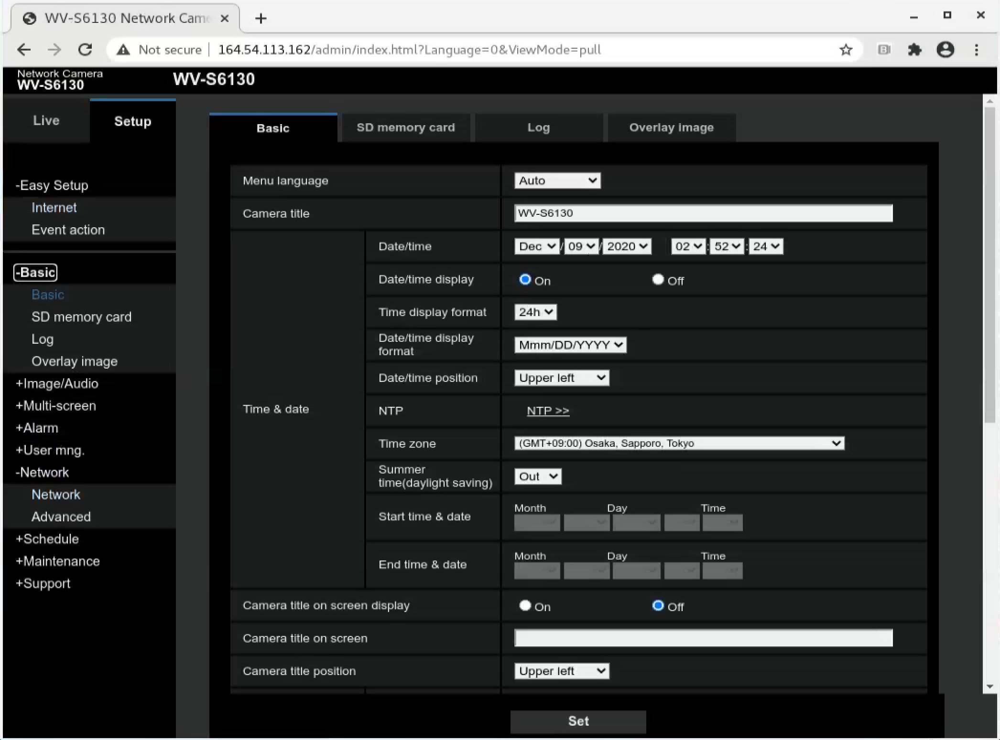
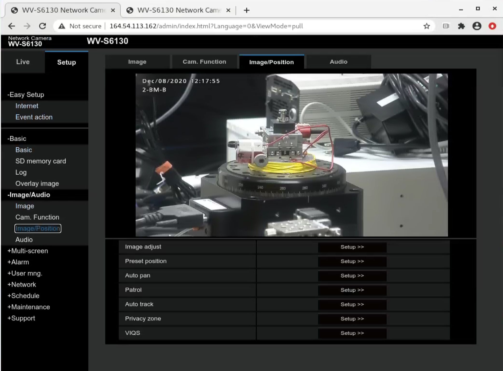
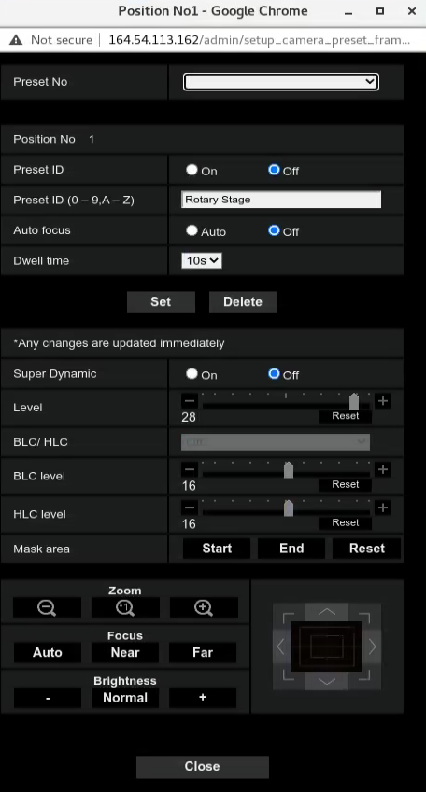

Web Cam
=======

.. contents:: 
   :local:

To access the old beamline web cam ssh to the beamline then open web browser and use IP address::

    XXX.XX.143.19

New webcams are accessible from::

     2-BM-A: xxx.xx.113.137
     2-BM-B: xxx.xx.113.162
    32-ID-B: xxx.xx.102.71
    32-ID-B: xxx.xx.102.89
    32-ID-C: xxx.xx.102.90
    32-ID-C: xxx.xx.102.88

Multi screen
------------

You can dispay multiple cameras on the same web page by configurting:

Time Zone
---------

.. warning:: factorty default time zone is Osaka, Japan. Change these and use ntp1.xray.aps.anl.gov (164.54.100.129) or ntp2.xray.aps.anl.gov (164.54.100.155) the set the camera ntp server to synchronize with the APS time server. See below the webcam NTP configuration page.

Also you can configure webcam preset position with:

