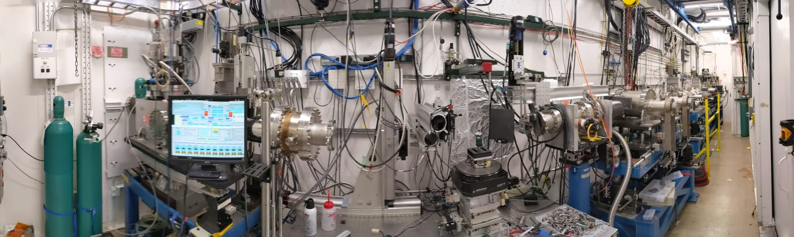

2-BM beamline safety orientation
================================

Please refer to the following as a general guideline and use it in conjunction with all the other safety courses you have taken at Argonne!

Safety first
~~~~~~~~~~~~

* Safety mindset is important. 
* Be attentive and think of others safety as well as of yours at all times.
* Stop work authority works both ways.

Common potential hazards
~~~~~~~~~~~~~~~~~~~~~~~~

X-ray radiation, high voltage equipment, pressurized gasses, hazardous chemicals, cryogenic liquids and system components, high heat sources, moving mechanical parts, robots, sharp objects.

Beamline overview
~~~~~~~~~~~~~~~~~

The 2-BM beamline features two stations, with Station B serving as the experimental hutch. Both hutches are fully shielded with lead: Station B is rated for pink/mono beam, while Station A is designed for white beam.

To facilitate easy access for running lines and cables, there are removable lead shielding hatches (labyrinths) on the tops and sides of the hutches. Each removable piece of shielding is marked with a designated PINK TAG, indicating that it may only be removed with a special permit. Note that beamline operation is prohibited unless all shielding pieces are in place.

The 2-BM beamline has two critical safety systems:

1. **BLEPS** (Beamline Equipment Protection System): A PLC-based system that monitors and safeguards beamline equipment.
2. **PSS** (Personal Safety System): This system controls door operations and interlocks to ensure personnel are protected from x-ray radiation exposure."

**2-BM-A hutch** mainly consists of beam defining optics like masks, slits, mono, shutter. There are no experiments inside of the A hutch.

**2-BM-B hutch** is the experimental station where we run the tomography experiments. It has 2 fully motorized optical tables with multiple degrees of freedom and a robot.

**Escape routes** In case of a fire, call 911 and leave the area through fire doors and proceed to the outside of LOM 431.  If you don’t have access to a phone landline, you can use your cell phone to dial 630-252-1911 This will go directly to Argonne Emergency Services.

If you have training on how to use fire extinguishers – dial 911 and follow training steps. If you do not have training on fire extinguishers- call 911 and leave through safe passage to the outside of LOM 431.

Electrical safety
~~~~~~~~~~~~~~~~~

* All the electrical equipment used in the experiment has to be listed in the ESAF! 
* Any equipment you bring on site has to be inspected by a Designated Electrical Inspector. 
* If it has not been inspected- you cannot use it on the beamline. 
* Any voltage over 50 V is considered hazardous!
* Users are not allowed to do any electrical work. No working hot allowed. Do NOT daisy-chain extension cords. Make sure your power cords to your equipment have proper voltage and power ratings. 
* DO NOT modify, unplug or reconfigure any beamline equipment without consulting with beamline staff first! 
* DO NOT use hoists/cranes on the beamline unless you are trained and certified to do so, and after talking to a beamline staff.
* Do not overload power circuits, know power rating of the equipment you are working with.
* We have 3 types of outlets available to users, white, brown and orange.

	* White- filtered clean power (generally used for sensitive electronics).
	* Brown-dirty power (for rough equipment like pumps and compressors).
	* Orange-emergency power source.

Users are not allowed to reset circuit breakers. If you happen to trip a breaker, let the staff know and be ready to explain what you did that lead to tripping the breaker. DO NOT reset it yourself!

High Pressure hazards
~~~~~~~~~~~~~~~~~~~~~

We have several gas bottles with pressurized gases available for your use. The most commonly used gases are Helium, Nitrogen and Argon.  If your experiment requires a use of gas, make sure it is listed in your ESAF.

Chemical safety
~~~~~~~~~~~~~~~

* Every chemical used in the experiment has to be listed in the ESAF.
* All chemicals should have MSDS. 
* A hood is available for use in the wet lab (438 C 030) for handling volatile chemicals and powders.
* Please wear proper PPE while handling chemicals. We have nitrile gloves of many sizes available as well as safety goggles. Use lab coats when handling acidic substances. Eye wash and an emergency shower are also available in the wet lab case you need it. Use of a wet lab should also be reflected in the ESAF.
* We recommend using gloves when handling glues and adhesives at the beamline. If you mix epoxy-don’t leave it unattended, cover excess of components to reduce outgassing. Solidified epoxy can be disposed of as regular landfill waste. 
* If you generate any chemical waste – make sure you document and label it properly. A Chemical Waste accumulation area (WAA) is located under the hood in the wet lab. The waste forms are also available at the WAA as well as online. Please notify beamline staff if you are anticipating generating chemical waste.
* If you need to use a respirator to handle your samples – please make sure you have a medical certification to wear one! It could be obtained at ANL Medical or at your own institution prior to coming to ANL.

Disposal of SHARPS
~~~~~~~~~~~~~~~~~~

* It is common on our beamline to use pins, needles and razor blades. 
* Please make sure you dispose of sharp objects into an appropriate YELLOW SHARPS container.
* Cover your sharp samples that are mounted on pins to prevent accidental exposure.
* Keep your food away from your samples.

**Do not hesitate to ask any questions. The beamline staff is always willing to help you out.**

If you have any doubts on how to use any equipment on our beamline – DO NOT GUESS, DO NOT TRY TO FIGURE OUT beamline operation on your own. Get training, ask questions and make sure you know what you are doing!

2-BM Photos
~~~~~~~~~~~

   2-BM-A Hutch

.. figure:: ../img/tomo_refs.png
   :width: 640px
   :align: center
   :alt: project

   Tomography setup

.. figure:: ../img/furnace_00001.png
   :width: 640px
   :align: center
   :alt: project

   Furnace

After sector orientation completion your training status will be updated at https://beam.aps.anl.gov/pls/apsweb/sst_credit.start_page

