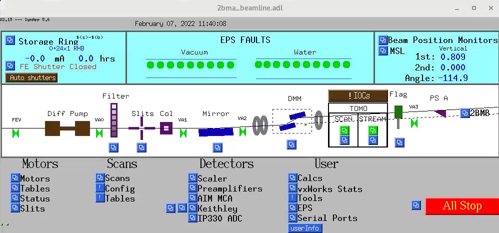
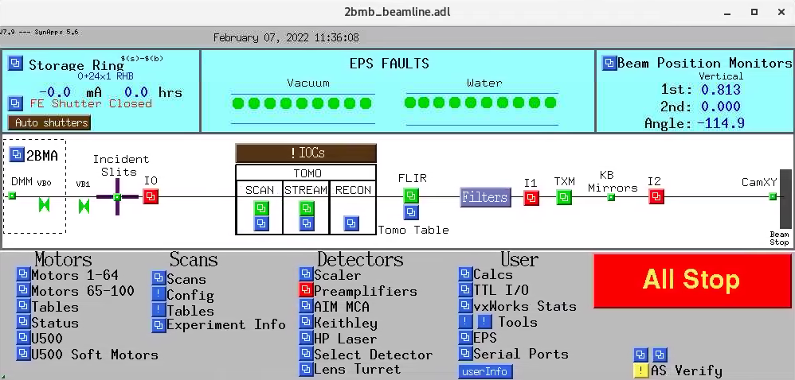
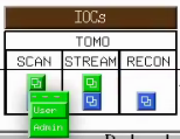
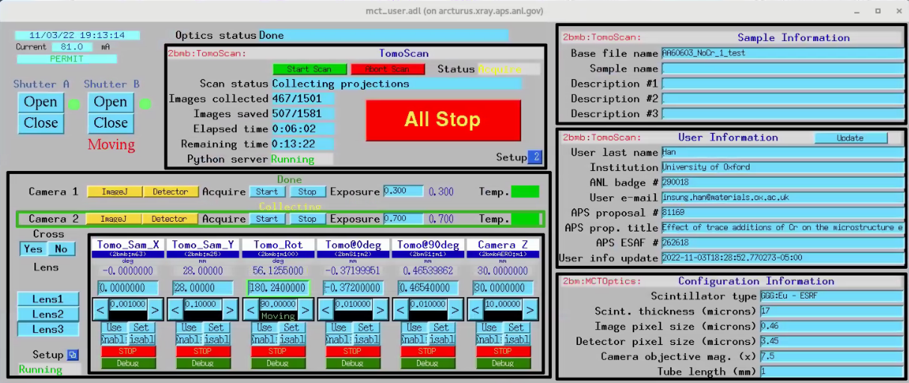
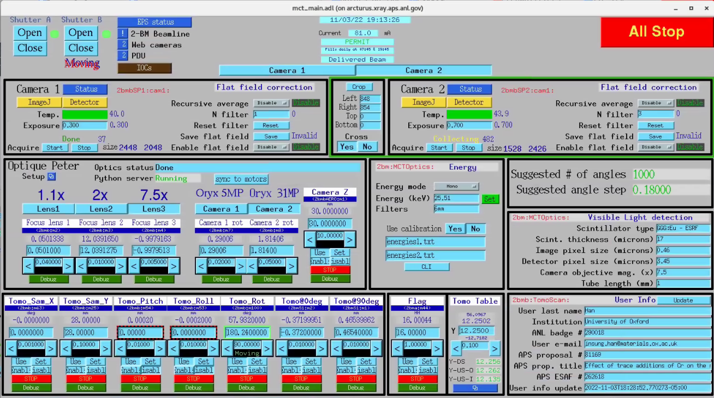
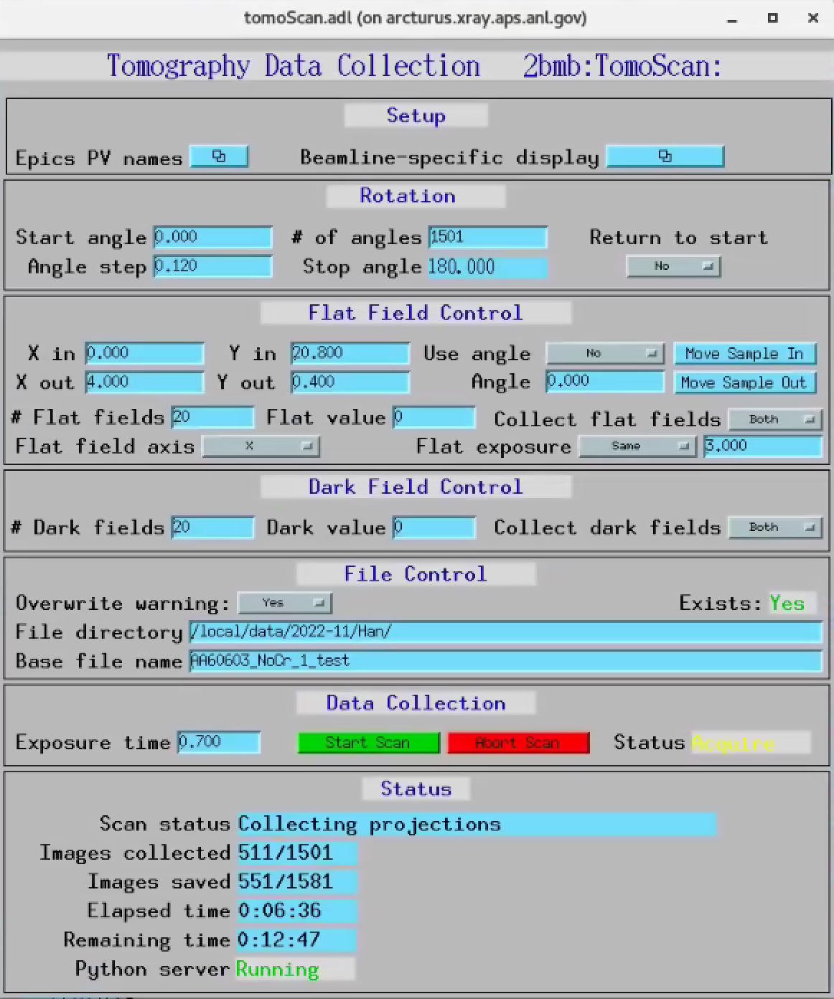
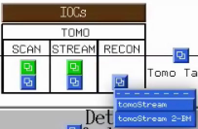
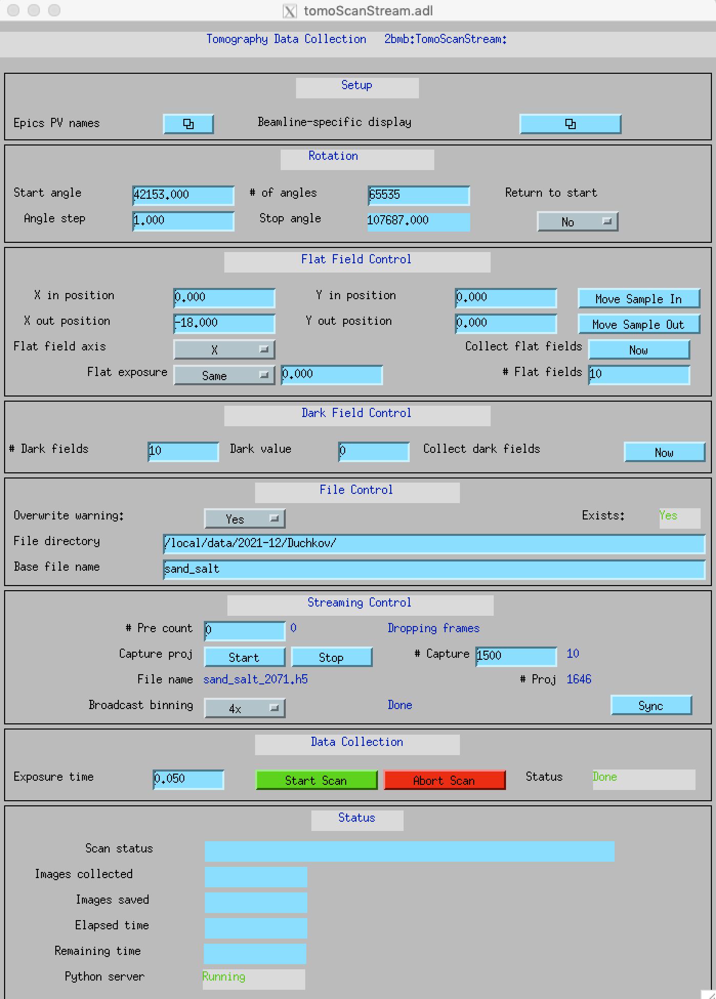
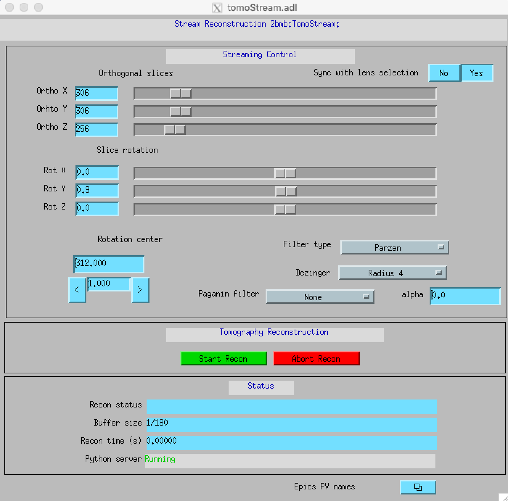
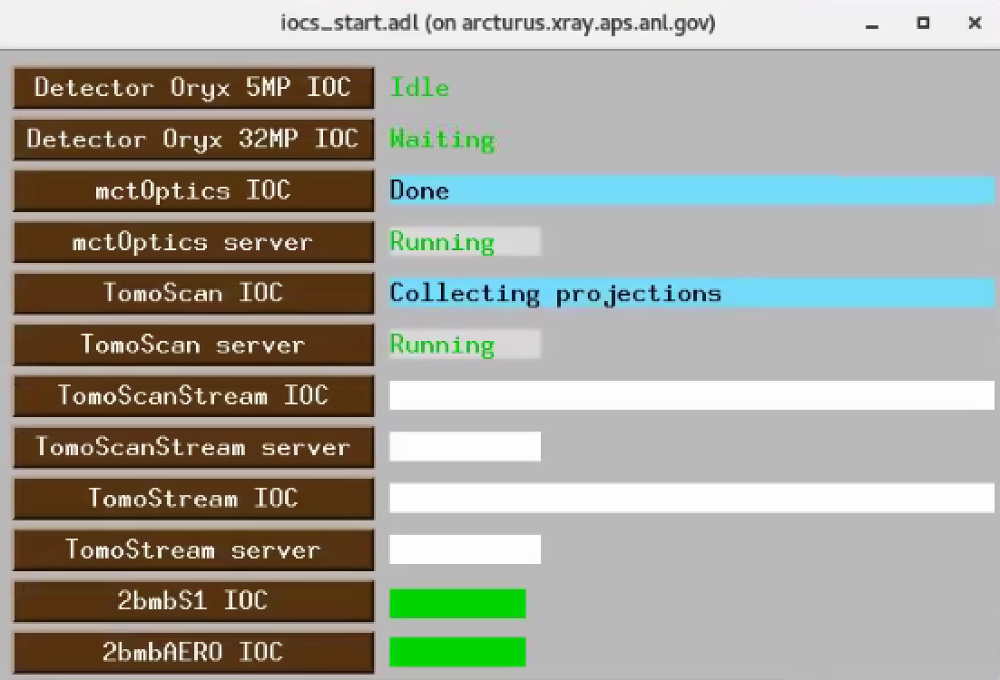

Beamline Control
================

All beamline components and detectors are controlled using `EPICS <https://epics-controls.org/>`_ and `areaDetector <https://areadetector.github.io/master/index.html>`_.
Each device can be configure and controlled through a graphic user interface (GUI) or through a python script using `PyEpics <https://cars9.uchicago.edu/software/python/pyepics3/>`_.

beamline
--------

To start the main 2-BM beamline control user interface::

    [user2bmb@arcturus,42,~]$ start_epics

tomography
----------

To start the main tomography control screens for 2-BM-A or 2-BM-B for scanning or streaming data collection select in the main beamline control screens the corresponding screen for user, admin, tomoscan, tomoscan 2-BM:

User interface:

Admin interface:

Main tomography control screen

   

To start tomoScanStream:

Main tomoScanStream control screen

Main tomoStream control screen to control the real time reconstruction:

If some of the above screen contains whirte fields, it means that the corresponding EPICS IOC is not running. To check/start/stop any IOC associated with tomograhy use the ioc_start user interface:

